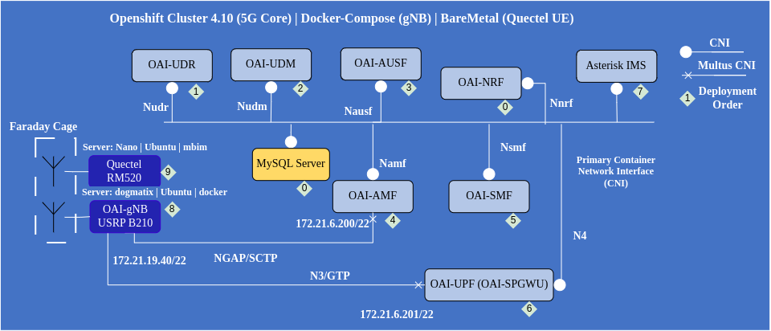

<table style="border-collapse: collapse; border: none;">
  <tr style="border-collapse: collapse; border: none;">
    <td style="border-collapse: collapse; border: none;">
      <a href="http://www.openairinterface.org/">
         
         </img>
      </a>
    </td>
    <td style="border-collapse: collapse; border: none; vertical-align: center;">
      <b><font size = "5">Core Network Quectel Testing Setup</font></b>
    </td>
  </tr>
</table>

The motive of this testing is to be sure all the merge request on AMF, SMF, UDR, UDM, AUSF and UPF gitlab repositories always works properly with COTSUE. This testing will be performed via oai-jenkins platform, this readme explains how jenkins perform the testing. 

Our correct testing scenario is

1. Deploy Core Network 
2. Start gNB (USRP B210) 
3. Perform_In_Loop_Twice(Start UE(Triggers Registration and PDU Session for `oai` and `ims` dnn) --> Stop UE (Triggers PDU session release for `oai` and `ims` dnn in order and then DE-Registration)) 
4. Collect Logs
5. Stop gNB 
6. Remove the Core Network

 


1.  [Deploy the Core Network](#1-deploy-the-core-network)
2.  [Start the gNB](#2-start-the-gnb)
3.  [Perform the Test](#3-perform-the-test)
4.  [Collect the Artifacts](#4-collect-the-artifacts)
5.  [Remove the Deployment](#5-remove-the-deployment)
6.  [Analyze the Artifacts](#6-analyze-the-artifacts)


### Pre-requisite

You need to have access to below machines (with `oaicicd` account)

|Server                      |Software/Hardware                                          |
|:---------------------------|:----------------------------------------------------------|
|Openshift Jumphost          |Openshift(4.10), helm (v3.6.2+5.el8 ), helm-spray (v4.0.10)|
|Cetautomatix (image builder)|Podman(3.1.0-dev)                                          |
|Dogmatix (gNB Server)       |USRP B210                                                  |
|Nano (UE-Server)            |Quectel RM520                                              |


Important configuration related information 


|Key       |Values                                                        |
|:---------|:-------------------------------------------------------------|
|PLMN      |00101                                                         |
|UE Release|16                                                            |
|IMSI      |001010000000100                                               |
|TAC       |0x01                                                          |
|key       |fec86ba6eb707ed08905757b1bb44b8f                              |
|opc       |C42449363BBAD02B66D16BC975D77CC1                              |
|ip-address|12.1.1.100 (for oai DNN) dynamic for ims DNN (mostly 12.2.1.2)|
|Slice,DNN |oai(1,0xFFFFFF),ims(1,0xFFFFFF)                               |


Know how to use helm, docker-compose, oc, kubectl commands. If you don't have helm spray plugin then download using

```shell
helm plugin install https://github.com/ThalesGroup/helm-spray
```

Of course! clone this repository and go to `ci-scripts/charts` directory.


## 1. Deploy the Core Network

Login to openshift cluster, you should know the password and from where to login. 

*NOTE*: If making a script in jenkins do not forget to reserve the machine

```shell
oc login -u oaicicd
oc project oaicicd-core
``` 

Now make sure that all the network function image tags you want to use are present when you do `oc get is`. At the time of writing this tutorial these tags are here

```
NAME             IMAGE REPOSITORY                                                                            TAGS               UPDATED
oai-amf          <openshift-registry-url>/oaicicd-core/oai-amf          develop-eaed3191   27 hours ago
oai-ausf         <openshift-registry-url>/oaicicd-core/oai-ausf         develop-702608a7   27 hours ago
oai-nrf          <openshift-registry-url>/oaicicd-core/oai-nrf          develop-f66cc2fe   27 hours ago
oai-smf          <openshift-registry-url>/oaicicd-core/oai-smf          develop-5c7fbfd7   27 hours ago
oai-upf          <openshift-registry-url>/oaicicd-core/oai-upf          develop-8c4397a    27 hours ago
oai-udm          <openshift-registry-url>/oaicicd-core/oai-udm          develop-7723778c   27 hours ago
oai-udr          <openshift-registry-url>/oaicicd-core/oai-udr          develop-89a82cc0   27 hours ago
support-tools    <openshift-registry-url>/oaicicd-core/support-tools    8.7-8              27 hours ago
```
**NOTE** Never delete `support-tools` image stream it is used to collect pcaps from the network functions. Also r

At the moment we are build the ubi images for all core network functions on `cetautomatix` RHEL server. We can do that on the openshift cluster too but for CI we don't do at the moment. We do that for CD. So all the images which are build on the `cetautomatix` server should be pushed in the openshift `oaicicd-core` project. 

For example the images can be pushed using below command

```shell
#first tag the image
sudo podman tag oai-amf:develop <openshift-registry-url>/oaicicd-core/oai-amf:<TAG-YOU-WANT>
oc whoami -t | sudo podman login -u oaicicd --password-stdin https://<openshift-registry-url> --tls-verify=false
sudo podman push <openshift-registry-url>/oaicicd-core/oai-amf:<TAG-YOU-WANT>
sudo podman rmi <openshift-registry-url>/oaicicd-core/oai-amf:<TAG-YOU-WANT>
sudo podman logout https://<openshift-registry-url>
```
**NOTE**: At the time of login or logout if you have error saying weird https then remove https:// from url and then re-try. 

Once images are push it will be good to verify that they are present in the right project/namespace

```shell
# grep the pushed tag of all the network functions
oc get istag | grep NRF_TAG_YOU_PUSHED
oc get istag | grep AMF_TAG_YOU_PUSHED
oc get istag | grep SMF_TAG_YOU_PUSHED
oc get istag | grep UPF_TAG_YOU_PUSHED
oc get istag | grep AUSF_YOU_PUSHED
oc get istag | grep UDR_TAG_YOU_PUSHED
oc get istag | grep UDM_TAG_YOU_PUSHED
```

### 1.1 Changing the tags

Once the images are present in the openshift cluster `oaicicd-core` project/namespace. We are ready to prepare the helm-charts with images tags pushed to the cluster. 

For the basic deployment the charts are present in `ci-scripts/charts/oai-5g-basic` and the most important file is `values.yaml` with all the configuration information. 

Do not change any other helm-charts unless you don't find the configuration variable you want to change. 

```shell
#assuming my current directory is ci-scripts/charts/oai-5g-basic
sed -i 's/NRF_TAG/<TAG_YOU_WANT>/g' values.yaml
sed -i 's/AMF_TAG/<TAG_YOU_WANT>/g' values.yaml
sed -i 's/SMF_TAG/<TAG_YOU_WANT>/g' values.yaml
sed -i 's/UPF_TAG/<TAG_YOU_WANT>/g' values.yaml
sed -i 's/AUSF_TAG/<TAG_YOU_WANT>/g' values.yaml
sed -i 's/UDR_TAG/<TAG_YOU_WANT>/g' values.yaml
sed -i 's/UDM_TAG/<TAG_YOU_WANT>/g' values.yaml
```

The UPF is configured to support two subnets, to disabled that please remove `netUeIp2` from `values.yaml`

## 1.2 Deploy the Basic Core Network

This step can take somewhere 3 to 4 mins so if planning a timeout in jenkins do not plan less than 6 mins (taking some margin)

Run the below command on openshift jumphost which has access to `helm command`

```shell
#assuming my current directory is ci-scripts/charts/oai-5g-basic
helm dependency update
helm install oai5gcn .
oc describe pod &> pod-describe-logs.logs
#Check that deployment is ready 
export READY_PODS=$(oc get pods -o custom-columns=NAMESPACE:metadata.namespace,POD:metadata.name,PodIP:status.podIP,READY:status.containerStatuses[*].ready | grep -v NAME | wc -l)
export TOTAL_PODS=$(oc get pods | grep -v NAME | wc -l)
## when READY_PODS==TOTAL_PODS the deployment is complete
```

By default the time-out for helm spray is 300 seconds or 5 mins, if you want to reduce or increase it add this flag `--timeout xxx` time in seconds

The above commands make sure that the network functions are up and running using the healthcheck script present in `Dockerfile` of each network function. In kubernetes it is known as readiness probe. Every network function helm-chart has a variable `readiness` to turn on and off this functionality.

**NOTE**: You might need to add `sleep` after helm because it can time for PFCP heartbeats. 

## 1.4 Check if the Deployment is correct

This is only needed to be sure that SMF and UPF are sharing the PFCP heartbeat, the required network functions have registered to NRF else there is no point going further. 

At the moment only AMF, SMF and UPF are registering to NRF. UDR, UDM and AUSF can do that but in this testbed we have disabled that. 

Make a shell script out of the below lines and run it on openshift jumphost which has access to `helm command`

```shell
#!/bin/bash
#to check AMF-NRF registration
oc project oaicicd-core
#this is a route you can check using oc get routes
export $NRF_URL="oai-nrf-svc-oaicicd-core.apps.oai.cs.eurecom.fr"
AMF_namf=$(curl -s -X GET http://$NRF_URL/nnrf-nfm/v1/nf-instances?nf-type="AMF" | jq -r ._links.item[0].href)
#to check SMF-NRF registration
SMF_nsmf=$(curl -s -X GET http://$NRF_URL/nnrf-nfm/v1/nf-instances?nf-type="SMF" | jq -r ._links.item[0].href)
#to check UPF-NRF registration
UPF_nupf=$(curl -s -X GET http://$NRF_URL/nnrf-nfm/v1/nf-instances?nf-type="UPF" | jq -r ._links.item[0].href)
if [[ -z $AMF_namf ]] && [[ -z $UPF_nupf ]] && [[ -z $SMF_nsmf ]]; then
      echo "There is a problem with NRF connection"
      exit 1
fi
UPF_POD=$(oc get pods | grep oai-upf | awk {'print $1'})
UPF_log1=$(oc logs $UPF_POD upf | grep 'Received SX HEARTBEAT REQUEST')
UPF_log2=$(oc logs $UPF_POD upf | grep 'handle_receive(16 bytes)')
if [[ -z $UPF_log1 ]] && [[ -z $UPF_log2 ]] ; then
      echo "PFCP Heartbeat Issue"
      exit 1
fi
echo "Core network is healthy"
```
If the output is `Core network is healthy` then you can move forward

## 2. Start the gNB

Login to the gNB host machine using `oaicicd` account and start the gNB

```shell
cd /home/oaicicd/ci-testbed/docker-compose
docker-compose up -d
```
Check if gNB is connected to the AMF, because if not there is no point in moving forward, you can directly go to setup 4 collect the artifacts

```shell
docker logs sa-b210-gnb | grep 'Received NGAP_REGISTER_GNB_CNF: associated AMF 1' | wc -l
```

## 3. Perform the Test

Login to the machine name as nano using `oaicicd` account, 


```shell
cd /home/oaicicd/core-ci
#start the UE
sudo ./start 
#if echo $? is 0 then testing was Successful Testing
#Stop the UE
sudo ./stop
#Perform the test again after 5 seconds gap
sleep 5
sudo ./start
#if echo $? is 0 then testing was Successful Testing
#Stop the UE
sudo ./stop
```

You can re-direct the output to file in case the logs are necessary else they will be printed on `jenkins console`

It is important to check twice to be sure everthing works. 

Stop the gNB before collecting artifacts, login to gnb machine

```shell
cd /home/oaicicd/ci-testbed/docker-compose
docker-compose stop -t2
```

## 4. Collect the Artifacts

First collect logs and pcap for core network functions

Login to `openshift jumphost`

Collect logs and pcap using below shell script

```shell
#!/bin/bash
oc project oaicicd-core
NRF=$(oc get pods | grep oai-nrf | awk {'print $1'})
UDR=$(oc get pods | grep oai-udr | awk {'print $1'})
UDM=$(oc get pods | grep oai-udm | awk {'print $1'})
AUSF=$(oc get pods | grep oai-ausf | awk {'print $1'})
AMF=$(oc get pods | grep oai-amf | awk {'print $1'})
SMF=$(oc get pods | grep oai-smf | awk {'print $1'})
UPF=$(oc get pods | grep oai-upf | awk {'print $1'})
folder_name=logs_$(date +"%d-%m-%y-%H-%M-%S")

echo "creating a folder for storing logs, folder name:" $folder_name
mkdir -p $folder_name
echo "getting $NRF logs"
oc logs $NRF nrf &> $folder_name/nrf.logs
echo "getting $UDR logs"
oc logs $UDR udr &> $folder_name/udr.logs
echo "getting $UDM logs"
oc logs $UDM udm &> $folder_name/udm.logs
echo "getting $AUSF logs"
oc logs $AUSF ausf &> $folder_name/ausf.logs
echo "getting $AMF logs"
oc logs $AMF amf &> $folder_name/amf.logs
echo "getting $SMF logs"
oc logs $SMF smf &> $folder_name/smf.logs
echo "getting $UPF logs"
oc logs $UPF upf &> $folder_name/upf.logs
#Collect Resource Consumption (Normally the window is 5 mins)
oc get pods.metrics.k8s.io &> $folder_name/nf-resource-consumption.log
oc rsync $NRF:/pcap $folder_name/
```

Login to gNB host machine and copy gNB logs

```shell
docker logs sa-b210-gnb &> gnb.logs
```

## 5. Remove the Deployment

Stop the gNB, login to gNB machine

```shell
cd /home/oaicicd/ci-testbed/docker-compose
docker-compose down -t2
```

Stop the core-network functions, login to `openshift-jumphost`

```shell
oc project oaicicd-core
helm uninstall oai5gcn
```

The default graceperiod for all network functions is `5 seconds` so if you want to put a time out in jenkins then you can put `10 seconds`

## 6. Analyze the Artifacts

Once all the artifacts are collected to be sure that everything went perfectly fine, please check in the collected pcaps below messages are there. 

Bare-minimum pcap of interest AMF and UPF. 

Normally you will see below messages twice because we connected the UE twice and did ping twice. 

Below messages are from AMF pcap

- NGSetupRequest
- NGSetupResponse
- InitialUEMessage, Registration request, Registration request
- DownlinkNASTransport, Identity request
- UplinkNASTransport, Identity response
- DownlinkNASTransport, Authentication request
- UplinkNASTransport, Authentication response
- DownlinkNASTransport, Security mode command 
- UplinkNASTransport, Security mode complete, Registration request 
- UERadioCapabilityInfoIndication
- UplinkNASTransport, Registration complete
- PDU session establishment request
- PDUSessionResourceSetupRequest, DL NAS transport, PDU session establishment accept
- PDUSessionResourceSetupResponse
- UplinkNASTransport, UL NAS transport, PDU session release request (Regular deactivation)
- PDUSessionResourceReleaseCommand, DL NAS transport, PDU session release command (Regular deactivation)
- PDUSessionResourceReleaseResponse
- UplinkNASTransport, UL NAS transport, PDU session release complete, UplinkNASTransport, Deregistration request (UE originating)
- SHUTDOWN 
- SHUTDOWN ACK
- SHUTDOWN_COMPLETE 

In UPF pcap you should see GTP packets minimum 8 times because the ping was 4 packets
