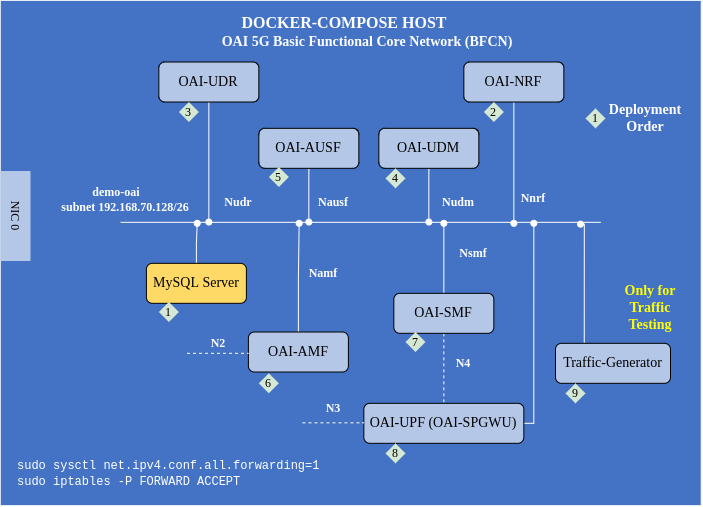

<table style="border-collapse: collapse; border: none;">
  <tr style="border-collapse: collapse; border: none;">
    <td style="border-collapse: collapse; border: none;">
      <a href="http://www.openairinterface.org/">
         
         </img>
      </a>
    </td>
    <td style="border-collapse: collapse; border: none; vertical-align: center;">
      <b><font size = "5">OpenAirInterface 5G Core Advance Deployment Using Docker-Compose</font></b>
    </td>
  </tr>
</table>




This tutorial is strictly for the advanced users of OAI who have an understanding about how the core network functions work and are comfortable in changing the configuration directly in the config file of each network function rather than in docker-compose using environment variables. 

The current method which we provide to the community to change the network functions configuration is not good since it has some limitations. Till the time we find a better way to configure our core network functions we propose this alternative way of configuring each network function. We do understand this is a laborious alternative and we are working on better configuration management techniques. 

If you would like to contribute then we will be glad to have your contributions. 

Before reading this tutorial it will be good if you can go through [deployment pre-requisites](./DEPLOY_PRE_REQUESITES.md) and try to deploy a [mini](./DEPLOY_SA5G_MINI_DS_TESTER_DEPLOYMENT.md) or [basic](./DEPLOY_SA5G_BASIC_DS_TESTER_DEPLOYMENT.md) deployment.

**TABLE OF CONTENTS**

1.  [Building core network images or pulling from docker hub](#1-building-core-network-images-or-pulling-from-docker-hub)
2.  [Deploying core network](#2-deploying-core-network)
3.  [How to report an issue?](#3-how-to-report-an-issue)

# 1. Building core network images or pulling from docker hub #

The users can either pull the docker images from official docker-hub repository or build by themselves if they make any changes in the code or would like to enable debug logging.

## 1.1 Pulling docker images ##

OAI [official docker-hub repository](https://hub.docker.com/u/oaisoftwarealliance) has three type of image tags develop, latest or version, 

- `latest` tag coresponds to latest release or master branch of the core network function 
- `develop` tag corresponds to develop branch or next release of the core network function 
- `version tag vX.X.X` corresponds to a release 

You can copy the below lines in a shell script and use it to pull the images or just pull it the way you want and re-tag if you want. By default, we are pulling develop images.

```shell
docker pull mysql:8.0
docker pull oaisoftwarealliance/oai-amf:develop
docker pull oaisoftwarealliance/oai-smf:develop
docker pull oaisoftwarealliance/oai-nrf:develop
docker pull oaisoftwarealliance/oai-udm:develop
docker pull oaisoftwarealliance/oai-udr:develop
docker pull oaisoftwarealliance/oai-ausf:develop
docker pull oaisoftwarealliance/oai-spgwu-tiny:develop
```

In the docker-compose file we are using the image names as above. If you wish to re-tag with some other name then please change the name in the docker-compose file.

## 1.2 Building docker images ##

Read the tutorial [build image](./BUILD_IMAGES.md) to know how to build core network functions docker image. If you want to change the logging in the image to debug then read the below paragraph else you can skip. 

By default all the dockerfiles present in any network function repository (AMF, SMF, NRF, UPF, UDR, UDM, AUSF) produce `info` level logs. This is done to reduce the image size and have a better performance. If a user wants debug information to get more logs then make below changes in `dockerfile` of any network function.

This way user will have more logs and can have better understanding and debug possibilities. To build any core network image in debug mode follow the below steps **after cloning the network function repository**. 

The example is for AMF: 

```bash
# clone amf repository 
$ git clone -b <prefered_branch or develop> https://gitlab.eurecom.fr/oai/cn5g/oai-cn5g-amf.git
$ cd oai-cn5g-amf/docker/
# Depending on the environment where the image will be used choose the correct dockerfile
$ vi/vim/nano/subl Dockerfile.amf.ubuntu
# replace the line RUN ./build_amf --clean --Verbose --build-type Release --jobs with below 
# RUN ./build_amf --clean --Verbose --build-type Debug --jobs
```


# 2. Deploying core network #

Before running the docker containers it is important to configure PLMN, TAC, network slice parameters(SST, SD), DNN, and user data (mysql). The config files are present in [conf folder](../docker-compose/conf). 

## 2.1 Configure the network functions according to your PLMN, Slice and DNN ##

The IP address or fully qualified domain name (FQDN) for each service is configured properly in their config files. You just need to change PLMN, TAC, network slice parameters(SST, SD), DNN, and user data (mysql), 

1. Configure `plmn` and `tac` in AMF
2. Configure `sst` and `sd` in AMF, SMF and SPGWU-Tiny
3. Configure `dnn` in SMF
4. Add users in the database according to your sim card

  Configure the [user subscription database sql file](../docker-compose/database/oai_db2.sql) for authentication information and pdu session.

  Authentication information is provisioned in table `AuthenticationSubscription`
  ```sql
  INSERT INTO `AuthenticationSubscription` (`ueid`, `authenticationMethod`, `encPermanentKey`, `protectionParameterId`, `sequenceNumber`, `authenticationManagementField`, `algorithmId`, `encOpcKey`, `encTopcKey`, `vectorGenerationInHss`, `n5gcAuthMethod`, `rgAuthenticationInd`, `supi`) VALUES
  ('208990200000001', '5G_AKA', 'fec86ba6eb707ed08905757b1bb44b8f', 'fec86ba6eb707ed08905757b1bb44b8f', '{\"sqn\": \"000000000020\", \"sqnScheme\": \"NON_TIME_BASED\", \"lastIndexes\": {\"ausf\": 0}}', '8000', 'milenage', 'c42449363bbad02b66d16bc975d77cc1', NULL, NULL, NULL, NULL, '208990200000001');
  ```

  PDU session information is provisioned in table `SessionManagementSubscriptionData`. To add information, follow the steps below. 
  
  + Static UE IP address allocation
  
  ``` sql
  INSERT INTO `SessionManagementSubscriptionData` (`ueid`, `servingPlmnid`, `singleNssai`, `dnnConfigurations`) VALUES 
  ('208990200000001', '20899', '{\"sst\": 1, \"sd\": \"16777215\"}','{\"oai\":{\"pduSessionTypes\":{ \"defaultSessionType\": \"IPV4\"},\"sscModes\": {\"defaultSscMode\": \"SSC_MODE_1\"},\"5gQosProfile\": {\"5qi\": 6,\"arp\":{\"priorityLevel\": 1,\"preemptCap\": \"NOT_PREEMPT\",\"preemptVuln\":\"NOT_PREEMPTABLE\"},\"priorityLevel\":1},\"sessionAmbr\":{\"uplink\":\"1000Mbps\", \"downlink\":\"1.00Mbps\"},\"staticIpAddress\":[{\"ipv4Addr\": \"12.1.1.4\"}]}}');
  ```
  
  + Dynamic IP address allocation

  ``` sql
  INSERT INTO `SessionManagementSubscriptionData` (`ueid`, `servingPlmnid`, `singleNssai`, `dnnConfigurations`) VALUES 
  ('208990200000001', '20899', '{\"sst\": 1, \"sd\": \"16777215\"}','{\"oai\":{\"pduSessionTypes\":{ \"defaultSessionType\": \"IPV4\"},\"sscModes\": {\"defaultSscMode\": \"SSC_MODE_1\"},\"5gQosProfile\": {\"5qi\": 6,\"arp\":{\"priorityLevel\": 1,\"preemptCap\": \"NOT_PREEMPT\",\"preemptVuln\":\"NOT_PREEMPTABLE\"},\"priorityLevel\":1},\"sessionAmbr\":{\"uplink\":\"1000Mbps\", \"downlink\":\"1000Mbps\"}}}');
  ```
  
  Make sure you perform this for all the UEs. For every user information in the `AuthenticationSubscription` table there should be a corresponding entry in `SessionManagementSubscriptionData` table. This information is only used if `USE_LOCAL_SUBSCRIPTION_INFO` parameter is set to `no` in the SMF config file. In that case, SMF retrieves this information from the UDM. In case the paramater is `yes`, SMF will use the DNN, IP address and slice mapping which is defined in the SMF configuration file in `LOCAL_CONFIGURATION` field.


**NOTE**: By default the SBI interface is configured with HTTP/1.1. It can be changed to HTTP/2 by changing the configuration in all network functions.


## 2.2 Instantiating the Docker Containers ##

To start the core network function containers do,

```shell
cd ../docker-compose
# if you have compose plugin in docker then do 
docker compose -f docker-compose-mount-conf.yaml up -d
# in case you don't have compose plugin and use docker-compose command
docker-compose -f docker-compose-mount-conf.yaml up -d
```
Once the network functions have started wait until they are healthy, once they are healthy check the next section. You can check if the network functions are healthy or not via

```shell
watch docker compose -f  docker-compose-mount-conf.yaml ps -a
```

**Note**: If you are stuck with `watch` command, exit using `ctrl + c`


## 2.3 When to start testing? ##

SMF and SPGWU/UPF needs to have a PFCP session between them before starting any test. When SMF and UPF(spgwu-tiny or vpp-upf) starts they send a NF registration request to NRF and SMF subscribe to UPF registration events. When a UPF registers with NRF, SMF gets the notification and it initiates a PFCP session for which there are regular heartbeats. 

**NOTE**: SMF and UPF(spgwu-tiny or vpp-upf) both can initiate a PFCP session with or without NRF. 

To check that the heartbeat exchange is there use the below commands 

```shell
# Output of this means SPGWU has received heartbeat request from SMF
docker logs oai-spgwu-tiny | grep 'Received SX HEARTBEAT REQUEST' | wc -l
```
```shell
# Output of this means SMF is starting the heartbeat procedure
docker logs oai-smf | grep 'PFCP HEARTBEAT PROCEDURE' | wc -l
```
If both the values are more than 1 then it is good. 

Now you can start testing with this core network 

## 2.4 Understanding Core Network Logs ##

Most of the times the registration issue can occur because of slicing or PLMN mismatch for that check the logs of AMF. If there is a PDU session related issue that can also occur because of slice or DNN mismatch which is configured in SMF and UPF. 

AMF asks the NRF to provide list of SMF and from there it finds the common slice or DNN. In case of PDU session rejections check the logs of AMF --> SMF --> UPF. 

## 2.5 Collecting logs and pcap ##

To collect the logs of all the network function you can follow the below commands or copy them to make a script

``` shell
docker logs oai-amf &> oai-amf.logs
docker logs oai-smf &> oai-smf.logs
docker logs oai-nrf &> oai-nrf.logs
docker logs oai-udr &> oai-udr.logs
docker logs oai-udm &> oai-udm.logs
docker logs oai-ausf &> oai-ausf.logs
docker logs oai-spgwu-tiny &> oai-spgwu-tiny.logs
```
Start the packet capture always before connecting the UE or even before connecting the gNB. Packets can be captured at the docker bridge or inside each network function. To capture packets on the docker bridge

```shell
sudo tshark -i oaicore -f "(not host 192.168.70.135 and not arp and not port 53 and not port 2152) or (host 192.168.70.135 and icmp)" -w {filename} > /dev/null 2>&1 &
```

## 2.6 Redeploy or undeploy core network functions ##

To re-deploy

```shell
#if you have docker-compose command then use docker-compose instead
docker compose -f docker-compose-mount-conf.yaml up -d --force-recreate
```

To undeploy

```shell
#if you have docker-compose command then use docker-compose instead
docker compose -f docker-compose-mount-conf.yaml stop -t2
docker compose -f docker-compose-mount-conf.yaml down -t2
```

# 3. How to report an issue? #

To report an issue regarding any component of CN5G follow the below procedure:

1. Share the testing scenario, what the test is trying to achieve
2. Debug logs of the 5GCN components and packet capture/tcpdump of the 5GCN components. Depending on where the packets are captured take care of interface on which the packets are captured. Also it will be nice to capture packets using a filter `ngap || http || pfcp || gtp`
3. If you have an issue with testing then you can send an email to openair5g-cn@lists.eurecom.fr with the configuration files, log files in debug mode and pcaps with appropriate filters. 
4. You can report an issue directly on network function repository on gitlab. To create an account on our gitlab server please follow account creation part from [here](../CONTRIBUTING.md)
