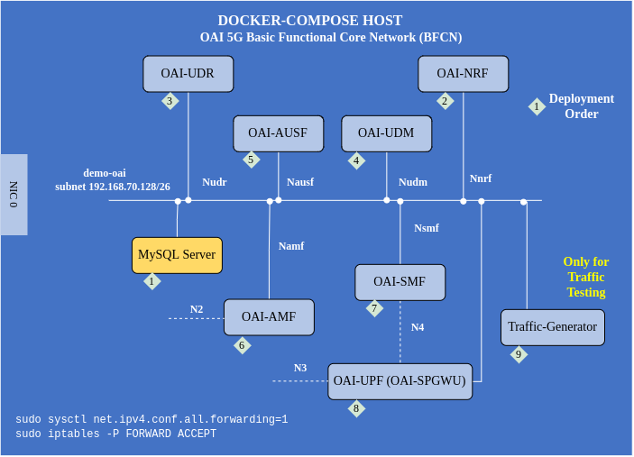

<table style="border-collapse: collapse; border: none;">
  <tr style="border-collapse: collapse; border: none;">
    <td style="border-collapse: collapse; border: none;">
      <a href="http://www.openairinterface.org/">
         
         </img>
      </a>
    </td>
    <td style="border-collapse: collapse; border: none; vertical-align: center;">
      <b><font size = "5">OpenAirInterface 5G Core Network Basic Deployment using Docker-Compose</font></b>
    </td>
  </tr>
</table>




**OVERVIEW**

This tutorial will help in understanding how to deploy a `basic` OAI core network using docker-compose. The recommended hardware to install the above core network setting is

- 4 CPU
- 16GiB RAM
- Minimum 1.5 GiB of free storage for docker images

Please follow the tutorial step by step to create a stable working testbed. You can use this tutorial to deploy OAI-5G core and test it with oai-gNB and oai-nr-ue.


**Reading time**: ~ 20 mins

**Tutorial replication time**: ~ 30 mins


**Note**

- In case readers are interested in deploying debuggers/developers core network environment with more logs please follow [this tutorial](./DEBUG_5G_CORE.md).
- In this tutorial we have considered two different host machines, `docker-compose-host` as the host machine to deploy core network functions and `gNB-host` as the gNB host machine.


**TABLE OF CONTENTS**

[[_TOC_]]

## 1. Basic Deployment Flavours ##

The Basic functional 5g core network can be deployed into 2 scenarios:

    - Scenario I:  AMF, SMF, UPF (SPGWU), NRF, UDM, UDR, AUSF, MYSQL
    - Scenario II:  AMF, SMF, UPF (SPGWU), UDM, UDR, AUSF, MYSQL

## 2. Pre-requisites ##

The container images are built using `docker build` command on Ubuntu 18.04 host machine. The base image for all the containers is Ubuntu 18.04.

The required software and their respected versions are listed below. To replicate the testbed use these versions.

| Software                   | Version                                 |
|:-------------------------- |:----------------------------------------|
| docker engine              | 19.03.6, build 369ce74a3c               |
| docker-compose             | 1.27.4, build 40524192                  |
| Host operating system      | Ubuntu 18.04.4 LTS                      |
| Container operating system | Ubuntu 18.04                            |
| tshark                     | Minimum 3.4.4 (Git commit c33f6306cbb2) |
| wireshark                  | Minimum 3.4.4 (Git commit c33f6306cbb2) |

### 2.1. Wireshark ###

The new version of `wireshark` may not be available in ubuntu 18.04 repository:

- You can either build it from source or you may also use the developer PPA:

```console
docker-compose-host $: sudo add-apt-repository ppa:wireshark-dev/stable
docker-compose-host $: sudo apt update
docker-compose-host $: sudo apt install wireshark

docker-compose-host $: wireshark --version
Wireshark 3.4.7 (Git v3.4.7 packaged as 3.4.7-1~ubuntu18.04.0+wiresharkdevstable1)
```

### 2.2. Networking considerations ###

Most of the times the `docker-compose-host` machine is not configured with packet forwarding. It can be enabled using the command below (if you have already done it in any other section then don't repeat).

**This is the most important step towards end-to-end connectivity.**

```console
docker-compose-host $: sudo sysctl net.ipv4.conf.all.forwarding=1
docker-compose-host $: sudo iptables -P FORWARD ACCEPT
```

## 3. Network Function Container Images ##

- In this demo the network function branch and tags which were used are listed below, follow the [Retrieving images](./RETRIEVE_OFFICIAL_IMAGES.md) or the [Building images](./BUILD_IMAGES.md) to build images with the tags below.

| CNF Name    | Branch Name | Tag      | Ubuntu 18.04 | RHEL8 (UBI8)    |
| ----------- | ----------- | -------- | ------------ | ----------------|
| AMF         | `master`    | `v1.5.0` | X            | X               |
| SMF         | `master`    | `v1.5.0` | X            | X               |
| NRF         | `master`    | `v1.5.0` | X            | X               |
| SPGW-U-TINY | `master`    | `v1.5.0` | X            | X               |
| UDR         | `master`    | `v1.5.0` | X            | X               |
| UDM         | `master`    | `v1.5.0` | X            | X               |
| AUSF        | `master`    | `v1.5.0` | X            | X               |

- In case readers are interested in making images using different branches than master or develop then, **they have to build images from scratch they can't use the docker-hub images**.

## 4. Configuring Host Machines ##

All the network functions are connected using `demo-oai` bridge.

There are two ways to create this bridge, either manually or automatically using docker-compose.

* The manual version will allow packet capturing while network functions are getting deployed. So the initial tested setup packets can be captured for debugging purposes or checking if network functions registered properly to NRF.
* The second option of automatic deployment is good when initial packet capture is not important.

### 4.1 Creating bridge manually ###

Since this is not the `default` behavior, you **have to** edit the docker-compose file.

- The bottom section of [docker-compose file](../docker-compose/docker-compose-mini-nrf.yaml) SHALL look like this:

```
    networks:
          public_net:
              external:
                  name: demo-oai-public-net
        # public_net:
        #     driver: bridge
        #     name: demo-oai-public-net
        #     ipam:
        #         config:
        #             - subnet: 192.168.70.128/26
        #     driver_opts:
        #         com.docker.network.bridge.name: "demo-oai"
```

- The `docker-compose-host` machine needs to be configured with `demo-oai` bridge before deploying core network components. To capture initial message exchange between network functions.

    ```console
    docker-compose-host $: docker network create \
      --driver=bridge \
      --subnet=192.168.70.128/26 \
      -o "com.docker.network.bridge.name"="demo-oai" \
      demo-oai-public-net
    455631b3749ccd6f10a366cd1c49d5a66cf976d176884252d5d88a1e54049bc5
    docker-compose-host $: ifconfig demo-oai
    demo-oai: flags=4099<UP,BROADCAST,MULTICAST>  mtu 1500
            inet 192.168.70.129  netmask 255.255.255.192  broadcast 192.168.70.191
            RX packets 0  bytes 0 (0.0 B)
            RX errors 0  dropped 0  overruns 0  frame 0
            TX packets 0  bytes 0 (0.0 B)
            TX errors 0  dropped 0 overruns 0  carrier 0  collisions 0
    docker-compose-host $: docker network ls
    NETWORK ID          NAME                  DRIVER              SCOPE
    d2d34e05bb2d        bridge                bridge              local
    455631b3749c        demo-oai-public-net   bridge              local
    ```

### 4.2 Create bridge automatically ###

- Though the bridge can be automatically created using docker-compose file if there is no need to capture initial packets.

This is the `default` version in the [docker-compose-basic-nrf.yaml](../docker-compose/docker-compose-basic-nrf.yaml).

The bottom section SHALL look like this:

    ```
    networks:
        # public_net:
        #     external:
        #         name: demo-oai-public-net
          public_net:
              driver: bridge
              name: demo-oai-public-net
              ipam:
                  config:
                      - subnet: 192.168.70.128/26
              driver_opts:
                  com.docker.network.bridge.name: "demo-oai"
    ```

### 4.3 In case you forgot, the section below is for both manual and automatic network creation. ###

- If the `docker-compose-host` machine is not configured with packet forwarding then it can be done using the command below (**important step**),

    ```console
    docker-compose-host $: sudo sysctl net.ipv4.conf.all.forwarding=1
    docker-compose-host $: sudo iptables -P FORWARD ACCEPT
    ```

- The `gNB-host` needs to be configured with a route to reach `docker-compose-host`. Assuming `gNB-host` physical interface which is connected with `docker-compose-host` is NIC1 and the ip-address of this interface is IP_ADDR_NIC1 then,

    ```console
    gNB-host$: sudo ip route add route 192.168.70.128/26 \
                           via IP_ADDR_NIC1\
                           dev NIC1_NAME
    ```

- To verify, ping the ip-address of the `docker-compose-host` interface connected to demo-oai bridge, if possible also ping amf from the gNB host machine.

    ```console
    gNB-host$: ping 192.168.70.129
    PING 192.168.70.129 (192.168.70.129) 56(84) bytes of data.
    64 bytes from 192.168.70.129: icmp_seq=1 ttl=64 time=0.260 ms
    64 bytes from 192.168.70.129: icmp_seq=2 ttl=64 time=0.147 ms
    64 bytes from 192.168.70.129: icmp_seq=3 ttl=64 time=0.187 ms
    64 bytes from 192.168.70.129: icmp_seq=4 ttl=64 time=0.187 ms
    64 bytes from 192.168.70.129: icmp_seq=5 ttl=64 time=0.181 ms
    ^C
    --- 192.168.70.129 ping statistics ---
    5 packets transmitted, 5 received, 0% packet loss, time 108ms
    rtt min/avg/max/mdev = 0.147/0.192/0.260/0.038 ms
    ```

## 5. Configuring the OAI-5G Core Network Functions ##

5G core network has two architectures service based or reference point which makes the NRF component optional, similarly you can choose to deploy the OAI core network components with or without NRF. Additionally in cloud native world it is preferred to provide a Fully Qualified Domain Name (FQDN) to a service rather than static ip-address. Each of our network functions can communicate with other core network function's using ip-address or FQDN. For example, AMF can register to NRF either with NRFs ip-address or FQDN.

Configuring network functions with static ip-addresses is preferred for bare-metal deployment of network functions. Whereas for docker-compose or helm chart based deployment it is better to use FQDN of network functions. In the docker-compose file you will see each network function is configured with both ip-address and FQDN, but if you are using FQDN then the code of network function will ignore the ip-address configuration.

In docker-compose the [service-name](https://docs.docker.com/compose/compose-file/#services-top-level-element) is actually the FQDN of the service.

### 5.1. Core Network Configuration ###

The docker-compose file has configuration parameters of each core network component. The file is pre-configured with parameters related to this scenario. The table contains the location of the configuration files. These files contain allowed configurable parameters. **Keep checking this file as it is possible that we will add new parameters for new features.**

You can also check configuration on our [wiki](https://gitlab.eurecom.fr/oai/cn5g/oai-cn5g-fed/-/wikis/home)


| File Name   | Repository                                   | Location                                                                                              |
|:----------- |:-------------------------------------------- |:------------------------------------------------------------------------------------------------------|
| amf.conf    | (Gitlab) cn5g/oai-cn5g-amf                   | [etc/amf.conf](https://gitlab.eurecom.fr/oai/cn5g/oai-cn5g-amf/-/blob/master/etc/amf.conf)            |
| smf.conf    | (Gitlab) cn5g/oai-cn5g-smf                   | [etc/smf.conf](https://gitlab.eurecom.fr/oai/cn5g/oai-cn5g-smf/-/blob/master/etc/smf.conf)            |
| nrf.conf    | (Gitlab) cn5g/oai-cn5g-nrf                   | [etc/nrf.conf](https://gitlab.eurecom.fr/oai/cn5g/oai-cn5g-nrf/-/blob/master/etc/nrf.conf)            |
| spgw_u.conf | (Github) OPENAIRINTERFACE/openair-spgwu-tiny | [etc/spgw_u.conf](https://github.com/OPENAIRINTERFACE/openair-spgwu-tiny/blob/master/etc/spgw_u.conf) |
| udr.conf    | (Gitlab) cn5g/oai-cn5g-udr                   | [etc/udr.conf](https://gitlab.eurecom.fr/oai/cn5g/oai-cn5g-udr/-/blob/master/etc/udr.conf)            |
| udm.conf    | (Gitlab) cn5g/oai-cn5g-udm                   | [etc/udm.conf](https://gitlab.eurecom.fr/oai/cn5g/oai-cn5g-udm/-/blob/master/etc/udm.conf)            |
| ausf.conf   | (Gitlab) cn5g/oai-cn5g-ausf                  | [etc/ausf.conf](https://gitlab.eurecom.fr/oai/cn5g/oai-cn5g-ausf/-/blob/master/etc/ausf.conf)         |

### 5.2. User Subscription Profile ###

There are two ways to configure the User Subscription Profile,

1. Pre-configure all the users in the [database file](../docker-compose/database/oai_db2.sql). This way when the core network starts it will have all the users.
2. Add a new user when the core-network is already running.

For the first method, you have to edit the [database file](../docker-compose/database/oai_db2.sql) and add or change the entries in table `AuthenticationSubscription`, either remove the already present entries or add a new one like below:

```sql
INSERT INTO `AuthenticationSubscription` (`ueid`, `authenticationMethod`, `encPermanentKey`, `protectionParameterId`, `sequenceNumber`, `authenticationManagementField`, `algorithmId`, `encOpcKey`, `encTopcKey`, `vectorGenerationInHss`, `n5gcAuthMethod`, `rgAuthenticationInd`, `supi`) VALUES
('208950000000031', '5G_AKA', '0C0A34601D4F07677303652C0462535B', '0C0A34601D4F07677303652C0462535B', '{\"sqn\": \"000000000020\", \"sqnScheme\": \"NON_TIME_BASED\", \"lastIndexes\": {\"ausf\": 0}}', '8000', 'milenage', '63bfa50ee6523365ff14c1f45f88737d', NULL, NULL, NULL, NULL, '208950000000031'),
```

Make sure you edit the IMSI, opc and key according to the settings of your user device.

For the second method, you have to add the entry when the core network is already running. **This step can only be performed after deploying the core network docker-containers**.

```console
docker-compose-host $: docker exec -it mysql /bin/bash
mysql-container$: mysql -uroot -plinux
mysql-container$: use oai_db;
mysql-container$: INSERT INTO `AuthenticationSubscription` (`ueid`, `authenticationMethod`, `encPermanentKey`, `protectionParameterId`, `sequenceNumber`, `authenticationManagementField`, `algorithmId`, `encOpcKey`, `encTopcKey`, `vectorGenerationInHss`, `n5gcAuthMethod`, `rgAuthenticationInd`, `supi`) VALUES
('208950000000031', '5G_AKA', '0C0A34601D4F07677303652C0462535B', '0C0A34601D4F07677303652C0462535B', '{\"sqn\": \"000000000020\", \"sqnScheme\": \"NON_TIME_BASED\", \"lastIndexes\": {\"ausf\": 0}}', '8000', 'milenage', '63bfa50ee6523365ff14c1f45f88737d', NULL, NULL, NULL, NULL, '208950000000031'),
```

Make sure you edit the IMSI, opc and key according to the settings of your user device.

## 6. Deploying OAI 5g Core Network ##

- The core network is deployed using a [python script](../docker-compose/core-network.py) which is a wrapper around `docker-compose` and `docker` command. The script purpose is to make the deployment easy.
- The script informs the user when the core-network is correctly configured by checking the health status of containers and connectivity between different core network components.
- To know how to use the script look, for the help menu as shown below.
- There are three parameters which can be provided
  - `--type` mandatory option to start/stop the 5g core components with minimum/basic functional architecture.
  - `--scenario` is optional and if not provided by default it is considered to use nrf component.
  - `--capture` will start capturing packets with the filters defined above on `demo-oai` bridge
- In case there is a problem or you don't want to use this python script, it is better to use docker-compose manually, read the [notes section](#10-notes)

    ```console
    docker-compose-host $: pwd
    /home/<docker-compose-host>/oai/oai-cn-fed/docker-compose
    docker-compose-host $: python3 core-network.py --help

    usage: core-network.py [-h] --type {start-mini,start-basic,start-basic-vpp,stop-mini,stop-basic,stop-basic-vpp} [--scenario {1,2}] [--capture CAPTURE]

    OAI 5G CORE NETWORK DEPLOY

    optional arguments:
      -h, --help            show this help message and exit
      --type {start-mini,start-basic,start-basic-vpp,stop-mini,stop-basic,stop-basic-vpp}, -t {start-mini,start-basic,start-basic-vpp,stop-mini,stop-basic,stop-basic-vpp}
                            Functional type of 5g core network ("start-mini"|"start-basic"|"start-basic-vpp"|"stop-mini"|"stop-basic"|"stop-basic-vpp")
      --scenario {1,2}, -s {1,2}
                            Scenario with NRF ("1") and without NRF ("2")
      --capture CAPTURE, -c CAPTURE
                            Add an automatic PCAP capture on docker networks to CAPTURE file

    example:
            python3 core-network.py --type start-basic
            python3 core-network.py --type start-basic-vpp
            python3 core-network.py --type start-mini --scenario 2
            python3 core-network.py --type stop-mini --scenario 2
            python3 core-network.py --type start-basic --scenario 1
    ```
- **Optional** Before executing the script it is better to start capturing packets to see the message flow between smf <--> nrf <--> upf. The packets will be captured on **demo-oai** bridge which should be configured on the `docker-compose-host` machine.

    ```console
    docker-compose-host $: sudo tshark -i demo-oai
         -f "not arp and not port 53 and not host archive.ubuntu.com and not host security.ubuntu.com" \
         -w /tmp/5gcn-basic-deployment-nrf.pcap
    ```

- Explanation on the capture filter:
   *  `not arp` : Not capturing ARP traffic
   *  `not port 53` : Not capturing DNS traffic
   *  `not host archive.ubuntu.com and not host security.ubuntu.com` : Not capturing traffic from `oai-ext-dn` container when installing tools
- Starting the core network components, it will take around `2-3 mins` to deploy the core network and get it configured. The time depends on the computational resources you have in your machine.

    ```shell
    docker-compose-host $: python3 core-network.py --type start-basic --scenario 1
    [2022-06-29 16:13:16,657] root:DEBUG:  Starting 5gcn components... Please wait....
    [2022-06-29 16:13:16,657] root:DEBUG: docker-compose -f docker-compose-basic-nrf.yaml up -d
    Creating network "demo-oai-public-net" with driver "bridge"
    Creating mysql   ... done
    Creating oai-nrf ... done
    Creating oai-udr ... done
    Creating oai-udm ... done
    Creating oai-ausf ... done
    Creating oai-amf  ... done
    Creating oai-smf  ... done
    Creating oai-spgwu ... done
    Creating oai-ext-dn ... done

    [2022-06-29 16:14:02,294] root:DEBUG:  OAI 5G Core network started, checking the health status of the containers... takes few secs....
    [2022-06-29 16:14:02,294] root:DEBUG: docker-compose -f docker-compose-basic-nrf.yaml ps -a
    [2022-06-29 16:15:00,842] root:DEBUG:  All components are healthy, please see below for more details....
    Name                    Command                  State                  Ports
    ----------------------------------------------------------------------------------------------
    mysql             docker-entrypoint.sh mysqld      Up (healthy)   3306/tcp, 33060/tcp
    oai-amf           /bin/bash /openair-amf/bin ...   Up (healthy)   38412/sctp, 80/tcp, 9090/tcp
    oai-ausf          /bin/bash /openair-ausf/bi ...   Up (healthy)   80/tcp
    oai-nrf           /bin/bash /openair-nrf/bin ...   Up (healthy)   80/tcp, 9090/tcp
    oai-smf           /bin/bash /openair-smf/bin ...   Up (healthy)   80/tcp, 8080/tcp, 8805/udp
    oai-spgwu         /bin/bash /openair-spgwu-t ...   Up (healthy)   2152/udp, 8805/udp
    oai-ext-dn   /bin/bash -c  ip route add ...   Up
    oai-udm           /bin/bash /openair-udm/bin ...   Up (healthy)   80/tcp
    oai-udr           /bin/bash /openair-udr/bin ...   Up (healthy)   80/tcp
    [2022-06-29 16:15:00,843] root:DEBUG:  Checking if the containers are configured....
    [2022-06-29 16:15:00,843] root:DEBUG:  Checking if AMF, SMF and UPF registered with nrf core network....
    [2022-06-29 16:15:00,843] root:DEBUG: curl -s -X GET http://192.168.70.130/nnrf-nfm/v1/nf-instances?nf-type="AMF" | grep -o "192.168.70.132"
    192.168.70.132
    [2022-06-29 16:15:01,113] root:DEBUG: curl -s -X GET http://192.168.70.130/nnrf-nfm/v1/nf-instances?nf-type="SMF" | grep -o "192.168.70.133"
    192.168.70.133
    [2022-06-29 16:15:01,146] root:DEBUG: curl -s -X GET http://192.168.70.130/nnrf-nfm/v1/nf-instances?nf-type="UPF" | grep -o "192.168.70.134"
    192.168.70.134
    [2022-06-29 16:15:01,174] root:DEBUG:  Checking if AUSF, UDM and UDR registered with nrf core network....
    [2022-06-29 16:15:01,175] root:DEBUG: curl -s -X GET http://192.168.70.130/nnrf-nfm/v1/nf-instances?nf-type="AUSF" | grep -o "192.168.70.138"
    192.168.70.138
    [2022-06-29 16:15:01,187] root:DEBUG: curl -s -X GET http://192.168.70.130/nnrf-nfm/v1/nf-instances?nf-type="UDM" | grep -o "192.168.70.137"
    192.168.70.137
    [2022-06-29 16:15:01,197] root:DEBUG: curl -s -X GET http://192.168.70.130/nnrf-nfm/v1/nf-instances?nf-type="UDR" | grep -o "192.168.70.136"
    192.168.70.136
    [2022-06-29 16:15:01,207] root:DEBUG:  AUSF, UDM, UDR, AMF, SMF and UPF are registered to NRF....
    [2022-06-29 16:15:01,207] root:DEBUG:  Checking if SMF is able to connect with UPF....
    [2022-06-29 16:15:01,271] root:DEBUG:  UPF did answer to N4 Association request from SMF....
    [2022-06-29 16:15:01,304] root:DEBUG:  SMF receiving heathbeats from UPF....
    [2022-06-29 16:15:01,304] root:DEBUG:  OAI 5G Core network is configured and healthy....
    ```

- To stop the core network you can use

    ```shell
    docker-compose-host $: python3 core-network.py --type stop-basic --scenario 1
    ```

- In case you see some issue at the end of the script, like NRF registration issue or SMF<-->UPF heartbeat issue ,then you can stop the core network and re-deploy it using the script or you can do it directly via docker-compose command, as explained in the previous section.

Your core network is ready you can use it.

You can use `oai-ext-dn` to perform iperf or ping towards the UE, just make sure that the subnet used by the UE is properly defined in the `oai-ext-dn` container using `ip route` command.

``` shell
docker-compose-host $: docker exec -it oai-ext-dn bash
docker-compose-host $: ping <ue-ip-address>
```


## 7. Notes ##

- The `oai-ext-dn` container is optional and is only required if the user wants to ping from the UE. In general this container is not required except for testing purposes.
- Using the python script from above you can perform minimum `AMF, SMF, UPF (SPGWU), NRF, MYSQL` and basic `AMF, SMF, UPF (SPGWU), NRF, UDM, UDR, AUSF, MYSQL` 5g core funtional testing with `FQDN/IP` based feature along with `NRF/noNRF`. Check the configuration before using the docker compose [files](../docker-compose/).
- This tutorial can be taken as reference to test the OAI 5G core with a COTS UE. The configuration file has to be changed according to the gNB, and COTS UE information should be present in the mysql database.
- In case you are interested in using HTTP V2 for SBI between the network functions instead of HTTP V1, then you have to use [docker-compose-basic-nrf-http2.yaml](../docker-compose/docker-compose-basic-nrf-http2.yaml)
- Generally, in a COTS UE, two PDN sessions are created by default so configure the IMS in SMF properly.
- In case you want to deploy debuggers/developers core network environment with more logs, please follow [this tutorial](./DEBUG_5G_CORE.md)
- It is not necessary to use [core-network.py](../docker-compose/core-network.py) Python script, it is possible to directly deploy using `docker-compose` command
  ``` console
  #To start the containers
  docker-compose-host $: docker-compose -f <file-name> up -d
  #To check their health status and wait till the time they are healthy, you ctrl + c to exit watch command
  docker-compose-host $: watch docker-compose -f <file-name> ps -a
  #To stop the containers with zero graceful period
  docker-compose-host $: docker-compose -f <file-name> down -t 0
  ```

## 8. Report an Issue ##

To report an issue regarding any-component of CN5G,

1. Share the testing scenario, what the test is trying to achieve.
2. Share logs of the 5GCN components and packet capture/tcpdump of the 5GCN components. Depending on where the packets are captured take care of interface on which the packets are captured. Also it will be nice to capture packets using a filter `ngap || http || pfcp || gtp`. So that the size of `.pcap` file is not huge.
3. You can send an email at openair5g-cn@lists.eurecom.fr with the configuration files, log files in debug mode and pcaps with appropriate filters. Choose an appropriate subject.
4. You can also report an issue or create a bug directly on gitlab. You don't need to sign `Contributor License Agreement` to open issues, it is only needed when you want to contribute and push your changes. You have to send us an email to whitelist your domain/email-address to create a gitlab account, please contact us at contact@openairinterface.org.
5. If you are interested to contribute then please follow [contribution guidelines](../CONTRIBUTING.md).
