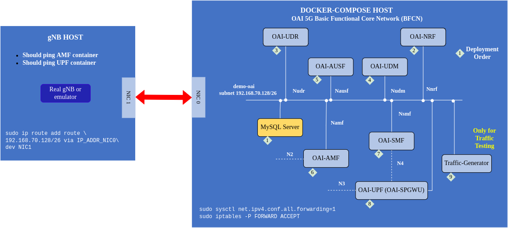

<table style="border-collapse: collapse; border: none;">
  <tr style="border-collapse: collapse; border: none;">
    <td style="border-collapse: collapse; border: none;">
      <a href="http://www.openairinterface.org/">
         
         </img>
      </a>
    </td>
    <td style="border-collapse: collapse; border: none; vertical-align: center;">
      <b><font size = "5">OpenAirInterface 5G Core Network Static UE IP Address Allocation</font></b>
    </td>
  </tr>
</table>




This tutorial shows how to configure OAI 5G core for providing static UE ip-addresses based on UE subscription data. In SMF configuration there is a parameter `USE_LOCAL_SUBSCRIPTION_INFO` which forces SMF to use local subscription information. For example using the DNN parameters (name,type and ip-address range) as defined in the configuration file. But all this information can be moved to mysql database and SMF can fetch it via communicating with UDM <--> UDR <--> MySql.

In this tutorial you will learn how to change this parameter and configure an ip-address for a particular UE-IMSI. This static ip-address allocation is needed in private 5G networks.

* To follow this tutorial the users should know how to deploy a Basic OAI-5G core network.
* The RAN emulator used for this tutorial is gNBSIM
* Readers could also replace the RAN emulator by a real RAN.

Please follow the tutorial step by step to create a stable working testbed.

**Reading time**: ~ 20 mins

**Tutorial replication time**: ~ 40 mins

**Note**:
- The commands mentioned in the document assume that your present working directory is `./docker-compose`. Make sure in the terminal in which you copy and paste the commands or write the tutorial commands as `pwd` as `./docker-compose`.
- Best practice open this markdown file with your favourite editor or online on gitlab and open a terminal separately
- Before reading this tutorial read this [one](./DEPLOY_SA5G_BASIC_DEPLOYMENT.md)

**CAUTION: 2023/07/13: This tutorial has been updated to use the new UPF that replaces SPGWU-TINY.**

**TABLE OF CONTENTS**

[[_TOC_]]

## 1. Pre-requisites

Read the tutorial on [how to deploy a Basic OAI-5G core network](./DEPLOY_SA5G_BASIC_DEPLOYMENT.md) you can choose to deploy with or without NRF. In this tutorial we are choosing with nrf scenarion.

Create a folder where you can store all the result files of the tutorial and later compare them with our provided result files, we recommend creating exactly the same folder to not break the flow of commands afterwards

<!---
For CI purposes please ignore this line
``` shell
docker-compose-host $: rm -rf /tmp/oai/static-ue-ip
```
-->

``` shell
docker-compose-host $: mkdir -p /tmp/oai/static-ue-ip
docker-compose-host $: chmod 777 /tmp/oai/static-ue-ip
```

## 2. Configuring the OAI-5G Core Network Functions

Edit the correct docker-compose file of Basic OAI 5G core network, set the parameter `USE_LOCAL_SUBSCRIPTION_INFO` to `no` in the smf service configuration of the docker-compose file.

- When using nrf [docker-compose file with nrf](../docker-compose/docker-compose-basic-nrf.yaml)

``` shell
docker-compose-host $: sed -i 's/use_local_subscription_info: yes/use_local_subscription_info: no/g' conf/basic_nrf_config.yaml
```

Then configure the [user subscription database sql file](../docker-compose/database/oai_db2.sql) with IMSI and DNN information mapping. In the table `SessionManagementSubscriptionData` add below entries

- Static UE ip-address allocation

``` sql
INSERT INTO `SessionManagementSubscriptionData` (`ueid`, `servingPlmnid`, `singleNssai`, `dnnConfigurations`) VALUES
('208950000000031', '20895', '{\"sst\": 222, \"sd\": \"123\"}','{\"default\":{\"pduSessionTypes\":{ \"defaultSessionType\": \"IPV4\"},\"sscModes\": {\"defaultSscMode\": \"SSC_MODE_1\"},\"5gQosProfile\": {\"5qi\": 6,\"arp\":{\"priorityLevel\": 1,\"preemptCap\": \"NOT_PREEMPT\",\"preemptVuln\":\"NOT_PREEMPTABLE\"},\"priorityLevel\":1},\"sessionAmbr\":{\"uplink\":\"100Mbps\", \"downlink\":\"100Mbps\"},\"staticIpAddress\":[{\"ipv4Addr\": \"12.1.1.4\"}]}}');
```

- Dynamic ip-address allocation
``` sql
INSERT INTO `SessionManagementSubscriptionData` (`ueid`, `servingPlmnid`, `singleNssai`, `dnnConfigurations`) VALUES
('208950000000032', '20895', '{\"sst\": 222, \"sd\": \"123\"}','{\"default\":{\"pduSessionTypes\":{ \"defaultSessionType\": \"IPV4\"},\"sscModes\": {\"defaultSscMode\": \"SSC_MODE_1\"},\"5gQosProfile\": {\"5qi\": 6,\"arp\":{\"priorityLevel\": 1,\"preemptCap\": \"NOT_PREEMPT\",\"preemptVuln\":\"NOT_PREEMPTABLE\"},\"priorityLevel\":1},\"sessionAmbr\":{\"uplink\":\"100Mbps\", \"downlink\":\"100Mbps\"}}}');
```

Make sure you perform this for all the UEs, if there is a user information present in the `AuthenticationSubscription` table then that UE should also have an entry in the `SessionManagementSubscriptionData` table.

For now these two entries are present in the database file

## 3. Deploying OAI 5g Core Network

In the previous tutorial we explain how to deploy the core network using our [python deployer](../docker-compose/core-network.py). Here we will only provide quick commands needed to deploy the core network, to learn how to use the python deployer please follow [this page](./DEPLOY_SA5G_MINI_WITH_GNBSIM.md).

- Start the core network components, check which scenario you are using with nrf or without nrf

As a first timer, we recommend to first run without any PCAP capture.

``` console
docker-compose-host $: python3 core-network.py --type start-basic --scenario 1
```

For CI purposes, we are deploying with an automated PCAP capture on the docker network.

**REMEMBER: if you are planning to run your CN5G deployment for a long time, the PCAP file can become huge!**

``` shell
docker-compose-host $: python3 core-network.py --type start-basic --scenario 1 --capture /tmp/oai/static-ue-ip/static-ue-ip.pcap
```
<details>
<summary>The output will look like this:</summary>

``` console
[2023-07-13 13:04:33,447] root:DEBUG:  Starting 5gcn components... Please wait....
[2023-07-13 13:04:34,163] root:DEBUG: docker-compose -f docker-compose-basic-nrf.yaml up -d mysql
Creating network "demo-oai-public-net" with driver "bridge"
Creating mysql ...
Creating mysql ... done

[2023-07-13 13:04:38,494] root:DEBUG: nohup sudo tshark -i demo-oai -f "(not host 192.168.70.135 and not arp and not port 53 and not port 2152) or (host 192.168.70.135 and icmp)" -w /tmp/oai/static-ue-ip/static-ue-ip.pcap > /dev/null 2>&1 &
[2023-07-13 13:04:58,508] root:DEBUG: docker-compose -f docker-compose-basic-nrf.yaml up -d
mysql is up-to-date
Creating oai-ext-dn ...
Creating oai-nrf    ...
Creating oai-nrf    ... done
Creating oai-udr    ...
Creating oai-ext-dn ... done
Creating oai-udr    ... done
Creating oai-udm    ...
Creating oai-udm    ... done
Creating oai-ausf   ...
Creating oai-ausf   ... done
Creating oai-amf    ...
Creating oai-amf    ... done
Creating oai-smf    ...
Creating oai-smf    ... done
Creating oai-upf    ...
Creating oai-upf    ... done

[2023-07-13 13:05:31,939] root:DEBUG:  OAI 5G Core network started, checking the health status of the containers... takes few secs....
[2023-07-13 13:05:31,939] root:DEBUG: docker-compose -f docker-compose-basic-nrf.yaml ps -a
[2023-07-13 13:06:50,551] root:DEBUG:  All components are healthy, please see below for more details....
Name                 Command                  State                       Ports
---------------------------------------------------------------------------------------------------
mysql        docker-entrypoint.sh mysqld      Up (healthy)   3306/tcp, 33060/tcp
oai-amf      /openair-amf/bin/oai_amf - ...   Up (healthy)   38412/sctp, 80/tcp, 8080/tcp, 9090/tcp
oai-ausf     /openair-ausf/bin/oai_ausf ...   Up (healthy)   80/tcp, 8080/tcp
oai-ext-dn   /bin/bash -c  ip route add ...   Up (healthy)
oai-nrf      /openair-nrf/bin/oai_nrf - ...   Up (healthy)   80/tcp, 8080/tcp, 9090/tcp
oai-smf      /openair-smf/bin/oai_smf - ...   Up (healthy)   80/tcp, 8080/tcp, 8805/udp
oai-udm      /openair-udm/bin/oai_udm - ...   Up (healthy)   80/tcp, 8080/tcp
oai-udr      /openair-udr/bin/oai_udr - ...   Up (healthy)   80/tcp, 8080/tcp
oai-upf      /openair-smf/bin/oai_upf - ...   Up (healthy)   2152/udp, 8080/tcp, 8805/udp
[2023-07-13 13:07:00,589] root:DEBUG:  Checking if the containers are configured....
[2023-07-13 13:07:00,589] root:DEBUG:  Checking if AMF, SMF and UPF registered with nrf core network....
[2023-07-13 13:07:00,589] root:DEBUG: curl -s -X GET --http2-prior-knowledge http://192.168.70.130:8080/nnrf-nfm/v1/nf-instances?nf-type="AMF" | grep -o "192.168.70.132"
192.168.70.132
[2023-07-13 13:07:00,604] root:DEBUG: curl -s -X GET --http2-prior-knowledge http://192.168.70.130:8080/nnrf-nfm/v1/nf-instances?nf-type="SMF" | grep -o "192.168.70.133"
192.168.70.133
[2023-07-13 13:07:00,618] root:DEBUG: curl -s -X GET --http2-prior-knowledge http://192.168.70.130:8080/nnrf-nfm/v1/nf-instances?nf-type="UPF" | grep -o "192.168.70.134"
192.168.70.134
[2023-07-13 13:07:00,630] root:DEBUG:  Checking if AUSF, UDM and UDR registered with nrf core network....
[2023-07-13 13:07:00,630] root:DEBUG: curl -s -X GET --http2-prior-knowledge http://192.168.70.130:8080/nnrf-nfm/v1/nf-instances?nf-type="AUSF" | grep -o "192.168.70.138"
192.168.70.138
[2023-07-13 13:07:00,642] root:DEBUG: curl -s -X GET --http2-prior-knowledge http://192.168.70.130:8080/nnrf-nfm/v1/nf-instances?nf-type="UDM" | grep -o "192.168.70.137"
192.168.70.137
[2023-07-13 13:07:00,654] root:DEBUG: curl -s -X GET --http2-prior-knowledge http://192.168.70.130:8080/nnrf-nfm/v1/nf-instances?nf-type="UDR" | grep -o "192.168.70.136"
192.168.70.136
[2023-07-13 13:07:00,667] root:DEBUG:  AUSF, UDM, UDR, AMF, SMF and UPF are registered to NRF....
[2023-07-13 13:07:00,667] root:DEBUG:  Checking if SMF is able to connect with UPF....
[2023-07-13 13:07:00,803] root:DEBUG:  UPF did answer to N4 Association request from SMF....
[2023-07-13 13:07:00,865] root:DEBUG:  SMF is receiving heartbeats from UPF....
[2023-07-13 13:07:00,866] root:DEBUG:  OAI 5G Core network is configured and healthy....
```
</details>

- Without nrf scenario

``` console
docker-compose-host $: python3 core-network.py --type start-basic --scenario 2
```


## 4. Deploying RAN Emulator

- **Scenario Execution**:
    + On the ran emulator host instantiate the ran emulator of your choice, here we will show it using gnbsim. We are running everything on one host thus the ran-emulator-host and docker-compose-host is the same for the moment.
    ``` shell
    docker-compose-host $: docker-compose -f docker-compose-gnbsim.yaml up -d gnbsim
    Found orphan containers (oai-ext-dn, oai-smf, oai-udr, oai-amf, oai-nrf, oai-udm, oai-upf, mysql, oai-ausf) for this project.
    Creating gnbsim ... done
    ```
    <!---
    For CI purposes please ignore this line
    ``` shell
    docker-compose-host $: ../ci-scripts/checkContainerStatus.py --container_name gnbsim --timeout 30
    ```
    -->

    + (Optional) in case you want you can also run another instance of gnbsim to check dynamic ip-address allocation is also working or not
    ``` console
    docker-compose-host $: docker-compose -f docker-compose-gnbsim.yaml up -d gnbsim2
    ```
    + In case you want to run the ran-emulator on another host then make sure both machine are able to communicate properly and from the host you are able to ping to the bridge of docker-compose-host `192.168.70.128`

- **Verify PDN session establishment**: To check if a PDN session is properly established, there is an extra external data network container only for this demo purpose. The ran emulator UE can be reached using this container to validate the PDN session establishment. To understand the packet flow read the next analysis section. The allocated UE ip-address for the first gnbsim should be 12.1.1.4 because we fixed it in previous steps and for the other gnbsim instance you need to check,

``` shell
docker-compose-host $: docker logs gnbsim 2>&1 | grep "UE address:"
[gnbsim]2023/07/13 11:07:13.134098 example.go:332: UE address: 12.1.1.4
```

``` console
docker-compose-host $: docker logs gnbsim2 2>&1 | grep "UE address:"
```

## 5. Traffic Test

``` shell
docker-compose-host $: docker exec oai-ext-dn ping 12.1.1.4 -c4
PING 12.1.1.4 (12.1.1.4) 56(84) bytes of data.
64 bytes from 12.1.1.4: icmp_seq=1 ttl=63 time=0.297 ms
64 bytes from 12.1.1.4: icmp_seq=2 ttl=63 time=0.824 ms
64 bytes from 12.1.1.4: icmp_seq=3 ttl=63 time=0.723 ms
64 bytes from 12.1.1.4: icmp_seq=4 ttl=63 time=0.849 ms

--- 12.1.1.4 ping statistics ---
4 packets transmitted, 4 received, 0% packet loss, time 3072ms
rtt min/avg/max/mdev = 0.297/0.673/0.849/0.223 ms
```

## 6. Log Collection

<!---
For CI purposes please ignore these lines
``` shell
docker-compose-host $: docker-compose -f docker-compose-gnbsim.yaml stop -t 2
docker-compose-host $: docker-compose -f docker-compose-basic-nrf.yaml stop -t 2
```
-->

- **Stop PCAP collection**: Stop the wireshark or tshark process on the docker-compose-host.

``` console
docker-compose-host $: pkill tshark
```

- **Collect the logs of all the components**:

``` shell
docker-compose-host $: docker logs oai-amf > /tmp/oai/static-ue-ip/amf.log 2>&1
docker-compose-host $: docker logs oai-smf > /tmp/oai/static-ue-ip/smf.log 2>&1
docker-compose-host $: docker logs oai-nrf > /tmp/oai/static-ue-ip/nrf.log 2>&1
docker-compose-host $: docker logs oai-upf > /tmp/oai/static-ue-ip/upf.log 2>&1
docker-compose-host $: docker logs oai-udr > /tmp/oai/static-ue-ip/udr.log 2>&1
docker-compose-host $: docker logs oai-udm > /tmp/oai/static-ue-ip/udm.log 2>&1
docker-compose-host $: docker logs oai-ausf > /tmp/oai/static-ue-ip/ausf.log 2>&1
docker-compose-host $: docker logs gnbsim > /tmp/oai/static-ue-ip/gnbsim.log 2>&1
```

## 7. Undeploy the network functions

### 7.1. Undeploy the ran emulator

``` shell
docker-compose-host $: docker-compose -f docker-compose-gnbsim.yaml down -t 0
```
<details>
<summary>The output will look like this:</summary>

``` console
Stopping gnbsim ... done
Found orphan containers (oai-nrf, oai-ausf, oai-smf, oai-udr, oai-upf, mysql, oai-amf, oai-udm, oai-ext-dn) for this project.
Removing gnbsim ... done
Network demo-oai-public-net is external, skipping
```
</details>

### 7.2. Undeploy the core network

``` shell
docker-compose-host $: python3 core-network.py --type stop-basic --scenario 1
```
<details>
<summary>The output will look like this:</summary>

``` console
[2023-07-13 13:07:54,271] root:DEBUG:  UnDeploying OAI 5G core components....
[2023-07-13 13:07:54,272] root:DEBUG: docker-compose -f docker-compose-basic-nrf.yaml down -t 0
Removing oai-upf    ...
Removing oai-smf    ...
Removing oai-amf    ...
Removing oai-ausf   ...
Removing oai-udm    ...
Removing oai-udr    ...
Removing oai-ext-dn ...
Removing oai-nrf    ...
Removing mysql      ...
Removing oai-udr    ... done
Removing oai-smf    ... done
Removing oai-upf    ... done
Removing oai-ausf   ... done
Removing oai-nrf    ... done
Removing oai-udm    ... done
Removing mysql      ... done
Removing oai-ext-dn ... done
Removing oai-amf    ... done
Removing network demo-oai-public-net

[2023-07-13 13:07:55,711] root:DEBUG:  OAI 5G core components are UnDeployed....
```
</details>

- If you replicate then your log files and pcap file will be present in `/tmp/oai/static-ue-ip/`. If you want to compare it with our provided logs and pcaps, then follow the next section


<!---
For CI purposes please ignore this line
``` shell
docker-compose-host $: sed -i 's/use_local_subscription_info: no/use_local_subscription_info: yes/g' conf/basic_nrf_config.yaml
```
-->


## 8. Reference logs


| PCAP and Logs      |
|:-------------------|
| [capture.pcap](./results/static-ue-ip/capture.pcap) |
| [amf.log](./results/static-ue-ip/amf.log)      |
| [smf.log](./results/static-ue-ip/smf.log)      |
| [nrf.log](./results/static-ue-ip/nrf.log)      |
| [udm.log](./results/static-ue-ip/udm.log)      |
| [udr.log](./results/static-ue-ip/udr.log)      |
| [ausf.log](./results/static-ue-ip/ausf.log)     |


## 9. Notes

- The `oai-ext-dn` container is optional and is only required if the user wants to ping from the UE. In general this container is not required except for testing purposes.
- Using the python script from above you can perform minimum `AMF, SMF, UPF, NRF, MYSQL` and basic `AMF, SMF, UPF, NRF, UDM, UDR, AUSF, MYSQL` 5g core funtional testing with `FQDN/IP` based feature along with `NRF/noNRF`. Check the configuration before using the docker compose [files](../docker-compose/).
- This tutorial can be taken as reference to test the OAI 5G core with a COTS UE. The configuration files has to be changed according to the gNB and COTS UE information should be present in the mysql database.
- In case you are interested in using HTTP V2 for SBI between the network functions instead of HTTP V1, then you have to use [docker-compose-basic-nrf-http2.yaml](../docker-compose/docker-compose-basic-nrf-http2.yaml)
- Generally, in a COTS UE two PDN sessions are created by default so configure the IMS in SMF properly. Currently some parameters can not be configured via [docker-compose-basic-nrf.yaml](../docker-compose/docker-compose-basic-nrf.yaml). We recommend you configure them directly in the conf file and mount the file in the docker during runtime.
- It is not necessary to use [core-network.py](../docker-compose/core-network.py) Python script, it is possible to directly deploy using `docker-compose` command
- In case you want to deploy debuggers/developers core network environment with more logs please follow [this tutorial](./DEBUG_5G_CORE.md)

``` bash
#To start the containers
docker-compose-host $: docker-compose -f <file-name> up -d
#To check their health status and wait till the time they are healthy, you ctrl + c to exit watch command
docker-compose-host $: watch docker-compose -f <file-name> ps -a
#To stop the containers
docker-compose-host $: docker-compose -f <file-name> down -t 0
```
