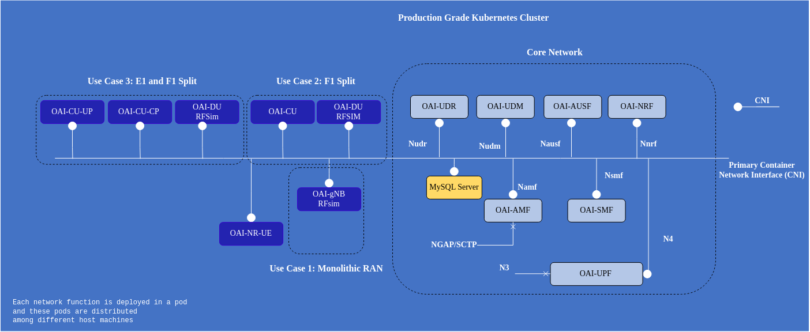

<table style="border-collapse: collapse; border: none;">
  <tr style="border-collapse: collapse; border: none;">
    <td style="border-collapse: collapse; border: none;">
      <a href="http://www.openairinterface.org/">
         
         </img>
      </a>
    </td>
    <td style="border-collapse: collapse; border: none; vertical-align: center;">
      <b><font size = "5">OpenAirInterface 5G Core and RAN Network Function Deployment using Helm Charts</font></b>
    </td>
  </tr>
</table>

OAI 5G core network have different network functions which can be used invidiually or deployed all together in different combination on a production grade Kubernetes cluster like Openshift or a Vanilla Kubernetes cluster. 




**Reading time**: ~30 mins

**Tutorial replication time**: ~40mins

**TABLE OF CONTENTS**

[[_TOC_]]


### Pre-requisite

1. Minimum 4 CPU (Threaded), 16GBi RAM and 50G storage
2. (Optional) Multus CNI if using multiple interfaces for NFs

Clone the git repository 

```console 
$: git clone -b <Branch> https://gitlab.eurecom.fr/oai/cn5g/oai-cn5g-fed
```

## 1. Description

The helm charts can be used on any production grade kubernetes cluster or even vanilla kubernetes. We have also tested on a single node 4 CPU and 16 GB ram minikube cluster with docker virtualization environment. In our testing environment we deploy these charts on our inhouse Openshift clusters the cluster information can be found below.

| Software                        | Version                                 |
|:--------------------------------|:----------------------------------------|
| Openshift Client Version        | 4.13.X                                  |
| Kubernetes Version              | Kubernetes Version: v1.27.4             |
| helm                            | v3.11.2                                 |
| Base images of Network functions| Ubuntu 20.04/22.04/UBI 8/9(RHEL 8/9)    |

Each NF has its independent helm-chart and apart from that there are parent helm-charts for below scenarions:

1. Minimalist deployment: MYSQL (Subscriber Database), AMF, SMF, UPF, NRF
2. Basic deployment: MYSQL (Subscriber Database), UDR, UDM, AUSF, AMF, SMF, UPF, NRF
3. Advance deployment: MYSQL (Subscriber Database), NSSF, UDR, UDM, AUSF, AMF, SMF, UPF, NRF

In this tutorial we will deploy a basic setting of OAI 5g core network and will deploy oai-gNB and oai-nr-ue in rf-simulator mode to perform some traffic testing. You can also deploy the core network in other two settings, it all depends on your use case and testbed. 

## 2. Fetching Network Function Images

Ubuntu base images can be pulled from [docker-hub](https://hub.docker.com/u/oaisoftwarealliance) but if you want to make some changes in the code then you should build your own images. If you will use Ubuntu images then skip this part and in section `3.1` there is a detailed procedure. In case of RHEL based worker node you have to build your own images, to download packages from RHEL repository you need a developer or enterprise account. 

1. To learn how to build UBI 9.X images follow this [tutorial](./openshift/README.md)
2. To learn how to build Ubuntu images follow this [tutorial](./BUILD_IMAGES.md)


## 3. Configuring Helm Charts

```console
cd oai-cn5g-fed
ls charts/
oai-5g-core  oai-5g-ran
ls charts/oai-5g-core/
mysql  oai-5g-advance  oai-5g-basic  oai-5g-mini  oai-amf  oai-ausf  oai-nrf  oai-nssf  oai-smf  oai-traffic-server  oai-udm  oai-udr  oai-upf
ls charts/oai-5g-ran/
oai-cu  oai-cu-cp  oai-cu-up  oai-du  oai-gnb  oai-nr-ue
```

All the OAI core network charts are present in `oai-5g-core` folder, there you can find charts of individual network functions and for the above described three different deployment settings. 

1. Folder `oai-5g-mini` is for [minimilist deployment](../charts/oai-5g-core/oai-5g-mini/README.md)
2. Folder `oai-5g-basic` is for [basic deployment](../charts/oai-5g-core/oai-5g-basic/README.md)
3. Folder `oai-5g-advance` is for [advance deployment](../charts/oai-5g-core/oai-5g-advance/README.md)

These charts are configured keeping in mind 5G service based architecture, if you want to deploy using reference based architecture then you need to make certain changes. 

The structure of all these folders is similar, 

```
oai-5g-basic/
├── Chart.yaml
├── config.yaml
├── README.md
├── templates
│   └── configmap.yaml
└── values.yaml

1 directory, 5 files

```

Starting version `2.0.0` of OAI 5G Core network functions their configuration will be in `config.yaml` and all infrastructure related information including image definition will be in `values.yaml`.

Helm chart of every network function looks similar and has the below structure. Only the chart of mysql database and NRF is different.

```
Network_function/
├── Chart.yaml
├── config.yaml
├── README.md
├── templates
│   ├── configmap.yaml
│   ├── deployment.yaml
│   ├── _helpers.tpl
│   ├── multus.yaml
│   ├── NOTES.txt
│   ├── rbac.yaml
│   ├── serviceaccount.yaml
│   └── service.yaml
└── values.yaml

1 directory, 12 files

```

All the configurable parameters for a particular commit/release are mentioned in the `config.yaml` file. These parameters will keep on changing in the future depending on the nature of development and features. 

**NOTE**: If there is a need to edit a specific configuration parameter that is not configurable via the helm-chart `config.yaml` file then it has to be changed at the time of building images.

Create a namespace where the helm-charts will be deployed, in our environment we deploy them in `oai-tutorial` namespace. To create a namespace use the below command on your cluster, 


```console
# needs a user which has the right to create namespaces
kubectl create ns oai-tutorial
#or 
oc new-project oai-tutorial
```

**NOTE**: Any changes done in the parent chart (Mini, basic, advance scenario helm charts) will overwrite the sub charts. 

### 3.1 Networking related information

Network function discovers each-other using NRF and instead of using the ip-address of network functions we rely on using their FQDN, **Kubernetes service concept**. To communicate with each other whether we deploy them in reference point architecture or service based architecture. 

*For example: AMF registers with NRF using NRF FQDN (`oai-nrf.oai-tutorial.svc.cluster.local`). This way we can get rid of any static ip-address configuration.*

#### 3.1.1 Configure Multiple Interfaces

- Here the network functions will use different virtual ethernet interfaces to bind their different logical interface. Example AMF communicates with gNB using N2 and with SMF and NRF using Namf, the Service Base Interface (SBI).
- This type of configuration is also used when gNB is outside of the cluster or UPF is outside of the cluster. 
- To make the above seperation we are using multus to provide multiple ethernet interfaces to network functions which have multiple communication interfaces.
- Only AMF, SMF and UPF have the possiblity to use multus. Other network functions can also use multus but then it needs to be configured. 
- To configure multus for AMF, SMF or UPF, in `values.yaml` of each network function edit the multus section.

```
## Example from oai-amf/values.yaml
multus:
  ## If you don't want to add a default route in your pod then leave this field empty
  defaultGateway: "172.21.7.254"
  n2Interface:
    create: false
    Ipadd: "172.21.6.94"
    Netmask: "22"
    ## If you do not have a gateway leave the field empty
    Gateway:
    ## If you do not want to add any routes in your pod then leave this field empty
    routes: [{'dst': '10.8.0.0/24','gw': '172.21.7.254'}]
    hostInterface: "bond0" # Interface of the host machine on which this pod will be scheduled
```

#### 3.1.2 Use Single Interface

- No need to configure multus for any network function. For different communication interfaces network functions will use same ethernet interface. Example AMF will use `eth0` interface to communicate with gNB, SMF and NRF.
- In `values.yaml` of AMF, SMF and UPF in multus section do multus.create `false` like below, 

```
## Example from oai-amf/values.yaml
multus:
  n2Interface:
    create: false
```

#### 3.1.3 Capturing Packets (Optional)

Every network function has an extra TCP dump container to take the TCP dump. But by default this container is not used. If enabled it will capture dumps on `all interfaces` and will store inside the container locally or in a persistant volume if enabled. 

To enable the persistant volume in the `values.yaml` of every network function make the below change, 

```
## amf
start:
  amf: true #If false the network function container will run in sleep mode for manually testing
  tcpdump: false

includeTcpDumpContainer: false #If true it will add a tcpdump container inside network function pod for debugging

#To store PCAP of NF in a sharedVolume so it can be easily fetched (PVC is created with NRF charts so make sure in NRF it is true)
persistent:
  sharedvolume: false

```

### 3.2 Network function Images

To pull images from docker-hub, it will be good to configure an image pull secrete because of the anonymous pull limit of 100 in docker-hub. If you provide a personal/company account the limit will be different. 

```bash
#kubernetes
kubectl create secret docker-registry regcred --docker-server=https://index.docker.io/v1/ --docker-username=<your-name> --docker-password=<your-pword> --docker-email=<your-email>
#openshift 
oc create secret docker-registry regcred --docker-server=https://index.docker.io/v1/ --docker-username=<your-name> --docker-password=<your-pword> --docker-email=<your-email>

```

There are more ways to make docker secrete you can follow this [link](https://kubernetes.io/docs/tasks/configure-pod-container/pull-image-private-registry/). After this mention this in the `values.yaml` of each network function

```
## good to use when pulling images from docker-hub mention
imagePullSecrets:
  - name: "regcred"
```

When pulling images from docker hub you have several choices either to use images with develop tag (based on latest develop branch somtimes might not be stable), latest (built from current master branch) and release tags. 


### 3.3 Configuring Helm Chart Parameters

In the [config.yaml](../charts/oai-5g-core/oai-5g-basic/config.yaml) of oai-5g-basic helm charts you will see the configurable parameters for all the network functions check, the PLMN, DNN and subscriber information in mysql database

For basic and advance deployment check the database [oai_db-basic.sql](../charts/oai-5g-core/mysql/initialization/oai_db-basic.sql)

A new subscriber entry can be added directly in the sql file or it can be added once the core network is already deployed. 

To add the entry before deploying the core network, make sure you have all the required subscriber information IMSI(ueid/supi), Key(encPermanentKey), OPC(encOpcKey), PLMN, NSSAI(SST, SD), DNN

```sql
 vim/vi/nano charts/oai-5g-core/mysql/initialization/oai_db-basic.sql
# Add a new or edit existing entries after AuthenticationSubscription table
INSERT INTO `AuthenticationSubscription` (`ueid`, `authenticationMethod`, `encPermanentKey`, `protectionParameterId`, `sequenceNumber`, `authenticationManagementField`, `algorithmId`, `encOpcKey`, `encTopcKey`, `vectorGenerationInHss`, `n5gcAuthMethod`, `rgAuthenticationInd`, `supi`) VALUES
('208990100001124', '5G_AKA', 'fec86ba6eb707ed08905757b1bb44b8f', 'fec86ba6eb707ed08905757b1bb44b8f', '{\"sqn\": \"000000000020\", \"sqnScheme\": \"NON_TIME_BASED\", \"lastIndexes\": {\"ausf\": 0}}', '8000', 'milenage', 'c42449363bbad02b66d16bc975d77cc1', NULL, NULL, NULL, NULL, '208990100001124');
# Add the PDN/DNN information after SessionManagementSubscriptionData table
# To assign a static ip-address use the below entry
INSERT INTO `SessionManagementSubscriptionData` (`ueid`, `servingPlmnid`, `singleNssai`, `dnnConfigurations`) VALUES 
('208990100001124', '20899', '{\"sst\": 1, \"sd\": \"10203\"}','{\"oai\":{\"pduSessionTypes\":{ \"defaultSessionType\": \"IPV4\"},\"sscModes\": {\"defaultSscMode\": \"SSC_MODE_1\"},\"5gQosProfile\": {\"5qi\": 6,\"arp\":{\"priorityLevel\": 1,\"preemptCap\": \"NOT_PREEMPT\",\"preemptVuln\":\"NOT_PREEMPTABLE\"},\"priorityLevel\":1},\"sessionAmbr\":{\"uplink\":\"100Mbps\", \"downlink\":\"100Mbps\"},\"staticIpAddress\":[{\"ipv4Addr\": \"12.1.1.85\"}]}}');
INSERT INTO `SessionManagementSubscriptionData` (`ueid`, `servingPlmnid`, `singleNssai`, `dnnConfigurations`) VALUES 
('208990100001125', '20899', '{\"sst\": 1, \"sd\": \"10203\"}','{\"oai\":{\"pduSessionTypes\":{ \"defaultSessionType\": \"IPV4\"},\"sscModes\": {\"defaultSscMode\": \"SSC_MODE_1\"},\"5gQosProfile\": {\"5qi\": 6,\"arp\":{\"priorityLevel\": 1,\"preemptCap\": \"NOT_PREEMPT\",\"preemptVuln\":\"NOT_PREEMPTABLE\"},\"priorityLevel\":1},\"sessionAmbr\":{\"uplink\":\"100Mbps\", \"downlink\":\"100Mbps\"}}}');
```

In the config file `smf.use_local_subscription_info` should be `yes` to use the user DNN subscription information from the database. Else it will be used as defined in the configuration file.

Once the charts are configured perform helm dependency update inside the chart repository

``` shell
cd charts/oai-5g-core/oai-5g-basic
helm dependency update
```

**NOTE**: Whenever you will make any change in the network function helm-chart or mysql helm chart you need to perform a dependency update to inform parent chart about the sub-charts update. 

## 4. Deploying Helm Charts

Helm charts have an order of deployment for the proper configuration of core network. 

Once the configuration is finished the charts can be deployed with a user who has the rights to

1. Create RBAC (Optional only if Openshift is used)
2. Run pod (only UPF needs that) with privileged and anyuid scc (optional only required if you have scc configure in your cluster)
3. Create multus binds (optional only if multus is used)

``` shell
helm install basic oai-5g-basic/
```

<details>
<summary>The output is similar to:</summary>

```console
NAME: basic
LAST DEPLOYED: Tue Dec 12 10:04:40 2023
NAMESPACE: default
STATUS: deployed
REVISION: 1
TEST SUITE: None
```
</details>


This command can take around 3-5 mins depending on your network speed and cluster configuration (computational capacity). You can use the wait command to see if the core network functions are running or not

```shell
kubectl wait --for=condition=ready pod -l app.kubernetes.io/instance=basic --timeout=3m
```

## 4.1 How to check if the Core network is properly configured?

Check the logs `smf` and `upf` to see that the PFCP session is properly configured, 

```console
kubectl logs -l app.kubernetes.io/name=oai-smf -n oai-tutorial | grep 'handle_receive(16 bytes)' | wc -l
kubectl logs -l app.kubernetes.io/name=oai-upf -n oai-tutorial | grep 'handle_receive(16 bytes)' | wc -l
```
If the value is more than 1 for both then it will verify that `smf` and `upf` have successfully registered to `nrf` and there is a PFCP session. 

## 5 Use Case 1: Testing with Monolithic RAN

The images which are used in the tutorial are already present in docker-hub like the other images of OAI 5g core network functions. The charts of all the network functions are preconfigured to work with OAI-gnB and OAI-NR-UE end to end installation. 

### 5.1 Images OAI-gNB and OAI-NR-UE

For ubuntu based worker nodes the images can be pulled directly from docker-hub. To build images manually follow this [link](https://gitlab.eurecom.fr/oai/openairinterface5g/-/tree/develop/docker). In case you have an Openshift cluster then follow this [link](../openshift/README.md)

### 5.2 Configuring OAI-gNB RFSimulator and OAI-NR-UE

**Very Important** To access internet in NR-UE the N6/SGI interface of UPF should be able access the internet. 

GNB requires the ip-address or service name of AMF. In case in AMF multus is used and N1/N2 interface is bind to multus interface, then please provide AMF ip-address. 

For this tutorial we are not using multus here for similicity, generally there should be two interfaces of gNB(for N2 and N3).

```
## oai-gNB configuration from values.yaml
config:
  timeZone: "Europe/Paris"
  useAdditionalOptions: "--sa -E --rfsim --log_config.global_log_options level,nocolor,time"
  gnbName: "oai-gnb-rfsim"
  mcc: "001"   # check the information with AMF, SMF, UPF
  mnc: "01"    # check the information with AMF, SMF, UPF
  tac: "1"     # check the information with AMF
  sst: "1"  #currently only 4 standard values are allowed 1,2,3,4
  usrp: rfsim   #allowed values rfsim, b2xx, n3xx or x3xx
  amfhost: "oai-amf"  # amf ip-address or service-name oai-amf-svc or 172.21.6.94
  n2IfName: "eth0"    # if multus.n2Interface.create is true then use n2
  n3IfName: "eth0"
``` 

### 5.3 Deploy OAI-gNB RFSimulator

To deploy the oai-gnb in rf simulator mode follow the below steps

``` shell
cd ../../oai-5g-ran/
helm install gnb oai-gnb --namespace oai-tutorial
```
<details>
<summary>The output is similar to:</summary>

```console
NAME: gnb
LAST DEPLOYED: Tue Dec 12 10:46:53 2023
NAMESPACE: default
STATUS: deployed
REVISION: 1
TEST SUITE: None
NOTES:
1. Get the application name by running these commands:
  export GNB_POD_NAME=$(kubectl get pods --namespace oai-tutorial -l "app.kubernetes.io/name=oai-gnb,app.kubernetes.io/instance=gnb" -o jsonpath="{.items[0].metadata.name}")
  export GNB_eth0_IP=$(kubectl get pods --namespace oai-tutorial -l "app.kubernetes.io/name=oai-gnb,app.kubernetes.io/instance=gnb" -o jsonpath="{.items[*].status.podIP}")
2. Dockerhub images of OpenAirInterface requires avx2 capabilities in the cpu and they are built for x86 architecture, tested on UBUNTU OS only.
3. Note: This helm chart of OAI-gNB is only tested in RF-simulator mode and is not tested with USRPs/RUs on Openshift/Kubernetes Cluster
4. In case you want to test these charts with USRP/RU then make sure your underlying kernel is realtime and CPU sleep states are off. 
   Also for good performance it is better to use MTU 9000 for Fronthaul interface. 
5. If you want to configure for a particular band then copy the configuration file in templates/configmap.yaml from here https://gitlab.eurecom.fr/oai/openairinterface5g/-/tree/develop/targets/PROJECTS/GENERIC-NR-5GC/CONF
```
</details>

Wait for the gNB to start

```shell
kubectl wait --for=condition=ready pod -l app.kubernetes.io/name=oai-gnb --timeout=3m --namespace oai-tutorial
```

To check if gnB is connected, read the logs of amf and check N2 setup procedure was correct or not, 

```console
kubectl logs --namespace oai-tutorial $(kubectl get pods --namespace oai-tutorial | grep oai-amf| awk '{print $1}') | grep 'Connected'
```

<details>
<summary>The output is similar to:</summary>

```console
Defaulted container "amf" out of: amf, init (init)
[2023-12-12 09:47:54.854] [amf_app] [info] |      1      |    Connected     |        0xe000        |       oai-gnb-rfsim           |               001, 01              | 
[2023-12-12 09:48:14.854] [amf_app] [info] |      1      |    Connected     |        0xe000        |       oai-gnb-rfsim           |               001, 01              | 
```
</details>


### 5.4 Configure OAI-NR-UE RFSimulator

```
config:
  timeZone: "Europe/Paris"
  rfSimServer: "oai-du"    # ip-address of rfsim or service name oai-gnb in case of du change it with oai-du if multus is true then provide ip-address of oai-gnb
  fullImsi: "001010000000100"       # make sure all the below entries are present in the subscriber database
  fullKey: "fec86ba6eb707ed08905757b1bb44b8f" 
  opc: "C42449363BBAD02B66D16BC975D77CC1"
  dnn: "oai"
  sst: "1"                     # configure according to gnb and amf, smf and upf 
  sd: "16777215"
  usrp: "rfsim"            # allowed rfsim, b2xx, n3xx, x3xx
  useAdditionalOptions: "--sa --rfsim -r 106 --numerology 1 -C 3619200000 --nokrnmod --log_config.global_log_options level,nocolor,time"
```

### 5.5 Deploy OAI-NR-UE RFSimulator

To deploy the oai-nr-ue in rf simulator mode follow the below steps

``` shell
helm install nrue oai-nr-ue/ --namespace oai-tutorial
```

<details>
<summary>The output is similar to:</summary>

```console
NAME: nrue
LAST DEPLOYED: Tue Dec 12 10:56:16 2023
NAMESPACE: default
STATUS: deployed
REVISION: 1
TEST SUITE: None
NOTES:
1. Get the application name by running these commands:
  export NR_UE_POD_NAME=$(kubectl get pods --namespace oai-tutorial -l "app.kubernetes.io/name=oai-nr-ue,app.kubernetes.io/instance=nrue" -o jsonpath="{.items[0].metadata.name}")
2. Dockerhub images of OpenAirInterface requires avx2 capabilities in the cpu and they are built for x86 architecture, tested on UBUNTU OS only.
3. Note: This helm chart of OAI-NR-UE is only tested in RF-simulator mode not tested with hardware on Openshift/Kubernetes Cluster
4. In case you want to test these charts with USRP then make sure your CPU sleep states are off```
</details>
```

Wait for the NR-UE to start

```shell
kubectl wait --for=condition=ready pod -l app.kubernetes.io/name=oai-nr-ue --timeout=3m --namespace oai-tutorial
```

Now you are start reading the logs of amf, smf and other network function to understand the message flow. Once the pdu session establishment procedure is finished you will receive an ip-address. You can start performing some testing. 

check if the UE received an ip-address

```console
kubectl exec -it -n oai-tutorial -c nr-ue $(kubectl get pods | grep oai-nr-ue | awk '{print $1}') -- ifconfig oaitun_ue1 |grep -E '(^|\s)inet($|\s)' | awk {'print $2'}
```

<details>
<summary>The output is similar to:</summary>

```console
12.1.1.100
```
</details>


### 5.6 Performing some traffic testing

Inside the nr-ue pod there is an extra tcdump container which can be use to perform traffic testing via iperf3 or 

``` shell
kubectl exec -it -n oai-tutorial -c nr-ue $(kubectl get pods | grep oai-nr-ue | awk '{print $1}') -- ping -I oaitun_ue1 -c4 google.fr
PING google.fr (216.58.213.67) from 12.1.1.100 oaitun_ue1: 56(84) bytes of data.
64 bytes from par21s18-in-f3.1e100.net (216.58.213.67): icmp_seq=1 ttl=117 time=27.0 ms
64 bytes from par21s18-in-f3.1e100.net (216.58.213.67): icmp_seq=2 ttl=117 time=22.3 ms
64 bytes from par21s18-in-f3.1e100.net (216.58.213.67): icmp_seq=3 ttl=117 time=24.1 ms
64 bytes from par21s18-in-f3.1e100.net (216.58.213.67): icmp_seq=4 ttl=117 time=22.7 ms

--- google.fr ping statistics ---
4 packets transmitted, 4 received, 0% packet loss, time 3003ms
rtt min/avg/max/mdev = 22.375/24.072/27.031/1.833 ms

## incase above doesn't work try with 8.8.8.8 instead of dns. If that works then probably you have't configure dns properly in SMF. 
```

## 6 Use Case 2: Testing with F1 Split RAN

The images used for OAI-CU and OAI-DU are the same images used for OAI-gNB. 

## 6.1 Configuration of OAI-CU and OAI-DU

**Very Important** To access internet in NR-UE the N6/SGI interface of UPF should be able access the internet. 

OAI-CU requires the ip-address or service name of AMF. In case in AMF multus is used and N1/N2 interface is bind to multus interface, then please provide AMF ip-address. 

For this tutorial we are not using multus here for similicity, generally there should be three interfaces of CU(for F1,N2, and N3).

```
## oai-cu configuration from values.yaml
config:
  mountConfig: false          #If config file is mounted then please edit mount.conf in configmap.yaml properly 
  timeZone: "Europe/Paris"
  useAdditionalOptions: "--sa --log_config.global_log_options level,nocolor,time"
  # If mounting the configuration file then below parameters are not used
  cuName: "oai-cu"
  mcc: "001"   # check the information with AMF, SMF, UPF
  mnc: "01"    # check the information with AMF, SMF, UPF
  tac: "1"     # check the information with AMF
  sst: "1"  #currently only 4 standard values are allowed 1,2,3,4
  amfhost: "oai-amf"  # amf ip-address or service-name oai-amf-svc or 172.21.6.94
  n2IfName: "eth0"    # if multus.n2Interface.create is true then use n2
  n3IfName: "eth0"   #if multus.n3Interface.create is true then use n3 or you can only use 1 interface n2 or eth0 
  f1IfName: "eth0"   #if multus.f1Interface.create is true then use multus.f1Interface.Ipadd
  f1cuPort: "2153"   #2153 if using same interface for f1 and n3 else standard port 2152 should be use if f1 and n3 interface are different
  f1duPort: "2153"   #2153 if using same interface for f1 and n3 else standard port 2152 should be use if f1 and n3 interface are different
``` 

```
## oai-du configuration from values.yaml
config:
  mountConfig: false          #If config file is mounted then please edit mount.conf in templates/configmap.yaml properly 
  timeZone: "Europe/Paris"
  useAdditionalOptions: "--sa --rfsim --log_config.global_log_options level,nocolor,time"
  duName: "oai-du-rfsim"
  mcc: "001"   # check the information with AMF, SMF, UPF
  mnc: "01"    # check the information with AMF, SMF, UPF
  tac: "1"     # check the information with AMF
  sst: "1"  #currently only 4 standard values are allowed 1,2,3,4
  usrp: rfsim   #allowed values rfsim, b2xx, n3xx or x3xx
  f1IfName: "eth0"   #if multus.f1Interface.create is true then use f1
  cuHost: "oai-cu" ## Ip-address or hostname
  f1cuPort: "2153"   #2153 if using same interface for f1 and n3 else standard port 2152 should be use if f1 and n3 interface are different
  f1duPort: "2153"   #2153 if using same interface for f1 and n3 else standard port 2152 should be use if f1 and n3 interface are different
```

### 6.2 Deploy OAI-CU and OAI-DU (RFSimulator)

``` shell
helm install cu oai-cu --namespace oai-tutorial
```
<details>
<summary>The output is similar to:</summary>

```console
NAME: cu
LAST DEPLOYED: Tue Dec 12 11:49:40 2023
NAMESPACE: default
STATUS: deployed
REVISION: 1
TEST SUITE: None
NOTES:
1. Get the application name by running these commands:
  export GNB__CU_POD_NAME=$(kubectl get pods --namespace oai-tutorial -l "app.kubernetes.io/name=oai-cu,app.kubernetes.io/instance=cu" -o jsonpath="{.items[0].metadata.name}")
  export GNB_CU_eth0_IP=$(kubectl get pods --namespace oai-tutorial -l "app.kubernetes.io/name=oai-cu,app.kubernetes.io/instance=cu" -o jsonpath="{.items[*].status.podIP}")
2. Dockerhub images of OpenAirInterface requires avx2 capabilities in the cpu and they are built for x86 architecture, tested on UBUNTU OS only.
3. If you want to configure for a particular band then copy the configuration file in templates/configmap.yaml from here https://gitlab.eurecom.fr/oai/openairinterface5g/-/tree/develop/targets/PROJECTS/GENERIC-NR-5GC/CONF
```
</details>

Wait for the oai-cu to start

```shell
kubectl wait --for=condition=ready pod -l app.kubernetes.io/name=oai-cu --namespace oai-tutorial --timeout=3m
```

Deploy oai-du

``` shell
helm install du oai-du --namespace oai-tutorial
```
<details>
<summary>The output is similar to:</summary>

```console
NAME: du
LAST DEPLOYED: Tue Dec 12 11:53:20 2023
NAMESPACE: default
STATUS: deployed
REVISION: 1
TEST SUITE: None
NOTES:
1. Get the application name by running these commands:
  export GNB_DU_POD_NAME=$(kubectl get pods --namespace oai-tutorial -l "app.kubernetes.io/name=oai-du,app.kubernetes.io/instance=du" -o jsonpath="{.items[0].metadata.name}")
  export GNB_DU_eth0_IP=$(kubectl get pods --namespace oai-tutorial -l "app.kubernetes.io/name=oai-du,app.kubernetes.io/instance=du" -o jsonpath="{.items[*].status.podIP}")
2. Dockerhub images of OpenAirInterface requires avx2 capabilities in the cpu and they are built for x86 architecture, tested on UBUNTU OS only.
3. Note: This helm chart of oai-du is only tested in RF-simulator mode and is not tested with USRPs/RUs on Openshift/Kubernetes Cluster
4. In case you want to test these charts with USRP/RU then make sure your underlying kernel is realtime and CPU sleep states are off
5. If you want to configure for a particular band then copy the configuration file in templates/configmap.yaml from here https://gitlab.eurecom.fr/oai/openairinterface5g/-/tree/develop/targets/PROJECTS/GENERIC-NR-5GC/CONF
```
</details>

Wait for the oai-du to start

```shell
kubectl wait --for=condition=ready pod -l app.kubernetes.io/name=oai-du --namespace oai-tutorials --timeout=3m
```

To check if oai-du is connected to oai-cu, read the logs of cu and check F1 setup procedure was correct or not, 

```console
kubectl logs --namespace oai-tutorial $(kubectl get pods --namespace oai-tutorial | grep oai-cu| awk '{print $1}') | grep 'Received F1 Setup Request'
```

<details>
<summary>The output is similar to:</summary>

```console
838801.974035 [NR_RRC] I Received F1 Setup Request from gNB_DU 3584 (oai-du-rfsim) on assoc_id 189
```
</details>


To check if oai-cu is connected to amf, read the logs of amf and check N2 setup procedure was correct or not, 

```console
kubectl logs --namespace oai-tutorial $(kubectl get pods --namespace oai-tutorial | grep oai-amf| awk '{print $1}') | grep 'Connected'
```

<details>
<summary>The output is similar to:</summary>

```console
Defaulted container "amf" out of: amf, init (init)
[2023-12-12 10:49:54.879] [amf_app] [info] |      1      |    Connected     |        0xe000        |       oai-cu           |               001, 01              | 
[2023-12-12 10:50:14.880] [amf_app] [info] |      1      |    Connected     |        0xe000        |       oai-cu           |               001, 01              | 
[2023-12-12 10:50:34.880] [amf_app] [info] |      1      |    Connected     |        0xe000        |       oai-cu           |               001, 01              | 
[2023-12-12 10:50:54.880] [amf_app] [info] |      1      |    Connected     |        0xe000        |       oai-cu           |               001, 01              | 
[2023-12-12 10:51:14.880] [amf_app] [info] |      1      |    Connected     |        0xe000        |       oai-cu           |               001, 01              | 
```
</details>

After this follow the same procedure to start oai-nr-ue and ping to see if the UE is connected. 


## 7 Use Case 3: Testing with E1 and F1 Split RAN

The images used for OAI-CU-CP and OAI-DU are the same images used for OAI-gNB. OAI-CU-UP uses a different image which is present in [docker-hub](https://hub.docker.com/r/oaisoftwarealliance/oai-nr-cuup). 

## 6.1 Configuration of OAI-CU and OAI-DU

**Very Important** To access internet in NR-UE the N6/SGI interface of UPF should be able access the internet. 

OAI-CU-CP requires the ip-address or service name of AMF. In case in AMF multus is used and N1/N2 interface is bind to multus interface, then please provide AMF ip-address. 

For this tutorial we are not using multus here for similicity, generally there should be three interfaces of CU-CP(for F1,N2 and E1).

```
## oai-cu-cp configuration from values.yaml
config:
  timeZone: "Europe/Paris"
  useAdditionalOptions: "--sa --log_config.global_log_options level,nocolor,time"
  cucpName: "oai-cu-cp"
  mcc: "001"   # check the information with AMF, SMF, UPF
  mnc: "01"    # check the information with AMF, SMF, UPF
  tac: "1"     # check the information with AMF
  sst: "1"  #currently only 4 standard values are allowed 1,2,3,4
  amfhost: "oai-amf"  # amf ip-address or service-name oai-amf-svc or 172.21.6.94
  n2IfName: "eth0"    # if multus.n2Interface.create is true then use n2
  n3IfName: "eth0"   #if multus.n3Interface.create is true then use n3 or you can only use 1 interface n2 or eth0 
  f1IfName: "eth0"   #if multus.f1Interface.create is true then use multus.f1Interface.Ipadd
  e1IfName: "eth0"   #if multus.f1Interface.create is true then use multus.f1Interface.Ipadd
  f1cuPort: "2153"   #2153 if using same interface for f1 and n3 else standard port 2152 should be use if f1 and n3 interface are different
  f1duPort: "2153"   #2153 if using same interface for f1 and n3 else standard port 2152 should be use if f1 and n3 interface are different 
``` 

```
## oai-cu-up configuration from values.yaml
config:
  timeZone: "Europe/Paris"
  useAdditionalOptions: "--sa"
  cuupName: "oai-cuup"
  mcc: "001"   # check the information with AMF, SMF, UPF/SPGWU
  mnc: "01"    # check the information with AMF, SMF, UPF/SPGWU
  tac: "1"     # check the information with AMF
  sst: "1"     #currently only 4 standard values are allowed 1,2,3,4
  cuCpHost: "oai-cu" # 
  n2IfName: "eth0"    # if multus.n2Interface.create is true then use n2
  n3IfName: "eth0"   #if multus.n3Interface.create is true then use n3 or you can only use 1 interface n2 or eth0 
  f1IfName: "eth0"   #if multus.f1uInterface.create is true then use multus.f1uInterface.Ipadd
  e1IfName: "eth0"   #if multus.e1Interface.create is true then use multus.e1Interface.Ipadd
  f1cuPort: "2153"   #2153 if using same interface for f1 and n3 else standard port 2152 should be use if f1 and n3 interface are different
  f1duPort: "2153"   #2153 if using same interface for f1 and n3 else standard port 2152 should be use if f1 and n3 interface are different
```

```
## oai-du configuration from values.yaml
config:
  mountConfig: false          #If config file is mounted then please edit mount.conf in templates/configmap.yaml properly 
  timeZone: "Europe/Paris"
  useAdditionalOptions: "--sa --rfsim --log_config.global_log_options level,nocolor,time"
  duName: "oai-du-rfsim"
  mcc: "001"   # check the information with AMF, SMF, UPF
  mnc: "01"    # check the information with AMF, SMF, UPF
  tac: "1"     # check the information with AMF
  sst: "1"  #currently only 4 standard values are allowed 1,2,3,4
  usrp: rfsim   #allowed values rfsim, b2xx, n3xx or x3xx
  f1IfName: "eth0"   #if multus.f1Interface.create is true then use f1
  cuHost: "oai-cu" ## Ip-address or hostname
  f1cuPort: "2153"   #2153 if using same interface for f1 and n3 else standard port 2152 should be use if f1 and n3 interface are different
  f1duPort: "2153"   #2153 if using same interface for f1 and n3 else standard port 2152 should be use if f1 and n3 interface are different
```

## 7.1 Deploy OAI-CU-CP, OAI-CU-UP and OAI-DU

``` shell
helm install cucp oai-cu-cp --namespace oai-tutorial
```
<details>
<summary>The output is similar to:</summary>

```console
NAME: cu
LAST DEPLOYED: Tue Dec 12 11:49:40 2023
NAMESPACE: default
STATUS: deployed
REVISION: 1
TEST SUITE: None
NOTES:
1. Get the application name by running these commands:
  export GNB__CU_POD_NAME=$(kubectl get pods --namespace oai-tutorial -l "app.kubernetes.io/name=oai-cu,app.kubernetes.io/instance=cu" -o jsonpath="{.items[0].metadata.name}")
  export GNB_CU_eth0_IP=$(kubectl get pods --namespace oai-tutorial -l "app.kubernetes.io/name=oai-cu,app.kubernetes.io/instance=cu" -o jsonpath="{.items[*].status.podIP}")
2. Dockerhub images of OpenAirInterface requires avx2 capabilities in the cpu and they are built for x86 architecture, tested on UBUNTU OS only.
3. If you want to configure for a particular band then copy the configuration file in templates/configmap.yaml from here https://gitlab.eurecom.fr/oai/openairinterface5g/-/tree/develop/targets/PROJECTS/GENERIC-NR-5GC/CONF
```
</details>

Wait for the oai-cu-cp to start

```shell
kubectl wait --for=condition=ready pod -l app.kubernetes.io/name=oai-cu-cp --timeout=3m
```

Deploy oai-cu-up

``` shell
helm install cuup oai-cu-up --namespace oai-tutorial
```
<details>
<summary>The output is similar to:</summary>

```console
NAME: cuup
LAST DEPLOYED: Tue Dec 12 12:13:43 2023
NAMESPACE: default
STATUS: deployed
REVISION: 1
TEST SUITE: None
NOTES:
1. Get the application name by running these commands:
  export GNB__CU_POD_NAME=$(kubectl get pods --namespace oai-tutorial -l "app.kubernetes.io/name=oai-cu-up,app.kubernetes.io/instance=cuup" -o jsonpath="{.items[0].metadata.name}")
2. Dockerhub images of OpenAirInterface requires avx2 capabilities in the cpu and they are built for x86 architecture, tested on UBUNTU OS only.
3. If you want to configure for a particular band then copy the configuration file in templates/configmap.yaml from here https://gitlab.eurecom.fr/oai/openairinterface5g/-/tree/develop/targets/PROJECTS/GENERIC-NR-5GC/CONF
4. For good performance make sure your underlying kernel is realtime and CPU sleep states are off
```
</details>

Wait for the oai-cu-cp to start

```shell
kubectl wait --for=condition=ready pod -l app.kubernetes.io/name=oai-cu-up --namespace oai-tutorial --timeout=3m
```

To check if oai-cu-up is connected to oai-cu-up, read the logs of cu-cp and check E1 setup procedure was correct or not, 

```console
kubectl logs --namespace oai-tutorial $(kubectl get pods --namespace oai-tutorial | grep oai-cu-cp| awk '{print $1}') | grep 'Accepting new CU-UP ID'
```

<details>
<summary>The output is similar to:</summary>

```console
840052.554668 [RRC] I Accepting new CU-UP ID 3584 name oai-cuup (assoc_id 193)
```
</details>

Deploy oai-du

``` shell
helm install du oai-du --namespace oai-tutorial
```
<details>
<summary>The output is similar to:</summary>

```console
NAME: du
LAST DEPLOYED: Tue Dec 12 11:53:20 2023
NAMESPACE: default
STATUS: deployed
REVISION: 1
TEST SUITE: None
NOTES:
1. Get the application name by running these commands:
  export GNB_DU_POD_NAME=$(kubectl get pods --namespace oai-tutorial -l "app.kubernetes.io/name=oai-du,app.kubernetes.io/instance=du" -o jsonpath="{.items[0].metadata.name}")
  export GNB_DU_eth0_IP=$(kubectl get pods --namespace oai-tutorial -l "app.kubernetes.io/name=oai-du,app.kubernetes.io/instance=du" -o jsonpath="{.items[*].status.podIP}")
2. Dockerhub images of OpenAirInterface requires avx2 capabilities in the cpu and they are built for x86 architecture, tested on UBUNTU OS only.
3. Note: This helm chart of oai-du is only tested in RF-simulator mode and is not tested with USRPs/RUs on Openshift/Kubernetes Cluster
4. In case you want to test these charts with USRP/RU then make sure your underlying kernel is realtime and CPU sleep states are off
5. If you want to configure for a particular band then copy the configuration file in templates/configmap.yaml from here https://gitlab.eurecom.fr/oai/openairinterface5g/-/tree/develop/targets/PROJECTS/GENERIC-NR-5GC/CONF
```
</details>

Wait for the oai-du to start

```shell
kubectl wait --for=condition=ready pod -l app.kubernetes.io/name=oai-du --timeout=3m --namespace oai-tutorial
```

To check if oai-du is connected to oai-cu, read the logs of cu and check F1 setup procedure was correct or not, 

```console
kubectl logs --namespace oai-tutorial $(kubectl get pods --namespace oai-tutorial | grep oai-cu-cp| awk '{print $1}') | grep 'Received F1 Setup Request'
```

<details>
<summary>The output is similar to:</summary>

```console
838801.974035 [NR_RRC] I Received F1 Setup Request from gNB_DU 3584 (oai-du-rfsim) on assoc_id 189
```
</details>


To check if oai-cu-cp is connected to amf, read the logs of amf and check N2 setup procedure was correct or not, 

```console
kubectl logs --namespace oai-tutorial $(kubectl get pods --namespace oai-tutorial | grep oai-amf| awk '{print $1}') | grep 'Connected'
```

<details>
<summary>The output is similar to:</summary>

```console
Defaulted container "amf" out of: amf, init (init)
[2023-12-12 10:49:54.879] [amf_app] [info] |      1      |    Connected     |        0xe000        |       oai-cu           |               001, 01              | 
[2023-12-12 10:50:14.880] [amf_app] [info] |      1      |    Connected     |        0xe000        |       oai-cu           |               001, 01              | 
[2023-12-12 10:50:34.880] [amf_app] [info] |      1      |    Connected     |        0xe000        |       oai-cu           |               001, 01              | 
[2023-12-12 10:50:54.880] [amf_app] [info] |      1      |    Connected     |        0xe000        |       oai-cu           |               001, 01              | 
[2023-12-12 10:51:14.880] [amf_app] [info] |      1      |    Connected     |        0xe000        |       oai-cu           |               001, 01              | 
```
</details>

After this follow the same procedure to start oai-nr-ue and ping to see if the UE is connected. 

### 8 Uninstall the helm charts

You can remove them one by one or you can use this command

``` shell
helm uninstall -n oai-tutorial $(helm list -aq -n oai-tutorial)
```

## 9. Extra

### 9.1 How to capture pcaps inside a network function?

We have specially provided a sperate container to capture pcap for each network function you can get inside this container and use tcpdump command 

```console
kubectl exec -it -c tcpdump $AMF_POD_NAME -- /bin/sh
tcpdump -i any -n 
```

## 9.2 Resource Consumption of Network Functions

Below resource consumption is observered using Kubernetes metrics server while NR-UE was pinging to `google.fr`

**Use case 1**

```console
kubectl top pods -n oai-tutorial
NAME                           CPU(cores)   MEMORY(bytes)   
basic-mysql-7c87d8cfbf-c6psl   3m           336Mi           
oai-amf-757f8dfb64-59k76       14m          5Mi             
oai-ausf-6dcc8cc79d-vlxmb      29m          2Mi             
oai-gnb-6d48896787-vl5sr       2253m        1348Mi          
oai-nr-ue-85b79b968f-x85px     1242m        622Mi           
oai-nrf-6ddd875c45-dt7hz       31m          3Mi             
oai-smf-5bf8b96d74-cg7s4       13m          5Mi             
oai-udm-5994fc6847-tpzgw       30m          3Mi             
oai-udr-754d6cd48-f6n7n        29m          4Mi             
oai-upf-6576bc8496-jnpxl       11m          97Mi
```
**Use case 2**

```console
kubectl top pods
NAME                           CPU(cores)   MEMORY(bytes)   
basic-mysql-7c87d8cfbf-c6psl   3m           336Mi           
oai-amf-757f8dfb64-59k76       13m          5Mi             
oai-ausf-6dcc8cc79d-vlxmb      28m          2Mi             
oai-cu-76fb9cbb4f-8pg7l        2m           116Mi           
oai-du-7d7b665f6f-sb55f        1868m        1338Mi          
oai-nr-ue-85b79b968f-46xvq     1288m        562Mi           
oai-nrf-6ddd875c45-dt7hz       30m          3Mi             
oai-smf-5bf8b96d74-cg7s4       13m          6Mi             
oai-udm-5994fc6847-tpzgw       29m          3Mi             
oai-udr-754d6cd48-f6n7n        28m          4Mi             
oai-upf-6576bc8496-jnpxl       11m          144Mi    
```

**Use case 3**

```console
kubectl top pods
NAME                           CPU(cores)   MEMORY(bytes)   
basic-mysql-7c87d8cfbf-c6psl   3m           336Mi           
oai-amf-757f8dfb64-59k76       13m          5Mi             
oai-ausf-6dcc8cc79d-vlxmb      28m          2Mi             
oai-cu-cp-86bf5df746-sf5jl     2m           116Mi           
oai-cu-up-54c8d9b97f-tfvmz     1m           55Mi            
oai-du-7d7b665f6f-9x7zq        1777m        1338Mi          
oai-nr-ue-85b79b968f-w499m     1182m        532Mi           
oai-nrf-6ddd875c45-dt7hz       29m          3Mi             
oai-smf-5bf8b96d74-cg7s4       12m          6Mi             
oai-udm-5994fc6847-tpzgw       29m          3Mi             
oai-udr-754d6cd48-f6n7n        28m          4Mi             
oai-upf-6576bc8496-jnpxl       11m          130Mi 
```
