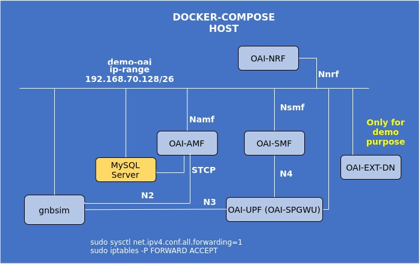

<table style="border-collapse: collapse; border: none;">
  <tr style="border-collapse: collapse; border: none;">
    <td style="border-collapse: collapse; border: none;">
      <a href="http://www.openairinterface.org/">
         
         </img>
      </a>
    </td>
    <td style="border-collapse: collapse; border: none; vertical-align: center;">
      <b><font size = "5">OpenAirInterface 5G Core Network Deployment and Testing with gnbsim</font></b>
    </td>
  </tr>
</table>



**Reading time: ~ 20mins**

**Tutorial replication time: ~ 40mins**

Note: In case readers are interested in deploying debuggers/developers core network environment with more logs please follow [this tutorial](./DEBUG_5G_CORE.md)

**CAUTION: 2023/07/13: This tutorial has been updated to use the new UPF that replaces SPGWU-TINY.**

**TABLE OF CONTENTS**

1.  [Pre-requisites](#1-pre-requisites)
2.  [Building Container Images](./BUILD_IMAGES.md) or [Retrieving Container Images](./RETRIEVE_OFFICIAL_IMAGES.md)
3.  Configuring Host Machines
4.  Configuring OAI 5G Core Network Functions
5.  [Deploying OAI 5G Core Network](#5-deploying-oai-5g-core-network)
6.  [Getting a `gnbsim` docker image](#6-getting-a-gnbsim-docker-image)
7.  [Executing `gnbsim` Scenario](#7-executing-the-gnbsim-scenario)
8.  [Analysing the Scenario Results](#8-analysing-the-scenario-results)
9.  [Trying some advanced stuff](#9-trying-some-advanced-stuff)
10. [Undeploy the network functions](#10-undeploy-the-network-functions)

* In this demo the image tags and commits which are used are listed below, follow [Building images](./BUILD_IMAGES.md) instructions to build images with these tags.

| CNF Name    | Branch Name             | tag      | Ubuntu 22.04 | RHEL8          |
| ----------- |:----------------------- | ---------| ------------ | ---------------|
| AMF         | `master`                | `v2.0.0` | X            | X              |
| SMF         | `master`                | `v2.0.0` | X            | X              |
| NRF         | `master`                | `v2.0.0` | X            | X              |
| UPF         | `master`                | `v2.0.0` | X            | X              |

<br/>

In this tutorial, we use an opensource simulator tool called `gnbsim`. With the help of the `gnbsim` tool, we can perform very basic SA5G tests by simulating one gnb and one ue.

**About gnbsim:**

Gnbsim is a 5G SA gNB/UE (Rel. 16) simulator for testing 5G System. It is a 3rd party opensource tool written in Golang. The [original repository](https://github.com/hhorai/gnbsim) is not available anymore, but a number of forks can be found, e.g., [here](https://github.com/AlohaLuo/gnbsim-backup), [here](https://github.com/Prabhjot-Sethi/gnbsim), and in [this repo](https://gitlab.eurecom.fr/kharade/gnbsim) which we will use from now on. Gnbsim simulates NGAP, NAS and GTPU protocols. The current version of gnbsim simulates one gnb and one ue.

Let's begin !!

* Steps 1 to 5 are similar to the previous tutorial. Please follow these steps to deploy OAI 5G core network components.
* We deploy the gnbsim docker service on the same host as for core network, so there is no need to create an additional route as we did for gnb-host.
* Before we proceed further, for end-to-end SA5G testing, make sure you have healthy docker services for OAI cn5g.

## 1. Pre-requisites

Create the folder to store the logs.

<!---
For CI purposes please ignore this line
``` shell
docker-compose-host $: rm -rf /tmp/oai/mini-gnbsim
```
-->

``` shell
docker-compose-host $: mkdir -p /tmp/oai/mini-gnbsim
docker-compose-host $: chmod 777 /tmp/oai/mini-gnbsim
```

**CAUTION: all the commands are to be executed from the `docker-compose` folder on the `CN5G host` server.**

## 5. Deploying OAI 5G Core Network

As a first timer, we recommend to first run without any PCAP capture.

``` console
docker-compose-host $: python3 ./core-network.py --type start-mini --scenario 2
...
[2023-07-13 12:59:57,491] root:DEBUG:  Starting 5gcn components... Please wait....
```

For CI purposes, we are deploying with an automated PCAP capture on the docker network.

**REMEMBER: if you are planning to run your CN5G deployment for a long time, the PCAP file can become huge!**

``` shell
docker-compose-host $: python3 ./core-network.py --type start-mini --scenario 2 --capture /tmp/oai/mini-gnbsim/mini-gnbsim.pcap
```

``` console
oai-cn5g-fed/docker-compose$ docker ps -a
811594cc284a        oai-upf:latest             "/openair-upf/bin/oa…"   About a minute ago   Up About a minute (healthy)   2152/udp, 8805/udp             oai-upf
ecde9367e35f        oai-smf:latest             "/openair-smf/bin/oa…"   About a minute ago   Up About a minute (healthy)   80/tcp, 8080/tcp, 8805/udp     oai-smf
68b72a425b31        trf-gen-cn5g:latest        "/bin/bash -c ' ip r…"   About a minute ago   Up About a minute (healthy)                                  oai-ext-dn
57f65999d804        oai-amf:latest             "/openair-amf/bin/oa…"   About a minute ago   Up About a minute (healthy)   80/tcp, 9090/tcp, 38412/sctp   oai-amf
a44ea43b7962        mysql:8.0                  "docker-entrypoint.s…"   About a minute ago   Up About a minute (healthy)   3306/tcp, 33060/tcp            mysql
oai-cn5g-fed/docker-compose$
```

We can also use basic deployment of 5GCN (with AUSF, UDM, UDR) as below -

``` console
docker-compose-host $: python3 ./core-network.py --type start-basic
```
## 6. Getting a `gnbsim` docker image

You have the choice:

* Building `gnbsim` docker image

Please clone the repository outside of the `oai-cn5g-fed` workspace.

``` console
$ cd
$ git clone https://gitlab.eurecom.fr/kharade/gnbsim.git
$ cd gnbsim
$ docker build --tag gnbsim:latest --target gnbsim --file docker/Dockerfile.ubuntu.22.04 .
```

OR

* You can pull a prebuilt docker image for `gnbsim`

``` console
docker pull rohankharade/gnbsim
docker image tag rohankharade/gnbsim:latest gnbsim:latest
```

## 7. Executing the `gnbsim` Scenario

* The configuration parameters are preconfigured in [docker-compose-gnbsim.yaml](../docker-compose/docker-compose-gnbsim.yaml) and one can modify it for testing purposes.

### 7.1. Launch gnbsim docker service

``` shell
docker-compose-host $: docker-compose -f docker-compose-gnbsim.yaml up -d gnbsim
Creating gnbsim ... done
```

Wait a bit for all `gnbsim` container to be healthy.
<!---
For CI purposes please ignore this line
``` shell
docker-compose-host $: ../ci-scripts/checkContainerStatus.py --container_name gnbsim --timeout 30
```
-->

``` shell
docker-compose-host $: docker-compose -f docker-compose-gnbsim.yaml ps -a
Name               Command                  State       Ports
--------------------------------------------------------------
gnbsim   /gnbsim/bin/entrypoint.sh  ...   Up (healthy)
```

After launching gnbsim, make sure all services status are healthy -
``` console
docker-compose-host $: docker ps -a
CONTAINER ID   IMAGE                           COMMAND                  CREATED              STATUS                        PORTS                          NAMES
2ad428f94fb0   gnbsim:latest                   "/gnbsim/bin/entrypo…"   33 seconds ago       Up 32 seconds (healthy)                                      gnbsim
811594cc284a   oai-upf:latest                  "/openair-upf/bin/oa…"   4 minutes ago        Up 4 minutes (healthy)        2152/udp, 8805/udp             oai-upf
ecde9367e35f   oai-smf:latest                  "/openair-smf/bin/oa…"   4 minutes ago        Up 4 minutes (healthy)        80/tcp, 8080/tcp, 8805/udp     oai-smf
68b72a425b31   trf-gen-cn5g:latest             "/bin/bash -c ' ip r…"   4 minutes ago        Up 4 minutes (healthy)                                       oai-ext-dn
57f65999d804   oai-amf:latest                  "/openair-amf/bin/oa…"   4 minutes ago        Up 4 minutes (healthy)        80/tcp, 9090/tcp, 38412/sctp   oai-amf
a44ea43b7962   mysql:8.0                       "docker-entrypoint.s…"   4 minutes ago        Up 4 minutes (healthy)        3306/tcp, 33060/tcp            mysql
```
Now we are ready to perform some traffic test.

You can see also if the UE got allocated an IP address.

``` shell
docker-compose-host $: docker logs gnbsim 2>&1 | grep "UE address:"
[gnbsim]2023/07/13 13:01:40.584271 example.go:329: UE address: 12.1.1.2
```

### 7.2. Ping test

Here we ping UE from external DN container.
``` shell
docker-compose-host $: docker exec oai-ext-dn ping -c 3 12.1.1.2
PING 12.1.1.2 (12.1.1.2) 56(84) bytes of data.
64 bytes from 12.1.1.2: icmp_seq=1 ttl=64 time=0.235 ms
64 bytes from 12.1.1.2: icmp_seq=2 ttl=64 time=0.145 ms
64 bytes from 12.1.1.2: icmp_seq=3 ttl=64 time=0.448 ms

--- 12.1.1.2 ping statistics ---
3 packets transmitted, 3 received, 0% packet loss, time 2036ms
rtt min/avg/max/mdev = 0.145/0.276/0.448/0.127 ms
```

Here we ping external DN from UE (gnbsim) container.
``` console
docker-compose-host $: docker exec gnbsim ping -c 3 -I 12.1.1.2 google.com
PING google.com (172.217.18.238) from 12.1.1.2 : 56(84) bytes of data.
64 bytes from par10s10-in-f238.1e100.net (172.217.18.238): icmp_seq=1 ttl=115 time=5.12 ms
64 bytes from par10s10-in-f238.1e100.net (172.217.18.238): icmp_seq=2 ttl=115 time=7.52 ms
64 bytes from par10s10-in-f238.1e100.net (172.217.18.238): icmp_seq=3 ttl=115 time=7.19 ms

--- google.com ping statistics ---
3 packets transmitted, 3 received, 0% packet loss, time 4ms
rtt min/avg/max/mdev = 5.119/6.606/7.515/1.064 ms
```

### 7.3. Iperf test

Here we do iperf traffic test between gnbsim UE and external DN node. We can make any node as iperf server/client.<br/>
Running iperf server on external DN container
``` console
$ docker exec -it oai-ext-dn iperf3 -s
-----------------------------------------------------------
Server listening on 5201
-----------------------------------------------------------
Accepted connection from 12.1.1.2, port 43339
[  5] local 192.168.70.135 port 5201 connected to 12.1.1.2 port 55553
[ ID] Interval           Transfer     Bandwidth
[  5]   0.00-1.00   sec  73.8 MBytes   619 Mbits/sec
[  5]   1.00-2.00   sec  76.3 MBytes   640 Mbits/sec
[  5]   2.00-3.00   sec  77.8 MBytes   653 Mbits/sec
[  5]   3.00-4.00   sec  66.7 MBytes   560 Mbits/sec
[  5]   4.00-5.00   sec  71.9 MBytes   603 Mbits/sec
[  5]   5.00-6.00   sec  80.2 MBytes   673 Mbits/sec
[  5]   6.00-7.00   sec  76.5 MBytes   642 Mbits/sec
[  5]   7.00-8.00   sec  78.6 MBytes   659 Mbits/sec
[  5]   8.00-9.00   sec  74.5 MBytes   625 Mbits/sec
[  5]   9.00-10.00  sec  75.5 MBytes   634 Mbits/sec
[  5]  10.00-10.01  sec   740 KBytes   719 Mbits/sec
- - - - - - - - - - - - - - - - - - - - - - - - -
[ ID] Interval           Transfer     Bandwidth
[  5]   0.00-10.01  sec  0.00 Bytes  0.00 bits/sec                  sender
[  5]   0.00-10.01  sec   753 MBytes   631 Mbits/sec                  receiver
-----------------------------------------------------------
Server listening on 5201
-----------------------------------------------------------
```
Running iperf client on gnbsim
``` console
$ docker exec -it gnbsim iperf3 -c 192.168.70.135 -B 12.1.1.2
Connecting to host 192.168.70.135, port 5201
[  5] local 12.1.1.2 port 55553 connected to 192.168.70.135 port 5201
[ ID] Interval           Transfer     Bitrate         Retr  Cwnd
[  5]   0.00-1.00   sec  77.6 MBytes   651 Mbits/sec   29    600 KBytes
[  5]   1.00-2.00   sec  76.2 MBytes   640 Mbits/sec    0    690 KBytes
[  5]   2.00-3.00   sec  77.5 MBytes   650 Mbits/sec    4    585 KBytes
[  5]   3.00-4.00   sec  66.2 MBytes   556 Mbits/sec  390    354 KBytes
[  5]   4.00-5.00   sec  72.5 MBytes   608 Mbits/sec    0    481 KBytes
[  5]   5.00-6.00   sec  80.0 MBytes   671 Mbits/sec    0    598 KBytes
[  5]   6.00-7.00   sec  76.2 MBytes   640 Mbits/sec    7    684 KBytes
[  5]   7.00-8.00   sec  78.8 MBytes   661 Mbits/sec    3    578 KBytes
[  5]   8.00-9.00   sec  75.0 MBytes   629 Mbits/sec    1    670 KBytes
[  5]   9.00-10.00  sec  75.0 MBytes   629 Mbits/sec    5    554 KBytes
- - - - - - - - - - - - - - - - - - - - - - - - -
[ ID] Interval           Transfer     Bitrate         Retr
[  5]   0.00-10.00  sec   755 MBytes   633 Mbits/sec  439             sender
[  5]   0.00-10.00  sec   753 MBytes   631 Mbits/sec                  receiver

iperf Done.
```

**Note:- The iperf test is just for illustration purposes and results of the test may vary based on resources available for the docker services.**

## 8. Analysing the Scenario Results

You can recover the logs like this:

``` console
docker-compose-host $: docker logs oai-amf > /tmp/oai/mini-gnbsim/amf.log 2>&1
docker-compose-host $: docker logs oai-smf > /tmp/oai/mini-gnbsim/smf.log 2>&1
docker-compose-host $: docker logs oai-upf > /tmp/oai/mini-gnbsim/upf.log 2>&1
docker-compose-host $: docker logs gnbsim > /tmp/oai/mini-gnbsim/gnbsim.log 2>&1
```

| Container     | Ip-address     |
| ------------- |:-------------- |
| mysql         | 192.168.70.131 |
| oai-amf       | 192.168.70.132 |
| oai-smf       | 192.168.70.133 |
| oai-upf       | 192.168.70.134 |
| oai-ext-dn    | 192.168.70.135 |
| Host Machine  | 192.168.70.129 |
| gnbsim gNB    | 192.168.70.136 |

| Pcap/log files                                                                             |
|:------------------------------------------------------------------------------------------ |
| [5gcn-deployment-gnbsim.pcap](./results/gnbSIM/pcap/5gcn-deployment-gnbsim.pcap)                  |
| [amf.log](./results/dsTest/logs/amf.log), [initialmessage.log](./results/dsTest/logs/initialmessage.log) |
| [smf.log](./results/dsTest/logs/smf.log)                                                          |

## 9. Trying Some Advanced Stuff

Here we try some scaling testing with gnbsim. There are additional IMSIs added into the database (208950000000031-208950000000040). Now we create a few more gnbsim instances (4 more for now). We use the same script to generate additional instances as follow -
``` shell
docker-compose-host $: docker-compose -f docker-compose-gnbsim.yaml up -d gnbsim2
Creating gnbsim2 ... done
```
<!---
For CI purposes please ignore this line
``` shell
docker-compose-host $: ../ci-scripts/checkContainerStatus.py --container_name gnbsim2 --timeout 40
```
-->
``` shell
docker-compose-host $: docker-compose -f docker-compose-gnbsim.yaml up -d gnbsim3
Creating gnbsim3 ... done
```
<!---
For CI purposes please ignore this line
``` shell
docker-compose-host $: ../ci-scripts/checkContainerStatus.py --container_name gnbsim3 --timeout 40
```
-->
``` shell
docker-compose-host $: docker-compose -f docker-compose-gnbsim.yaml up -d gnbsim4
Creating gnbsim4 ... done
```
<!---
For CI purposes please ignore this line
``` shell
docker-compose-host $: ../ci-scripts/checkContainerStatus.py --container_name gnbsim4 --timeout 40
```
-->
``` shell
docker-compose-host $: docker-compose -f docker-compose-gnbsim.yaml up -d gnbsim5
Creating gnbsim5 ... done
```
Wait a bit for all `gnbsim` containers to be healthy.
<!---
For CI purposes please ignore this line
``` shell
docker-compose-host $: ../ci-scripts/checkContainerStatus.py --container_name gnbsim5 --timeout 40
```
-->

``` shell
docker-compose-host $: docker-compose -f docker-compose-gnbsim.yaml ps -a
docker-compose-host $: docker logs gnbsim2 2>&1 | grep "UE address:"
[gnbsim]2022/09/14 16:45:41.584271 example.go:329: UE address: 12.1.1.3
docker-compose-host $: docker logs gnbsim3 2>&1 | grep "UE address:"
[gnbsim]2022/09/14 16:45:42.584271 example.go:329: UE address: 12.1.1.4
docker-compose-host $: docker logs gnbsim4 2>&1 | grep "UE address:"
[gnbsim]2022/09/14 16:45:43.584271 example.go:329: UE address: 12.1.1.5
docker-compose-host $: docker logs gnbsim5 2>&1 | grep "UE address:"
[gnbsim]2022/09/14 16:45:44.584271 example.go:329: UE address: 12.1.1.6
```
So here basically, the minimum configuration parameters that we need to change are gnbid, imsi and container ip address in docker-compose-gnbsim.yaml.
Please make sure the status of the instance is healthy before creating one more instance. Now here we have deployed all 5 gnbsim intances -
``` shell
$ docker ps -a
CONTAINER ID   IMAGE                           COMMAND                  CREATED          STATUS                    PORTS                          NAMES
a25174c51297   gnbsim:latest                   "/gnbsim/bin/entrypo…"   3 minutes ago    Up 3 minutes  (healthy)                                  gnbsim5
00c6207b0064   gnbsim:latest                   "/gnbsim/bin/entrypo…"   4 minutes ago    Up 4 minutes  (healthy)                                  gnbsim4
ed440f95fb19   gnbsim:latest                   "/gnbsim/bin/entrypo…"   4 minutes ago    Up 4 minutes  (healthy)                                  gnbsim3
8c4e4098955d   gnbsim:latest                   "/gnbsim/bin/entrypo…"   14 minutes ago   Up 14 minutes (healthy)                                  gnbsim2
895b1838c62a   gnbsim:latest                   "/gnbsim/bin/entrypo…"   15 minutes ago   Up 15 minutes (healthy)                                  gnbsim
811594cc284a   oai-upf:latest                  "/openair-upf/bin/oa…"   16 minutes ago   Up 16 minutes (healthy)   2152/udp, 8805/udp             oai-upf
ecde9367e35f   oai-smf:latest                  "/openair-smf/bin/oa…"   16 minutes ago   Up 16 minutes (healthy)   80/tcp, 8080/tcp, 8805/udp     oai-smf
68b72a425b31   trf-gen-cn5g:latest             "/bin/bash -c ' ip r…"   16 minutes ago   Up 16 minutes (healthy)                                  oai-ext-dn
57f65999d804   oai-amf:latest                  "/openair-amf/bin/oa…"   16 minutes ago   Up 16 minutes (healthy)   80/tcp, 9090/tcp, 38412/sctp   oai-amf
a44ea43b7962   mysql:8.0                       "docker-entrypoint.s…"   16 minutes ago   Up 16 minutes (healthy)   3306/tcp, 33060/tcp            mysql
```
* Let's verify all gnb and ue are registered at our 5G core -
``` console
$ docker logs oai-amf
truncated output
[2021-05-17T12:17:28.539943] [AMF] [amf_app] [info ]
[2021-05-17T12:17:28.539998] [AMF] [amf_app] [info ] |----------------------------------------------------------------------------------------------------------------|
[2021-05-17T12:17:28.540009] [AMF] [amf_app] [info ] |----------------------------------------------------gNBs' information-------------------------------------------|
[2021-05-17T12:17:28.540031] [AMF] [amf_app] [info ] |    Index    |      Status      |       Global ID    |    gNB Name     |               PLMN             |
[2021-05-17T12:17:28.540046] [AMF] [amf_app] [info ] |      1      |    Connected     |         0x400      |                 |            208, 95             |
[2021-05-17T12:17:28.540056] [AMF] [amf_app] [info ] |      2      |    Connected     |         0x800      |                 |            208, 95             |
[2021-05-17T12:17:28.540065] [AMF] [amf_app] [info ] |      3      |    Connected     |         0xc00      |                 |            208, 95             |
[2021-05-17T12:17:28.540077] [AMF] [amf_app] [info ] |      4      |    Connected     |         0x1000     |                 |            208, 95             |
[2021-05-17T12:17:28.540086] [AMF] [amf_app] [info ] |      5      |    Connected     |         0x1400     |                 |            208, 95             |
[2021-05-17T12:17:28.540094] [AMF] [amf_app] [info ] |----------------------------------------------------------------------------------------------------------------|
[2021-05-17T12:17:28.540102] [AMF] [amf_app] [info ]
[2021-05-17T12:17:28.540108] [AMF] [amf_app] [info ] |----------------------------------------------------------------------------------------------------------------|
[2021-05-17T12:17:28.540118] [AMF] [amf_app] [info ] |----------------------------------------------------UEs' information--------------------------------------------|
[2021-05-17T12:17:28.540131] [AMF] [amf_app] [info ] | Index |      5GMM state      |      IMSI        |     GUTI      | RAN UE NGAP ID | AMF UE ID |  PLMN   |Cell ID|
[2021-05-17T12:17:28.540146] [AMF] [amf_app] [info ] |      1|       5GMM-REGISTERED|   208950000000031|               |               0|          1| 208, 95 | 262160|
[2021-05-17T12:17:28.540169] [AMF] [amf_app] [info ] |      2|       5GMM-REGISTERED|   208950000000032|               |               0|          2| 208, 95 | 524304|
[2021-05-17T12:17:28.540185] [AMF] [amf_app] [info ] |      3|       5GMM-REGISTERED|   208950000000033|               |               0|          3| 208, 95 | 786448|
[2021-05-17T12:17:28.540197] [AMF] [amf_app] [info ] |      4|       5GMM-REGISTERED|   208950000000034|               |               0|          4| 208, 95 |1048592|
[2021-05-17T12:17:28.540211] [AMF] [amf_app] [info ] |      5|       5GMM-REGISTERED|   208950000000035|               |               0|          5| 208, 95 |1310736|
[2021-05-17T12:17:28.540219] [AMF] [amf_app] [info ] |----------------------------------------------------------------------------------------------------------------|
[2021-05-17T12:17:28.540227] [AMF] [amf_app] [info ]

```
* Finally lets ping UE from external DN node -
``` shell
docker-compose-host $: docker exec oai-ext-dn ping -c 2 12.1.1.2
PING 12.1.1.2 (12.1.1.2) 56(84) bytes of data.
64 bytes from 12.1.1.2: icmp_seq=1 ttl=64 time=0.416 ms
64 bytes from 12.1.1.2: icmp_seq=2 ttl=64 time=0.763 ms

--- 12.1.1.2 ping statistics ---
2 packets transmitted, 2 received, 0% packet loss, time 1008ms
rtt min/avg/max/mdev = 0.416/0.589/0.763/0.175 ms
docker-compose-host $: docker exec oai-ext-dn ping -c 2 12.1.1.3
PING 12.1.1.3 (12.1.1.3) 56(84) bytes of data.
64 bytes from 12.1.1.3: icmp_seq=1 ttl=64 time=0.328 ms
64 bytes from 12.1.1.3: icmp_seq=2 ttl=64 time=0.620 ms

--- 12.1.1.3 ping statistics ---
2 packets transmitted, 2 received, 0% packet loss, time 1005ms
rtt min/avg/max/mdev = 0.328/0.474/0.620/0.146 ms
docker-compose-host $: docker exec oai-ext-dn ping -c 2 12.1.1.4
PING 12.1.1.4 (12.1.1.4) 56(84) bytes of data.
64 bytes from 12.1.1.4: icmp_seq=1 ttl=64 time=0.408 ms
64 bytes from 12.1.1.4: icmp_seq=2 ttl=64 time=0.694 ms

--- 12.1.1.4 ping statistics ---
2 packets transmitted, 2 received, 0% packet loss, time 1032ms
rtt min/avg/max/mdev = 0.408/0.551/0.694/0.143 ms
docker-compose-host $: docker exec oai-ext-dn ping -c 2 12.1.1.5
PING 12.1.1.5 (12.1.1.5) 56(84) bytes of data.
64 bytes from 12.1.1.5: icmp_seq=1 ttl=64 time=0.289 ms
64 bytes from 12.1.1.5: icmp_seq=2 ttl=64 time=0.233 ms

--- 12.1.1.5 ping statistics ---
2 packets transmitted, 2 received, 0% packet loss, time 1004ms
rtt min/avg/max/mdev = 0.233/0.261/0.289/0.028 ms
docker-compose-host $: docker exec oai-ext-dn ping -c 2 12.1.1.6
PING 12.1.1.6 (12.1.1.6) 56(84) bytes of data.
64 bytes from 12.1.1.6: icmp_seq=1 ttl=63 time=0.577 ms
64 bytes from 12.1.1.6: icmp_seq=2 ttl=63 time=0.346 ms

--- 12.1.1.6 ping statistics ---
2 packets transmitted, 2 received, 0% packet loss, time 1015ms
rtt min/avg/max/mdev = 0.346/0.461/0.577/0.117 ms
```

### 9.1. Recover the logs

Let recover one last time the logs:

<!---
For CI purposes please ignore these lines
``` shell
docker-compose-host $: docker-compose -f docker-compose-gnbsim.yaml stop -t 2
docker-compose-host $: docker-compose -f docker-compose-mini-nonrf.yaml stop -t 2
```
-->

``` shell
docker-compose-host $: docker logs oai-amf > /tmp/oai/mini-gnbsim/amf.log 2>&1
docker-compose-host $: docker logs oai-smf > /tmp/oai/mini-gnbsim/smf.log 2>&1
docker-compose-host $: docker logs oai-upf > /tmp/oai/mini-gnbsim/upf.log 2>&1
docker-compose-host $: docker logs gnbsim > /tmp/oai/mini-gnbsim/gnbsim.log 2>&1
docker-compose-host $: docker logs gnbsim2 > /tmp/oai/mini-gnbsim/gnbsim2.log 2>&1
docker-compose-host $: docker logs gnbsim3 > /tmp/oai/mini-gnbsim/gnbsim3.log 2>&1
docker-compose-host $: docker logs gnbsim4 > /tmp/oai/mini-gnbsim/gnbsim4.log 2>&1
docker-compose-host $: docker logs gnbsim5 > /tmp/oai/mini-gnbsim/gnbsim5.log 2>&1
```
## 10. Undeploy the network functions

Last thing is to remove all services - <br/>

### 10.1. Undeploy the gnbsim container(s)

``` shell
docker-compose-host $: docker-compose -f docker-compose-gnbsim.yaml down -t 0
Stopping service gnbsim ...
Stopping gnbsim5 ... done
Stopping gnbsim4 ... done
Stopping gnbsim3 ... done
Stopping gnbsim2 ... done
Stopping gnbsim ... done
Removing gnbsim5 ... done
Removing gnbsim4 ... done
Removing gnbsim3 ... done
Removing gnbsim2 ... done
Removing gnbsim ... done
Network demo-oai-public-net is external, skipping
Service gnbsim is  stopped
```

### 10.2. Undeploy the core network

``` shell
docker-compose-host $: python3 ./core-network.py --type stop-mini --scenario 2
...
[2021-09-14 16:47:44,070] root:DEBUG:  OAI 5G core components are UnDeployed....
```

## 11. End of tutorial
