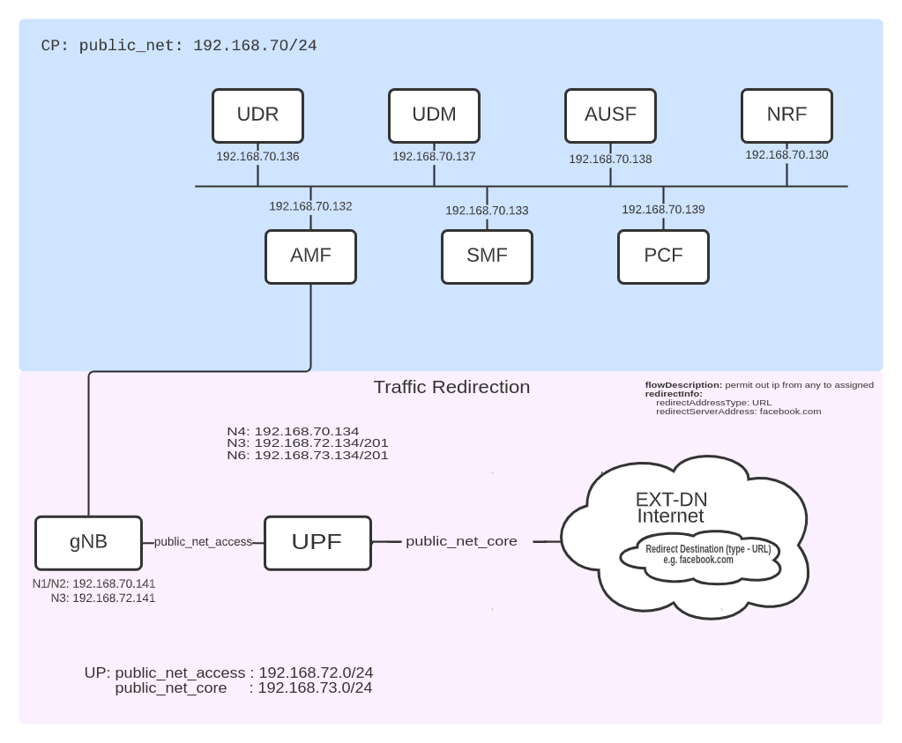

<table style="border-collapse: collapse; border: none;">
  <tr style="border-collapse: collapse; border: none;">
    <td style="border-collapse: collapse; border: none;">
      <a href="http://www.openairinterface.org/">
         
         </img>
      </a>
    </td>
    <td style="border-collapse: collapse; border: none; vertical-align: center;">
      <b><font size = "5">OpenAirInterface 5G Core Traffic redirect/Redirection Network Deployment and Testing With Gnbsim</font></b>
    </td>
  </tr>
</table>




**Reading time: ~ 20 minutes**

**Tutorial replication time: ~ 1h**

**Compute resource recommendation: ~ 6GB RAM, 8CPU**

Note: In case readers are interested in deploying debuggers/developers core network environment with more logs please follow [this tutorial](./DEBUG_5G_CORE.md)

**TABLE OF CONTENTS**

1. [Pre-requisites](#1-pre-requisites)
2. [Building Container Images](./BUILD_IMAGES.md) or [Retrieving Container Images](./RETRIEVE_OFFICIAL_IMAGES.md)
3. [Deploying OAI 5G Core Network](#3-deploying-oai-5g-core-network)
4. [Simulate with gnbsim](#4-simulate-with-gnbsim)
5. [Traffic test for Redirection](#5-traffic-test-for-redirection)
6. [Trace Analysis](#6-trace-analysis)
7. [Undeploy Network Functions](#7-undeploy-network-functions)
8. [Conclusion](#8-conclusion)

For this demo, all the images which use the `develop` branch have been retrieved from the official `docker-hub` (see also
[Retrieving images](./RETRIEVE_OFFICIAL_IMAGES.md)).

| NF Name | Branch Name | Tag used at time of writing | Ubuntu 22.04 | RHEL8 |
|----------|:------------|-----------------------------|--------------|-------|
| NSSF     | `develop`    | `v2.0.0`                    | X            | -     |
| AMF      | `develop`    | `v2.0.0`                    | X            | -     |
| AUSF     | `develop`    | `v2.0.0`                    | X            | -     |
| NRF      | `develop`    | `v2.0.0`                    | X            | -     |
| SMF      | `develop`    | `v2.0.0`                    | X            | -     |
| UDR      | `develop`    | `v2.0.0`                    | X            | -     |
| UDM      | `develop`    | `v2.0.0`                    | X            | -     |
| PCF      | `develop`    | `v2.0.0`                    | X            | -     |
| UPF-VPP  | `develop`    | `v2.0.0`                    | X            | -     |

<br/>

This tutorial shows how to configure the Traffic Redirection feature at SMF and UPF, based on policies from the PCF.

We will show and validate:
* Traffic redirection scenario for a subscriber (gnbsim) with traffic classification and URL based redirection to destination server


## 1. Pre-requisites
Create a folder where you can store all the result files of the tutorial and later compare them with our provided result files.
We recommend creating exactly the same folder to not break the flow of commands afterwards.

<!---
For CI purposes please ignore this line
``` shell
docker-compose-host $: rm -rf /tmp/oai/redirect-scenario
```
-->

``` shell
docker-compose-host $: mkdir -p /tmp/oai/redirect-scenario
docker-compose-host $: chmod 777 /tmp/oai/redirect-scenario
```
## [2. Building Container Images](./BUILD_IMAGES.md) or [Retrieving Container Images](./RETRIEVE_OFFICIAL_IMAGES.md)

## 3. Deploying OAI 5g Core Network

We use `docker-compose` to deploy the core network. Please refer to the file [docker-compose-basic-vpp-pcf-redirection.yaml](../docker-compose/docker-compose-basic-vpp-pcf-redirection.yaml)
for details.


### Docker Networks
In total, 3 different docker networks are used:
* public_net (demo-oai) for control plane 
* public_net_access (cn5g-access) for the N3 interface between gnbsim and gNB
* public_net_core (cn5g-core) for the N6 interface between UPF and DN


### Deployment and Tracing

The first interface (demo-oai) is used for the control plane, including the N4 interfaces to all UPFs. The others are used for the user plane.

Therefore, we do not need to filter out the UP when tracing on the `demo-oai` interface.
We run the `mysql` service first, so that we can start the trace before anything is sent over the CP. 
You can choose to skip this step and deploy all the NFs at once.

``` shell
docker-compose-host $: docker-compose -f docker-compose-basic-vpp-pcf-redirection.yaml up -d mysql 
Creating network "demo-oai-public-net" with driver "bridge"
Creating network "oai-public-access" with the default driver
Creating network "oai-public-core" with the default driver
Creating mysql ... done
```

We capture the packets on the docker networks and filter out ARP. 
``` shell
docker-compose-host $: sleep 1
docker-compose-host $: nohup sudo tshark -i demo-oai -f "not arp" -w /tmp/oai/redirect-scenario/control_plane.pcap > /tmp/oai/redirect-scenario/control_plane.log 2>&1 &
```
<!--
For CI purposes please ignore this line
``` shell
docker-compose-host $: ../ci-scripts/checkTsharkCapture.py --log_file /tmp/oai/redirect-scenario/control_plane.log --timeout 60
```
-->

Then, we start all the NFs.

``` shell
docker-compose-host $: docker-compose -f docker-compose-basic-vpp-pcf-redirection.yaml up -d
mysql is up-to-date
Creating oai-nrf             ... done
Creating oai-udr             ... done
Creating vpp-upf             ... done
Creating oai-pcf             ... done
Creating oai-udm             ... done
Creating oai-ext-dn          ... done
Creating oai-ausf            ... done
Creating oai-amf             ... done
Creating oai-smf             ... done
```

<!--
For CI purposes please ignore this line
``` shell
docker-compose-host $: ../ci-scripts/checkContainerStatus.py --container_name mysql --timeout 120
docker-compose-host $: ../ci-scripts/checkContainerStatus.py --container_name oai-amf --timeout 30
docker-compose-host $: docker-compose -f docker-compose-basic-vpp-pcf-redirection.yaml ps -a
```
-->

### Checking the Status of the NFs
Using `docker ps` you can verify that no NF exited, e.g. because of a faulty configuration:

Also all should be in an `healthy` state before going further. The `mysql` container may take some time.
``` console 
docker-compose-host $: docker ps
CONTAINER ID   IMAGE                 COMMAND                  CREATED          STATUS                    PORTS                          NAMES
16e442edd7b9   oai-smf:develop        "/bin/bash /openair-…"   30 seconds ago   Up 29 seconds (healthy)   80/tcp, 8080/tcp, 8805/udp     oai-smf
17cd7f15c863   oai-amf:develop       "python3 /openair-am…"   31 seconds ago   Up 29 seconds (healthy)   80/tcp, 9090/tcp, 38412/sctp   oai-amf
81d91b0e9719   oai-ausf:develop       "/bin/bash /openair-…"   32 seconds ago   Up 31 seconds (healthy)   80/tcp                         oai-ausf
4c11b8c156fc   trf-gen-cn5g:latest   "/bin/bash -c 'iptab…"   32 seconds ago   Up 30 seconds (healthy)                                  oai-ext-dn
9da12093f3d6   oai-udm:develop        "/bin/bash /openair-…"   33 seconds ago   Up 31 seconds (healthy)   80/tcp                         oai-udm
b867ac7db503   oai-upf-vpp:develop    "/openair-upf/bin/en…"   34 seconds ago   Up 31 seconds (healthy)   2152/udp, 8085/udp             vpp-upf
4e133a45bd0b   oai-pcf:develop        "/bin/bash /openair-…"   34 seconds ago   Up 33 seconds (healthy)   80/tcp, 8080/tcp               oai-pcf
341271bb659a   oai-udr:develop        "/bin/bash /openair-…"   34 seconds ago   Up 33 seconds (healthy)   80/tcp                         oai-udr
aa8cbc6fe533   oai-nrf:develop        "python3 /openair-nr…"   34 seconds ago   Up 33 seconds (healthy)   80/tcp, 9090/tcp               oai-nrf
ac10687810e0   mysql:5.7             "docker-entrypoint.s…"   34 seconds ago   Up 33 seconds (healthy)   3306/tcp, 33060/tcp            mysql         
```

Please wait until all NFs are healthy. 


## 4. Simulate with gnbsim

When the CN is deployed successfully, we can simulate a gNB and UE using `gnbsim`. 
Please see the [gnbsim tutorial](./DEPLOY_SA5G_MINI_WITH_GNBSIM.md) on how to retrieve or build the image.

``` shell
docker-compose-host $: docker-compose -f docker-compose-gnbsim-vpp.yaml up -d 
Creating gnbsim-vpp ...
Creating gnbsim-vpp ... done
```

<!--
For CI purposes please ignore this line
``` shell
docker-compose-host $: ../ci-scripts/checkContainerStatus.py --container_name gnbsim-vpp --timeout 30
```
-->


We can verify that the gNB received an IP address and that the PDU session establishment was successful. 
``` shell
docker-compose-host $: docker logs gnbsim-vpp 2>&1 | grep "UE address:"
[gnbsim]2023/01/13 17:07:05.134094 example.go:332: UE address: 12.1.1.2
```
It can take some time until the PDU session establishment is complete, so you may have to repeat this command until
you see the IP address.

## 5. Traffic Test for Redirection

*Note: As tshark is running in the background, and we run everything in the same terminal, we will stop the control plane traces here. If you want, you can open tshark on another terminal and terminate it whenever it suits you.*  
``` shell
docker-compose-host $: sudo pkill tshark 
docker-compose-host $: sleep 5
```

Before we start the traffic tests, we start the user plane trace without any filter:
``` shell
docker-compose-host $: nohup sudo tshark -i cn5g-access -i cn5g-core  -w /tmp/oai/redirect-scenario/user_plane_redirect.pcap > /tmp/oai/redirect-scenario/user_plane_redirect.log 2>&1 &
```

<!--
For CI purposes please ignore this line
``` shell
docker-compose-host $: ../ci-scripts/checkTsharkCapture.py --log_file /tmp/oai/redirect-scenario/user_plane_redirect.log --timeout 60
```
-->

This capture contains all the UP network interfaces.

Please make a note that,
* In the policy decisions file (`policies/redirection/policy_decisions/policy_decision.yaml`), we configure UE IMSI with PCC rule to be used. We can verify that the UE with the IMSI `208950000000031` is configured to use the PCC rule `redirection-rule`.

* Moreover, the PCC rules (`policies/redirection/pcc_rules/pcc_rules.yaml`) configured for redirection contains  `flowDescription` as `permit out ip from any to assigned` which is basically means that, to allow all kind of UE traffic and redirection the traffic to destination server address as per traffic control rule defined in`policies/redirection/traffic_rules/traffic_rule.yaml`.

* As you can see below, in the traffic contorl rule (`policies/redirection/traffic_rules/traffic_rule.yaml`) we use redirect server address type as `URL` & redirect server addressas `facebook.com`.

```yaml
redirection-scenario:
  redirectInfo:
    redirectEnabled: true
    redirectAddressType: URL
    redirectServerAddress: facebook.com
```
* Note: Currently only URL type of redirection supported 

Now, we generate HTTP traffic to destination as `google.com`, which will be redirected to destination server `facebook.com`.

``` console 
docker-compose-host $: docker exec -it gnbsim-vpp curl --interface 12.1.1.2 google.com
<!DOCTYPE html>
<html>
<!--
<?xml version="1.0" encoding="UTF-8"?><WISPAccessGatewayParam xmlns:xsi="http://www.w3.org/2001/XMLSchema-instance" xsi:noNamespaceSchemaLocation="http://www.acmewisp.com/WISPAccessGatewayParam.xsd"><Proxy><MessageType>110</MessageType><ResponseCode>200</ResponseCode><NextURL>facebook.com</NextURL></Proxy></WISPAccessGatewayParam>
-->
   <head>
      <title>Redirection</title>
      <meta http-equiv="refresh" content="0; URL=facebook.com">
   </head>
   <body>
      Please <a href='facebook.com'>click here</a> to continue
   </body>
</html>
```

<!--
For CI purposes please ignore these lines
we use 1.1.1.1 as it serves HTTP, so we can verify if the redirect works properly in the generated traces 
 * 192.168.73.135 is oai-ext-dn interface on N6 primary subnet

``` shell
docker-compose-host $: docker exec -it gnbsim-vpp curl --interface 12.1.1.2 google.com > /tmp/oai/redirect-scenario/ue-test.log 2>&1
```
-->

We capture here UPF session details & traffic trace

```shell
docker-compose-host $: docker exec vpp-upf bin/vppctl show upf session > /tmp/oai/redirect-scenario/vpp-upf-redirect-session.log 2>&1
```

We will see in the [analysis](#8-trace-analysis) that the IP packets to `google.com` are redirected to destination `facebook.com` over EXT-DN-Internet.


## 6 Trace Analysis

Now that we have captured control plane and user plane traces, we can stop `tshark`:
``` shell
docker-compose-host $: sudo pkill tshark
```

Then, we change the permissions of the traces to open them in Wireshark:
``` shell
docker-compose-host $: sudo chmod 666 /tmp/oai/redirect-scenario/control_plane.*
docker-compose-host $: sudo chmod 666 /tmp/oai/redirect-scenario/user_plane_redirect.*
```

As we capture more than one interface, the pcap files are likely out-of-order. To solve this, sort based on the `Time`
column. 

### Redirection Scenario

The results of this tutorial are located in [results/redirect](results/redirect). 

We can verify the PDU session details as per [UPF session logs](docs/results/redirect/vpp-upf-redirect-session.log). We should note that the forwarding rule is set with redirect information, describing all HTTP traffic will be redirected to destination URL `facebook.com`

```yaml
FAR: 1
  Apply Action: 00000002 == [FORWARD]
  Forward:
    Network Instance: internet.oai.org
    Destination Interface: 1
    Redirect Information: HTTP to facebook.com
```

In the [UE traffic trace](results/redirect/ue-test.log) at gnbsim-vpp, we can see that the HTTP GET request generated using curl for destination `google.com` is redirected to new HTTP address `facebook.com`. This can be also confirmed in the pcap trace [user_plane_redirect.pcapng](results/redirect/user_plane_redirect.pcapng), where request packet #4 is destinated for URI `google.com` & the response packet #6 is with HTTP code (302-redirection) from destination `facebook.com`

## 7 Undeploy Network Functions

When you are done, you can undeploy the gnbsim instances and stop the NFs. 

First, we stop the gnbsim instances:

``` shell
docker-compose-host $: docker-compose -f docker-compose-gnbsim-vpp.yaml stop -t 2
```

Then, we stop the NFs. 

``` shell
docker-compose-host $: docker-compose -f docker-compose-basic-vpp-pcf-redirection.yaml stop -t 2
```

Now we are able to collect the logs.

``` shell
docker-compose-host $: docker logs oai-amf > /tmp/oai/redirect-scenario/amf.log 2>&1
docker-compose-host $: docker logs oai-smf > /tmp/oai/redirect-scenario/smf.log 2>&1
docker-compose-host $: docker logs oai-nrf > /tmp/oai/redirect-scenario/nrf.log 2>&1
docker-compose-host $: docker logs vpp-upf > /tmp/oai/redirect-scenario/vpp-upf.log 2>&1
docker-compose-host $: docker logs oai-udr > /tmp/oai/redirect-scenario/udr.log 2>&1
docker-compose-host $: docker logs oai-udm > /tmp/oai/redirect-scenario/udm.log 2>&1
docker-compose-host $: docker logs oai-ausf > /tmp/oai/redirect-scenario/ausf.log 2>&1
docker-compose-host $: docker logs oai-pcf > /tmp/oai/redirect-scenario/pcf.log 2>&1
docker-compose-host $: docker logs gnbsim-vpp > /tmp/oai/redirect-scenario/gnbsim-vpp.log 2>&1
```

Finally, we undeploy the gnbsims and NFs to clean up the Docker networks.

``` shell
docker-compose-host $: docker-compose -f docker-compose-gnbsim-vpp.yaml down -t 2
docker-compose-host $: docker-compose -f docker-compose-basic-vpp-pcf-redirection.yaml down -t 2
```

## 8 Conclusion

We shown in this tutorial how the traffic redirection can be configured in the OAI CN with the help of policy configuration at PCF. We have used VPP-UPF for validation of this feature. We have verified the URL based redirection in this tutorial. Other types of redirection, e.g. server address type `ipv4/ipv6/SIP URI` are not currently supported in VPP-UPF.
