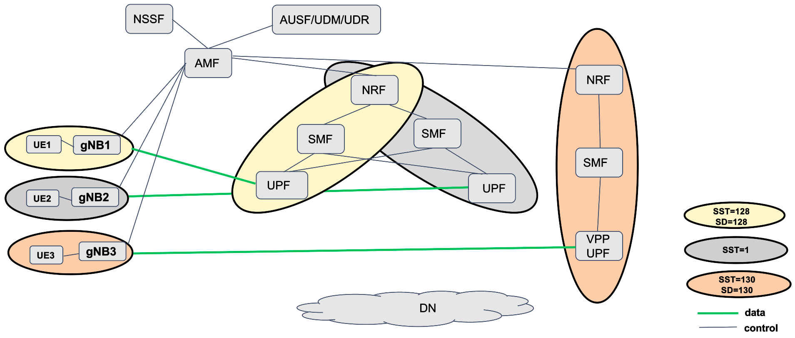
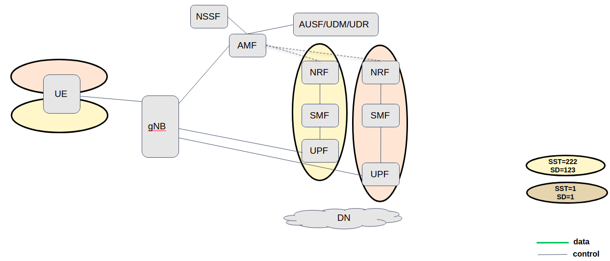

<table style="border-collapse: collapse; border: none;">
  <tr style="border-collapse: collapse; border: none;">
    <td style="border-collapse: collapse; border: none;">
      <a href="http://www.openairinterface.org/">
         
         </img>
      </a>
    </td>
    <td style="border-collapse: collapse; border: none; vertical-align: center;">
      <b><font size = "5">OpenAirInterface 5G Core Network Deployment and Testing with gnbsim</font></b>
    </td>
  </tr>
</table>



**Reading time: ~ 30mins**

**Tutorial replication time: ~ 1h30mins**

**Compute resource recommendation: ~ 6GB RAM, 4CPU (Based on docker stats)**

Note: In case readers are interested in deploying debuggers/developers core network environment with more logs please follow [this tutorial](./DEBUG_5G_CORE.md)

**CAUTION: 2023/07/13: This tutorial has been updated to use the new UPF that replaces SPGWU-TINY.**

**TABLE OF CONTENTS**

[[_TOC_]]

* In this demo the image tags and commits which were used are listed below, follow the [Building images](./BUILD_IMAGES.md) to build images with the tags below.

You can also retrieve the images from `docker-hub`. See [Retrieving images](./RETRIEVE_OFFICIAL_IMAGES.md).

| CNF Name    | Branch Name   | Tag used at time of writing   | Ubuntu 22.04 | RHEL8         |
| ----------- |:------------- | ----------------------------- | ------------ | --------------|
| NSSF        | `master`      | `v2.0.0`                      | X            | X              |
| AMF         | `master`      | `v2.0.0`                      | X            | X              |
| AUSF        | `master`      | `v2.0.0`                      | X            | X              |
| NRF         | `master`      | `v2.0.0`                      | X            | X              |
| SMF         | `master`      | `v2.0.0`                      | X            | X              |
| UDR         | `master`      | `v2.0.0`                      | X            | X              |
| UDM         | `master`      | `v2.0.0`                      | X            | X              |
| UPF         | `master`      | `v2.0.0`                      | X            | X              |
| UPF-VPP     | `master`      | `v2.0.0`                      | X            | X              |

<br/>

In this tutorial we are going to explore the slicing feature of OAI 5G core network. Here we will validate -
* UPF selection based on S-NSSAI
* SMF selection based on S-NSSAI
* NRF selection based on S-NSSAI (With help of NSSF)
* AMF selection based on S-NSSAI (With help of NSSF - Next Release, March 2022)
* Single UE with multiple S-NSSAIs

A Network Slice is defined within a PLMN and it incorporates the 5G Core and 5G RAN components. Network slice is identified as Single Network Slice Selection Assistance Information (S-NSSAI). A S-NSSAI consists of Slice/Service type (SST) and Slice Differentiator (SD). SST is a mandatory field which defines the expected slice behavior in terms of features and services. Whereas SD is an optional field which can be used to differentiate amongst multiple slices.

Currently 3GPP allows up to eight (8) S-NSSAIs in the NSSAI sent in signaling messages between the UE and the Network, it means a single UE may be served by at most eight Network Slices at a time. SST length is 8 bits; so it can provide 2^8= 256 SST values from which there are reserved values O to 127 for standardized SSTs (e.g. SST 2 = URLCC, SST 3 = MIoT, SST 4 = V2X etc.).

**Slicing current status in OAI 5G CN**

* Role of NSSF -> NSSF currently supports slice selection during the pdu session establishment request. When AMF is not locally configured with NRF information, then with the help of NSSF, it discovers an appropriate NRF based on S-NSSAI provided.
* Role of AMF  -> AMF selects first available SMF from the NF instance list (of SMF instances) provided by appropriate NRF.
* Role od SMF  -> SMF can associate with multiple UPFs at the same time as in slice 2 and 3 from the figure above. UPF is selected here based on S-NSSAI and DNN.

As shown in the figure above, there are 3 S-NSSAIs configured (Can be differentiated with colors) viz. <br/>
Note: Here we have used standardised SST values (2,3,4), because rf-simulator only supports SST values 1,2,3,4. Moreover, it is only for numerical reference and does not reflect standard SST behaviour e.g. URLCC, MIoT, V2X etc.<br/>

* Slice1: [SST=128,SD=128] =>   NRF1, SMF1, UPF1, GNB1, UE1
* Slice2: [SST=1]          =>   NRF1, SMF2, UPF2, GNB2, UE2
* Slice3: [SST=130,SD=130] =>   NRF2, SMF3, VPP-UPF3, GNB3, UE3

Here AMF, NSSF, UDM, UDR, AUSF are common to all slices. SMF and UPF in slice 1 and 2 have same NRF hence both UPFs are discoverable to both SMF. You can verify in the logs that both SMFs are successfully associated to both UPFs in slice 2 and 3. Here the number of SMFs/UPFs registered under single (NSI) NRF is part of operator's network planning.<br/>


**Let's begin !!**

* Steps 1 to 4 are similar to previous tutorials such as [minimalist](./DEPLOY_SA5G_MINI_WITH_GNBSIM.md) or [basic](./DEPLOY_SA5G_BASIC_DEPLOYMENT.md) deployments. Please follow these steps to deploy OAI 5G core network components.

## 1. Pre-requisites

Create a folder where you can store all the result files of the tutorial and later compare them with our provided result files, we recommend creating exactly the same folder to not break the flow of commands afterwards.

<!---
For CI purposes please ignore this line
``` shell
docker-compose-host $: rm -rf /tmp/oai/slicing-with-nssf
```
-->

``` shell
docker-compose-host $: mkdir -p /tmp/oai/slicing-with-nssf
docker-compose-host $: chmod 777 /tmp/oai/slicing-with-nssf
```

## 5. Deploying OAI 5g Core Network

* We deploy `basic` version 5g core with additional component oai-nssf. We will use `docker-compose` to deploy 5g core as below -

Once again, if it is the first time, or you plan to run the experiment for a very long time: no capture:

``` console
docker-compose-host $: docker-compose -f docker-compose-slicing-basic-nrf.yaml up -d
```

For CI purposes, we will capture packets and we won't run it for long, so the PCAP file is not too big.

``` shell
docker-compose-host $: docker-compose -f docker-compose-slicing-basic-nrf.yaml up -d mysql
Creating network "demo-oai-public-net" with driver "bridge"
Creating network "oai-public-access" with the default driver
Creating network "oai-public-core" with the default driver
Creating mysql            ... done
```

We capture the packets on the docker networks with a complex filter --> smaller PCAP file.
``` shell
docker-compose-host $: nohup sudo tshark -i demo-oai -f '(not host 192.168.70.145 and not host 192.168.70.154) or (host 192.168.70.145 and icmp)' -w /tmp/oai/slicing-with-nssf/slicing-with-nssf.pcap > /tmp/oai/slicing-with-nssf/slicing-with-nssf.log 2>&1 &
```

<!---
For CI purposes please ignore this line
``` shell
docker-compose-host $: ../ci-scripts/checkTsharkCapture.py --log_file /tmp/oai/slicing-with-nssf/slicing-with-nssf.log --timeout 30
```
-->

``` shell
docker-compose-host $: docker-compose -f docker-compose-slicing-basic-nrf.yaml up -d
mysql is up-to-date
Creating oai-nrf-slice12 ... done
Creating oai-udr         ... done
Creating oai-nrf-slice3  ... done
Creating oai-nssf        ... done
Creating oai-ext-dn      ... done
Creating oai-udm         ... done
Creating oai-ausf        ... done
Creating oai-amf         ... done
Creating oai-smf-slice3  ... done
Creating oai-smf-slice1  ... done
Creating oai-smf-slice2  ... done
Creating oai-upf-slice1  ... done
Creating vpp-upf-slice3  ... done
Creating oai-upf-slice2  ... done
```

``` shell
docker-compose-host $: sudo chmod 666 /tmp/oai/slicing-with-nssf/slicing-with-nssf.*
```

<!---
For CI purposes please ignore this line
``` shell
docker-compose-host $: ../ci-scripts/checkContainerStatus.py --container_name mysql --timeout 120
docker-compose-host $: ../ci-scripts/checkContainerStatus.py --container_name oai-upf-slice1 --timeout 30
```
-->

* Make sure all services are healthy -

``` shell
docker-compose-host $: docker-compose -f docker-compose-slicing-basic-nrf.yaml ps -a
Name                    Command                  State                       Ports
--------------------------------------------------------------------------------------------------------
mysql             docker-entrypoint.sh mysqld      Up (healthy)   3306/tcp, 33060/tcp
oai-amf           /openair-amf/bin/oai_amf - ...   Up (healthy)   38412/sctp, 80/tcp, 8080/tcp, 9090/tcp
oai-ausf          /openair-ausf/bin/oai_ausf ...   Up (healthy)   80/tcp, 8080/tcp
oai-ext-dn        /bin/bash -c  iptables -t  ...   Up (healthy)
oai-nrf-slice12   /openair-nrf/bin/oai_nrf - ...   Up (healthy)   80/tcp, 8080/tcp, 9090/tcp
oai-nrf-slice3    /openair-nrf/bin/oai_nrf - ...   Up (healthy)   80/tcp, 8080/tcp, 9090/tcp
oai-nssf          /openair-nssf/bin/oai_nssf ...   Up (healthy)   80/tcp, 8080/tcp
oai-smf-slice1    /openair-smf/bin/oai_smf - ...   Up (healthy)   80/tcp, 8080/tcp, 8805/udp
oai-smf-slice2    /openair-smf/bin/oai_smf - ...   Up (healthy)   80/tcp, 8080/tcp, 8805/udp
oai-smf-slice3    /openair-smf/bin/oai_smf - ...   Up (healthy)   80/tcp, 8080/tcp, 8805/udp
oai-udm           /openair-udm/bin/oai_udm - ...   Up (healthy)   80/tcp, 8080/tcp
oai-udr           /openair-udr/bin/oai_udr - ...   Up (healthy)   80/tcp, 8080/tcp
oai-upf-slice1    /openair-upf/bin/oai_udr - ...   Up (healthy)   2152/udp, 8080/tcp, 8805/udp
oai-upf-slice2    /openair-upf/bin/oai_udr - ...   Up (healthy)   2152/udp, 8080/tcp, 8805/udp
vpp-upf-slice3    /openair-upf/bin/entrypoin ...   Up (healthy)   2152/udp, 8085/udp
```

## 6. Getting `ransim` docker images

We are using 3 different ran simulators: [ueransim](https://github.com/aligungr/UERANSIM), [rfsimulator](https://gitlab.eurecom.fr/oai/openairinterface5g/-/tree/develop/ci-scripts/yaml_files/5g_rfsimulator) and [gnbsim](https://gitlab.eurecom.fr/kharade/gnbsim) for slice 2, 3 and 4 repectively. Each of them has their own set of features, and one can use on a per need basis. Different ran simulator usage mimics here the realistic deployemnt scenario where operator can have multi vendor devices deployed in the network. <br/>

You can pull docker images from official repositories as below -

``` console
$ docker pull rohankharade/gnbsim:latest
$ docker pull rohankharade/ueransim:latest
$ docker pull oaisoftwarealliance/oai-gnb:develop
$ docker pull oaisoftwarealliance/oai-nr-ue:develop
```
And re-tag them for tutorials' docker-compose file to work.
``` console
$ docker image tag rohankharade/gnbsim:latest gnbsim:latest
$ docker image tag rohankharade/ueransim:latest ueransim:latest
```

## 7. Executing `ransim` Scenario

We deploy ran simulators with the help of docker-compose as below -
Deploy ran simulator for slice 1
``` shell
docker-compose-host $: docker-compose -f docker-compose-slicing-ransim.yaml up -d ueransim
Creating ueransim             ... done
```
Wait a bit (5 to 10 seconds).
<!---
For CI purposes please ignore this line
``` shell
docker-compose-host $: ../ci-scripts/checkContainerStatus.py --container_name ueransim --timeout 30
```
-->
Deploy ran simulator for slice 2
``` shell
docker-compose-host $: docker-compose -f docker-compose-slicing-ransim.yaml up -d oai-gnb oai-nr-ue1
Creating rfsim5g-oai-gnb    ... done
Creating rfsim5g-oai-nr-ue1 ... done
```
Wait a bit (5 to 10 seconds).
<!---
For CI purposes please ignore this line
``` shell
docker-compose-host $: ../ci-scripts/checkContainerStatus.py --container_name rfsim5g-oai-nr-ue1 --timeout 30
```
-->
Deploy ran simulator for slice 3

``` shell
docker-compose-host $: docker-compose -f docker-compose-slicing-ransim.yaml up -d gnbsim
Creating gnbsim             ... done
```
Wait a bit (5 to 10 seconds).
<!---
For CI purposes please ignore this line
``` shell
docker-compose-host $: ../ci-scripts/checkContainerStatus.py --container_name gnbsim --timeout 30
```
-->

Make sure all ran simulator services are healthy.

``` shell
docker-compose-host $: docker-compose -f docker-compose-slicing-ransim.yaml ps -a
       Name                     Command                  State       Ports
--------------------------------------------------------------------------
gnbsim               /gnbsim/bin/entrypoint.sh  ...   Up (healthy)
rfsim5g-oai-gnb      /opt/oai-gnb/bin/entrypoin ...   Up (healthy)
rfsim5g-oai-nr-ue1   /opt/oai-nr-ue/bin/entrypo ...   Up (healthy)
ueransim             /ueransim/bin/entrypoint.sh      Up (healthy)
```

After successful deployment we can verify at AMF that all gnbs and UEs are successfully registered to network.
``` console
docker-compose-host $: docker logs oai-amf
[2021-12-13T20:47:20.265472] [AMF] [amf_app] [info ] |----------------------------------------------------------------------------------------------------------------|
[2021-12-13T20:47:20.265497] [AMF] [amf_app] [info ] |----------------------------------------------------gNBs' information-------------------------------------------|
[2021-12-13T20:47:20.265503] [AMF] [amf_app] [info ] |    Index    |      Status      |       Global ID       |       gNB Name       |               PLMN             |
[2021-12-13T20:47:20.265522] [AMF] [amf_app] [info ] |      1      |    Connected     |         0x1           |UERANSIM-gnb-208-95-1 |            208, 95             |
[2021-12-13T20:47:20.265530] [AMF] [amf_app] [info ] |      2      |    Connected     |         0x1400        |                      |            208, 95             |
[2021-12-13T20:47:20.265537] [AMF] [amf_app] [info ] |      3      |    Connected     |         0xe000        |         gnb-rfsim    |            208, 95             |
[2021-12-13T20:47:20.265543] [AMF] [amf_app] [info ] |----------------------------------------------------------------------------------------------------------------|
[2021-12-13T20:47:20.265548] [AMF] [amf_app] [info ]
[2021-12-13T20:47:20.265553] [AMF] [amf_app] [info ] |----------------------------------------------------------------------------------------------------------------|
[2021-12-13T20:47:20.265558] [AMF] [amf_app] [info ] |----------------------------------------------------UEs' information--------------------------------------------|
[2021-12-13T20:47:20.265564] [AMF] [amf_app] [info ] | Index |      5GMM state      |      IMSI        |     GUTI      | RAN UE NGAP ID | AMF UE ID |  PLMN   |Cell ID|
[2021-12-13T20:47:20.265951] [AMF] [amf_app] [info ] |      1|       5GMM-REGISTERED|   208950000000035|               |               1|          2| 208, 95 |    256|
[2021-12-13T20:47:20.265967] [AMF] [amf_app] [info ] |      2|       5GMM-REGISTERED|   208950000000036|               |     -1441334349|          3| 208, 95 |14680064|
[2021-12-13T20:47:20.265976] [AMF] [amf_app] [info ] |      3|       5GMM-REGISTERED|   208950000000037|               |      -372062044|          4| 208, 95 |14680064|

```

## 8. Traffic Test

In this section we perform traffic test between oai-ext-dn node and UEs <br/>

``` shell
docker-compose-host $: docker logs gnbsim 2>&1 | tail -10
docker-compose-host $: docker logs oai-amf 2>&1 | tail -20
docker-compose-host $: docker exec oai-ext-dn ping -c 4 12.1.1.2
PING 12.1.1.2 (12.1.1.2) 56(84) bytes of data.
64 bytes from 12.1.1.2: icmp_seq=2 ttl=63 time=0.346 ms
64 bytes from 12.1.1.2: icmp_seq=3 ttl=63 time=0.286 ms
64 bytes from 12.1.1.2: icmp_seq=4 ttl=63 time=0.267 ms

--- 12.1.1.2 ping statistics ---
4 packets transmitted, 3 received, 25% packet loss, time 3059ms
rtt min/avg/max/mdev = 0.267/0.299/0.346/0.039 ms

docker-compose-host $: docker exec oai-ext-dn ping -c 4 12.2.1.2
PING 12.2.1.2 (12.2.1.2) 56(84) bytes of data.
64 bytes from 12.2.1.2: icmp_seq=1 ttl=63 time=1.00 ms
64 bytes from 12.2.1.2: icmp_seq=2 ttl=63 time=0.644 ms
64 bytes from 12.2.1.2: icmp_seq=3 ttl=63 time=0.504 ms
64 bytes from 12.2.1.2: icmp_seq=4 ttl=63 time=0.390 ms

--- 12.2.1.2 ping statistics ---
4 packets transmitted, 4 received, 0% packet loss, time 3039ms
rtt min/avg/max/mdev = 0.390/0.635/1.004/0.232 ms

docker-compose-host $: docker exec oai-ext-dn ping -c 4 12.1.1.130
PING 12.1.1.130 (12.1.1.130) 56(84) bytes of data.
64 bytes from 12.1.1.130: icmp_seq=1 ttl=63 time=40.0 ms
64 bytes from 12.1.1.130: icmp_seq=2 ttl=63 time=39.5 ms
64 bytes from 12.1.1.130: icmp_seq=3 ttl=63 time=11.2 ms
64 bytes from 12.1.1.130: icmp_seq=4 ttl=63 time=11.2 ms

--- 12.1.1.130 ping statistics ---
4 packets transmitted, 4 received, 0% packet loss, time 3003ms
rtt min/avg/max/mdev = 11.206/25.511/40.071/14.292 ms
```

## 9. Analyzing Scenario Results

<!---
For CI purposes please ignore these lines
``` shell
docker-compose-host $: docker-compose -f docker-compose-slicing-ransim.yaml stop -t 2
docker-compose-host $: docker-compose -f docker-compose-slicing-basic-nrf.yaml stop -t 2
```
-->

``` shell
docker-compose-host $: docker logs oai-amf > /tmp/oai/slicing-with-nssf/amf.log 2>&1
docker-compose-host $: docker logs oai-ausf > /tmp/oai/slicing-with-nssf/ausf.log 2>&1
docker-compose-host $: docker logs oai-nssf > /tmp/oai/slicing-with-nssf/nssf.log 2>&1
docker-compose-host $: docker logs oai-udm > /tmp/oai/slicing-with-nssf/udm.log 2>&1
docker-compose-host $: docker logs oai-udr > /tmp/oai/slicing-with-nssf/udr.log 2>&1
docker-compose-host $: docker logs oai-nrf-slice12 > /tmp/oai/slicing-with-nssf/nrf-slice12.log 2>&1
docker-compose-host $: docker logs oai-nrf-slice3 > /tmp/oai/slicing-with-nssf/nrf-slice3.log 2>&1
docker-compose-host $: docker logs oai-smf-slice1 > /tmp/oai/slicing-with-nssf/smf-slice1.log 2>&1
docker-compose-host $: docker logs oai-smf-slice2 > /tmp/oai/slicing-with-nssf/smf-slice2.log 2>&1
docker-compose-host $: docker logs oai-smf-slice3 > /tmp/oai/slicing-with-nssf/smf-slice3.log 2>&1
docker-compose-host $: docker logs oai-upf-slice1 > /tmp/oai/slicing-with-nssf/upf-slice1.log 2>&1
docker-compose-host $: docker logs oai-upf-slice2 > /tmp/oai/slicing-with-nssf/upf-slice2.log 2>&1
docker-compose-host $: docker logs vpp-upf-slice3 > /tmp/oai/slicing-with-nssf/vpp-upf-slice3.log 2>&1
docker-compose-host $: docker logs gnbsim > /tmp/oai/slicing-with-nssf/gnbsim.log 2>&1
docker-compose-host $: docker logs rfsim5g-oai-gnb > /tmp/oai/slicing-with-nssf/rfsim5g-oai-gnb.log 2>&1
docker-compose-host $: docker logs rfsim5g-oai-nr-ue1 > /tmp/oai/slicing-with-nssf/rfsim5g-oai-nr-ue1.log 2>&1
docker-compose-host $: docker logs ueransim > /tmp/oai/slicing-with-nssf/ueransim.log 2>&1
```

**To be explained in detail**

| Container             |   Ip-address   |
| ----------------------|:-------------- |
| mysql                 | 192.168.70.131 |
| oai-nssf              | 192.168.70.132 |
| oai-udr               | 192.168.70.133 |
| oai-udm               | 192.168.70.134 |
| oai-ausf              | 192.168.70.135 |
| oai-nrf-slice12       | 192.168.70.136 |
| oai-nrf-slice3        | 192.168.70.137 |
| oai-amf               | 192.168.70.138 |
| oai-smf-slice1        | 192.168.70.139 |
| oai-smf-slice2        | 192.168.70.140 |
| oai-smf-slice3        | 192.168.70.141 |
| oai-upf-slice1        | 192.168.70.142 |
| oai-upf-slice2        | 192.168.70.143 |
| vpp-upf-slice3 (N4)   | 192.168.70.144 |
| vpp-upf-slice3 (N3)   | 192.168.72.144 |
| vpp-upf-slice3 (N6)   | 192.168.73.144 |
| oai-ext-dn            | 192.168.70.145 |
| ueransim gNB          | 192.168.70.152 |
| rfsim gNB             | 192.168.70.153 |
| rfsim UE1             | 192.168.70.154 |
| rfsim UE2             | 192.168.70.155 |
| gnbsim gNB            | 192.168.70.156 |
| UE1                   | 12.2.1.2       |
| UE2                   | 12.1.1.130     |
| UE3                   | 12.1.1.2       |

| Pcap/log files                                                                             |
|:------------------------------------------------------------------------------------------ |
| [5gcn-deployment-slicing.pcap](./results/slicing/pcap/5gcn-deployment-slicing.pcap)        |

## 10. UE with multiple S-NSSAIs
OAI 5G CN also supports UE with multiple slices. Apparently the ran simulators that we have validated do not support UE with multiple slices at once.



## 11. Undeploy network functions

Use docker-compose down to undeploy network <br/>

### 11.1. Undeploy RAN

``` shell
docker-compose-host $: docker-compose -f docker-compose-slicing-ransim.yaml down -t 0
Stopping ueransim           ... done
Stopping rfsim5g-oai-nr-ue1 ... done
Stopping rfsim5g-oai-gnb    ... done
Removing ueransim           ... done
Removing gnbsim             ... done
Removing rfsim5g-oai-nr-ue1 ... done
Removing rfsim5g-oai-gnb    ... done
Network demo-oai-public-net is external, skipping
Network oai-public-access is external, skipping
```

### 11.2. Undeploy 5GCN

``` shell
docker-compose-host $: docker-compose -f docker-compose-slicing-basic-nrf.yaml down -t 0
Stopping oai-nssf        ... done
Stopping oai-upf-slice2  ... done
Stopping oai-upf-slice1  ... done
Stopping oai-ext-dn      ... done
Stopping oai-smf-slice2  ... done
Stopping vpp-upf-slice3  ... done
Stopping oai-smf-slice1  ... done
Stopping oai-smf-slice3  ... done
Stopping oai-amf         ... done
Stopping oai-nrf-slice3  ... done
Stopping oai-ausf        ... done
Stopping oai-nrf-slice12 ... done
Stopping oai-udm         ... done
Stopping oai-udr         ... done
Stopping mysql           ... done
Removing oai-upf-slice1  ... done
Removing oai-amf         ... done
Removing oai-udr         ... done
Removing vpp-upf-slice3  ... done
Removing oai-smf-slice2  ... done
Removing oai-nrf-slice12 ... done
Removing oai-smf-slice3  ... done
Removing oai-smf-slice1  ... done
Removing mysql           ... done
Removing oai-ext-dn      ... done
Removing oai-udm         ... done
Removing oai-nssf        ... done
Removing oai-nrf-slice3  ... done
Removing oai-upf-slice2  ... done
Removing oai-ausf        ... done
Removing network demo-oai-public-net
Removing network oai-public-access
Removing network oai-public-core
```

## 12. Reference logs
