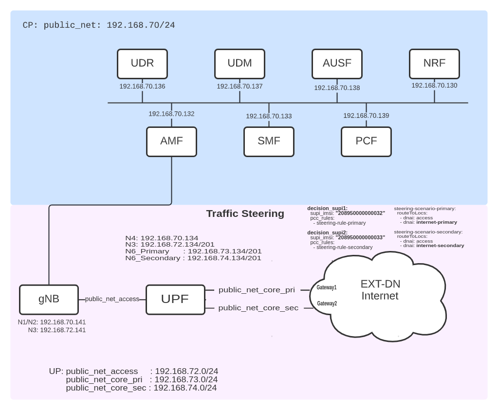

<table style="border-collapse: collapse; border: none;">
  <tr style="border-collapse: collapse; border: none;">
    <td style="border-collapse: collapse; border: none;">
      <a href="http://www.openairinterface.org/">
         
         </img>
      </a>
    </td>
    <td style="border-collapse: collapse; border: none; vertical-align: center;">
      <b><font size = "5">OpenAirInterface 5G Core Traffic Steering/steering Network Deployment and Testing With Gnbsim</font></b>
    </td>
  </tr>
</table>



**Reading time: ~ 20 minutes**

**Tutorial replication time: ~ 1h**

**Compute resource recommendation: ~ 6GB RAM, 8CPU**

Note: In case readers are interested in deploying debuggers/developers core network environment with more logs please follow [this tutorial](./DEBUG_5G_CORE.md)

**TABLE OF CONTENTS**

1. [Pre-requisites](#1-pre-requisites)
2. [Building Container Images](./BUILD_IMAGES.md) or [Retrieving Container Images](./RETRIEVE_OFFICIAL_IMAGES.md)
3. [Deploying OAI 5G Core Network](#3-deploying-oai-5g-core-network)
4. [Simulate with gnbsim](#4-simulate-with-gnbsim)
5. [Traffic test for Steering](#5-traffic-test-for-steering)
6. [Trace Analysis](#6-trace-analysis)
7. [Undeploy Network Functions](#7-undeploy-network-functions)
8. [Conclusion](#8-conclusion)

For this demo, all the images which use the `develop` branch have been retrieved from the official `docker-hub` (see also
[Retrieving images](./RETRIEVE_OFFICIAL_IMAGES.md)).

| NF Name | Branch Name | Tag used at time of writing | Ubuntu 22.04 | RHEL8 |
|----------|:------------|-----------------------------|--------------|-------|
| NSSF     | `develop`    | `v2.0.0`                    | X            | -     |
| AMF      | `develop`    | `v2.0.0`                    | X            | -     |
| AUSF     | `develop`    | `v2.0.0`                    | X            | -     |
| NRF      | `develop`    | `v2.0.0`                    | X            | -     |
| SMF      | `develop`    | `v2.0.0`                    | X            | -     |
| UDR      | `develop`    | `v2.0.0`                    | X            | -     |
| UDM      | `develop`    | `v2.0.0`                    | X            | -     |
| PCF      | `develop`    | `v2.0.0`                    | X            | -     |
| UPF-VPP  | `develop`    | `v2.0.0`                    | X            | -     |

<br/>

This tutorial shows how to configure the Traffic Steering feature at SMF and UPF, based on policies from the PCF.

We will show and validate:

* Traffic steering scenario for a subscriber (gnbsim) with traffic classification and steering to destination server over multiple N6 inetrfaces at UPF

## 1. Pre-requisites
Create a folder where you can store all the result files of the tutorial and later compare them with our provided result files.
We recommend creating exactly the same folder to not break the flow of commands afterwards.

<!---
For CI purposes please ignore this line
``` shell
docker-compose-host $: rm -rf /tmp/oai/steering-scenario
```
-->

``` shell
docker-compose-host $: mkdir -p /tmp/oai/steering-scenario
docker-compose-host $: chmod 777 /tmp/oai/steering-scenario
```
## [2. Building Container Images](./BUILD_IMAGES.md) or [Retrieving Container Images](./RETRIEVE_OFFICIAL_IMAGES.md)

## 3. Deploying OAI 5g Core Network

We use `docker-compose` to deploy the core network. Please refer to the file [docker-compose-basic-vpp-pcf-steering.yaml](../docker-compose/docker-compose-basic-vpp-pcf-steering.yaml)
for details.


### Docker Networks
In total, 3 different docker networks are used:
* public_net (demo-oai) for control plane 
* public_net_access (cn5g-access) for the N3 interface between gnbsim and gNB
* public_net_core (cn5g-core) for the N6 interface between UPF and DN


### Deployment and Tracing

The first interface (demo-oai) is used for the control plane, including the N4 interfaces to all UPFs. The others are used for the user plane.

Therefore, we do not need to filter out the UP when tracing on the `demo-oai` interface.
We run the `mysql` service first, so that we can start the trace before anything is sent over the CP. 
You can choose to skip this step and deploy all the NFs at once.

``` shell
docker-compose-host $: docker-compose -f docker-compose-basic-vpp-pcf-steering.yaml up -d mysql 
Creating network "demo-oai-public-net" with driver "bridge"
Creating network "oai-public-access" with the default driver
Creating network "oai-public-core-pri" with the default driver
Creating network "oai-public-core-sec" with the default driver
Creating mysql ... done
```

We capture the packets on the docker networks and filter out ARP. 
``` shell
docker-compose-host $: sleep 1
docker-compose-host $: nohup sudo tshark -i demo-oai -f "not arp" -w /tmp/oai/steering-scenario/control_plane.pcap > /tmp/oai/steering-scenario/control_plane.log 2>&1 &
```
<!--
For CI purposes please ignore this line
``` shell
docker-compose-host $: ../ci-scripts/checkTsharkCapture.py --log_file /tmp/oai/steering-scenario/control_plane.log --timeout 60
```
-->

Then, we start all the NFs.

``` shell
docker-compose-host $: docker-compose -f docker-compose-basic-vpp-pcf-steering.yaml up -d
mysql is up-to-date
Creating oai-nrf             ... done
Creating oai-udr             ... done
Creating vpp-upf             ... done
Creating oai-pcf             ... done
Creating oai-udm             ... done
Creating oai-ext-dn          ... done
Creating oai-ausf            ... done
Creating oai-amf             ... done
Creating oai-smf             ... done
```

* Note: Here we use two docker subnets for N6, that is `oai-public-core-pri` and `oai-public-core-sec`, which terminates to DN over two different ipv4 subnets. Operator can have different termination endpoints for these multiple N6 interfaces, e.g. one could terminate to regular internet DN and another could be local edge server etc.

<!--
For CI purposes please ignore this line
``` shell
docker-compose-host $: ../ci-scripts/checkContainerStatus.py --container_name mysql --timeout 120
docker-compose-host $: ../ci-scripts/checkContainerStatus.py --container_name oai-amf --timeout 30
docker-compose-host $: docker-compose -f docker-compose-basic-vpp-pcf-steering.yaml ps -a
```
-->

### Checking the Status of the NFs
Using `docker ps` you can verify that no NF exited, e.g. because of a faulty configuration:

Also all should be in an `healthy` state before going further. The `mysql` container may take some time.
``` console 
docker-compose-host $: docker ps
CONTAINER ID   IMAGE                 COMMAND                  CREATED          STATUS                    PORTS                          NAMES
16e442edd7b9   oai-smf:develop        "/bin/bash /openair-…"   30 seconds ago   Up 29 seconds (healthy)   80/tcp, 8080/tcp, 8805/udp     oai-smf
17cd7f15c863   oai-amf:develop       "python3 /openair-am…"   31 seconds ago   Up 29 seconds (healthy)   80/tcp, 9090/tcp, 38412/sctp   oai-amf
81d91b0e9719   oai-ausf:develop       "/bin/bash /openair-…"   32 seconds ago   Up 31 seconds (healthy)   80/tcp                         oai-ausf
4c11b8c156fc   trf-gen-cn5g:latest   "/bin/bash -c 'iptab…"   32 seconds ago   Up 30 seconds (healthy)                                  oai-ext-dn
9da12093f3d6   oai-udm:develop        "/bin/bash /openair-…"   33 seconds ago   Up 31 seconds (healthy)   80/tcp                         oai-udm
b867ac7db503   oai-upf-vpp:develop    "/openair-upf/bin/en…"   34 seconds ago   Up 31 seconds (healthy)   2152/udp, 8085/udp             vpp-upf
4e133a45bd0b   oai-pcf:develop        "/bin/bash /openair-…"   34 seconds ago   Up 33 seconds (healthy)   80/tcp, 8080/tcp               oai-pcf
341271bb659a   oai-udr:develop        "/bin/bash /openair-…"   34 seconds ago   Up 33 seconds (healthy)   80/tcp                         oai-udr
aa8cbc6fe533   oai-nrf:develop        "python3 /openair-nr…"   34 seconds ago   Up 33 seconds (healthy)   80/tcp, 9090/tcp               oai-nrf
ac10687810e0   mysql:5.7             "docker-entrypoint.s…"   34 seconds ago   Up 33 seconds (healthy)   3306/tcp, 33060/tcp            mysql         
```

Please wait until all NFs are healthy. 

## 4. Simulate with gnbsim

When the CN is deployed successfully, we can simulate a gNB and UE using `gnbsim`. 
Please see the [gnbsim tutorial](./DEPLOY_SA5G_MINI_WITH_GNBSIM.md) on how to retrieve or build the image.

* Instantiate first Gnbsim instance (IMSI - 208950000000032)

``` shell
docker-compose-host $: docker-compose -f docker-compose-gnbsim-vpp-additional.yaml up -d gnbsim-vpp2
Creating gnbsim-vpp2 ...
Creating gnbsim-vpp2 ... done
```
<!--
For CI purposes please ignore this line
``` shell
docker-compose-host $: ../ci-scripts/checkContainerStatus.py --container_name gnbsim-vpp2 --timeout 10
```
-->

* Instantiate second Gnbsim instance (IMSI - 208950000000033)

``` shell
docker-compose-host $: docker-compose -f docker-compose-gnbsim-vpp-additional.yaml up -d gnbsim-vpp3
Creating gnbsim-vpp3 ...
Creating gnbsim-vpp3 ... done
```
<!--
For CI purposes please ignore this line
``` shell
docker-compose-host $: ../ci-scripts/checkContainerStatus.py --container_name gnbsim-vpp2 --timeout 10
docker-compose-host $: ../ci-scripts/checkContainerStatus.py --container_name gnbsim-vpp3 --timeout 10
```
-->


We can verify that both the UEs received an IP address and that the PDU session establishment was successful. 
``` shell
docker-compose-host $: docker logs gnbsim-vpp2 2>&1 | grep "UE address:"
[gnbsim]2023/01/13 17:07:05.134094 example.go:332: UE address: 12.1.1.2
```
``` shell
docker-compose-host $: docker logs gnbsim-vpp3 2>&1 | grep "UE address:"
[gnbsim]2023/01/13 17:07:05.134094 example.go:332: UE address: 12.1.1.3
```

It can take some time until the PDU session establishment is complete, so you may have to repeat this command until you see the IP address.


## 5. Traffic Test for Steering

*Note: As tshark is running in the background, and we run everything in the same terminal, we will stop the control plane traces here. If you want, you can open tshark on another terminal and terminate it whenever it suits you.*  
``` shell
docker-compose-host $: sudo pkill tshark 
docker-compose-host $: sleep 5
```

Before we start the traffic tests, we start the user plane trace without any filter:
``` shell
docker-compose-host $: nohup sudo tshark -i cn5g-access -i cn5g-core-pri -i cn5g-core-sec  -w /tmp/oai/steering-scenario/user_plane_steering.pcap > /tmp/oai/steering-scenario/user_plane_steering.log 2>&1 &
```

<!--
For CI purposes please ignore this line
``` shell
docker-compose-host $: ../ci-scripts/checkTsharkCapture.py --log_file /tmp/oai/steering-scenario/user_plane_steering.log --timeout 60
```
-->

This capture contains all the UP network interfaces.


Please make a note that,
* In the policy decisions file (`policies/steering/policy_decisions/policy_decision.yaml`), we configure UE IMSI with PCC rule to be used. We can verify that the UE with the IMSI `208950000000032` is configured to use the PCC rule `steering-rule-primary`, whereas UE with the IMSI `208950000000033` is configured to use the PCC rule `steering-rule-secondary`

* Moreover, the PCC rules (`policies/steering/pcc_rules/pcc_rules.yaml`) configured for steering contains  `flowDescription` as `permit out ip from any to assigned` which is basically means that, to allow all kind of UE traffic and steer the traffic to one of N6 interface of UPF as per traffic control rule defined in `policies/steering/traffic_rules/traffic_rule.yaml`.

* As you can see below, in the traffic contorl rule (`policies/steering/traffic_rules/traffic_rule.yaml`) we use DNAI of the interface at UPF to steer the traffic to one of the N6 interface.


```yaml
steering-scenario-primary:
  routeToLocs:
    - dnai: access
    - dnai: internet-primary

steering-scenario-secondary:
  routeToLocs:
    - dnai: access
    - dnai: internet-secondary

```

Now, we generate ICMP traffic to `1.1.1.1` from UE1:

``` console 
docker exec gnbsim-vpp2 /bin/bash -c 'traceroute -4 -T -s 12.1.1.2 1.1.1.1' 
traceroute to 1.1.1.1 (1.1.1.1), 30 hops max, 60 byte packets
 1  * * *
 2  192.168.73.135 (192.168.73.135)  4.787 ms  4.835 ms  4.824 ms
 3  rohan (192.168.73.1)  4.795 ms  4.768 ms  4.884 ms
 4  _gateway (192.168.107.1)  4.927 ms  4.909 ms  4.889 ms
 5  eurecom-gw.eurecom.fr (193.55.113.194)  4.857 ms  4.828 ms  4.801 ms
 6  gi0-0-0-6-ren-nr-sophia-rtr-091.noc.renater.fr (193.51.187.18)  4.769 ms  4.873 ms  4.761 ms
 7  xe-0-0-5-marseille1-rtr-131.noc.renater.fr (193.51.177.20)  8.094 ms  8.091 ms  8.021 ms
 8  xe-1-0-0-ren-nr-lyon1-rtr-131.noc.renater.fr (193.55.204.109)  10.676 ms xe-0-0-9-ren-nr-lyon1-rtr-131.noc.renater.fr (193.51.177.16)  10.697 ms xe-1-0-9-lyon1-rtr-131.noc.renater.fr (193.51.177.223)  10.442 ms
 9  renater-ias-geant-gw.gen.ch.geant.net (83.97.89.13)  20.646 ms  20.622 ms  20.548 ms
10  ae2.mx1.fra.de.geant.net (62.40.98.180)  26.707 ms  26.472 ms  28.251 ms
11  * * *
12  172.70.240.3 (172.70.240.3)  28.176 ms 172.69.148.3 (172.69.148.3)  25.304 ms 172.70.248.3 (172.70.248.3)  28.933 ms
13  one.one.one.one (1.1.1.1)  28.571 ms  25.481 ms  25.230 ms
```

Then, we generate ICMP traffic to `1.1.1.1` from UE2:

```console
docker exec gnbsim-vpp3 /bin/bash -c 'traceroute -4 -T -s 12.1.1.3 1.1.1.1'
traceroute to 1.1.1.1 (1.1.1.1), 30 hops max, 60 byte packets
 1  * * *
 2  192.168.74.135 (192.168.74.135)  0.601 ms  1.000 ms  1.022 ms
 3  rohan (192.168.73.1)  1.023 ms  1.022 ms  1.949 ms
 4  _gateway (192.168.107.1)  1.912 ms  1.892 ms  1.886 ms
 5  eurecom-gw.eurecom.fr (193.55.113.194)  2.339 ms  2.177 ms  2.299 ms
 6  gi0-0-0-6-ren-nr-sophia-rtr-091.noc.renater.fr (193.51.187.18)  2.363 ms  2.075 ms  1.918 ms
 7  xe-0-0-5-marseille1-rtr-131.noc.renater.fr (193.51.177.20)  4.577 ms  4.613 ms  4.568 ms
 8  xe-0-0-4-ren-nr-lyon1-rtr-131.noc.renater.fr (193.55.204.107)  19.794 ms xe-0-0-3-ren-nr-lyon1-rtr-131.noc.renater.fr (193.51.177.81)  19.776 ms xe-0-0-9-ren-nr-lyon1-rtr-131.noc.renater.fr (193.51.177.16)  19.750 ms
 9  renater-ias-geant-gw.gen.ch.geant.net (83.97.89.13)  15.771 ms  15.419 ms  15.393 ms
10  ae2.mx1.fra.de.geant.net (62.40.98.180)  23.980 ms  23.949 ms  23.930 ms
11  * * *
12  172.69.148.3 (172.69.148.3)  24.503 ms 172.70.248.3 (172.70.248.3)  24.608 ms 162.158.108.2 (162.158.108.2)  24.564 ms
13  one.one.one.one (1.1.1.1)  24.019 ms  24.469 ms  24.508 ms
```

<!--
For CI purposes please ignore these lines
we use 1.1.1.1 as it serves HTTP, so we can verify if the Steering works properly in the generated traces 
 * 192.168.73.135 is oai-ext-dn interface on N6 primary subnet
 * 192.168.74.135 is oai-ext-dn interface on N6 secondary subnet

``` shell
docker-compose-host $: docker exec gnbsim-vpp2 traceroute -4 -T -s 12.1.1.2 1.1.1.1 > /tmp/oai/steering-scenario/ue1-test.log 2>&1 
docker-compose-host $: docker exec gnbsim-vpp3 traceroute -4 -T -s 12.1.1.3 1.1.1.1 > /tmp/oai/steering-scenario/ue2-test.log 2>&1 
docker-compose-host $: grep 192.168.73.135 /tmp/oai/steering-scenario/ue1-test.log
docker-compose-host $: grep 192.168.74.135 /tmp/oai/steering-scenario/ue2-test.log
```
-->


```shell
docker-compose-host $: docker exec vpp-upf bin/vppctl show upf session > /tmp/oai/steering-scenario/vpp-upf-steering-session.log 2>&1
```

We will see in the [analysis](#8-trace-analysis) that the IP packets to `1.1.1.1` are steered to destination over EXT-DN-Internet with corresponding N6 interface .

## 6 Trace Analysis

Now that we have captured control plane and user plane traces, we can stop `tshark`:
``` shell
docker-compose-host $: sudo pkill tshark
```

Then, we change the permissions of the traces to open them in Wireshark:
``` shell
docker-compose-host $: sudo chmod 666 /tmp/oai/steering-scenario/control_plane.*
docker-compose-host $: sudo chmod 666 /tmp/oai/steering-scenario/user_plane_steering.*
```
As we capture more than one interface, the pcap files are likely out-of-order. To solve this, sort based on the `Time`
column. 

### Steering Scenario

The results of this tutorial are located in [results/steering](results/steering). 

We can verify the PDU session details as per [UPF session logs](docs/results/steering/vpp-upf-steering-session.log). We should note that the forwarding rule set for UE 1 (12.1.1.2), is with network instance `internet.oai.org.pri`. Which means all the UE 1 (12.1.1.2) traffic will be sent to DN over primary interface of the UPF.

```yaml
FAR: 1
  Apply Action: 00000002 == [FORWARD]
  Forward:
    Network Instance: internet.oai.org.pri
    Destination Interface: 1
```

Moreover, we should also note that the forwarding rule set for UE 1 (12.1.1.3), is with network instance `internet.oai.org.sec`. Which means all the UE 1 (12.1.1.2) traffic will be sent to DN over secondary interface of the UPF.

```yaml
FAR: 1
  Apply Action: 00000002 == [FORWARD]
  Forward:
    Network Instance: internet.oai.org.sec
    Destination Interface: 1
```
This can be also confirmed in the pcap trace [user_plane_steering.pcapng](results/steering/user_plane_steering.pcapng). We see that the packet #4 is the UE1 packet, that is sent to DN over UPF's primary interface (192.168.73.0/24). Similary for UE2, the request packet #373 is sent to DN over UPF's secondary interface (192.168.74.0/24). Hence, we confirm here that the UE packets are steered in uplink direction, based on policies configured at PCF.

## 7 Undeploy Network Functions

When you are done, you can undeploy the gnbsim instances and stop the NFs. 

First, we stop the gnbsim instances:

``` shell
docker-compose-host $: docker-compose -f docker-compose-gnbsim-vpp-additional.yaml stop -t 2
```

Then, we stop the NFs. 

``` shell
docker-compose-host $: docker-compose -f docker-compose-basic-vpp-pcf-steering.yaml stop -t 2
```

Now we are able to collect the logs.

``` shell
docker-compose-host $: docker logs oai-amf > /tmp/oai/steering-scenario/amf.log 2>&1
docker-compose-host $: docker logs oai-smf > /tmp/oai/steering-scenario/smf.log 2>&1
docker-compose-host $: docker logs oai-nrf > /tmp/oai/steering-scenario/nrf.log 2>&1
docker-compose-host $: docker logs vpp-upf > /tmp/oai/steering-scenario/vpp-upf.log 2>&1
docker-compose-host $: docker logs oai-udr > /tmp/oai/steering-scenario/udr.log 2>&1
docker-compose-host $: docker logs oai-udm > /tmp/oai/steering-scenario/udm.log 2>&1
docker-compose-host $: docker logs oai-ausf > /tmp/oai/steering-scenario/ausf.log 2>&1
docker-compose-host $: docker logs oai-pcf > /tmp/oai/steering-scenario/pcf.log 2>&1
docker-compose-host $: docker logs gnbsim-vpp2 > /tmp/oai/steering-scenario/gnbsim-vpp2.log 2>&1
docker-compose-host $: docker logs gnbsim-vpp3 > /tmp/oai/steering-scenario/gnbsim-vpp3.log 2>&1
```

Finally, we undeploy the gnbsims and NFs to clean up the Docker networks.

``` shell
docker-compose-host $: docker-compose -f docker-compose-gnbsim-vpp-additional.yaml down -t 2
docker-compose-host $: docker-compose -f docker-compose-basic-vpp-pcf-steering.yaml down -t 2
```

## 8 Conclusion

We shown in this tutorial how the traffic steering can be configured in the OAI CN with the help of policy configuration at PCF. We have used VPP-UPF for validation of this feature. We used two N6 interfaces in this tutorial for steering user traffic in uplink direction. We have defined policies at PCF for two users and we have verified that the uplink traffic is steered to corresponding N6 interface based pre-configured policies at PCF.
