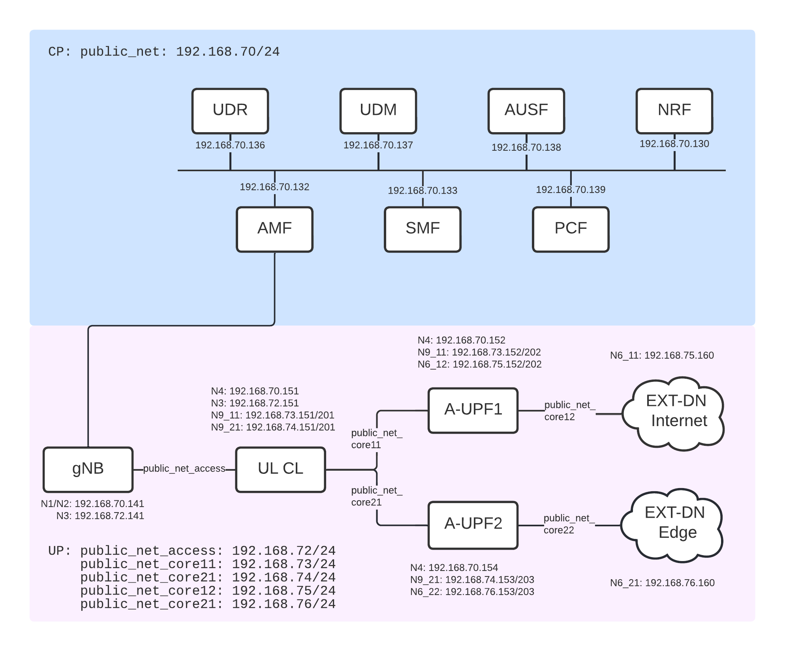

<table style="border-collapse: collapse; border: none;">
  <tr style="border-collapse: collapse; border: none;">
    <td style="border-collapse: collapse; border: none;">
      <a href="http://www.openairinterface.org/">
         
         </img>
      </a>
    </td>
    <td style="border-collapse: collapse; border: none; vertical-align: center;">
      <b><font size = "5">OpenAirInterface 5G Core UL CL Network Deployment and Testing With Gnbsim</font></b>
    </td>
  </tr>
</table>



**Reading time: ~ 20 minutes**

**Tutorial replication time: ~ 1h**

**Compute resource recommendation: ~ 6GB RAM, 8CPU**

Each instance of VPP-UPF runs on a different (logical) CPU core to distribute the workload:
* 0-1: ULCL
* 2-3: A-UPF1
* 4-5: A-UPF2

You need at least 6 logical CPU cores for this tutorial. 

Note: In case readers are interested in deploying debuggers/developers core network environment with more logs please follow [this tutorial](./DEBUG_5G_CORE.md)

**TABLE OF CONTENTS**

[[_TOC_]]

For this demo, all the images which use the `v1.5.0` tag have been retrieved from the official `docker-hub` (see also
[Retrieving images](./RETRIEVE_OFFICIAL_IMAGES.md)).

| NF Name | Branch Name | Tag used at time of writing | Ubuntu 18.04 | RHEL8 |
|----------|:------------|-----------------------------|--------------|-------|
| NSSF     | `master`    | `v1.5.0`                    | X            | -     |
| AMF      | `master`    | `v1.5.0`                    | X            | -     |
| AUSF     | `master`    | `v1.5.0`                    | X            | -     |
| NRF      | `master`    | `v1.5.0`                    | X            | -     |
| SMF      | `master`    | `v1.5.0`                    | X            | -     |
| UDR      | `master`    | `v1.5.0`                    | X            | -     |
| UDM      | `master`    | `v1.5.0`                    | X            | -     |
| PCF      | `master`    | `v1.5.0`                    | X            | -     |
| UPF-VPP  | `master`    | `V1.5.0`                    | X            | -     |

<br/>

This tutorial shows how to configure the UL CL feature at SMF and UPF, based on policies from the PCF.

We will show and validate:
* UL CL scenario for a subscriber (gnbsim) with UL traffic classification to the edge and the internet
* I-UPF/A-UPF N9 scenario to the internet DN for another gnbsim subscriber 
* I-UPF/A-UPF N9 scenario to the edge DN for another gnbsim subscriber

## 1. Pre-requisites

Create a folder where you can store all the result files of the tutorial and later compare them with our provided result files.
We recommend creating exactly the same folder to not break the flow of commands afterwards.

<!---
For CI purposes please ignore this line
``` shell
docker-compose-host $: rm -rf /tmp/oai/ulcl-scenario
```
-->

``` shell
docker-compose-host $: mkdir -p /tmp/oai/ulcl-scenario
docker-compose-host $: chmod 777 /tmp/oai/ulcl-scenario
```

## 2. Get OAI CN5G Container Images

You can either:

* [Building Container Images](./BUILD_IMAGES.md) or
* [Retrieving Container Images](./RETRIEVE_OFFICIAL_IMAGES.md)

## 3. Deploying OAI 5g Core Network

We deploy an adapted version of [docker-commpose-basic-vpp-nrf.yaml](../docker-compose/docker-compose-basic-vpp-nrf.yaml) of the 5G core with the PCF as additional NF and 3 UPFs instead of 1.

We use `docker-compose` to deploy the core network. Please refer to the file [docker-compose-basic-vpp-pcf-ulcl.yaml](../docker-compose/docker-compose-basic-vpp-pcf-ulcl.yaml)
for details.

### Docker Networks
In total, 6 different docker networks are used:
* public_net (demo-oai) for control plane 
* public_net_access (cn5g-access) for the N3 interface between gnbsim and gNB
* public_net_core_11 (cn5g-core-11) for the N9 interface between ULCL and A-UPF1
* public_net_core_12 (cn5g-core-12) for the N6 interface between A-UPF1 and EXT-DN-Internet
* public_net_core_21 (cn5g-core-21) for the N9 interface between ULCL and A-UPF2
* public_net_core_22 (cn5g-core-22) for the N6 interface between A-UPF2 and EXT-DN-Edge

### Deployment and Tracing

The first interface (demo-oai) is used for the control plane, including the N4 interfaces to all UPFs. The others are used for the user plane.

Therefore, we do not need to filter out the UP when tracing on the `demo-oai` interface.
We run the `mysql` service first, so that we can start the trace before anything is sent over the CP. 
You can choose to skip this step and deploy all the NFs at once.

``` shell
docker-compose-host $: docker-compose -f docker-compose-basic-vpp-pcf-ulcl.yaml up -d mysql 
Creating network "demo-oai-public-net" with driver "bridge"
Creating network "oai-public-access" with the default driver
Creating network "oai-public-core11" with the default driver
Creating network "oai-public-core21" with the default driver
Creating network "oai-public-core12" with the default driver
Creating network "oai-public-core22" with the default driver
Creating mysql ... done
```


We capture the packets on the docker networks and filter out ARP. 
``` shell
docker-compose-host $: sleep 1
docker-compose-host $: nohup sudo tshark -i demo-oai -f "not arp" -w /tmp/oai/ulcl-scenario/control_plane.pcap > /tmp/oai/ulcl-scenario/control_plane.log 2>&1 &
```
<!--
For CI purposes please ignore this line
``` shell
docker-compose-host $: ../ci-scripts/checkTsharkCapture.py --log_file /tmp/oai/ulcl-scenario/control_plane.log --timeout 60
```
-->

Then, we start all the NFs.

``` shell
docker-compose-host $: docker-compose -f docker-compose-basic-vpp-pcf-ulcl.yaml up -d
mysql is up-to-date
Creating oai-nrf             ... done
Creating oai-udr             ... done
Creating vpp-upf-aupf2       ... done
Creating vpp-upf-ulcl        ... done
Creating vpp-upf-aupf1       ... done
Creating oai-pcf             ... done
Creating oai-udm             ... done
Creating oai-ext-dn-internet ... done
Creating oai-ext-dn-edge     ... done
Creating oai-ausf            ... done
Creating oai-amf             ... done
Creating oai-smf             ... done
```

<!--
For CI purposes please ignore this line
``` shell
docker-compose-host $: ../ci-scripts/checkContainerStatus.py --container_name mysql --timeout 120
docker-compose-host $: ../ci-scripts/checkContainerStatus.py --container_name oai-amf --timeout 30
docker-compose-host $: docker-compose -f docker-compose-basic-vpp-pcf-ulcl.yaml ps -a
```
-->

### Checking the Status of the NFs
Using `docker ps` you can verify that no NF exited, e.g. because of a faulty configuration:

Also all should be in an `healthy` state before going further. The `mysql` container may take some time.
``` console 
docker-compose-host $: docker ps
CONTAINER ID   IMAGE                 COMMAND                  CREATED          STATUS                    PORTS                          NAMES
16e442edd7b9   oai-smf:v1.5.0        "/bin/bash /openair-…"   30 seconds ago   Up 29 seconds (healthy)   80/tcp, 8080/tcp, 8805/udp     oai-smf
17cd7f15c863   oai-amf:v1.5.0        "python3 /openair-am…"   31 seconds ago   Up 29 seconds (healthy)   80/tcp, 9090/tcp, 38412/sctp   oai-amf
81d91b0e9719   oai-ausf:v1.5.0       "/bin/bash /openair-…"   32 seconds ago   Up 31 seconds (healthy)   80/tcp                         oai-ausf
4c11b8c156fc   trf-gen-cn5g:latest   "/bin/bash -c 'iptab…"   32 seconds ago   Up 30 seconds (healthy)                                  oai-ext-dn-internet
2ef303b9bc02   trf-gen-cn5g:latest   "/bin/bash -c 'iptab…"   32 seconds ago   Up 31 seconds (healthy)                                  oai-ext-dn-edge
9da12093f3d6   oai-udm:v1.5.0        "/bin/bash /openair-…"   33 seconds ago   Up 31 seconds (healthy)   80/tcp                         oai-udm
b867ac7db503   oai-upf-vpp:v1.5.0    "/openair-upf/bin/en…"   34 seconds ago   Up 31 seconds (healthy)   2152/udp, 8085/udp             vpp-upf-ulcl
4e133a45bd0b   oai-pcf:v1.5.0        "/bin/bash /openair-…"   34 seconds ago   Up 33 seconds (healthy)   80/tcp, 8080/tcp               oai-pcf
24d29ca1257b   oai-upf-vpp:v1.5.0    "/openair-upf/bin/en…"   34 seconds ago   Up 32 seconds (healthy)   2152/udp, 8085/udp             vpp-upf-aupf2
08d289a69916   oai-upf-vpp:v1.5.0    "/openair-upf/bin/en…"   34 seconds ago   Up 32 seconds (healthy)   2152/udp, 8085/udp             vpp-upf-aupf1
341271bb659a   oai-udr:v1.5.0        "/bin/bash /openair-…"   34 seconds ago   Up 33 seconds (healthy)   80/tcp                         oai-udr
aa8cbc6fe533   oai-nrf:v1.5.0        "python3 /openair-nr…"   34 seconds ago   Up 33 seconds (healthy)   80/tcp, 9090/tcp               oai-nrf
ac10687810e0   mysql:5.7             "docker-entrypoint.s…"   34 seconds ago   Up 33 seconds (healthy)   3306/tcp, 33060/tcp            mysql         
```

Please wait until all NFs are healthy. 

When you are running in debug mode, you should also check the docker logs of SMF and verify that the UPF graph has been built successfully:

``` console
docker-compose-host $: docker logs oai-smf | grep -A 5 graph

[2023-01-13T16:55:44.125040] [smf] [smf_app] [debug] UPF graph 
[2023-01-13T16:55:44.125042] [smf] [smf_app] [debug] * aupf2.node.5gcn.mnc95.mcc208.3gppnetwork.org --> N6(edge.5gcn.mnc95.mcc208.3gppnetwork.org), S-NSSAI UPF info list: {  {SST=222, SD=123, {DNN = default, DNAI list: {DNAI = edge, }, }, , }, 

[2023-01-13T16:55:46.142769] [smf] [smf_app] [debug] UPF graph 
[2023-01-13T16:55:46.142771] [smf] [smf_app] [debug] * aupf1.node.5gcn.mnc95.mcc208.3gppnetwork.org --> N6(internet.5gcn.mnc95.mcc208.3gppnetwork.org), S-NSSAI UPF info list: {  {SST=222, SD=123, {DNN = default, DNAI list: {DNAI = internet, }, }, , }, 
* aupf2.node.5gcn.mnc95.mcc208.3gppnetwork.org --> N6(edge.5gcn.mnc95.mcc208.3gppnetwork.org), S-NSSAI UPF info list: {  {SST=222, SD=123, {DNN = default, DNAI list: {DNAI = edge, }, }, , }, 

[2023-01-13T16:55:48.149576] [smf] [smf_app] [debug] UPF graph 
[2023-01-13T16:55:48.149579] [smf] [smf_app] [debug] * ulcl.node.5gcn.mnc95.mcc208.3gppnetwork.org --> N9(aupf1.node.5gcn.mnc95.mcc208.3gppnetwork.org), S-NSSAI UPF info list: {  {SST=222, SD=123, {DNN = default, DNAI list: {DNAI = aupf1, }, }, , }, N9(aupf2.node.5gcn.mnc95.mcc208.3gppnetwork.org), S-NSSAI UPF info list: {  {SST=222, SD=123, {DNN = default, DNAI list: {DNAI = aupf2, }, }, , }, N3(access.5gcn.mnc95.mcc208.3gppnetwork.org), S-NSSAI UPF info list: {  {SST=222, SD=123, {DNN = default, DNAI list: {DNAI = access, }, }, , }, 
* aupf2.node.5gcn.mnc95.mcc208.3gppnetwork.org --> N6(edge.5gcn.mnc95.mcc208.3gppnetwork.org), S-NSSAI UPF info list: {  {SST=222, SD=123, {DNN = default, DNAI list: {DNAI = edge, }, }, , }, N9(ulcl.node.5gcn.mnc95.mcc208.3gppnetwork.org), S-NSSAI UPF info list: {  {SST=222, SD=123, {DNN = default, DNAI list: {DNAI = ulcl, }, }, , }, 
* aupf1.node.5gcn.mnc95.mcc208.3gppnetwork.org --> N6(internet.5gcn.mnc95.mcc208.3gppnetwork.org), S-NSSAI UPF info list: {  {SST=222, SD=123, {DNN = default, DNAI list: {DNAI = internet, }, }, , }, N9(ulcl.node.5gcn.mnc95.mcc208.3gppnetwork.org), S-NSSAI UPF info list: {  {SST=222, SD=123, {DNN = default, DNAI list: {DNAI = ulcl, }, }, , }, 
```

We see that first AUPF2 is added, followed by AUPF1 and ULCL. The order of this may differ. 
It is important that all 3 UPFs are added successfully and that there are the correct edges.
When the graph is fully built, it should look like this (again, the order does not matter):
* ulcl --> N9(aupf1): aupf1, N9(aupf2): aupf2, N3(access)
* aupf1 --> N9(ulcl): ulcl, N6(internet)
* aupf2 -> N9(ulcl): ulcl, N6(edge)


## 4. Simulate with gnbsim

When the CN is deployed successfully, we can simulate a gNB and UE using `gnbsim`. 
Please see the [gnbsim tutorial](./DEPLOY_SA5G_MINI_WITH_GNBSIM.md) on how to retrieve or build the image.

``` shell
docker-compose-host $: docker-compose -f docker-compose-gnbsim-vpp.yaml up -d 
Creating gnbsim-vpp ...
Creating gnbsim-vpp ... done
```

<!--
For CI purposes please ignore this line
``` shell
docker-compose-host $: ../ci-scripts/checkContainerStatus.py --container_name gnbsim-vpp --timeout 30
```
-->


We can verify that the gNB received an IP address and that the PDU session establishment was successful. 
``` shell
docker-compose-host $: docker logs gnbsim-vpp 2>&1 | grep "UE address:"
[gnbsim]2023/01/13 17:07:05.134094 example.go:332: UE address: 12.1.1.2
```
It can take some time until the PDU session establishment is complete, so you may have to repeat this command until
you see the IP address.

Please note, that the UL CL is transparent for the UE and this only shows that there is a PDU session, not that
the traffic is routed correctly. Currently, the SMF tries to create a session on any UPF if the selection based on PCC rules 
fails. 

## 5. Traffic Test for UL CL Scenario

*Note: As tshark is running in the background, and we run everything in the same terminal, we will stop the control plane traces here. If you want, you can open tshark on another terminal and terminate it whenever it suits you.*  
``` shell
docker-compose-host $: sudo pkill tshark 
docker-compose-host $: sleep 5
```

Before we start the traffic tests, we start the user plane trace without any filter:
``` shell
docker-compose-host $: nohup sudo tshark -i cn5g-access -i cn5g-core-11 -i cn5g-core-12 -i cn5g-core-21 -i cn5g-core-22 -w /tmp/oai/ulcl-scenario/user_plane_ulcl.pcap > /tmp/oai/ulcl-scenario/user_plane_ulcl.log 2>&1 &
```

<!--
For CI purposes please ignore this line
``` shell
docker-compose-host $: ../ci-scripts/checkTsharkCapture.py --log_file /tmp/oai/ulcl-scenario/user_plane_ulcl.log --timeout 60
```
-->

This capture contains all the UP network interfaces.

Then, we generate ICMP traffic to `1.1.1.1` and `1.1.1.2`:

``` console 
docker-compose-host $: docker exec -it gnbsim-vpp ping -I 12.1.1.2 -c4 1.1.1.2
PING 1.1.1.2 (1.1.1.2) from 12.1.1.2 : 56(84) bytes of data.
64 bytes from 1.1.1.2: icmp_seq=1 ttl=54 time=10.7 ms
64 bytes from 1.1.1.2: icmp_seq=2 ttl=54 time=10.9 ms
64 bytes from 1.1.1.2: icmp_seq=3 ttl=54 time=9.28 ms
64 bytes from 1.1.1.2: icmp_seq=4 ttl=54 time=9.12 ms

--- 1.1.1.2 ping statistics ---
4 packets transmitted, 4 received, 0% packet loss, time 3003ms
rtt min/avg/max/mdev = 9.116/10.005/10.934/0.815 ms
```

``` console 
docker-compose-host $: docker exec -it gnbsim-vpp ping -I 12.1.1.2 -c4 1.1.1.1
PING 1.1.1.1 (1.1.1.1) from 12.1.1.2 : 56(84) bytes of data.
64 bytes from 1.1.1.1: icmp_seq=1 ttl=54 time=12.7 ms
64 bytes from 1.1.1.1: icmp_seq=2 ttl=54 time=11.0 ms
64 bytes from 1.1.1.1: icmp_seq=3 ttl=54 time=9.73 ms
64 bytes from 1.1.1.1: icmp_seq=4 ttl=54 time=17.2 ms

--- 1.1.1.1 ping statistics ---
4 packets transmitted, 4 received, 0% packet loss, time 3005ms
rtt min/avg/max/mdev = 9.725/12.668/17.231/2.843 ms
```

<!--
For CI purposes please ignore these lines
 * 192.168.75.160 is oai-ext-dn-internet
 * 192.168.76.160 is oai-ext-dn-edge

``` shell
docker-compose-host $: docker exec gnbsim-vpp /bin/bash -c 'traceroute -4 -T -s 12.1.1.2 1.1.1.1' 2>&1 | tee /tmp/oai/ulcl-scenario/ue0-test0.log
docker-compose-host $: docker exec gnbsim-vpp /bin/bash -c 'traceroute -4 -T -s 12.1.1.2 1.1.1.2' 2>&1 | tee /tmp/oai/ulcl-scenario/ue0-test1.log
docker-compose-host $: grep 192.168.75.160 /tmp/oai/ulcl-scenario/ue0-test0.log
docker-compose-host $: grep 192.168.76.160 /tmp/oai/ulcl-scenario/ue0-test1.log
```
-->


We will see in the [analysis](#8-trace-analysis) that the IP packets to `1.1.1.1` are routed over A-UPF1 and the EXT-DN-Internet and the
packets to `1.1.1.2` are routed over A-UPF2 and the EXT-DN-Edge

To better analyse the traces for the following scenarios, we stop the trace:
``` shell
docker-compose-host $: sudo pkill tshark 
```


## 6. Traffic Test for Edge-Only Scenario
As you can see in the PCC rules (`policies/ulcl/pcc_rules/pcc_rules.yaml`), there are two edge rules: `edge-rule-restricted` and
`edge-rule-all`. Both use the same traffic rule, but the flow description is configured differently. It means that the
`edge-rule-restricted` allows only traffic to 1.1.1.2, whereas the other rule allows any traffic to the edge.

Which UE uses which PCC rules is configured in the policy decisions file (`policies/policy_decisions/policy_decision.yaml`).
You can see that the UE with the IMSI `208950000000032` is configured to use the `edge-rule-all`. 

To start the edge-only UE, use docker-compose:
``` shell
docker-compose-host $: docker-compose -f docker-compose-gnbsim-vpp-additional.yaml up -d gnbsim-vpp2
Creating gnbsim-vpp2 ...
Creating gnbsim-vpp2 ... done
```

<!--
For CI purposes please ignore this line
``` shell
docker-compose-host $: ../ci-scripts/checkContainerStatus.py --container_name gnbsim-vpp2 --timeout 30
```
-->

Again, we can verify if the PDU session establishment was successful.
``` shell
docker-compose-host $: docker logs gnbsim-vpp2 2>&1 | grep "UE address:"
[gnbsim]2023/01/13 17:14:12.992695 example.go:332: UE address: 12.1.1.3
```

We start a trace for this scenario:
``` shell
docker-compose-host $: nohup sudo tshark -i cn5g-access -i cn5g-core-11 -i cn5g-core-12 -i cn5g-core-21 -i cn5g-core-22 -w /tmp/oai/ulcl-scenario/user_plane_edge_only.pcap > /tmp/oai/ulcl-scenario/user_plane_edge_only.log 2>&1 &
```

<!--
For CI purposes please ignore this line
``` shell
docker-compose-host $: ../ci-scripts/checkTsharkCapture.py --log_file /tmp/oai/ulcl-scenario/user_plane_edge_only.log --timeout 60
```
-->

Then, as before, we ping `1.1.1.1` and `1.1.1.2`. 

``` console 
docker-compose-host $: docker exec -it gnbsim-vpp2 ping -I 12.1.1.3 -c4 1.1.1.2
PING 1.1.1.2 (1.1.1.2) from 12.1.1.3 : 56(84) bytes of data.
64 bytes from 1.1.1.2: icmp_seq=1 ttl=114 time=29.3 ms
64 bytes from 1.1.1.2: icmp_seq=2 ttl=114 time=18.8 ms
64 bytes from 1.1.1.2: icmp_seq=3 ttl=114 time=25.4 ms
64 bytes from 1.1.1.2: icmp_seq=4 ttl=114 time=15.2 ms

--- 1.1.1.2 ping statistics ---
4 packets transmitted, 4 received, 0% packet loss, time 3003ms
rtt min/avg/max/mdev = 15.200/22.169/29.265/5.484 ms
```

``` console 
docker-compose-host $: docker exec -it gnbsim-vpp2 ping -I 12.1.1.3 -c4 1.1.1.1
PING 1.1.1.1 (1.1.1.1) from 12.1.1.3 : 56(84) bytes of data.
64 bytes from 1.1.1.1: icmp_seq=1 ttl=55 time=15.7 ms
64 bytes from 1.1.1.1: icmp_seq=2 ttl=55 time=19.8 ms
64 bytes from 1.1.1.1: icmp_seq=3 ttl=55 time=9.77 ms
64 bytes from 1.1.1.1: icmp_seq=4 ttl=55 time=12.3 ms

--- 1.1.1.1 ping statistics ---
4 packets transmitted, 4 received, 0% packet loss, time 3005ms
rtt min/avg/max/mdev = 9.766/14.397/19.823/3.785 ms
```

<!--
For CI purposes please ignore these lines
we use 1.1.1.1 and 1.1.1.2 as it serves HTTP, so we can verify if the UL CL works properly in the generated traces 
 * 192.168.76.160 is oai-ext-dn-edge

``` shell
docker-compose-host $: docker exec gnbsim-vpp2 /bin/bash -c 'traceroute -4 -T -s 12.1.1.3 1.1.1.1' 2>&1 | tee /tmp/oai/ulcl-scenario/ue1-test0.log
docker-compose-host $: docker exec gnbsim-vpp2 /bin/bash -c 'traceroute -4 -T -s 12.1.1.3 1.1.1.2' 2>&1 | tee /tmp/oai/ulcl-scenario/ue1-test1.log
docker-compose-host $: grep 192.168.76.160 /tmp/oai/ulcl-scenario/ue1-test0.log
docker-compose-host $: grep 192.168.76.160 /tmp/oai/ulcl-scenario/ue1-test1.log
```
-->


In the [analysis](#8-trace-analysis) we see that all this traffic is routed over A-UPF2 and the EXT-DN-Edge.

Again, we stop this trace:
``` shell
docker-compose-host $: sudo pkill tshark
```

## 7. Traffic Test for Internet-Only Scenario
The policies for the IMSI `208950000000033` configure that this subscriber should use the Internet-only scenario.
We start it again using docker-compose:
``` shell
docker-compose-host $: docker-compose -f docker-compose-gnbsim-vpp-additional.yaml up -d gnbsim-vpp3
```

<!--
For CI purposes please ignore this line
``` shell
docker-compose-host $: ../ci-scripts/checkContainerStatus.py --container_name gnbsim-vpp3 --timeout 30
```
-->

We verify that the PDU session establishment is successful and that the UP is routed.

``` shell
docker-compose-host $: docker logs gnbsim-vpp3 2>&1 | grep "UE address:"
[gnbsim]2023/01/13 17:20:03.092889 example.go:332: UE address: 12.1.1.4
```

We start a trace for this scenario:
``` shell
docker-compose-host $: nohup sudo tshark -i cn5g-access -i cn5g-core-11 -i cn5g-core-12 -i cn5g-core-21 -i cn5g-core-22 -w /tmp/oai/ulcl-scenario/user_plane_internet_only.pcap > /tmp/oai/ulcl-scenario/user_plane_internet_only.log 2>&1 &
```

<!--
For CI purposes please ignore this line
``` shell
docker-compose-host $: ../ci-scripts/checkTsharkCapture.py --log_file /tmp/oai/ulcl-scenario/user_plane_internet_only.log --timeout 60
```
-->

Again, we generate traffic using pings to 1.1.1.2 and 1.1.1.1.

``` console
docker-compose-host $: docker exec -it gnbsim-vpp3 ping -I 12.1.1.4 -c4 1.1.1.2
PING 1.1.1.2 (1.1.1.2) from 12.1.1.4 : 56(84) bytes of data.
64 bytes from 1.1.1.2: icmp_seq=1 ttl=114 time=29.3 ms
64 bytes from 1.1.1.2: icmp_seq=2 ttl=114 time=18.8 ms
64 bytes from 1.1.1.2: icmp_seq=3 ttl=114 time=25.4 ms
64 bytes from 1.1.1.2: icmp_seq=4 ttl=114 time=15.2 ms

--- 1.1.1.2 ping statistics ---
4 packets transmitted, 4 received, 0% packet loss, time 3003ms
rtt min/avg/max/mdev = 15.200/22.169/29.265/5.484 ms
```

``` console 
docker-compose-host $: docker exec -it gnbsim-vpp3 ping -I 12.1.1.4 -c4 1.1.1.1
PING 1.1.1.1 (1.1.1.1) from 12.1.1.4 : 56(84) bytes of data.
64 bytes from 1.1.1.1: icmp_seq=1 ttl=55 time=15.7 ms
64 bytes from 1.1.1.1: icmp_seq=2 ttl=55 time=19.8 ms
64 bytes from 1.1.1.1: icmp_seq=3 ttl=55 time=9.77 ms
64 bytes from 1.1.1.1: icmp_seq=4 ttl=55 time=12.3 ms

--- 1.1.1.1 ping statistics ---
4 packets transmitted, 4 received, 0% packet loss, time 3005ms
rtt min/avg/max/mdev = 9.766/14.397/19.823/3.785 ms
```

<!--
For CI purposes please ignore these lines
we use 1.1.1.1 and 1.1.1.2 as it serves HTTP, so we can verify if the UL CL works properly in the generated traces 
 * 192.168.75.160 is oai-ext-dn-internet

``` shell
docker-compose-host $: docker exec gnbsim-vpp3 /bin/bash -c 'traceroute -4 -T -s 12.1.1.4 1.1.1.1' 2>&1 | tee /tmp/oai/ulcl-scenario/ue2-test0.log
docker-compose-host $: docker exec gnbsim-vpp3 /bin/bash -c 'traceroute -4 -T -s 12.1.1.4 1.1.1.2' 2>&1 | tee /tmp/oai/ulcl-scenario/ue2-test1.log
docker-compose-host $: grep 192.168.75.160 /tmp/oai/ulcl-scenario/ue2-test0.log
docker-compose-host $: grep 192.168.75.160 /tmp/oai/ulcl-scenario/ue2-test1.log
```
-->

## 8 Trace Analysis

Now that we have captured control plane and user plane traces, we can stop `tshark`:
``` shell
docker-compose-host $: sudo pkill tshark
```

Then, we change the permissions of the traces to open them in Wireshark:
``` shell
docker-compose-host $: sudo chmod 666 /tmp/oai/ulcl-scenario/control_plane.*
docker-compose-host $: sudo chmod 666 /tmp/oai/ulcl-scenario/user_plane_ulcl.*
docker-compose-host $: sudo chmod 666 /tmp/oai/ulcl-scenario/user_plane_edge_only.*
docker-compose-host $: sudo chmod 666 /tmp/oai/ulcl-scenario/user_plane_internet_only.*
```

As we capture more than one interface, the pcap files are likely out-of-order. To solve this, sort based on the `Time`
column. 

### UL CL Scenario

The results of this tutorial are located in [results/ulcl](results/ulcl). 

First, we open the [user_plane_ulcl.pcapng](results/ulcl/user_plane_ulcl.pcapng) file and sort based on time. 

We see that each ICMP request to `1.1.1.2` has four packets. The first packet #7 is from the gNB to the UL CL, the second (#1) is from the
ULCL to the A-UPF2, the third (#2) is from A-UPF2 to EXT-DN-Edge. The last packet (#4) is from the EXT-DN-Edge to the Internet.
We see that here NAT is applied and the UE source IP `12.1.1.2` is replaced with `192.168.76.160`, the IP address of the 
EXT-DN-Edge. The same happens for the ICMP reply, but in the other direction.

It is interesting to check the first IP layer and the GTP layer in packets #1 and #2. In number #1 we see that the source IP is `192.168.70.201` (UL CL) and the destination IP is 
`192.168.74.203`, which is the A-UPF2 or edge UPF. We see that the configured policies route traffic to `1.1.1.2` to the edge DN.

When we analyze the ICMP request to `1.1.1.1` (starting at packet #39), we can see that the path from the gNB to the UL CL is the same in packet #39. After that in packet #37, 
however, the packets are routed via the A-UPF1 (`192.168.73.202`). Therefore, the EXT-DN-Internet is used and NAT is done 
with the IP address `192.168.75.160` in packet #35.

Please note that the packets are out of order in these examples and you have to sort based on time to follow the flow correctly.

### Edge Only Scenario

We open the [user_plane_edge_only.pcapng](results/ulcl/user_plane_edge_only.pcapng) file and sort again based on time.

We see that the ICMP traffic to `1.1.1.2` follows the edge route, as in the previous example (Packets #1, #7, #3, #4). The difference is that the ICMP traffic to `1.1.1.1` also follows the edge route.
You can see this in packets #33, #35, #37 and #38. In fact, all traffic is routed there, as it is defined in the PCC rules.

### Internet Only Scenario

We open the `user_plane_internet_only.pcap` file and apply the same filter and sorting.

This scenario is the opposite of the edge-only scenario. We can see that all the traffic is routed to A-UPF1 and the
EXT-DN-Internet. You can check the packets #1, #4, #3# and #6 to see that the A-UPF1's IP address `192.168.73.202` is used for the GTP tunnel in packet #4.
It is also used for the ping to `1.1.1.1` in packet #33. 

## 10 Undeploy Network Functions

When you are done, you can undeploy the gnbsim instances and stop the NFs. 

First, we stop the gnbsim instances:

``` shell
docker-compose-host $: docker-compose -f docker-compose-gnbsim-vpp-additional.yaml stop -t 2
docker-compose-host $: docker-compose -f docker-compose-gnbsim-vpp.yaml stop -t 2
```

Then, we stop the NFs. 

``` shell
docker-compose-host $: docker-compose -f docker-compose-basic-vpp-pcf-ulcl.yaml stop -t 2
```

Now we are able to collect the logs.

``` shell
docker-compose-host $: docker logs oai-amf > /tmp/oai/ulcl-scenario/amf.log 2>&1
docker-compose-host $: docker logs oai-smf > /tmp/oai/ulcl-scenario/smf.log 2>&1
docker-compose-host $: docker logs oai-nrf > /tmp/oai/ulcl-scenario/nrf.log 2>&1
docker-compose-host $: docker logs vpp-upf-ulcl > /tmp/oai/ulcl-scenario/vpp-upf-ulcl.log 2>&1
docker-compose-host $: docker logs vpp-upf-aupf1 > /tmp/oai/ulcl-scenario/vpp-upf-aupf1.log 2>&1
docker-compose-host $: docker logs vpp-upf-aupf2 > /tmp/oai/ulcl-scenario/vpp-upf-aupf2.log 2>&1
docker-compose-host $: docker logs oai-udr > /tmp/oai/ulcl-scenario/udr.log 2>&1
docker-compose-host $: docker logs oai-udm > /tmp/oai/ulcl-scenario/udm.log 2>&1
docker-compose-host $: docker logs oai-ausf > /tmp/oai/ulcl-scenario/ausf.log 2>&1
docker-compose-host $: docker logs oai-pcf > /tmp/oai/ulcl-scenario/pcf.log 2>&1
docker-compose-host $: docker logs gnbsim-vpp > /tmp/oai/ulcl-scenario/gnbsim-vpp.log 2>&1
docker-compose-host $: docker logs gnbsim-vpp2 > /tmp/oai/ulcl-scenario/gnbsim-vpp2.log 2>&1
docker-compose-host $: docker logs gnbsim-vpp3 > /tmp/oai/ulcl-scenario/gnbsim-vpp3.log 2>&1
```

Finally, we undeploy the gnbsims and NFs to clean up the Docker networks.

``` shell
docker-compose-host $: docker-compose -f docker-compose-gnbsim-vpp-additional.yaml down -t 2
docker-compose-host $: docker-compose -f docker-compose-gnbsim-vpp.yaml down -t 2
docker-compose-host $: docker-compose -f docker-compose-basic-vpp-pcf-ulcl.yaml down -t 2
```

## 11 Conclusion
We show in this tutorial how the UL CL can be configured in the OAI. The UL CL UPF is acting as an UL CL for the first scenario,
but is acting as an I-UPF for the edge-only and internet-only scenario.

You can see in the `docker-compose-basic-vpp-pcf-ulcl.yaml`
file and the policy configuration that the DNAI and NW instances have to be configured correctly in UPF and PCF.

As an example, the `internet-scenario` traffic rule has the following DNAIs configured:
* access
* ulcl
* aupf1
* internet

This means that each of these components should be present in the path, i.e., gNB (access), ULCL UPF (ulcl), AUPF1 (aupf1)
and EXT-DN-Internet (internet).

We can see in the configuration of the UL CL UPF that the N3 interface configures the `access` DNAI and the N9 interface to the
AUPF1 configures the `aupf1` DNAI. The N9 interface of the A-UPF1 configures the `ulcl` DNAI and the N6 interface the `internet` DNAI.

The naming of the DNAIs is up to the user, but we recommend that it should correspond to the name of the NF.

When the SMF is creating the UPF graph, the edges are created based on the NWI of a UPF interface and the UPF FQDN.

For example, the ULCL UPF configures the NWI `aupf1.node.5gcn.mnc95.mcc208.3gppnetwork.org` for its N9 interface to the
A-UPF1. An edge exists when the FQDN of the A-UPF matches this string. The FQDN is not directly configured, but is composed
of different environment variables:

`<NAME>.node.5gcn.mnc<MNC>.mcc<MCC>.<REALM>`

Keep that in mind when creating your own scenarios and always verify in the SMF logs that the graph is built correctly.
