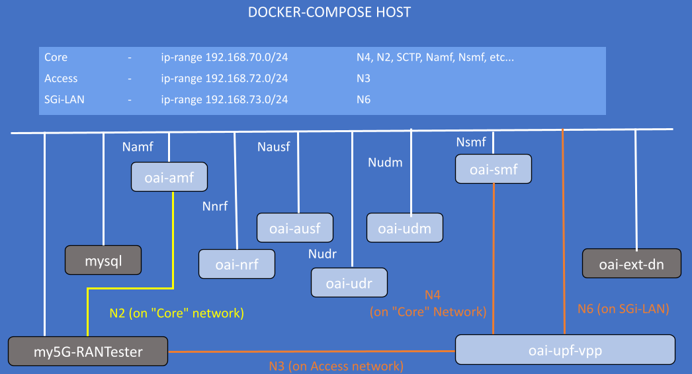

<table style="border-collapse: collapse; border: none;">
  <tr style="border-collapse: collapse; border: none;">
    <td style="border-collapse: collapse; border: none;">
      <a href="http://www.openairinterface.org/">
         
         </img>
      </a>
    </td>
    <td style="border-collapse: collapse; border: none; vertical-align: center;">
      <b><font size = "5">OpenAirInterface 5G Core Network Deployment and Testing with My5g-RANTester</font></b>
    </td>
  </tr>
</table>




**Reading time: ~ 30mins**

**Tutorial replication time: ~ 1h30mins**

Note: In case readers are interested in deploying debuggers/developers core network environment with more logs please follow [this tutorial](./DEBUG_5G_CORE.md)

**TABLE OF CONTENTS**

1.  Pre-requisites
2.  [Building Container Images](./BUILD_IMAGES.md) or [Retrieving Container Images](./RETRIEVE_OFFICIAL_IMAGES.md)
3.  Configuring Host Machines
4.  Configuring OAI 5G Core Network Functions
5.  Deploying OAI 5G Core Network
6.  [Getting a `my5G-RANTester` docker image](#6-getting-a-my5G-RANTester-docker-image)
7.  [Executing `my5G-RANTester` Scenario](#7-executing-the-my5G-RANTester-scenario)
8.  [Analysing Scenario Results](#8-analysing-the-scenario-results)
9.  [Trying some advanced stuff](#9-trying-some-advanced-stuff)

* In this demo the image tags which were used are listed below, follow [Building images](./BUILD_IMAGES.md) to build images with the tags below. When pulling images of network functions from dockerhub pull images for `develop` tag

| CNF Name    | Branch Name    | Tag used at time of writing   | Ubuntu 18.04 | RHEL8         |
| ----------- |:-------------- | ----------------------------- | ------------ | --------------|
| AMF         | `master`      | `v1.5.0`                      | X            | X              |
| AUSF        | `master`      | `v1.5.0`                      | X            | X              |
| NRF         | `master`      | `v1.5.0`                      | X            | X              |
| SMF         | `master`      | `v1.5.0`                      | X            | X              |
| UDR         | `master`      | `v1.5.0`                      | X            | X              |
| UDM         | `master`      | `v1.5.0`                      | X            | X              |
| SPGWU       | `master`      | `v1.5.0`                      | X            | X              |
| UPF-VPP     | `master`      | `v1.5.0`                      | X            | X              |


<br/>

This tutorial is an extension of a previous tutorial: [testing a `basic` deployment](./DEPLOY_SA5G_BASIC_DEPLOYMENT.md).

Moreover, there are various other opensource gnb/ue simulator tools that are available for SA5G test. In this tutorial, we use an opensource simulator tool called `My5g-RANTester`. With the help of `My5g-RANTester` tool, we can perform very basic SA5G test by simulating one gnb and multiple ues.

##### About My5g-RANTester -

[My5g-RANTester](https://github.com/my5G/my5G-RANTester) is the open-source state-of-the-art 5G UE and RAN (gNodeB) implementation. my5G-RANTester follows the 3GPP Release 15 standard for NG-RAN. Using my5G-RANTester, it is possible to generate different workloads and test several functionalities of a 5G core, including its compliance to the 3GPP standards. Scalability is also a relevant feature of the my5G-RANTester, which is able to mimic the behaviour of a large number of UEs and gNBs accessing simultaneously a 5G core.

Let's begin !!

* Steps 1 to 5 are similar to this previous [tutorial on vpp-upf](https://gitlab.eurecom.fr/oai/cn5g/oai-cn5g-fed/-/blob/master/docs/DEPLOY_SA5G_WITH_VPP_UPF.md#5-deploying-oai-5g-core-network). Please follow these steps to deploy OAI 5G core network components.
* We deploy my5G-RANTester docker service on the same host as of core network, so there is no need to create additional route as
we did for gnb-host.
* Before we proceed further for end-to-end SA5G test, make sure you have healthy docker services for OAI cn5g

## 1. Pre-requisites

Create a folder where you can store all the result files of the tutorial and later compare them with our provided result files, we recommend creating exactly the same folder to not break the flow of commands afterwards.

<!---
For CI purposes please ignore this line
``` shell
docker-compose-host $: rm -rf /tmp/oai/vpp-upf-my5g
```
-->

``` shell
docker-compose-host $: mkdir -p /tmp/oai/vpp-upf-my5g
docker-compose-host $: chmod 777 /tmp/oai/vpp-upf-my5g
```

## 5. Deploying OAI 5g Core Network
* We will use the same wrapper script for docker-compose that was used for previous tutorials to set up 5gcn with `UPF-VPP`. Use the --help option to check how to use this wrapper script.

``` shell
docker-compose-host $: python3 ./core-network.py --type start-basic-vpp --scenario 1 --capture /tmp/oai/vpp-upf-my5g/vpp-upf-my5g.pcap
[2022-02-08 16:18:19,328] root:DEBUG:  Starting 5gcn components... Please wait....
[2022-02-08 16:18:19,328] root:DEBUG: docker-compose -f docker-compose-basic-vpp-nrf.yaml up -d mysql
Creating network "oai-public-cp" with the default driver
Creating network "oai-public-access" with the default driver
Creating network "oai-public-core" with the default driver
Creating mysql   ... done
[2022-02-08 16:18:32,203] root:DEBUG: nohup sudo tshark -i demo-oai -i cn5g-core -f "(not host 192.168.73.135 and not arp and not port 53 and not port 2152) or (host 192.168.73.135 and icmp)" -w /tmp/oai/vpp-upf-gnbsim/vpp-upf-gnbsim.pcap > /dev/null 2>&1 &
[2022-02-08 16:18:52,217] root:DEBUG: docker-compose -f docker-compose-basic-vpp-nrf.yaml up -d
mysql is up-to-date
Creating oai-nrf ... done
Creating vpp-upf ... done
Creating oai-udr ... done
Creating oai-udm    ... done
Creating oai-ext-dn ... done
Creating oai-ausf   ... done
Creating oai-amf    ... done
Creating oai-smf    ... done

[2022-02-08 16:19:47,977] root:DEBUG:  OAI 5G Core network started, checking the health status of the containers... takes few secs....
[2022-02-08 16:19:47,977] root:DEBUG: docker-compose -f docker-compose-basic-vpp-nrf.yaml ps -a
[2022-02-08 16:20:11,681] root:DEBUG:  All components are healthy, please see below for more details....
Name                 Command                  State                  Ports
-----------------------------------------------------------------------------------------
mysql        docker-entrypoint.sh mysqld      Up (healthy)   3306/tcp, 33060/tcp
oai-amf      /bin/bash /openair-amf/bin ...   Up (healthy)   38412/sctp, 80/tcp, 9090/tcp
oai-ausf     /bin/bash /openair-ausf/bi ...   Up (healthy)   80/tcp
oai-ext-dn   /bin/bash -c  apt update;  ...   Up
oai-nrf      /bin/bash /openair-nrf/bin ...   Up (healthy)   80/tcp, 9090/tcp
oai-smf      /bin/bash /openair-smf/bin ...   Up (healthy)   80/tcp, 8805/udp, 9090/tcp
oai-udm      /bin/bash /openair-udm/bin ...   Up (healthy)   80/tcp
oai-udr      /bin/bash /openair-udr/bin ...   Up (healthy)   80/tcp
vpp-upf      /openair-upf/bin/entrypoin ...   Up (healthy)   2152/udp, 8085/udp
[2022-02-08 16:20:11,681] root:DEBUG:  Checking if the containers are configured....
[2022-02-08 16:20:11,681] root:DEBUG:  Checking if AMF, SMF and UPF registered with nrf core network....
[2022-02-08 16:20:11,681] root:DEBUG: curl -s -X GET http://192.168.70.130/nnrf-nfm/v1/nf-instances?nf-type="AMF" | grep -o "192.168.70.132"
192.168.70.132
[2022-02-08 16:20:11,694] root:DEBUG: curl -s -X GET http://192.168.70.130/nnrf-nfm/v1/nf-instances?nf-type="SMF" | grep -o "192.168.70.133"
192.168.70.133
[2022-02-08 16:20:11,706] root:DEBUG: curl -s -X GET http://192.168.70.130/nnrf-nfm/v1/nf-instances?nf-type="UPF" | grep -o "192.168.70.202"
192.168.70.202
[2022-02-08 16:20:11,717] root:DEBUG:  Checking if AUSF, UDM and UDR registered with nrf core network....
[2022-02-08 16:20:11,717] root:DEBUG: curl -s -X GET http://192.168.70.130/nnrf-nfm/v1/nf-instances?nf-type="AUSF" | grep -o "192.168.70.138"
192.168.70.138
[2022-02-08 16:20:11,728] root:DEBUG: curl -s -X GET http://192.168.70.130/nnrf-nfm/v1/nf-instances?nf-type="UDM" | grep -o "192.168.70.137"
192.168.70.137
[2022-02-08 16:20:11,739] root:DEBUG: curl -s -X GET http://192.168.70.130/nnrf-nfm/v1/nf-instances?nf-type="UDR" | grep -o "192.168.70.136"
192.168.70.136
[2022-02-08 16:20:11,750] root:DEBUG:  AUSF, UDM, UDR, AMF, SMF and UPF are registered to NRF....
[2022-02-08 16:20:11,750] root:DEBUG:  Checking if SMF is able to connect with UPF....
[2022-02-08 16:20:11,868] root:DEBUG:  UPF did answer to N4 Association request from SMF....
[2022-02-08 16:20:11,927] root:DEBUG:  SMF receiving heathbeats from UPF....
[2022-02-08 16:20:11,928] root:DEBUG:  OAI 5G Core network is configured and healthy....
```

More details in [section 5 of the `basic` vpp tutorial](./DEPLOY_SA5G_WITH_VPP_UPF.md#5-deploying-oai-5g-core-network).

## 6. Building a `My5g-RANTester` docker image
* Pull pre-built docker image
``` console
docker-compose-host $: docker pull rohankharade/my5grantester:latest
docker-compose-host $: docker tag rohankharade/my5grantester:latest my5grantester:latest
```

OR

* Build `My5g-RANTester` docker image
``` console
docker-compose-host $: git clone https://github.com/my5G/my5G-RANTester
docker-compose-host $: cd my5G-RANTester/
docker-compose-host $: docker build -f docker/Dockerfile --target my5grantester --tag my5grantester:latest .
```

## 7. Executing the `My5g-RANTester` Scenario

* The configuration parameters, are preconfigured in [docker-compose-basic-vpp-nrf.yaml](../docker-compose/docker-compose-basic-vpp-nrf.yaml) and [docker-compose-my5grantester-vpp.yaml](../docker-compose/docker-compose-my5grantester-vpp.yaml) and one can modify it for test.
* Launch my5G-RANTester docker service

<!---
For CI purposes please ignore this line
``` shell
docker-compose-host $: sleep 5
```
-->


``` shell
docker-compose-host $: docker-compose -f docker-compose-my5grantester-vpp.yaml up -d
Creating my5grantester ... done
```

<!---
For CI purposes please ignore this line
``` shell
docker-compose-host $: sleep 15
```
-->

* After launching My5g-RANTester, make sure service status is healthy -
``` shell
docker-compose-host $: docker-compose -f docker-compose-my5grantester-vpp.yaml ps -a
    Name        Command       State       Ports
-----------------------------------------------
my5grantester   ./app ue   Up (healthy)
```

We can verify it using my5grantester container logs as below -
``` console
docker-compose-host $: docker logs my5G-RANTester
Creating my5grantester ... done
Attaching to my5grantester
my5grantester    | time="2022-05-11T21:59:28Z" level=info msg="my5G-RANTester version 0.1"
my5grantester    | time="2022-05-11T21:59:28Z" level=info msg=---------------------------------------
my5grantester    | time="2022-05-11T21:59:28Z" level=info msg="[TESTER] Starting test function: Testing registration of multiple UEs"
my5grantester    | time="2022-05-11T21:59:28Z" level=info msg="[TESTER][UE] Number of UEs: 1"
my5grantester    | time="2022-05-11T21:59:28Z" level=info msg="[TESTER][GNB] gNodeB control interface IP/Port: 192.168.70.143/9487"
my5grantester    | time="2022-05-11T21:59:28Z" level=info msg="[TESTER][GNB] gNodeB data interface IP/Port: 192.168.72.143/2152"
my5grantester    | time="2022-05-11T21:59:28Z" level=info msg="[TESTER][AMF] AMF IP/Port: 192.168.70.132/38412"
my5grantester    | time="2022-05-11T21:59:28Z" level=info msg=---------------------------------------
my5grantester    | time="2022-05-11T21:59:28Z" level=info msg="[GNB] SCTP/NGAP service is running"
my5grantester    | time="2022-05-11T21:59:28Z" level=info msg="[GNB] UNIX/NAS service is running"
my5grantester    | time="2022-05-11T21:59:28Z" level=info msg="[GNB][SCTP] Receive message in 0 stream\n"
my5grantester    | time="2022-05-11T21:59:28Z" level=info msg="[GNB][NGAP] Receive Ng Setup Response"
my5grantester    | time="2022-05-11T21:59:28Z" level=info msg="[GNB][AMF] AMF Name: OAI-AMF"
my5grantester    | time="2022-05-11T21:59:28Z" level=info msg="[GNB][AMF] State of AMF: Active"
my5grantester    | time="2022-05-11T21:59:28Z" level=info msg="[GNB][AMF] Capacity of AMF: 30"
my5grantester    | time="2022-05-11T21:59:28Z" level=info msg="[GNB][AMF] PLMNs Identities Supported by AMF -- mcc: 208 mnc:95"
my5grantester    | time="2022-05-11T21:59:28Z" level=info msg="[GNB][AMF] List of AMF slices Supported by AMF -- sst:de sd:000000"
my5grantester    | time="2022-05-11T21:59:28Z" level=info msg="[GNB][AMF] List of AMF slices Supported by AMF -- sst:01 sd:000001"
my5grantester    | time="2022-05-11T21:59:28Z" level=info msg="[GNB][AMF] List of AMF slices Supported by AMF -- sst:04 sd:000000"
my5grantester    | time="2022-05-11T21:59:29Z" level=info msg="[TESTER] TESTING REGISTRATION USING IMSI 0000000043 UE"
my5grantester    | time="2022-05-11T21:59:29Z" level=info msg="[UE] UNIX/NAS service is running"
my5grantester    | time="2022-05-11T21:59:29Z" level=info msg="[GNB][SCTP] Receive message in 0 stream\n"
my5grantester    | time="2022-05-11T21:59:29Z" level=info msg="[GNB][NGAP] Receive Downlink NAS Transport"
my5grantester    | time="2022-05-11T21:59:29Z" level=info msg="[UE][NAS] Message without security header"
my5grantester    | time="2022-05-11T21:59:29Z" level=info msg="[UE][NAS] Receive Authentication Request"
my5grantester    | time="2022-05-11T21:59:29Z" level=info msg="[UE][NAS][MAC] Authenticity of the authentication request message: OK"
my5grantester    | time="2022-05-11T21:59:29Z" level=info msg="[UE][NAS][SQN] SQN of the authentication request message: VALID"
my5grantester    | time="2022-05-11T21:59:29Z" level=info msg="[UE][NAS] Send authentication response"
my5grantester    | time="2022-05-11T21:59:29Z" level=info msg="[GNB][SCTP] Receive message in 0 stream\n"
my5grantester    | time="2022-05-11T21:59:29Z" level=info msg="[GNB][NGAP] Receive Downlink NAS Transport"
my5grantester    | time="2022-05-11T21:59:29Z" level=info msg="[UE][NAS] Message with security header"
my5grantester    | time="2022-05-11T21:59:29Z" level=info msg="[UE][NAS] Message with integrity and with NEW 5G NAS SECURITY CONTEXT"
my5grantester    | time="2022-05-11T21:59:29Z" level=info msg="[UE][NAS] successful NAS MAC verification"
my5grantester    | time="2022-05-11T21:59:29Z" level=info msg="[UE][NAS] Receive Security Mode Command"
my5grantester    | time="2022-05-11T21:59:29Z" level=info msg="[UE][NAS] Type of ciphering algorithm is 5G-EA0"
my5grantester    | time="2022-05-11T21:59:29Z" level=info msg="[UE][NAS] Type of integrity protection algorithm is 128-5G-IA2"
my5grantester    | time="2022-05-11T21:59:29Z" level=info msg="[GNB][SCTP] Receive message in 0 stream\n"
my5grantester    | time="2022-05-11T21:59:29Z" level=info msg="[GNB][NGAP] Receive Initial Context Setup Request"
my5grantester    | time="2022-05-11T21:59:29Z" level=info msg="[GNB][UE] UE Context was created with successful"
my5grantester    | time="2022-05-11T21:59:29Z" level=info msg="[GNB][UE] UE RAN ID 1"
my5grantester    | time="2022-05-11T21:59:29Z" level=info msg="[GNB][UE] UE AMF ID 1"
my5grantester    | time="2022-05-11T21:59:29Z" level=info msg="[GNB][UE] UE Mobility Restrict --Plmn-- Mcc: not informed Mnc: not informed"
my5grantester    | time="2022-05-11T21:59:29Z" level=info msg="[GNB][UE] UE Masked Imeisv: "
my5grantester    | time="2022-05-11T21:59:29Z" level=info msg="[GNB][UE] Allowed Nssai-- Sst: de Sd: 00007b"
my5grantester    | time="2022-05-11T21:59:29Z" level=info msg="[GNB][NAS][UE] Send Registration Accept."
my5grantester    | time="2022-05-11T21:59:29Z" level=info msg="[GNB][NGAP][AMF] Send Initial Context Setup Response."
my5grantester    | time="2022-05-11T21:59:29Z" level=info msg="[UE][NAS] Message with security header"
my5grantester    | time="2022-05-11T21:59:29Z" level=info msg="[UE][NAS] Message with integrity and ciphered"
my5grantester    | time="2022-05-11T21:59:29Z" level=info msg="[UE][NAS] successful NAS MAC verification"
my5grantester    | time="2022-05-11T21:59:29Z" level=info msg="[UE][NAS] successful NAS CIPHERING"
my5grantester    | time="2022-05-11T21:59:29Z" level=info msg="[UE][NAS] Receive Registration Accept"
my5grantester    | time="2022-05-11T21:59:29Z" level=info msg="[UE][NAS] UE 5G GUTI: [0 0 0 1]"
my5grantester    | time="2022-05-11T21:59:30Z" level=info msg="[GNB][SCTP] Receive message in 0 stream\n"
my5grantester    | time="2022-05-11T21:59:30Z" level=info msg="[GNB][NGAP] Receive PDU Session Resource Setup Request"
my5grantester    | time="2022-05-11T21:59:30Z" level=info msg="[GNB][NGAP][UE] PDU Session was created with successful."
my5grantester    | time="2022-05-11T21:59:30Z" level=info msg="[GNB][NGAP][UE] PDU Session Id: 1"
my5grantester    | time="2022-05-11T21:59:30Z" level=info msg="[GNB][NGAP][UE] NSSAI Selected --- sst: de sd: 00007b"
my5grantester    | time="2022-05-11T21:59:30Z" level=info msg="[GNB][NGAP][UE] PDU Session Type: ipv4"
my5grantester    | time="2022-05-11T21:59:30Z" level=info msg="[GNB][NGAP][UE] QOS Flow Identifier: 6"
my5grantester    | time="2022-05-11T21:59:30Z" level=info msg="[GNB][NGAP][UE] Uplink Teid: 231454274"
my5grantester    | time="2022-05-11T21:59:30Z" level=info msg="[GNB][NGAP][UE] Downlink Teid: 1"
my5grantester    | time="2022-05-11T21:59:30Z" level=info msg="[GNB][NGAP][UE] Non-Dynamic-5QI: 6"
my5grantester    | time="2022-05-11T21:59:30Z" level=info msg="[GNB][NGAP][UE] Priority Level ARP: 1"
my5grantester    | time="2022-05-11T21:59:30Z" level=info msg="[GNB][NGAP][UE] UPF Address: 192.168.72.202 :2152"
my5grantester    | time="2022-05-11T21:59:30Z" level=info msg="[UE][NAS] Message with security header"
my5grantester    | time="2022-05-11T21:59:30Z" level=info msg="[UE][NAS] Message with integrity and ciphered"
my5grantester    | time="2022-05-11T21:59:30Z" level=info msg="[UE][NAS] successful NAS MAC verification"
my5grantester    | time="2022-05-11T21:59:30Z" level=info msg="[UE][NAS] successful NAS CIPHERING"
my5grantester    | time="2022-05-11T21:59:30Z" level=info msg="[UE][NAS] Receive DL NAS Transport"
my5grantester    | time="2022-05-11T21:59:30Z" level=info msg="[UE][NAS] Receiving PDU Session Establishment Accept"
my5grantester    | time="2022-05-11T21:59:30Z" level=info msg="[UE][DATA] UE is ready for using data plane"
```

## Traffic test
UL Test ->
``` shell
docker-compose-host $: docker exec my5grantester ping -c4 -I uetun1 192.168.73.135
PING 192.168.73.135 (192.168.73.135) from 12.1.1.2 uetun1: 56(84) bytes of data.
64 bytes from 192.168.73.135: icmp_seq=1 ttl=63 time=5.35 ms
64 bytes from 192.168.73.135: icmp_seq=2 ttl=63 time=0.456 ms
64 bytes from 192.168.73.135: icmp_seq=3 ttl=63 time=0.595 ms

--- 192.168.73.135 ping statistics ---
3 packets transmitted, 3 received, 0% packet loss, time 2016ms
rtt min/avg/max/mdev = 0.456/2.136/5.357/2.278 ms
```

DL Test ->
``` shell
docker-compose-host $: docker exec oai-ext-dn ping 12.1.1.2 -c4
PING 12.1.1.2 (12.1.1.2) 56(84) bytes of data.
64 bytes from 12.1.1.2: icmp_seq=1 ttl=63 time=1.01 ms
64 bytes from 12.1.1.2: icmp_seq=2 ttl=63 time=0.531 ms
64 bytes from 12.1.1.2: icmp_seq=3 ttl=63 time=0.467 ms

--- 12.1.1.2 ping statistics ---
3 packets transmitted, 3 received, 0% packet loss, time 2010ms
rtt min/avg/max/mdev = 0.467/0.670/1.013/0.244 ms
```
## Multiple UEs registration test
Load-test with UEs in queue*:
* Update value in the [docker-compose-my5grantester-vpp.yaml](../docker-compose/docker-compose-my5grantester-vpp.yaml)
``` console
     NUM_UE: 10
```

* Verify at AMF logs
``` console
docker-compose-host $: docker logs oai-amf
[2022-05-11T21:53:21.866098] [AMF] [amf_app] [info ] |----------------------------------------------------------------------------------------------------------------|
[2022-05-11T21:53:21.866102] [AMF] [amf_app] [info ] |----------------------------------------------------gNBs' information-------------------------------------------|
[2022-05-11T21:53:21.866105] [AMF] [amf_app] [info ] |    Index    |      Status      |       Global ID       |       gNB Name       |               PLMN             |
[2022-05-11T21:53:21.866110] [AMF] [amf_app] [info ] |      1      |    Connected     |         0x300       |         my5gRANTester        |            208, 95             |
[2022-05-11T21:53:21.866113] [AMF] [amf_app] [info ] |----------------------------------------------------------------------------------------------------------------|
[2022-05-11T21:53:21.866115] [AMF] [amf_app] [info ]
[2022-05-11T21:53:21.866117] [AMF] [amf_app] [info ] |----------------------------------------------------------------------------------------------------------------|
[2022-05-11T21:53:21.866120] [AMF] [amf_app] [info ] |----------------------------------------------------UEs' information--------------------------------------------|
[2022-05-11T21:53:21.866122] [AMF] [amf_app] [info ] | Index |      5GMM state      |      IMSI        |     GUTI      | RAN UE NGAP ID | AMF UE ID |  PLMN   |Cell ID|
[2022-05-11T21:53:21.866127] [AMF] [amf_app] [info ] |      1|       5GMM-REGISTERED|   208950000000043|               |               1|          1| 208, 95 |     16|
[2022-05-11T21:53:21.866131] [AMF] [amf_app] [info ] |      2|       5GMM-REGISTERED|   208950000000044|               |               2|          2| 208, 95 |     16|
[2022-05-11T21:53:21.866134] [AMF] [amf_app] [info ] |      3|       5GMM-REGISTERED|   208950000000045|               |               3|          3| 208, 95 |     16|
[2022-05-11T21:53:21.866138] [AMF] [amf_app] [info ] |      4|       5GMM-REGISTERED|   208950000000046|               |               4|          4| 208, 95 |     16|
[2022-05-11T21:53:21.866141] [AMF] [amf_app] [info ] |      5|       5GMM-REGISTERED|   208950000000047|               |               5|          5| 208, 95 |     16|
[2022-05-11T21:53:21.866144] [AMF] [amf_app] [info ] |      6|       5GMM-REGISTERED|   208950000000048|               |               6|          6| 208, 95 |     16|
[2022-05-11T21:53:21.866148] [AMF] [amf_app] [info ] |      7|       5GMM-REGISTERED|   208950000000049|               |               7|          7| 208, 95 |     16|
[2022-05-11T21:53:21.866151] [AMF] [amf_app] [info ] |      8|       5GMM-REGISTERED|   208950000000050|               |               8|          8| 208, 95 |     16|
[2022-05-11T21:53:21.866155] [AMF] [amf_app] [info ] |      9|       5GMM-REGISTERED|   208950000000051|               |               9|          9| 208, 95 |     16|
[2022-05-11T21:53:21.866158] [AMF] [amf_app] [info ] |     10|       5GMM-REGISTERED|   208950000000052|               |              10|         10| 208, 95 |     16|
[2022-05-11T21:53:21.866161] [AMF] [amf_app] [info ] |----------------------------------------------------------------------------------------------------------------|

```

## Recover the logs

``` shell
docker-compose-host $: docker logs oai-amf > /tmp/oai/vpp-upf-my5g/amf.log 2>&1
docker-compose-host $: docker logs oai-smf > /tmp/oai/vpp-upf-my5g/smf.log 2>&1
docker-compose-host $: docker logs oai-nrf > /tmp/oai/vpp-upf-my5g/nrf.log 2>&1
docker-compose-host $: docker logs vpp-upf > /tmp/oai/vpp-upf-my5g/vpp-upf.log 2>&1
docker-compose-host $: docker logs oai-udr > /tmp/oai/vpp-upf-my5g/udr.log 2>&1
docker-compose-host $: docker logs oai-udm > /tmp/oai/vpp-upf-my5g/udm.log 2>&1
docker-compose-host $: docker logs oai-ausf > /tmp/oai/vpp-upf-my5g/ausf.log 2>&1
docker-compose-host $: docker logs my5grantester > /tmp/oai/vpp-upf-my5g/my5grantester.log 2>&1

```

## Stop the core network

``` shell
docker-compose-host $: docker-compose -f docker-compose-my5grantester-vpp.yaml down
docker-compose-host $: python3 ./core-network.py --type stop-basic-vpp --scenario 1
```


## 8. Analysing the Scenario Results

| Pcap/log files                                                                             |
|:------------------------------------------------------------------------------------------ |
| [5gcn-deployment-my5G-RANTester.pcap](./results/My5g-RANTester/5gcn-deployment-my5grantester.pcap)                  |

