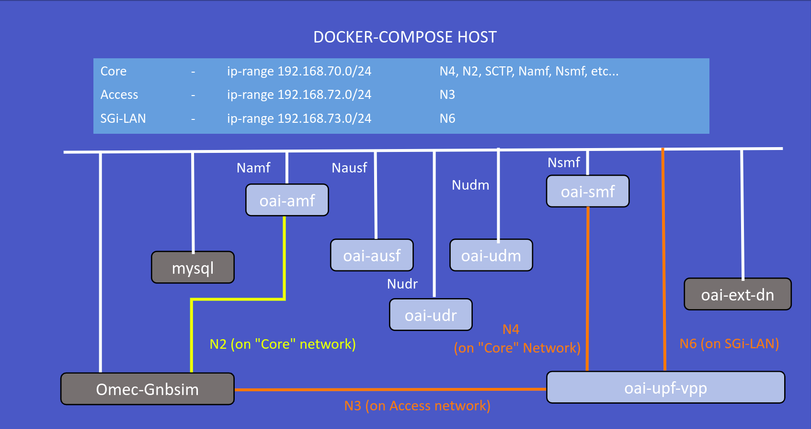

<table style="border-collapse: collapse; border: none;">
  <tr style="border-collapse: collapse; border: none;">
    <td style="border-collapse: collapse; border: none;">
      <a href="http://www.openairinterface.org/">
         
         </img>
      </a>
    </td>
    <td style="border-collapse: collapse; border: none; vertical-align: center;">
      <b><font size = "5">OpenAirInterface 5G Core Network Deployment and Testing with omec-gnbsim</font></b>
    </td>
  </tr>
</table>




**Reading time: ~ 30mins**

**Tutorial replication time: ~ 1h30mins**

Note: In case readers are interested in deploying debuggers/developers core network environment with more logs please follow [this tutorial](./DEBUG_5G_CORE.md)

**TABLE OF CONTENTS**

1.  Pre-requisites
2.  [Building Container Images](https://gitlab.eurecom.fr/oai/cn5g/oai-cn5g-fed/-/blob/omec-gnbsim-tutorial/docs/BUILD_IMAGES.md)/[Pull the container images](https://gitlab.eurecom.fr/oai/cn5g/oai-cn5g-fed/-/blob/omec-gnbsim-tutorial/docs/RETRIEVE_OFFICIAL_IMAGES.md)
3.  Configuring Host Machines
4.  Configuring OAI 5G Core Network Functions
5.  Deploying OAI 5G Core Network
6.  [Getting a `omec-gnbsim` docker image](#6-getting-a-omec-gnbsim-docker-image)
7.  [Executing `omec-gnbsim` Scenario](#7-executing-the-omec-gnbsim-scenario)
8.  [Analysing Scenario Results](#8-analysing-the-scenario-results)
9.  [Trying some advanced stuff](#9-trying-some-advanced-stuff)

* In this demo the image tags which were used are listed below, follow the [Building images](./BUILD_IMAGES.md) to build images with below tags. When pulling images of network functions from dockerhub pull images for `develop` tag

| CNF Name    | Branch Name    | Tag used at time of writing   | Ubuntu 18.04 | RHEL8         |
| ----------- |:-------------- | ----------------------------- | ------------ | --------------|
| AMF         | `master`      | `v1.5.0`                      | X            | X              |
| AUSF        | `master`      | `v1.5.0`                      | X            | X              |
| NRF         | `master`      | `v1.5.0`                      | X            | X              |
| SMF         | `master`      | `v1.5.0`                      | X            | X              |
| UDR         | `master`      | `v1.5.0`                      | X            | X              |
| UDM         | `master`      | `v1.5.0`                      | X            | X              |
| SPGWU       | `master`      | `v1.5.0`                      | X            | X              |
| UPF-VPP     | `master`      | `v1.5.0`                      | X            | X              |


<br/>

This tutorial is an extension of a previous tutorial: [testing a `basic` deployment](./DEPLOY_SA5G_BASIC_DEPLOYMENT.md).

Moreover, there are various other opensource gnb/ue simulator tools that are available for SA5G test. In this tutorial, we use an opensource simulator tool called `omec-gnbsim`. With the help of `omec-gnbsim` tool, we can perform basic SA5G test by simulating multiple gnb & ue.

##### About omec-gnbsim -

[omec-gnbsim](https://github.com/omec-project/gnbsim.git) is tool  under SD-Core project of Open Networking Foundation (ONF). It provides a tool to simulate gNodeB and UE by generating NAS and NGAP messages for the configured UEs and call flows. The tool currently supports simulation profiles for the following
procedures :

    1. Registration                              -> Validated with OAI-5GCN
    2. UE Initiated PDU Session Establishment    -> Validated with OAI-5GCN
    3. UE Initiated De-registration              -> Validated with OAI-5GCN
    4. AN Release                                -> Not validated with OAI-5GCN
    5. UE Initiated Service Request              -> Not validated with OAI-5GCN
    6. N/W triggered PDU Session Release         -> Not validated with OAI-5GCN
    7. UE Requested PDU Session Release          -> Not validated with OAI-5GCN
    8. N/W triggered UE Deregistration           -> Not validated with OAI-5GCN

Let's begin !!

* Steps 1 to 5 are similar as previous [tutorial on vpp-upf](https://gitlab.eurecom.fr/oai/cn5g/oai-cn5g-fed/-/blob/master/docs/DEPLOY_SA5G_WITH_VPP_UPF.md#5-deploying-oai-5g-core-network). Please follow these steps to deploy OAI 5G core network components.
* We deploy omec-gnbsim docker service on same host as of core network, so there is no need to create additional route as
we did for gnb-host.
* Before we proceed further for end-to-end SA5G test, make sure you have healthy docker services for OAI cn5g

## 1. Pre-requisites

Create a folder where you can store all the result files of the tutorial and later compare them with our provided result files, we recommend creating exactly the same folder to not break the flow of commands afterwards.

<!---
For CI purposes please ignore this line
``` shell
docker-compose-host $: rm -rf /tmp/oai/vpp-upf-omec-gnbsim
```
-->

#### NOTE: ####
OMEC GNBSIM does not includes optional IE requested NSSAI slice during pdu resource setup procedure hence we need to retrive default NSSAI information from UDM here.   -

##### IMPORTANT: Add following parameters in oai-amf service of docker-compose, before deploying core network. #####

```bash
            - EXTERNAL_UDM=yes
```

``` shell
docker-compose-host $: mkdir -p /tmp/oai/vpp-upf-omec-gnbsim
docker-compose-host $: chmod 777 /tmp/oai/vpp-upf-omec-gnbsim
```

## 5. Deploying OAI 5g Core Network
* We will use same wrapper script for docker-compose that used for previous tutorials to set up 5gcn with `UPF-VPP`. Use help option to check how to use this wrapper script.

``` shell
docker-compose-host $: python3 ./core-network.py --type start-basic-vpp --scenario 1 --capture /tmp/oai/vpp-upf-omec-gnbsim/vpp-upf-omec-gnbsim.pcap
[2022-02-08 16:18:19,328] root:DEBUG:  Starting 5gcn components... Please wait....
[2022-02-08 16:18:19,328] root:DEBUG: docker-compose -f docker-compose-basic-vpp-nrf.yaml up -d mysql
Creating network "oai-public-cp" with the default driver
Creating network "oai-public-access" with the default driver
Creating network "oai-public-core" with the default driver
Creating mysql   ... done
[2022-02-08 16:18:32,203] root:DEBUG: nohup sudo tshark -i demo-oai -i cn5g-core -f "(not host 192.168.73.135 and not arp and not port 53 and not port 2152) or (host 192.168.73.135 and icmp)" -w /tmp/oai/vpp-upf-gnbsim/vpp-upf-gnbsim.pcap > /dev/null 2>&1 &
[2022-02-08 16:18:52,217] root:DEBUG: docker-compose -f docker-compose-basic-vpp-nrf.yaml up -d
mysql is up-to-date
Creating oai-nrf ... done
Creating vpp-upf ... done
Creating oai-udr ... done
Creating oai-udm    ... done
Creating oai-ext-dn ... done
Creating oai-ausf   ... done
Creating oai-amf    ... done
Creating oai-smf    ... done

[2022-02-08 16:19:47,977] root:DEBUG:  OAI 5G Core network started, checking the health status of the containers... takes few secs....
[2022-02-08 16:19:47,977] root:DEBUG: docker-compose -f docker-compose-basic-vpp-nrf.yaml ps -a
[2022-02-08 16:20:11,681] root:DEBUG:  All components are healthy, please see below for more details....
Name                 Command                  State                  Ports
-----------------------------------------------------------------------------------------
mysql        docker-entrypoint.sh mysqld      Up (healthy)   3306/tcp, 33060/tcp
oai-amf      /bin/bash /openair-amf/bin ...   Up (healthy)   38412/sctp, 80/tcp, 9090/tcp
oai-ausf     /bin/bash /openair-ausf/bi ...   Up (healthy)   80/tcp
oai-ext-dn   /bin/bash -c  apt update;  ...   Up
oai-nrf      /bin/bash /openair-nrf/bin ...   Up (healthy)   80/tcp, 9090/tcp
oai-smf      /bin/bash /openair-smf/bin ...   Up (healthy)   80/tcp, 8805/udp, 9090/tcp
oai-udm      /bin/bash /openair-udm/bin ...   Up (healthy)   80/tcp
oai-udr      /bin/bash /openair-udr/bin ...   Up (healthy)   80/tcp
vpp-upf      /openair-upf/bin/entrypoin ...   Up (healthy)   2152/udp, 8085/udp
[2022-02-08 16:20:11,681] root:DEBUG:  Checking if the containers are configured....
[2022-02-08 16:20:11,681] root:DEBUG:  Checking if AMF, SMF and UPF registered with nrf core network....
[2022-02-08 16:20:11,681] root:DEBUG: curl -s -X GET http://192.168.70.130/nnrf-nfm/v1/nf-instances?nf-type="AMF" | grep -o "192.168.70.132"
192.168.70.132
[2022-02-08 16:20:11,694] root:DEBUG: curl -s -X GET http://192.168.70.130/nnrf-nfm/v1/nf-instances?nf-type="SMF" | grep -o "192.168.70.133"
192.168.70.133
[2022-02-08 16:20:11,706] root:DEBUG: curl -s -X GET http://192.168.70.130/nnrf-nfm/v1/nf-instances?nf-type="UPF" | grep -o "192.168.70.202"
192.168.70.202
[2022-02-08 16:20:11,717] root:DEBUG:  Checking if AUSF, UDM and UDR registered with nrf core network....
[2022-02-08 16:20:11,717] root:DEBUG: curl -s -X GET http://192.168.70.130/nnrf-nfm/v1/nf-instances?nf-type="AUSF" | grep -o "192.168.70.138"
192.168.70.138
[2022-02-08 16:20:11,728] root:DEBUG: curl -s -X GET http://192.168.70.130/nnrf-nfm/v1/nf-instances?nf-type="UDM" | grep -o "192.168.70.137"
192.168.70.137
[2022-02-08 16:20:11,739] root:DEBUG: curl -s -X GET http://192.168.70.130/nnrf-nfm/v1/nf-instances?nf-type="UDR" | grep -o "192.168.70.136"
192.168.70.136
[2022-02-08 16:20:11,750] root:DEBUG:  AUSF, UDM, UDR, AMF, SMF and UPF are registered to NRF....
[2022-02-08 16:20:11,750] root:DEBUG:  Checking if SMF is able to connect with UPF....
[2022-02-08 16:20:11,868] root:DEBUG:  UPF did answer to N4 Association request from SMF....
[2022-02-08 16:20:11,927] root:DEBUG:  SMF receiving heathbeats from UPF....
[2022-02-08 16:20:11,928] root:DEBUG:  OAI 5G Core network is configured and healthy....
```

More details in [section 5 of the `basic` vpp tutorial](https://gitlab.eurecom.fr/oai/cn5g/oai-cn5g-fed/-/blob/master/docs/DEPLOY_SA5G_WITH_VPP_UPF.md#5-deploying-oai-5g-core-network).

## 6. Building a `omec-gnbsim` docker image
* Pull pre-built docker image 
``` console
docker-compose-host $: docker pull rohankharade/5gc-gnbsim:0.0.1-dev
docker-compose-host $: docker tag rohankharade/5gc-gnbsim:0.0.1-dev 5gc-gnbsim:0.0.1-dev
```

OR 

* Build `omec-gnbsim` docker image
``` console
docker-compose-host $: git clone https://github.com/omec-project/gnbsim.git
docker-compose-host $: cd gnbsim/ && git checkout 1caccfcaac9b718d987aff378212614e4fe634fb
docker-compose-host $: go build
docker-compose-host $: make docker-build
```

## 7. Executing the `omec-gnbsim` Scenario

* Refer and update accordingly the Omec-gnbsim test profiles in [omec-gnbsim-config.yaml](../docker-compose/omec-gnbsim-config.yaml)
* The configuration parameters, are preconfigured in [docker-compose-basic-vpp-nrf.yaml](../docker-compose/docker-compose-basic-vpp-nrf.yaml) and [docker-compose-omec-gnbsim-vpp.yaml](../docker-compose/docker-compose-omec-gnbsim-vpp.yaml) and one can modify it for test.
* Launch omec-gnbsim docker service

<!---
For CI purposes please ignore this line
``` shell
docker-compose-host $: sleep 5
```
-->


``` shell
docker-compose-host $: docker-compose -f docker-compose-omec-gnbsim-vpp.yaml up -d
Creating omec-gnbsim-vpp ... done
```

Verify docker logs

``` bash
docker-compose-host $: docker logs omec-gnbsim-vpp -f
Creating omec-gnbsim-vpp ... done
```

After successful test, we should see selected test profiles are passed
```bash
:
2022-09-09T06:36:28Z [INFO][GNBSIM][Summary] Profile Name: profile1 , Profile Type: register
2022-09-09T06:36:28Z [INFO][GNBSIM][Summary] Ue's Passed: 5 , Ue's Failed: 0
:
:
2022-09-09T12:30:32Z [INFO][GNBSIM][Summary] Profile Name: profile2 , Profile Type: pdusessest
2022-09-09T12:30:32Z [INFO][GNBSIM][Summary] Ue's Passed: 5 , Ue's Failed: 0
:
:
2022-09-09T12:30:45Z [INFO][GNBSIM][Summary] Profile Name: profile5 , Profile Type: deregister
2022-09-09T12:30:45Z [INFO][GNBSIM][Summary] Ue's Passed: 2 , Ue's Failed: 0
:

```
## Stop the core network and gnbsim

``` shell
docker-compose-host $: docker-compose -f docker-compose-omec-gnbsim-vpp.yaml down
docker-compose-host $: python3 ./core-network.py --type stop-basic-vpp --scenario 1
```


## 8. Analysing the Scenario Results

| Pcap/log files                                                                             |
|:------------------------------------------------------------------------------------------ |
| [omec-gnbsim-logs.txt](./results/omec-gnbsim/omec-gnbsim-logs.txt) |
| [5gcn-deployment-omec-gnbsim.pcapng](./results/omec-gnbsim/pcap/5gcn-deployment-omec-gnbsim.pcapng) |


<!---
For CI purposes please ignore this line
``` shell
docker-compose-host $: sleep 15
```
-->

