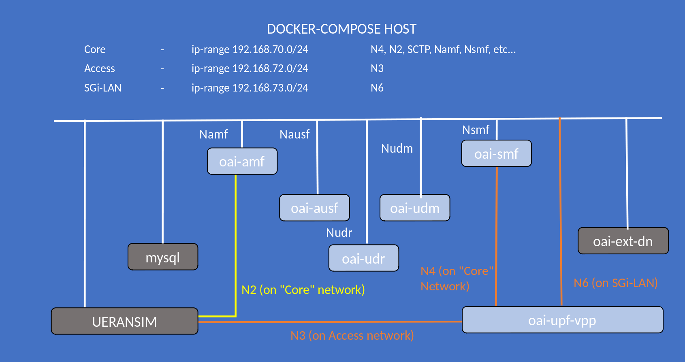

<table style="border-collapse: collapse; border: none;">
  <tr style="border-collapse: collapse; border: none;">
    <td style="border-collapse: collapse; border: none;">
      <a href="http://www.openairinterface.org/">
         
         </img>
      </a>
    </td>
    <td style="border-collapse: collapse; border: none; vertical-align: center;">
      <b><font size = "5">OpenAirInterface 5G Core Network Deployment and Testing with UERANSIM</font></b>
    </td>
  </tr>
</table>




**Reading time: ~ 30mins**

**Tutorial replication time: ~ 1h30mins**

Note: In case readers are interested in deploying debuggers/developers core network environment with more logs please follow [this tutorial](./DEBUG_5G_CORE.md)

**TABLE OF CONTENTS**

1.  Pre-requisites
2.  [Building Container Images](./BUILD_IMAGES.md) or [Retrieving Container Images](./RETRIEVE_OFFICIAL_IMAGES.md)
3.  Configuring Host Machines
4.  Configuring OAI 5G Core Network Functions
5.  Deploying OAI 5G Core Network
6.  [Getting a `ueransim` docker image](#6-getting-a-ueransim-docker-image)
7.  [Executing `ueransim` Scenario](#7-executing-the-ueransim-scenario)
8.  [Analysing Scenario Results](#8-analysing-the-scenario-results)
9.  [Trying some advanced stuff](#9-trying-some-advanced-stuff)

* In this demo the image tags and commits which were used are listed below, follow [Building images](./BUILD_IMAGES.md) to build images with the tags below.

| CNF Name    | Branch Name | Tag      | Ubuntu 18.04 | RHEL8 (UBI8)    |
| ----------- | ----------- | -------- | ------------ | ----------------|
| AMF         | `develop`   | `v1.5.0` | X            | X               |
| SMF         | `develop`   | `v1.5.0` | X            | X               |
| NRF         | `develop`   | `v1.5.0` | X            | X               |
| VPP-UPF     | `develop`   | `v1.5.0` | X            | X               |
| UDR         | `develop`   | `v1.5.0` | X            | X               |
| UDM         | `develop`   | `v1.5.0` | X            | X               |
| AUSF        | `develop`   | `v1.5.0` | X            | X               |

<br/>

This tutorial is an extension of a previous tutorial: [testing a `basic` deployment](./DEPLOY_SA5G_BASIC_DEPLOYMENT.md).

Moreover, there are various other opensource gnb/ue simulator tools that are available for SA5G test. In this tutorial, we use an opensource simulator tool called `UERANSIM`. With the help of `UERANSIM` tool, we can perform very basic SA5G test by simulating one gnb and multiple ues.

##### About UERANSIM - #####

[UERANSIM](https://github.com/aligungr/UERANSIM) is the open-source state-of-the-art 5G UE and RAN (gNodeB) implementation. It can be considered as a 5G mobile phone and a base station in basic terms. The project can be used for testing 5G Core Network and studying 5G System. UERANSIM can simulate multiple UEs and it also aims to simulate radio. Moreover for the detailed feature set, please refer its [official page.](https://github.com/aligungr/UERANSIM/wiki/Feature-Set)

Let's begin !!

* Steps 1 to 5 are similar to this previous [tutorial on vpp-upf](https://gitlab.eurecom.fr/oai/cn5g/oai-cn5g-fed/-/blob/master/docs/DEPLOY_SA5G_WITH_VPP_UPF.md#5-deploying-oai-5g-core-network). Please follow these steps to deploy OAI 5G core network components.
* We deploy ueransim docker service on the same host as for core network, so there is no need to create additional route as
we did for gnb-host.
* Before we proceed further for end-to-end SA5G test, make sure you have healthy docker services for OAI cn5g

#### NOTE: ####
UERANSIM currently does not support integraty and ciphering algorithm NIA0, NEA0 repectively. Hence we have to update AMF config in the docker-compose as below -

##### IMPORTANT: Add following parameters in oai-amf service of docker-compose, before deploying core network. #####

```bash
            - INT_ALGO_LIST=["NIA1" , "NIA2"]
            - CIPH_ALGO_LIST=["NEA1" , "NEA2"]
```

Then we follow deployment procedure as usual.
```bash
oai-cn5g-fed/docker-compose$ docker-compose -f docker-compose-basic-vpp-nrf.yaml up -d
Creating mysql   ... done
Creating oai-nrf ... done
Creating vpp-upf ... done
Creating oai-udr ... done
Creating oai-udm    ... done
Creating oai-ext-dn ... done
Creating oai-ausf   ... done
Creating oai-amf    ... done
Creating oai-smf    ... done
```

More details in [section 5 of the `basic` vpp tutorial](https://gitlab.eurecom.fr/oai/cn5g/oai-cn5g-fed/-/blob/master/docs/DEPLOY_SA5G_WITH_VPP_UPF.md#5-deploying-oai-5g-core-network).
After deploying core network, make sure all services are healthy.

```bash
oai-cn5g-fed/docker-compose$ docker ps -a
CONTAINER ID   IMAGE                COMMAND                  CREATED          STATUS                    PORTS                          NAMES
4349e8808902   oai-smf:latest       "/bin/bash /openair-…"   49 seconds ago   Up 48 seconds (healthy)   80/tcp, 9090/tcp, 8805/udp     oai-smf
62e774768482   oai-amf:latest       "/bin/bash /openair-…"   49 seconds ago   Up 48 seconds (healthy)   80/tcp, 9090/tcp, 38412/sctp   oai-amf
0302e6a3d2b3   oai-ausf:latest      "/bin/bash /openair-…"   50 seconds ago   Up 49 seconds (healthy)   80/tcp                         oai-ausf
fb3249a5ade7   ubuntu:bionic        "/bin/bash -c ' apt …"   51 seconds ago   Up 49 seconds                                            oai-ext-dn
4f114039c218   oai-udm:latest       "/bin/bash /openair-…"   51 seconds ago   Up 49 seconds (healthy)   80/tcp                         oai-udm
c0838aff8796   oai-udr:latest       "/bin/bash /openair-…"   51 seconds ago   Up 50 seconds (healthy)   80/tcp                         oai-udr
99ab1b23862c   oai-upf-vpp:latest   "/openair-upf/bin/en…"   51 seconds ago   Up 50 seconds (healthy)   2152/udp, 8085/udp             vpp-upf
3469f853e26d   mysql:8.0            "docker-entrypoint.s…"   52 seconds ago   Up 51 seconds (healthy)   3306/tcp, 33060/tcp            mysql
ab06bd3104ef   oai-nrf:latest       "/bin/bash /openair-…"   52 seconds ago   Up 51 seconds (healthy)   80/tcp, 9090/tcp               oai-nrf
```

## 6. Getting a `UERANSIM` docker image ##

You have the choice:

* Build `UERANSIM` docker image

```bash
$ git clone -b docker_support https://github.com/orion-belt/UERANSIM.git
$ cd UERANSIM
$  docker build --target ueransim --tag ueransim:latest -f docker/Dockerfile.ubuntu.18.04 .
```

OR

* You can pull a prebuilt docker image for `UERANSIM`

```bash
docker pull rohankharade/ueransim
docker image tag rohankharade/ueransim:latest ueransim:latest
```

## 7. Executing the `UERANSIM` Scenario ##

* The configuration parameters are preconfigured in [docker-compose-basic-vpp-nrf.yaml](../docker-compose/docker-compose-basic-vpp-nrf.yaml) and [docker-compose.yaml OF UERANSIM](../docker-compose/docker-compose-ueransim-vpp.yaml) and one can modify it for testing purposes.
* Launch ueransim docker service
```bash
oai-cn5g-fed/docker-compose$ docker-compose -f docker-compose-ueransim-vpp.yaml up -d
Creating ueransim ... done
```
* After launching UERANSIM, make sure all services status are healthy -
```bash
oai-cn5g-fed/docker-compose$ docker ps -a
CONTAINER ID   IMAGE                COMMAND                  CREATED              STATUS                        PORTS                          NAMES
cb206b9b0a25   ueransim:latest      "/ueransim/bin/entry…"   14 seconds ago       Up 13 seconds (healthy)                                      ueransim
4349e8808902   oai-smf:latest       "/bin/bash /openair-…"   About a minute ago   Up About a minute (healthy)   80/tcp, 9090/tcp, 8805/udp     oai-smf
62e774768482   oai-amf:develop      "/bin/bash /openair-…"   About a minute ago   Up About a minute (healthy)   80/tcp, 9090/tcp, 38412/sctp   oai-amf
0302e6a3d2b3   oai-ausf:latest      "/bin/bash /openair-…"   About a minute ago   Up About a minute (healthy)   80/tcp                         oai-ausf
fb3249a5ade7   ubuntu:bionic        "/bin/bash -c ' apt …"   About a minute ago   Up About a minute                                            oai-ext-dn
4f114039c218   oai-udm:latest       "/bin/bash /openair-…"   About a minute ago   Up About a minute (healthy)   80/tcp                         oai-udm
c0838aff8796   oai-udr:latest       "/bin/bash /openair-…"   About a minute ago   Up About a minute (healthy)   80/tcp                         oai-udr
99ab1b23862c   oai-upf-vpp:latest   "/openair-upf/bin/en…"   About a minute ago   Up About a minute (healthy)   2152/udp, 8085/udp             vpp-upf
3469f853e26d   mysql:8.0            "docker-entrypoint.s…"   About a minute ago   Up About a minute (healthy)   3306/tcp, 33060/tcp            mysql
ab06bd3104ef   oai-nrf:latest       "/bin/bash /openair-…"   About a minute ago   Up About a minute (healthy)   80/tcp, 9090/tcp               oai-nrf
```
We can verify it using UERANSIM container logs as below -
```bash
$ docker logs ueransim
Now setting these variables '@GTP_IP@ @IGNORE_STREAM_IDS@ @LINK_IP@ @MCC@ @MNC@ @NCI@ @NGAP_IP@ @NGAP_PEER_IP@ @SD@ @SST@ @TAC@'
Now setting these variables '@AMF_VALUE@ @APN@ @GNB_IP_ADDRESS@ @IMEI@ @IMEI_SV@ @IMSI@ @KEY@ @MCC@ @MNC@ @OP@ @OP_TYPE@ @PDU_TYPE@ @SD@ @SD_C@ @SD_D@ @SST@ @SST_C@ @SST_D@'
Done setting the configuration
### Running ueransim ###
Running gnb
UERANSIM v3.2.4
[2021-12-01 07:46:01.772] [sctp] [info] Trying to establish SCTP connection... (192.168.70.132:38412)
[2021-12-01 07:46:01.776] [sctp] [info] SCTP connection established (192.168.70.132:38412)
[2021-12-01 07:46:01.776] [sctp] [debug] SCTP association setup ascId[105]
[2021-12-01 07:46:01.776] [ngap] [debug] Sending NG Setup Request
[2021-12-01 07:46:01.780] [ngap] [debug] NG Setup Response received
[2021-12-01 07:46:01.780] [ngap] [info] NG Setup procedure is successful
Running ue
UERANSIM v3.2.4
[2021-12-01 07:46:02.759] [nas] [info] UE switches to state [MM-DEREGISTERED/PLMN-SEARCH]
[2021-12-01 07:46:02.759] [rrc] [debug] UE[1] new signal detected
[2021-12-01 07:46:02.759] [rrc] [debug] New signal detected for cell[1], total [1] cells in coverage
[2021-12-01 07:46:02.759] [nas] [info] Selected plmn[208/95]
[2021-12-01 07:46:02.759] [rrc] [info] Selected cell plmn[208/95] tac[40960] category[SUITABLE]
[2021-12-01 07:46:02.759] [nas] [info] UE switches to state [MM-DEREGISTERED/PS]
[2021-12-01 07:46:02.759] [nas] [info] UE switches to state [MM-DEREGISTERED/NORMAL-SERVICE]
[2021-12-01 07:46:02.759] [nas] [debug] Initial registration required due to [MM-DEREG-NORMAL-SERVICE]
[2021-12-01 07:46:02.759] [nas] [debug] UAC access attempt is allowed for identity[0], category[MO_sig]
[2021-12-01 07:46:02.759] [nas] [debug] Sending Initial Registration
[2021-12-01 07:46:02.760] [nas] [info] UE switches to state [MM-REGISTER-INITIATED]
[2021-12-01 07:46:02.760] [rrc] [debug] Sending RRC Setup Request
[2021-12-01 07:46:02.760] [rrc] [info] RRC Setup for UE[1]
[2021-12-01 07:46:02.760] [rrc] [info] RRC connection established
[2021-12-01 07:46:02.760] [rrc] [info] UE switches to state [RRC-CONNECTED]
[2021-12-01 07:46:02.760] [nas] [info] UE switches to state [CM-CONNECTED]
[2021-12-01 07:46:02.760] [ngap] [debug] Initial NAS message received from UE[1]
[2021-12-01 07:46:02.787] [nas] [debug] Authentication Request received
[2021-12-01 07:46:02.799] [nas] [debug] Security Mode Command received
[2021-12-01 07:46:02.799] [nas] [debug] Selected integrity[1] ciphering[1]
[2021-12-01 07:46:02.804] [ngap] [debug] Initial Context Setup Request received
[2021-12-01 07:46:02.805] [nas] [debug] Registration accept received
[2021-12-01 07:46:02.805] [nas] [info] UE switches to state [MM-REGISTERED/NORMAL-SERVICE]
[2021-12-01 07:46:02.805] [nas] [debug] Sending Registration Complete
[2021-12-01 07:46:02.805] [nas] [info] Initial Registration is successful
[2021-12-01 07:46:02.805] [nas] [debug] Sending PDU Session Establishment Request
[2021-12-01 07:46:02.805] [nas] [debug] UAC access attempt is allowed for identity[0], category[MO_sig]
[2021-12-01 07:46:03.036] [ngap] [info] PDU session resource(s) setup for UE[1] count[1]
[2021-12-01 07:46:03.037] [nas] [debug] PDU Session Establishment Accept received
[2021-12-01 07:46:03.037] [nas] [info] PDU Session establishment is successful PSI[1]
[2021-12-01 07:46:03.055] [app] [info] Connection setup for PDU session[1] is successful, TUN interface[uesimtun0, 12.2.1.2] is up.
```
Now we are ready to perform some traffic test.
* Ping test <br/>
Here we ping UE from external DN container.
```bash
$ docker exec -it oai-ext-dn ping -c 3 12.2.1.2
PING 12.2.1.2 (12.2.1.2) 56(84) bytes of data.
64 bytes from 12.2.1.2: icmp_seq=1 ttl=64 time=0.235 ms
64 bytes from 12.2.1.2: icmp_seq=2 ttl=64 time=0.145 ms
64 bytes from 12.2.1.2: icmp_seq=3 ttl=64 time=0.448 ms

--- 12.1.1.2 ping statistics ---
3 packets transmitted, 3 received, 0% packet loss, time 2036ms
rtt min/avg/max/mdev = 0.145/0.276/0.448/0.127 ms
```
Here we ping external DN from UE (UERANSIM) container.
```bash
oai-cn5g-fed/docker-compose$ docker exec ueransim ping -c 3 -I uesimtun0 google.com
PING google.com (172.217.18.238) from 12.2.1.2 : 56(84) bytes of data.
64 bytes from par10s10-in-f238.1e100.net (172.217.18.238): icmp_seq=1 ttl=115 time=5.12 ms
64 bytes from par10s10-in-f238.1e100.net (172.217.18.238): icmp_seq=2 ttl=115 time=7.52 ms
64 bytes from par10s10-in-f238.1e100.net (172.217.18.238): icmp_seq=3 ttl=115 time=7.19 ms

--- google.com ping statistics ---
3 packets transmitted, 3 received, 0% packet loss, time 4ms
rtt min/avg/max/mdev = 5.119/6.606/7.515/1.064 ms
```

* Iperf test <br/>
Here we do iperf traffic test between UERANSIM UE and external DN node. We can make any node as iperf server/client.<br/>
Running iperf server on external DN container
```bash
$ docker exec -it oai-ext-dn iperf3 -s
-----------------------------------------------------------
Server listening on 5201
-----------------------------------------------------------
Accepted connection from 12.2.1.2, port 49925
[  5] local 192.168.73.135 port 5201 connected to 12.2.1.2 port 58455
[ ID] Interval           Transfer     Bandwidth
[  5]   0.00-1.00   sec  4.13 MBytes  34.6 Mbits/sec
[  5]   1.00-2.00   sec  2.33 MBytes  19.5 Mbits/sec
[  5]   2.00-3.00   sec  2.68 MBytes  22.5 Mbits/sec
[  5]   3.00-4.00   sec  2.10 MBytes  17.6 Mbits/sec
[  5]   4.00-5.00   sec  2.26 MBytes  19.0 Mbits/sec
[  5]   5.00-6.00   sec  2.14 MBytes  17.9 Mbits/sec
[  5]   6.00-7.00   sec  2.71 MBytes  22.8 Mbits/sec
[  5]   7.00-8.00   sec  2.19 MBytes  18.4 Mbits/sec
[  5]   8.00-9.00   sec  2.12 MBytes  17.8 Mbits/sec
[  5]   9.00-10.00  sec  2.53 MBytes  21.2 Mbits/sec
[  5]  10.00-10.00  sec  0.00 Bytes  0.00 bits/sec
- - - - - - - - - - - - - - - - - - - - - - - - -
[ ID] Interval           Transfer     Bandwidth
[  5]   0.00-10.00  sec  0.00 Bytes  0.00 bits/sec                  sender
[  5]   0.00-10.00  sec  25.2 MBytes  21.1 Mbits/sec                  receiver
-----------------------------------------------------------
Server listening on 5201
-----------------------------------------------------------
```
Running iperf client on ueransim
```bash
$ docker exec -it ueransim iperf3 -c 192.168.73.135 -B 12.2.1.2
Connecting to host 192.168.73.135, port 5201
[  4] local 12.2.1.2 port 58455 connected to 192.168.73.135 port 5201
[ ID] Interval           Transfer     Bandwidth       Retr  Cwnd
[  4]   0.00-1.00   sec  5.07 MBytes  42.5 Mbits/sec  318   34.2 KBytes
[  4]   1.00-2.00   sec  2.34 MBytes  19.7 Mbits/sec  268   22.4 KBytes
[  4]   2.00-3.00   sec  2.72 MBytes  22.8 Mbits/sec  276   34.2 KBytes
[  4]   3.00-4.00   sec  2.10 MBytes  17.6 Mbits/sec  234   38.2 KBytes
[  4]   4.00-5.00   sec  2.22 MBytes  18.6 Mbits/sec  303   13.2 KBytes
[  4]   5.00-6.00   sec  2.16 MBytes  18.1 Mbits/sec  240   38.2 KBytes
[  4]   6.00-7.00   sec  2.72 MBytes  22.8 Mbits/sec  307   60.6 KBytes
[  4]   7.00-8.00   sec  2.16 MBytes  18.1 Mbits/sec  325   35.5 KBytes
[  4]   8.00-9.00   sec  2.16 MBytes  18.1 Mbits/sec  223   56.6 KBytes
[  4]   9.00-10.00  sec  2.47 MBytes  20.7 Mbits/sec  349   26.3 KBytes
- - - - - - - - - - - - - - - - - - - - - - - - -
[ ID] Interval           Transfer     Bandwidth       Retr
[  4]   0.00-10.00  sec  26.1 MBytes  21.9 Mbits/sec  2843             sender
[  4]   0.00-10.00  sec  25.2 MBytes  21.1 Mbits/sec                  receiver

iperf Done.
```
* Note:- The iperf test is just for illustration purposes and results of the test may vary based on resources available for the docker services

## 8. Analysing the Scenario Results ##

| Pcap/log files                                                                             |
|:------------------------------------------------------------------------------------------ |
| [5gcn-deployment-ueransim.pcap](./results/UERANSIM/pcap/5gcn-deployment-ueransim.pcap)                  |


## 9. Trying Some Advanced Stuff ##

Here we try some scaling test with ueransim. There are additional IMSIs added into database (208950000000031-208950000000131).
Now we register 100 UEs using ueransim.
#### Note: We have to update `NUMBER_OF_UE` parameter in docker-compose of ueransim. ####
```bash
NUMBER_OF_UE=100
```
* Launch ueransim docker service
```bash
oai-cn5g-fed/docker-compose$ docker-compose -f docker-compose-ueransim-vpp.yaml up -d
Creating ueransim ... done
```
Wait a bit <br/>
Now we can verify that all UEs are successfully registered from AMF or SMF logs.
```bash
[2021-12-23T22:14:40.065414] [AMF] [amf_app] [info ]
[2021-12-23T22:14:40.065442] [AMF] [amf_app] [info ] |----------------------------------------------------------------------------------------------------------------|
[2021-12-23T22:14:40.065447] [AMF] [amf_app] [info ] |----------------------------------------------------gNBs' information-------------------------------------------|
[2021-12-23T22:14:40.065450] [AMF] [amf_app] [info ] |    Index    |      Status      |       Global ID       |       gNB Name       |               PLMN             |
[2021-12-23T22:14:40.065457] [AMF] [amf_app] [info ] |      1      |    Connected     |         0x1       |         UERANSIM-gnb-208-95-1        |            208, 95             |
[2021-12-23T22:14:40.065460] [AMF] [amf_app] [info ] |----------------------------------------------------------------------------------------------------------------|
[2021-12-23T22:14:40.065463] [AMF] [amf_app] [info ]
[2021-12-23T22:14:40.065465] [AMF] [amf_app] [info ] |----------------------------------------------------------------------------------------------------------------|
[2021-12-23T22:14:40.065468] [AMF] [amf_app] [info ] |----------------------------------------------------UEs' information--------------------------------------------|
[2021-12-23T22:14:40.065471] [AMF] [amf_app] [info ] | Index |      5GMM state      |      IMSI        |     GUTI      | RAN UE NGAP ID | AMF UE ID |  PLMN   |Cell ID|
[2021-12-23T22:14:40.065477] [AMF] [amf_app] [info ] |      1|       5GMM-REGISTERED|   208950000000031|               |              50|         50| 208, 95 |    256|
[2021-12-23T22:14:40.065481] [AMF] [amf_app] [info ] |      2|       5GMM-REGISTERED|   208950000000032|               |              61|         61| 208, 95 |    256|
[2021-12-23T22:14:40.065486] [AMF] [amf_app] [info ] |      3|       5GMM-REGISTERED|   208950000000033|               |              82|         82| 208, 95 |    256|
[2021-12-23T22:14:40.065490] [AMF] [amf_app] [info ] |      4|       5GMM-REGISTERED|   208950000000034|               |              32|         32| 208, 95 |    256|
[2021-12-23T22:14:40.065494] [AMF] [amf_app] [info ] |      5|       5GMM-REGISTERED|   208950000000035|               |              23|         23| 208, 95 |    256|
[2021-12-23T22:14:40.065499] [AMF] [amf_app] [info ] |      6|       5GMM-REGISTERED|   208950000000036|               |              87|         87| 208, 95 |    256|
[2021-12-23T22:14:40.065504] [AMF] [amf_app] [info ] |      7|       5GMM-REGISTERED|   208950000000037|               |              30|         30| 208, 95 |    256|
          [[ Truncated Output :) ]]
[2021-12-23T22:14:40.066113] [AMF] [amf_app] [info ] |     91|       5GMM-REGISTERED|   208950000000121|               |               4|          4| 208, 95 |    256|
[2021-12-23T22:14:40.066120] [AMF] [amf_app] [info ] |     92|       5GMM-REGISTERED|   208950000000122|               |               2|          2| 208, 95 |    256|
[2021-12-23T22:14:40.066127] [AMF] [amf_app] [info ] |     93|       5GMM-REGISTERED|   208950000000123|               |               7|          7| 208, 95 |    256|
[2021-12-23T22:14:40.066145] [AMF] [amf_app] [info ] |     94|       5GMM-REGISTERED|   208950000000124|               |              20|         20| 208, 95 |    256|
[2021-12-23T22:14:40.066152] [AMF] [amf_app] [info ] |     95|       5GMM-REGISTERED|   208950000000125|               |               1|          1| 208, 95 |    256|
[2021-12-23T22:14:40.066161] [AMF] [amf_app] [info ] |     96|       5GMM-REGISTERED|   208950000000126|               |              35|         35| 208, 95 |    256|
[2021-12-23T22:14:40.066168] [AMF] [amf_app] [info ] |     97|       5GMM-REGISTERED|   208950000000127|               |              44|         44| 208, 95 |    256|
[2021-12-23T22:14:40.066175] [AMF] [amf_app] [info ] |     98|       5GMM-REGISTERED|   208950000000128|               |              57|         57| 208, 95 |    256|
[2021-12-23T22:14:40.066182] [AMF] [amf_app] [info ] |     99|       5GMM-REGISTERED|   208950000000129|               |              85|         85| 208, 95 |    256|
[2021-12-23T22:14:40.066189] [AMF] [amf_app] [info ] |    100|       5GMM-REGISTERED|   208950000000130|               |              93|         93| 208, 95 |    256|
[2021-12-23T22:14:40.066194] [AMF] [amf_app] [info ] |----------------------------------------------------------------------------------------------------------------|
[2021-12-23T22:14:40.066199] [AMF] [amf_app] [info ]
[2021-12-23T22:15:00.065577] [AMF] [amf_app] [info ]

```

* Ping to two random UEs
```bash
$ docker exec oai-ext-dn ping -c 2 12.2.1.101
PING 12.2.1.101 (12.2.1.101) 56(84) bytes of data.
64 bytes from 12.2.1.101: icmp_seq=1 ttl=63 time=0.896 ms
64 bytes from 12.2.1.101: icmp_seq=2 ttl=63 time=1.53 ms

--- 12.2.1.101 ping statistics ---
2 packets transmitted, 2 received, 0% packet loss, time 1000ms
rtt min/avg/max/mdev = 0.896/1.216/1.537/0.322 ms

$ docker exec oai-ext-dn ping -c 2 12.2.1.88
PING 12.2.1.88 (12.2.1.88) 56(84) bytes of data.
64 bytes from 12.2.1.88: icmp_seq=1 ttl=63 time=0.977 ms
64 bytes from 12.2.1.88: icmp_seq=2 ttl=63 time=0.687 ms

--- 12.2.1.88 ping statistics ---
2 packets transmitted, 2 received, 0% packet loss, time 1001ms
rtt min/avg/max/mdev = 0.687/0.832/0.977/0.145 ms
```
* DIY: You can further investigate usage and help information for sub-commands with the help of UE console.([Refer to the official page](https://github.com/aligungr/UERANSIM/wiki/Usage))
```bash
$ docker exec -it ueransim ./nr-cli imsi-208950000000130
--------------------------------------------------------------------------------------------
$ commands
info           | Show some information about the UE
status         | Show some status information about the UE
timers         | Dump current status of the timers in the UE
rls-state      | Show status information about RLS
coverage       | Dump available cells and PLMNs in the coverage
ps-establish   | Trigger a PDU session establishment procedure
ps-list        | List all PDU sessions
ps-release     | Trigger a PDU session release procedure
ps-release-all | Trigger PDU session release procedures for all active sessions
deregister     | Perform a de-registration by the UE
--------------------------------------------------------------------------------------------
```
## 10. Undeploy ##

Last thing is to remove all services - <br/>

* Undeploy the UERANSIM
```bash
oai-cn5g-fed/docker-compose$ docker-compose -f docker-compose-ueransim-vpp.yaml down
Stopping ueransim ... done
Removing ueransim ... done
Network demo-oai-public-net is external, skipping
Network oai-public-access is external, skipping
```

* Undeploy the core network
```bash
oai-cn5g-fed/docker-compose$  python3 ./core-network.py --type stop-basic-vpp --fqdn no --scenario 1
...
[2021-09-14 16:47:44,070] root:DEBUG:  OAI 5G core components are UnDeployed....
```
