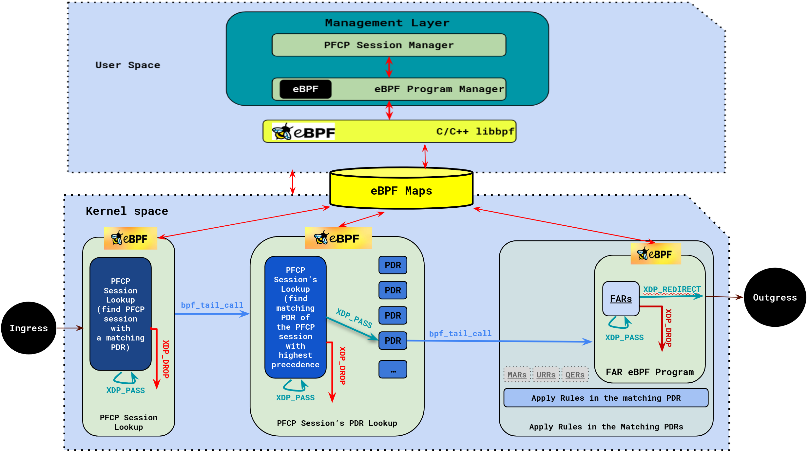
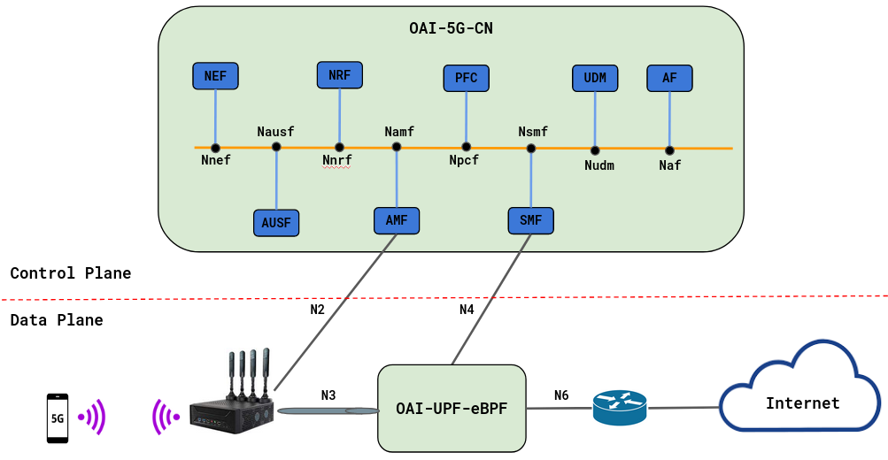
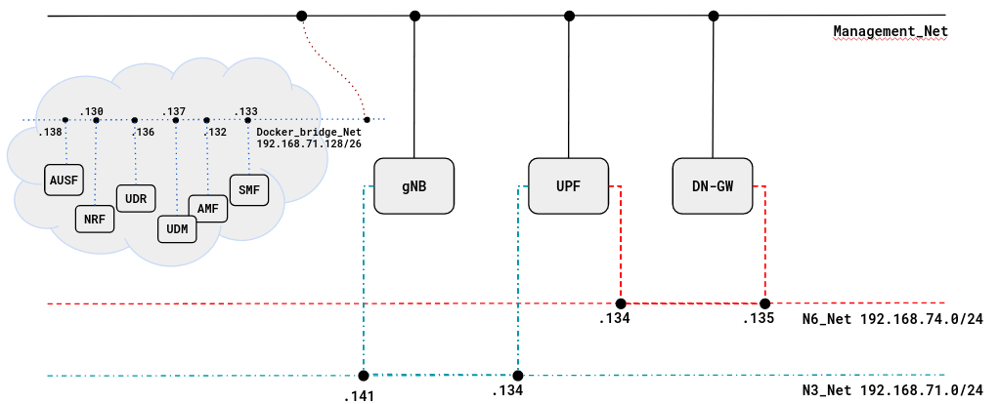

<table style="border-collapse: collapse; border: none;">
  <tr style="border-collapse: collapse; border: none;">
    <td style="border-collapse: collapse; border: none;">
      <a href="http://www.openairinterface.org/">
         
         </img>
      </a>
    </td>
    <td style="border-collapse: collapse; border: none; vertical-align: center;">
      <b><font size = "5">OpenAirInterface 5G Core Network Deployment with eBPF-UPF using docker-compose</font></b>
    </td>
  </tr>
</table>


**Reading time: ~ 50mins**

**Tutorial replication time: ~ 1h30mins**

Note: In case readers are interested in deploying debuggers/developers core network environment with more logs, please follow [this tutorial](./DEBUG_5G_CORE.md)

**TABLE OF CONTENTS**

[[_TOC_]]

-----------------------------------------------------------------------------------------
__Note:__ If you are familiar with eBPF and XDP you can skip Section 1

## 1. Understanding the (e)BPF-XDP

### i. (extended) Berkeley Packet Filtering ((e)BPF)
The eBPF is a virtual machine having its origins in the Linux kernel. It runs sandboxed programs in a privileged mode (e.g. OS kernel) to *__safely__* and *__efficiently__* extend the capabilities of the kernel with custom code that can be injected at run-time without requiring to changes in the kernel source code or load kernel modules. The eBPF is an *event-driven* program that is triggered when the kernel or application passes a certain *hook point*. eBPF has some predefined hook points that include system calls, every kernel function, kernel trace points, and network events, to name few. If a predefined hook does not exists for a particular need, it is possible to create one at kernel probe or user probe, almost anywhere.

An eBPF program follows several steps before being executed. Series of components are used at these steps to compile, verify, and execute the eBPF program.
  - It starts by a __compilation step__, where eBPF programs leverage a special bytecode stored by *libelf* in an Executable and Linkable Forma (ELF) object file that is generated by the *Clang/LLVM* toolchain starting from a source code written in a (restricted) C language.
  - This is followed by a __loading step__, where *libbpf* loads the ELF file (i.e., bytecode) to the identified hook point, via system calls.
  - Upon injection, the bytecode goes through __verification step__ to be analyzed and verified, whose aim is to guarantee that the code cannot harm the kernel, for example checking that only allowed memory accesses are performed and that the program will eventually terminate (i.e., no infinite loops). As a consequence, eBPF programs must use some limitations, such as a maximum number of instructions and the non support for infinite loops. Moreover, the only way to access memory is to use *maps*, which are set of key-value stores with different access semantics (e.g., array, hash, and queue), that can be shared between eBPF programs and user space.
  - After the program is verified, it goes through the final step before execution; __Just-In-Time (JIT) Compilation__. Here the generic bytecode is translated into machine specific instruction set to optimize the execution speed of the program. This makes the eBPF programs run efficiently as native compiled kernel code.


### ii. eXpress Data Path (XDP)
XDP is a *high-performance packet processing* framework, enabling Datapath (DP) network packets processing in the Linux kernel at the earliest stage of the networking stack. It is located in the reception chain of the *network device driver* before the Socket Buffer Allocation (SKB), referred as hook point. XDP allows the execution of custom eBPF programs written in C and compiled into *eBPF bytecode*. These eBPF programs are ran as soon as possible, usually *immediately* on packet reception at the network interface. This early interception makes XDP highly efficient and suitable for use cases that require low-latency and high-performance packet handling.

XDP provides three models to *link and attach* eBPF programs to a network interface:
 - (i) *Generic XDP* - It is loaded into the kernel as part of the ordinary network path. It is an easy way, mostly, used to test XDP programs on any (generic) hardware. However, this model does not provide full performance benefits.
 - (ii) *Native XDP* - Loaded by the network card driver as part of its initial receive path. While it requires the support from the network card driver, this solution offers better performances.
 - (iii) *Offloaded XDP* - Loaded directly on the network interface card, and it is executed without using the CPU. It requires support from the network interface device.

 We may mention that *not* all the network device drivers implement XDP hooks, in such case, we use generic XDP hook. In Linux 4.18 and later, XDP hooks are supported by the following network device drivers: Veth, Virtio_net, Tap, Tun, Qede, Thunder, Bnxt, Lxgbe, Nfp, I40e, Mlx5, and MLX4.


In what follows, we describe the main steps in the XDP call flow.
  - (1) __Packet Arrival__: At a packet reception by the NIC, the network driver is notified, which passes the packet to the XDP program attached to the interface.
  - (2) __XDP Program Execution__: The XDP program is executed by the eBPF virtual machine. The program can perform various operations on the packet, such as packet filtering, forwarding, or modification. Based on the logic defined in the XDP program, the program returns a verdict to the XDP hook.
  - (3) __Verdict Decision__: The XDP program returns one of several verdict options, in the form of a program return code, to indicate the desired action for the packet (ie.,  (drop it, pass it or forward it). This return code is a positive integer between 0 and 4 mapping predefined actions as shown in Table.
  - (4) __Post-XDP Processing__: The driver applies the verdict returned by the XDP program to the packet. If the packet is to be dropped (code 0 or 1), it is immediately discarded. If the packet is to be forwarded or passed to the network stack (code 2, 3 or 4), the driver sets the appropriate fields in the packet's header and passes it along.
  - (5) __Further Processing__: If the packet continues to the Linux networking stack, it undergoes additional processing, such as protocol parsing, routing, and higher-level networking operations.

XDP is widely used in high-performance networking applications, such as NFV, SDN, and DDoS mitigation. It has become a popular tool for accelerating and offloading packet processing from user-space applications to the kernel-space.


| Value       | Action          | Description                                   |
| ----------- |---------------- | --------------------------------------------- |
| 0           | `XDP_ABORTED`   | `eBPF program error, drop the packet`         |
| 1           | `XDP_DROP`      | `Drop the packet`                             |
| 2           | `XDP_PASS`      | `Allow farther processing by network stack`   |
| 3           | `XDP_REDIRECT`  | `Forward the packet to a different interface` |


---------------------------------------------------------------------------------------------------------------------
## 2. UPF Architecture

OAI-UPF-eBPF as a part of the OAI 5G mobile Core Network implements a data network gateway function. It communicates with the SMF via the Packet Forwarding Control Plane (PFCP) protocol (N4 interface) and forwards packets between Access and Data Networks using N3 and N6 interfaces respectively. These two main UPF parts are implemented in two separate components: the Management layer and the Datapath layer.

<figure>
  

  <figcaption><b><font size = "5">Figure 1: UPF Architecture: eBPF XDP based</font></b></figcaption>

### i. Management layer
The Management layer is a user space library, which is responsible about PFCP sessions management. It receives packet processing rules from SMF via the reference point N4, and configures the Datapath for proper forwarding. It implements functions such as:
  - `handle_pfcp_session_establishment_request()`,
  - `handle_pfcp_session_modification_request()`,
  - `handle_pfcp_session_deletion_request()`,

to respectively create, update and delete a PFCP session. In addition to that, this layer is managing the eBPF programs lifecycle via CRUD functions; that is to say, it creates eBFP sessions (by distinguishing the uplink and downlink directions), update them , or delete them. It also compares PDRs with their precedence, extracts FARs, and creates and manages eBPF Maps, to name few of its role.

When a PFCP session request is received via the N4 interface, the request is parsed by `PFCP Session Manager`, which calls the `eBPF Program Manager` to dynamically load (update, or delete, respectively) an eBPF bytecode representing the new PFCP session context in case of establishment request (modification request, or deletion request, respectively).
There is at least one eBPF program running in kernel space for each PFCP session. These programs contain the eBPF maps used to store
the PDRs and FARs. All the communication between the user space and the kernel space is through the libbpf library, which is maintained by the Linux kernel source tree. The PFCP Session Manager parses the structures received to eBPF map
entries and updates the maps accordingly. The PFCP session context is created in Datapath Layer, where the user traffic will be handled.

### ii. Datapath layer
In previous tutorials, we were using the `oai-spgwu-tiny` implementation as UPF. That implementation has a limited throughput capacity and is a pure software solution without any acceleration. In this tutorial, we unveil a new UPF version that embed two deployment modes; the `simple switch` mode and `eBPF-XDP`mode.


  - `Simple Switch` Mode: is reusing the code from the `oai-spgwu-tiny` to do simple UPF features. The purpose of using this mode is first to show the functioning of the entire OAI 5G setup (RAN & CN), but also enable some functionalities that are not yet implemented within the eBPF-XDP deplyment mode. Please notice that this mode is hidden in Figure 1 for the sake of understanding and providing too much details. By default this mode (i.e., `Simple Switch`) is the one running.

  - `eBPF-XDP` Mode: The main goal of using this mode is to seek for throughput and high UPF performance. This first release of UPF (v2.0.0) is offering yet basic features including (PDRs and FARs). In the upcoming versions we will implement additional features (such as QERs, MARs, and URRs). This mode is shown in Figure 1, and to be activated you have to use the line `enable_bpf_datapath: yes` in the config file `conf/basic_nrf_config_ebpf.yaml`. To disable the `eBPF-XDP` mode, you have to put the value of `enable_bpf_datapath` to `no`.

The two modes are independent, therefore if you want to switch between these two modes, you will have to restart the setup after updating the `enable_bpf_datapath` feature.

In what follows, our focus will be on the eBPF-XDP implementation.
The Datapath layer is a kernel space layer based on eBPF XDP packet processing. Its job is to process the user traffic as fast as possible, which imply doing the treatment as close as possible to the NIC by using XDP hooks. When the UPF is started, a service chain function is created within three main components (a Parser, a Detector, and a Forwarder): the `PFCP Session Lookup` as a traffic parser, the `PFCP Session's PDR Lookup` represeting the traffic detector, and the `FAR Program` to forward the traffic. Each of these three main components is an eBPF XDP program, representing a pipeline with several stages. At each stage a decision is made on the packet, weither is will be passed to the next stage (XDP_PASS action), droped for some reasons (XDP_DROP), or redirected (XDP_REDIRECT).

The Parser (i.e., PFCP Session Lookup) parses the ingress traffic to check if it is an uplink (GTPu) or a downlink (UDP) flow. In case of Uplink (respectively, Downlink) traffic, the couple (TEID UL, UE IP SRC) (respectively, (UE IP DST, TEID DL)) key is used to get the PFCP session context with a matching PDR. A tail call to the Detector (PFCP Session's PDR Lookup) is executed
Then. Here, the Traffic Detector searches inside the eBPF hash maps for the highest precedence PDR associated with the packet.
If such PDR is found, the packet passes to the Forwarder (i.e., FAR Program). The Forwarder uses the FAR ID obtained from the PDR (with the highest precedence) to find the FAR object, which is stored in a eBPF hash map. This FAR object contains the action (e.g. forward) that will be applied, the outer header creation and the destination interface. Besides that, the FAR Program accesses other eBPF maps to search for the MAC address of the next hop and the index of the destination interface where the packet will be redirected.


---------------------------------------------------------------------------------------------------------------------
## 3. OAI 5G Testbed
### i.  UPF Standalone Deployment
<figure>
  

  <figcaption><b><font size = "5">Figure 2: UPF Architecture: eBPF XDP based</font></b></figcaption>


* In this demo the image tags and commits which were used are listed below, follow [Building images](./BUILD_IMAGES.md) to build images with the tags below.

You can also retrieve the images from `docker-hub`. See [Retrieving images](./RETRIEVE_OFFICIAL_IMAGES.md).


| CNF Name    | Branch Name    | Tag used at time of writing   | Ubuntu 20.04 | Ubuntu 22.04  | RHEL8        |
| ----------- |:-------------- | ----------------------------- | ------------ | --------------|------------- |
| AMF         | `master`       | `v2.0.0`                      | x            | X             | x            |
| AUSF        | `master`       | `v2.0.0`                      | x            | X             | x            |
| NRF         | `master`       | `v2.0.0`                      | x            | X             | x            |
| SMF         | `master`       | `v2.0.0`                      | x            | X             | x            |
| UDR         | `master`       | `v2.0.0`                      | x            | X             | x            |
| UDM         | `master`       | `v2.0.0`                      | x            | X             | x            |
| UPF         | `master`       | `v2.0.0`                      | X            | X             |              |


<br/>


The testbed is composed of four main machines defined as follow:
  - `OAI-5G-CN`: This machine is used to host the the OAI 5G Core Control plane composed of functions: `SMF/AMF/NRF/PCF/UDM/AUSF` and a `MySQL`.
  - `OAI-UPF-eBPF`: This machine is hosting the OAI UPF, it has three interfaces one is used for the management and N4 interface and the two others for the N3 and N6 interfaces.
  - `OAI-gNB`: This is the OAI gNodeB
  - `OAI-EXT-DN-GW`: This machine is used as an external gateway to do SNAT and Bridge.

In addition to that, we are using a quectel as a COTS UE to generate a user traffic.

### ii.  UPF Docker Container Deployment
To be continued ...

---------------------------------------------------------------------------------------------------------------------
## 4. Pre-requisites
### i. 5G CN Pre-requisites
Create a folder where you can store all the result files of the tutorial and later compare them with our provided result files, we recommend creating exactly the same folder to not break the flow of commands afterwards.

<!---
For CI purposes please ignore this line
``` shell
docker-compose-host $: rm -rf /tmp/oai/upf-ebpf-gnbsim
```
-->

``` shell
docker-compose-host $: mkdir -p /tmp/oai/upf-ebpf-gnbsim
docker-compose-host $: chmod 777 /tmp/oai/upf-ebpf-gnbsim
```

### ii. UPF Pre-requisistes

  * Git
  * gcc
  * Clang >= v3.4.0
  * make >= v4.2.1
  * cmake >= v3.16.3
  * LLVM >= v3.7.1
  * kernel-headers >= v5.4
  * binutils-dev
  * libbpf-dev
  * libelf-dev
  * libpcap-dev
  * zlib1g-dev
  * libcap-dev
  * python3-docutils
  * tar

If you want to run OAI-UPF-eBPF from sources you can first install these dependencies on ubutnu 20.04 or 22.04 using the command:

```console
 oai-cn5g-upf$sudo apt install -y git gcc-multilib clang make cmake binutils-dev \
      libbpf-dev libelf-dev libpcap-dev zlib1g-dev \
      llvm libcap-dev python3-docutils tar
 ```

### iii. UPF System Requirements

#### a. Standalone Deployment
  * 64-bit kernel with kernel-headers >= v5.4
  * 3 network interfaces for N3, N4, and N6/N9 reference points.
  * Require for root privileges (i.e. you have to use `sudo` mode).
  * At least 4GB of RAM.

#### b. Docker Container Deployment
  * Require for root privileges (i.e. you have to use `sudo` mode).
  * `network_mode: host` (i.e., use the host networking).
---------------------------------------------------------------------------------------------------------------------
## 5. Network Functions Configuration

### i. SMF
Please follow the [SMF Config tutorial](https://gitlab.eurecom.fr/oai/cn5g/oai-cn5g-fed/-/blob/yaml_config_documentation/docs/CONFIGURATION.md?ref_type=heads) for the SMF configuration.

Here we focus on the SMF details that needed to update (if not set by default) in order to make the SMF interacting with both AMF and UPF. Note that the `basic_nrf_config_ebpf.yaml` that is used as a shared volume is used by entire 5GCN functions including the UPF.

```console
$ cat docker-compose-basic-nrf-ebpf.yaml

oai-smf:
        expose:
            - 80/tcp
            - 8080/tcp
            - 8805/udp
        volumes:
            - ./conf/basic_nrf_config_ebpf.yaml:/openair-smf/etc/config.yaml
        networks:
            public_net:
                ipv4_address: 192.168.70.133
```

We use the `eth0` interface with the IPv4 address 192.168.70.133 within `oai-smf` Docker container as `N4` reference point for listening to UDP traffic over the port 8805 exchanged with the UPF.

```console
$ cat conf/basic_nrf_config_ebpf.yaml

nfs:
  smf:
    n4:
      interface_name: eth0
      port: 8805
```

In our premise we are using a local DNS on the `172.21.3.100`, so you may have to update this feature (i.e., `ue_dns.primary_ipv4`) with the DNS that you are using. As DNN we use `test` you may also update this value according to the DNN you want to use. For the current version, we are using default QoS Profile within this DNN(`5qi: 9`).

```console
$ cat conf/basic_nrf_config_ebpf.yaml

smf:
  ue_mtu: 1500
  ue_dns:
    primary_ipv4: "172.21.3.100"
    secondary_ipv4: "8.8.8.8"
  smf_info:
    sNssaiSmfInfoList:
      - sNssai: *embb_slice1
        dnnSmfInfoList:
          - dnn: "test"
  local_subscription_infos:
    - single_nssai: *embb_slice1
      dnn: "test"
      qos_profile:
        5qi: 9
        session_ambr_ul: "200Mbps"
        session_ambr_dl: "400Mbps"
```


### ii. AMF
Please refer to the [Documentation](https://gitlab.eurecom.fr/oai/cn5g/oai-cn5g-fed/-/blob/yaml_config_documentation/docs/CONFIGURATION.md?ref_type=heads) for more details about the AMF configuration.

```console
$ cat docker-compose-basic-nrf-ebpf.yaml

oai-amf:
        expose:
            - 80/tcp
            - 8080/tcp
            - 38412/sctp
        volumes:
            - ./conf/basic_nrf_config_ebpf.yaml:/openair-amf/etc/config.yaml
        networks:
            public_net:
                ipv4_address: 192.168.70.132
```

We use the eth0 interface with the IPv4 address 192.168.70.132 within oai-amf Docker container as `N2` reference point for listening to `SCTP` traffic over the port `38412` exchanged with the gNB.

```console
$ cat conf/basic_nrf_config_ebpf.yaml
nfs:
  amf:
    n2:
      interface_name: eth0
      port: 38412
```

We have used the values 208 & 01, and 0x0a000 for respectively mnc & mcc, and gNB tracking area code (tac)

```console
$ cat conf/basic_nrf_config_ebpf.yaml
amf:
  served_guami_list:
    - mcc: 208
      mnc: 95
      amf_region_id: 01
      amf_set_id: 001
      amf_pointer: 01
    - mcc: 001
      mnc: 01
      amf_region_id: 01
      amf_set_id: 001
      amf_pointer: 01
  plmn_support_list:
    - mcc: 208
      mnc: 95
      tac: 0xa000
      nssai:
        - *embb_slice1
```


### iii. UPF
__Note:__ in case you are deploying the UPF as Docker container, please update the reference points `N3` and `N6` accordingly.

In this tutorial, the UPF is deployed as a standalone application on a bare-metal machine dedicated for this usage. But you can also deploy it in a docker container (but in host-mode).


In this section of the docker-compose file, it is important to note the requirement for three distinct interfaces as outlined in the prerequisites. This distinction arises from the fact that the traffic being exchanged across these interfaces varies: on the N3 reference point, we handle GTP traffic, while on the N6 reference point, it's non-GTP traffic. Consequently, the approach to processing user traffic differs between N3 and N6, achieved through the utilization of eBPF-XDP programs.

In this context, we need at least two eBPF programs, one for N3 and another for N6. However, the eBPF library permits the linkage and attachment of __only__ one XDP program per network interface. Therefore, we need two different interfaces.

On the other hand, disntinguishing the network interface used for the N4 traffic from the N3 and N6 interfaces is also needed. Indeed, N3 and N6 interfaces are linked to XDP programs that filter all traffic according to specific PDR rules. Additionally, it's worth noting that PFCP traffic does not match these PDR rules, hence if this kind of traffic goes throw network interface handeling N3 or N6 traffic, it will be droped.

#### If you are deploying on bare-metal: the configuration file should look this with `enx00e04c6808f6` and `enx00e04c680455` being 2 physical network interfaces on your server: ####

```console
$ cat conf/basic_nrf_config_ebpf.yaml
nfs:
  upf:
      n3:
        interface_name: enx00e04c6808f6
        port: 2152
      n4:
        interface_name: demo-oai
        port: 8805
      n6:
        interface_name: enx00e04c680455
```

#### If you are deploying in a container in host-mode (as in the documentated version in git) : the configuration file should look this: ####

```console
$ cat conf/basic_nrf_config_ebpf.yaml
nfs:
  upf:
    n3:
      interface_name: demo-n3
      port: 2152
    n4:
      interface_name: demo-oai
      port: 8805
    n6:
      interface_name: demo-n6
```

```console
$ cat conf/basic_nrf_config_ebpf.yaml
upf:
  support_features:
    enable_bpf_datapath: yes    # If "on": eBPF is used as datapath
                                # else simpleswitch is used,
                                # DEFAULT= off
  remote_n6_gw: oai-ext-dn      # Dummy host used for bridging and snating
  upf_info:
    sNssaiUpfInfoList:
      - sNssai: *embb_slice1
        dnnUpfInfoList:
          - dnn: "test"
```


### iv. OAI-EXT-DN-GW
For the first release of the UPF-eBPF we are using a gateway that has two roles:
  - 1. __Bridging Functionality__: Since traffic handling occurs within the NIC through XDP programs, it bypasses the TCP/IP stack in the upper layers of the kernel. Consequently, when the UPF transmits traffic, it lacks awareness of routing tables. The decision regarding whether to exit the UPF at the L2 or L3 level necessitates the implementation of ARP tables or routing tables, respectively.\
  In our specific use case, opting for an ARP Table proves more feasible than implementing complex routing strategies within the UPF, as the latter can introduce latency. Hence, a dedicated gateway is required, establishing a point-to-point connection with the UPF to leverage its MAC address as a bridge.\
  This gateway's configuration is detailed in the UPF Configuration file (`config.yaml`), which can be found in the `oai-cn5g-upf/etc` folder. The relevant setting, `remote_n6_gw`, can be located under the `upf` section. The value of this feature, denoted as `remote_n6_gw`, corresponds to the source IPv4 address of the gateway connected to the UPF on the N6 interface.

  ```console
  upf:
  support_features:
    enable_bpf_datapath: yes    # If "on": BPF is used as datapath else simpleswitch is used, DEFAULT= off
  remote_n6_gw: oai-ext-dn
  ```

 __NB:__ In this example we have used `oai-ext-dn` as a value to `remote_n6_gw`, and this value is found is `/etc/hosts`:
  ```console
  ubuntu@eiffel:~/workspace/oai-cn5g-upf/etc$ cat /etc/hosts
  127.0.0.1 localhost
  192.168.74.135 oai-ext-dn
  192.168.70.130 oai-nrf
  192.168.71.141 oai-gnb
  ```


  - 2. __Snating Functionality__: SNAT or Source Network Address Translation allows traffic from COTS UE running in a private network to go out to the internet by going through a gateway capable of performing SNAT. The gateway replaces the outgoing COTS UE packets source IP with its own public IP. For this we have added the following iptables rule:

  ```bash
  docker-compose-host $: sudo iptables -t nat -A POSTROUTING -o enp53s0 -s 12.1.1.130 -j SNAT --to 172.21.19.56
  ```
  Where the interface `enp53s0` is the OAI-EXT-DN-GW interface to the public network with the Ipv4 `172.21.19.56`, and the IPv4 `12.1.1.130` is the COTS UE IP address.

  To generalize that, you can use CIDR notation to specify the range of IP addresses that should be subjected to Network Address Translation (NAT). Here's a generalized version of the rule:

  ```bash
  docker-compose-host $: sudo iptables -t nat -A POSTROUTING -o enp53s0 -s 12.1.1.0/24 -j SNAT --to 172.21.19.56
  ```
 
   - 3. __MTU Functionality__:  Another point that we want to address here is the Maximum Transmission Unit (MTU), representing the maximum frame size a NIC can transmit. Typically, NICs have a fixed MTU, with Ethernet's default being 1,500 bytes. Within the IP network stack, the MTU constrains packet transmission size. On the uplink side, the gNB sets the MTU at 1,500 bytes. Consequently, each user packet, encapsulated in a GTP header, adheres to this size, achieved through packet fragmentation or data padding. On the downlink, the UPF receives packets over the n6 interface, fixed at the Ethernet MTU (1,500 bytes). If the UPF forwards a received packet to the n3 interface, it undergoes encapsulation within a GTP header, adding 40 bytes (20 Bytes for external IP header, 8 bytes for external UDP header, and 12 Bytes for GTPv2 header). The gNB's MTU limit is 1,500 bytes; thus, packet sizes on the UPF side must be reduced. Since the UPF doesn't handle packet fragmentation, MTU reduction within the gateway is necessary before the packet reaches the N6 interface.

  ```bash
  $ ifconfig eth1 mtu 1460
  ```
  While eth1 is the interface attached point-to-point with the UPF n6 interface and 1460 is the MTU value.

If you look at the `host-mode` example, do the following command after you've deployed (after section 6.1):

``` console
$ docker logs oai-ext-dn
1. Disable TCP Checksum on N6 interface (eth1):
Actual changes:
tx-checksumming: off
    tx-checksum-ip-generic: off
    tx-checksum-sctp: off
tcp-segmentation-offload: off
    tx-tcp-segmentation: off [requested on]
    tx-tcp-ecn-segmentation: off [requested on]
    tx-tcp-mangleid-segmentation: off [requested on]
    tx-tcp6-segmentation: off [requested on]

2. Setup MTU (1460) on N6 interface (eth1):
eth1: flags=4163<UP,BROADCAST,RUNNING,MULTICAST>  mtu 1460
        inet 192.168.72.135  netmask 255.255.255.192  broadcast 192.168.72.191
        ether 02:42:c0:a8:48:87  txqueuelen 0  (Ethernet)
        RX packets 4  bytes 396 (396.0 B)
        RX errors 0  dropped 0  overruns 0  frame 0
        TX packets 0  bytes 0 (0.0 B)
        TX errors 0  dropped 0 overruns 0  carrier 0  collisions 0


3. Add a route to UE subnet (12.1.1.0/24) via UPF N6 interface (192.168.72.129):

4. Disable the useless N3 interface (eth0):

5. Update the default route:
Delete the default route: default
RTNETLINK answers: No such process
Sgi interface is eth2
default via 192.168.70.129 dev eth2
12.1.1.0/24 via 192.168.72.129 dev eth1
192.168.70.128/26 dev eth2 proto kernel scope link src 192.168.70.135
192.168.72.128/26 dev eth1 proto kernel scope link src 192.168.72.135

6. Add SNAT rule to allow UE traffic to reach the internet:
Done setting the configuration

!!!!!!!!!!!!!!!!!!!!!!!!!!!!!!!!!!!!!!!!!!!!!!!!!!!!!!!!!!!!!!!!!!!!!!!!!!!!!!!!!!!!!!!!
Gateway Has the following configuration :

                 +---------------+
                 |               |
  (UPF)----------|  OAI-EXT-GW   |----------- (Internet)
              N6 |               | Sgi
                 +---------------+

    GW N6 Interface ----------------: (Ifname, IPv4, MTU) = (eth1, 192.168.72.135, 1460)
    GW Sgi Interface ---------------: (Ifname, IPv4, MTU) = (eth2, 192.168.70.135, 1500)
    GW Default Route ---------------: default via 192.168.70.129 dev eth2
    Route to UE --------------------: 12.1.1.0/24 via 192.168.72.129 dev eth1
    Iptables Postrouting -----------: SNAT       all  --  12.1.1.0/24          anywhere             to:192.168.70.135

!!!!!!!!!!!!!!!!!!!!!!!!!!!!!!!!!!!!!!!!!!!!!!!!!!!!!!!!!!!!!!!!!!!!!!!!!!!!!!!!!!!!!!!!

```

-----------------------------------------------------------------------------------------------------------------------


## 6. Deploying OAI 5G Core Network

### 6.1 Start OAI 5G CN Docker Containers

* We will use the same wrapper script for docker-compose that was used for previous tutorials to set up 5gcn with `UPF-eBPF`. Use the --help option to check how to use this wrapper script.

All the following commands shall be executed from the `oai-cn5g-fed/docker-compose` folder.

``` console
oai-cn5g-fed/docker-compose$ $ python3 ./core-network.py --help
OAI 5G CORE NETWORK DEPLOY

optional arguments:
  -h, --help            show this help message and exit
  --type {start-mini,start-basic,start-basic-vpp,start-basic-ebpf,stop-mini,stop-basic,stop-basic-vpp,stop-basic-ebpf}
                        Functional type of 5g core network
  --scenario {1,2}, -s {1,2}
                        Scenario with NRF ("1") and without NRF ("2")
  --capture CAPTURE, -c CAPTURE
                        Add an automatic PCAP capture on docker networks to CAPTURE file

example:
        python3 core-network.py --type start-mini
        python3 core-network.py --type start-basic
        python3 core-network.py --type start-basic-vpp
        python3 core-network.py --type start-basic-ebpf
        python3 core-network.py --type stop-mini
        python3 core-network.py --type start-mini --scenario 2
        python3 core-network.py --type start-basic --scenario 2
```

Currently in this tutorial format, we support a `basic` deployment with the `UPF-eBPF`: `basic-ebpf`,

In that deployment configuration, you can deploy with `NRF` only (i.e., scenario `1`).

As a first-timer, we recommend that you first deploy without any PCAP capture. We also recommend no capture if you plan to run your CN5G deployment for a long time.

``` console
docker-compose-host $: python3 ./core-network.py --type start-basic-ebpf --scenario 1
```

For CI purposes, we are deploying with an automated PCAP capture on the docker networks.

**REMEMBER: if you are planning to run your CN5G deployment for a long time, the PCAP file can become huge!**

``` shell
docker-compose-host $: python3 ./core-network.py --type start-basic-ebpf --scenario 1 --capture /tmp/oai/upf-ebpf-gnbsim/upf-ebpf-gnbsim.pcap
[2023-10-24 13:46:30,461] root:DEBUG:  Starting 5gcn components... Please wait....
[2023-10-24 13:46:30,481] root:DEBUG: docker-compose -f docker-compose-basic-nrf-ebpf.yaml up -d mysql
[+] Running 4/4
 ⠿ Network demo-oai-public-net  Created 0.2ss
 ⠿ Network demo-oai-n3-net      Created 0.3ss
 ⠿ Network demo-oai-n6-net      Created 0.2ss
 ⠿ Container mysql              Started 1.4ss

[2023-10-24 13:46:32,613] root:DEBUG: nohup sudo tshark -i demo-oai -i demo-n3 -f "(not host 192.168.72.135 and not arp and not port 53 and not port 2152) or (host 192.168.72.135 and icmp)" -w /tmp/oai/upf-ebpf-gnbsim/upf-ebpf-gnbsim.pcap > /dev/null 2>&1 &
[2023-10-24 13:46:52,625] root:DEBUG: docker-compose -f docker-compose-basic-nrf-ebpf.yaml up -d
[+] Running 5/6 ⠿ Container oai-ext-dn  Created 1.3s
⠿ Container mysql       Running 0.0ss
⠿ Container oai-nrf     Created 1.3s2s
⠿ Container oai-udr     Created 0.8ss
⠿ Container oai-udm     Created 0.6ss
⠿ Container oai-ausf    Started 9.3s
⠿ Container oai-amf     Started 10.0s
⠿ Container oai-smf     Started 10.3s

[2023-10-24 13:47:10,095] root:DEBUG:  OAI 5G Core network started, checking the health status of the containers... takes few secs....
[2023-10-24 13:47:10,095] root:DEBUG: docker-compose -f docker-compose-basic-nrf-ebpf.yaml ps -a
[2023-10-24 13:48:17,476] root:DEBUG:  All components are healthy, please see below for more details....

NAME                COMMAND                  SERVICE             STATUS              PORTS
---------------------------------------------------------------------------------------------------
mysql               "docker-entrypoint.s…"   mysql               running (healthy)   3306/tcp, 33060/tcp
oai-amf             "/openair-amf/bin/oa…"   oai-amf             running (healthy)   80/tcp, 8080/tcp, 9090/tcp, 38412/sctp
oai-ausf            "/openair-ausf/bin/o…"   oai-ausf            running (healthy)   80/tcp, 8080/tcp
oai-nrf             "/openair-nrf/bin/oa…"   oai-nrf             running (healthy)   80/tcp, 8080/tcp, 9090/tcp
oai-smf             "/openair-smf/bin/oa…"   oai-smf             running (healthy)   80/tcp, 8080/tcp, 8805/udp
oai-udm             "/openair-udm/bin/oa…"   oai-udm             running (healthy)   80/tcp, 8080/tcp
oai-udr             "/openair-udr/bin/oa…"   oai-udr             running (healthy)   80/tcp, 8080/tcp

[2023-10-24 13:48:27,504] root:DEBUG:  Checking if the containers are configured....
[2023-10-24 13:48:27,504] root:DEBUG:  Checking if AMF, SMF and UPF registered with nrf core network....
[2023-10-24 13:48:27,504] root:DEBUG: curl -s -X GET --http2-prior-knowledge http://192.168.70.130:8080/nnrf-nfm/v1/nf-instances?nf-type="AMF" | grep -o "192.168.70.132"
192.168.70.132
[2023-10-24 13:48:27,510] root:DEBUG: curl -s -X GET --http2-prior-knowledge http://192.168.70.130:8080/nnrf-nfm/v1/nf-instances?nf-type="SMF" | grep -o "192.168.70.133"
192.168.70.133
[2023-10-24 13:48:27,516] root:DEBUG: curl -s -X GET --http2-prior-knowledge http://192.168.70.130:8080/nnrf-nfm/v1/nf-instances?nf-type="UPF" | grep -o "192.168.70.134"
192.168.70.134

[2023-10-24 13:48:27,523] root:DEBUG:  Checking if AUSF, UDM and UDR registered with nrf core network....
[2023-10-24 13:48:27,523] root:DEBUG: curl -s -X GET --http2-prior-knowledge http://192.168.70.130:8080/nnrf-nfm/v1/nf-instances?nf-type="AUSF" | grep -o "192.168.70.138"
192.168.70.138
[2023-10-24 13:48:27,529] root:DEBUG: curl -s -X GET --http2-prior-knowledge http://192.168.70.130:8080/nnrf-nfm/v1/nf-instances?nf-type="UDM" | grep -o "192.168.70.137"
192.168.70.137
[2023-10-24 13:48:27,535] root:DEBUG: curl -s -X GET --http2-prior-knowledge http://192.168.70.130:8080/nnrf-nfm/v1/nf-instances?nf-type="UDR" | grep -o "192.168.70.136"
192.168.70.136
[2023-10-24 13:48:27,541] root:DEBUG:  AMF, SMF and UPF are registered to NRF....
[2023-10-24 13:48:27,541] root:DEBUG:  Checking if SMF is able to connect with UPF....
[2023-10-24 13:48:27,571] root:DEBUG:  UPF is receiving heartbeats from SMF....
[2023-10-24 13:48:27,571] root:DEBUG:  OAI 5G Core network is configured and healthy....
```

To check the status of the different containers, run the following command:

``` shell
docker-compose-host $: docker ps
CONTAINER ID   IMAGE                                     COMMAND                  CREATED          STATUS                    PORTS                                    NAMES
5064dc400acc   oaisoftwarealliance/oai-smf:develop       "/openair-smf/bin/oa…"   43 minutes ago   Up 43 minutes (healthy)   80/tcp, 8080/tcp, 8805/udp               oai-smf
813f70ec16de   oaisoftwarealliance/oai-amf:develop       "/openair-amf/bin/oa…"   44 minutes ago   Up 43 minutes (healthy)   80/tcp, 8080/tcp, 9090/tcp, 38412/sctp   oai-amf
df91ba4925ee   oaisoftwarealliance/oai-ausf:develop      "/openair-ausf/bin/o…"   44 minutes ago   Up 43 minutes (healthy)   80/tcp, 8080/tcp                         oai-ausf
6f04d0ae0277   oaisoftwarealliance/oai-udm:develop       "/openair-udm/bin/oa…"   44 minutes ago   Up 43 minutes (healthy)   80/tcp, 8080/tcp                         oai-udm
67f3582a91ad   oaisoftwarealliance/oai-udr:develop       "/openair-udr/bin/oa…"   44 minutes ago   Up 43 minutes (healthy)   80/tcp, 8080/tcp                         oai-udr
04514567425a   oaisoftwarealliance/oai-nrf:develop       "/openair-nrf/bin/oa…"   44 minutes ago   Up 43 minutes (healthy)   80/tcp, 8080/tcp, 9090/tcp               oai-nrf
0b31a261a392   mysql:8.0                                 "docker-entrypoint.s…"   44 minutes ago   Up 44 minutes (healthy)   3306/tcp, 33060/tcp                      mysql
ubuntu@eiffel:~$
```

### 6.2 Build UPF-eBPF
In case of running the UPF as docker container, you will need first to access to your container using the following command:

```console
$ docker exec -it oai-upf bash
```

```console
$ sudo make clean && make setup && make install
```

### 6.3 Run UPF

```console
$ sudo upf -o -c etc /config.yaml
```


### 6.4 Get the logs


Here we have deployed with `NRF`:

* The script validates that `AMF`, `SMF`, `AUSF`, `UDM` and `UDR` did register to `NRF`
* The script also validates that SMF associates over `N4` with UPF.

You can also see this with the container logs:

1. UPF registration to NRF

```console
$ docker logs oai-nrf
[2023-10-24 15:47:00.457] [nrf_app] [start] Options parsed
[2023-10-24 15:47:00.457] [config ] [info] Reading NF configuration from /openair-nrf/etc/config.yaml
[2023-10-24 15:47:00.469] [config ] [debug] Unknown NF amf in configuration. Ignored
[2023-10-24 15:47:00.469] [config ] [debug] Unknown NF smf in configuration. Ignored
[2023-10-24 15:47:00.469] [config ] [debug] Unknown NF upf in configuration. Ignored
[2023-10-24 15:47:00.469] [config ] [debug] Unknown NF udm in configuration. Ignored
[2023-10-24 15:47:00.469] [config ] [debug] Unknown NF udr in configuration. Ignored
[2023-10-24 15:47:00.469] [config ] [debug] Unknown NF ausf in configuration. Ignored
[2023-10-24 15:47:00.470] [config ] [debug] Validating configuration of log_level
[2023-10-24 15:47:00.470] [config ] [debug] Validating configuration of register_nf
[2023-10-24 15:47:00.470] [config ] [debug] Validating configuration of http_version
[2023-10-24 15:47:00.470] [config ] [debug] Validating configuration of NRF Config
[2023-10-24 15:47:00.471] [config ] [info] ==== OPENAIRINTERFACE nrf vBranch: HEAD Abrev. Hash: 52d2ced Date: Thu Sep 28 14:49:02 2023 +0000 ====
[2023-10-24 15:47:00.471] [config ] [info] Basic Configuration:
[2023-10-24 15:47:00.471] [config ] [info]   - log_level..................................: debug
[2023-10-24 15:47:00.471] [config ] [info]   - http_version...............................: 2
[2023-10-24 15:47:00.471] [config ] [info]   NRF Config:
[2023-10-24 15:47:00.471] [config ] [info]     - host.....................................: oai-nrf
[2023-10-24 15:47:00.471] [config ] [info]     - SBI
[2023-10-24 15:47:00.471] [config ] [info]       + URL....................................: http://oai-nrf:8080
[2023-10-24 15:47:00.471] [config ] [info]       + API Version............................: v1
[2023-10-24 15:47:00.471] [config ] [info]       + IPv4 Address ..........................: 192.168.70.130
[2023-10-24 15:47:00.471] [config ] [info]     - heartbeat................................: 10
[2023-10-24 15:47:00.471] [nrf_app] [start] Starting...
[2023-10-24 15:47:00.471] [nrf_app] [debug] Subscribe to NF status registered event
[2023-10-24 15:47:00.471] [nrf_app] [debug] Subscribe to NF status deregistered event
[2023-10-24 15:47:00.471] [nrf_app] [debug] Subscribe to NF status profile changed event
[2023-10-24 15:47:00.471] [nrf_app] [start] Started
[2023-10-24 15:47:00.472] [nrf_app] [info] HTTP2 server started
...
[2023-10-24 15:47:07.195] [nrf_sbi] [info] Got a request to register an NF instance/Update an NF instance, Instance ID: f4f6b612-a6a9-4b22-9ec7-bf1a0fa817c0
[2023-10-24 15:47:07.195] [nrf_app] [info] Handle Register NF Instance/Update NF Instance (HTTP version 2)
[2023-10-24 15:47:07.195] [nrf_app] [debug] NF Profile with ID f4f6b612-a6a9-4b22-9ec7-bf1a0fa817c0, NF type SMF
[2023-10-24 15:47:07.195] [nrf_app] [debug] Convert a json-type profile to a NF profile (profile ID: f4f6b612-a6a9-4b22-9ec7-bf1a0fa817c0)
[2023-10-24 15:47:07.195] [nrf_app] [debug] 	Instance name: OAI-SMF
[2023-10-24 15:47:07.195] [nrf_app] [debug] Set NF status to REGISTERED
[2023-10-24 15:47:07.195] [nrf_app] [debug] getCustomInfo -> null
[2023-10-24 15:47:07.195] [nrf_app] [debug] 	Status: REGISTERED
[2023-10-24 15:47:07.195] [nrf_app] [debug] 	Heartbeat timer: 50
[2023-10-24 15:47:07.195] [nrf_app] [debug] 	Priority: 1
[2023-10-24 15:47:07.195] [nrf_app] [debug] 	Capacity: 100
[2023-10-24 15:47:07.195] [nrf_app] [debug] 	SNSSAI (SD, SST): 1, 16777215
[2023-10-24 15:47:07.195] [nrf_app] [debug] 	SNSSAI (SD, SST): 1, 1
[2023-10-24 15:47:07.195] [nrf_app] [debug] 	SNSSAI (SD, SST): 222, 123
[2023-10-24 15:47:07.195] [nrf_app] [debug] 	IPv4 Addr: 192.168.70.133
[2023-10-24 15:47:07.195] [nrf_app] [debug] 	SMF profile, SMF Info
[2023-10-24 15:47:07.195] [nrf_app] [debug] 		NSSAI SD: 16777215, SST: 1
[2023-10-24 15:47:07.195] [nrf_app] [debug] 		DNN: oai
[2023-10-24 15:47:07.195] [nrf_app] [debug] 		NSSAI SD: 1, SST: 1
[2023-10-24 15:47:07.195] [nrf_app] [debug] 		DNN: oai.ipv4
[2023-10-24 15:47:07.195] [nrf_app] [debug] 		NSSAI SD: 123, SST: 222
[2023-10-24 15:47:07.195] [nrf_app] [debug] 		DNN: default
```

2. SMF PFCP association with UPF

``` console
$ docker logs oai-smf
[2023-10-24 15:47:07.159] [smf_app] [start] Options parsed
[2023-10-24 15:47:07.159] [config ] [info] Reading NF configuration from /openair-smf/etc/config.yaml
[2023-10-24 15:47:07.171] [config ] [debug] Unknown NF upf in configuration. Ignored
[2023-10-24 15:47:07.171] [config ] [debug] Unknown NF udr in configuration. Ignored
[2023-10-24 15:47:07.171] [config ] [debug] Unknown NF ausf in configuration. Ignored
[2023-10-24 15:47:07.172] [config ] [debug] Validating configuration of log_level
[2023-10-24 15:47:07.172] [config ] [debug] Validating configuration of register_nf
[2023-10-24 15:47:07.172] [config ] [debug] Validating configuration of http_version
[2023-10-24 15:47:07.172] [config ] [debug] Validating configuration of nrf
[2023-10-24 15:47:07.173] [config ] [debug] Validating configuration of pcf
[2023-10-24 15:47:07.173] [config ] [debug] Validating configuration of udm
[2023-10-24 15:47:07.173] [config ] [debug] Validating configuration of amf
[2023-10-24 15:47:07.173] [config ] [debug] Validating configuration of SMF Config
[2023-10-24 15:47:07.175] [config ] [debug] Validating configuration of DNN
[2023-10-24 15:47:07.175] [config ] [debug] Validating configuration of DNN
[2023-10-24 15:47:07.176] [config ] [debug] Validating configuration of DNN
[2023-10-24 15:47:07.176] [config ] [debug] Validating configuration of DNN
[2023-10-24 15:47:07.177] [config ] [warning] The IPv6 prefix / length  is not valid
[2023-10-24 15:47:07.177] [config ] [warning] Enable UR and enable DL PDR in PFCP Session Establishment per UPF is not supported currently, we use the same values for all UPFs.
[2023-10-24 15:47:07.177] [config ] [debug] DNN oai: -- First UE IPv4: 12.1.1.130 -- Last UE IPv4: 12.1.1.254
[2023-10-24 15:47:07.177] [config ] [debug] DNN oai.ipv4: -- First UE IPv4: 12.1.1.66 -- Last UE IPv4: 12.1.1.126
[2023-10-24 15:47:07.177] [config ] [debug] DNN default: -- First UE IPv4: 12.1.1.2 -- Last UE IPv4: 12.1.1.62
[2023-10-24 15:47:07.177] [config ] [debug] DNN ims: -- First UE IPv4: 14.1.1.2 -- Last UE IPv4: 14.1.1.254
[2023-10-24 15:47:07.177] [config ] [info] ==== OPENAIRINTERFACE smf vBranch: HEAD Abrev. Hash: 4c81ade4 Date: Thu Sep 28 12:00:11 2023 +0000 ====
[2023-10-24 15:47:07.177] [config ] [info] Basic Configuration:
[2023-10-24 15:47:07.177] [config ] [info]   - log_level..................................: debug
[2023-10-24 15:47:07.177] [config ] [info]   - register_nf................................: Yes
[2023-10-24 15:47:07.177] [config ] [info]   - http_version...............................: 2
[2023-10-24 15:47:07.177] [config ] [info] SMF Config:
[2023-10-24 15:47:07.177] [config ] [info]   - host.......................................: oai-smf
[2023-10-24 15:47:07.177] [config ] [info]   - sbi
[2023-10-24 15:47:07.177] [config ] [info]     + URL......................................: http://oai-smf:8080
[2023-10-24 15:47:07.177] [config ] [info]     + API Version..............................: v1
[2023-10-24 15:47:07.177] [config ] [info]     + IPv4 Address ............................: 192.168.70.133
[2023-10-24 15:47:07.177] [config ] [info]   - n4
[2023-10-24 15:47:07.177] [config ] [info]     + Port.....................................: 8805
[2023-10-24 15:47:07.177] [config ] [info]     + IPv4 Address ............................: 192.168.70.133
[2023-10-24 15:47:07.177] [config ] [info]     + MTU......................................: 1500
[2023-10-24 15:47:07.177] [config ] [info]     + Interface name: .........................: eth0
[2023-10-24 15:47:07.177] [config ] [info]   supported_features:
[2023-10-24 15:47:07.177] [config ] [info]     + use_local_subscription_info..............: Yes
[2023-10-24 15:47:07.177] [config ] [info]     + use_local_pcc_rules......................: Yes
[2023-10-24 15:47:07.177] [config ] [info]     + use_external_ausf........................: No
[2023-10-24 15:47:07.177] [config ] [info]     + use_external_udm.........................: No
[2023-10-24 15:47:07.177] [config ] [info]     + use_external_nssf........................: No
[2023-10-24 15:47:07.177] [config ] [info]   - ue_mtu.....................................: 1500
[2023-10-24 15:47:07.177] [config ] [info]   - p-cscf_ipv4................................: 127.0.0.1
[2023-10-24 15:47:07.177] [config ] [info]   - p-cscf_ipv6................................: fe80::7915:f408:1787:db8b
[2023-10-24 15:47:07.177] [config ] [info]   UPF List:
[2023-10-24 15:47:07.177] [config ] [info]     + oai-upf
[2023-10-24 15:47:07.177] [config ] [info]       - host...................................: oai-upf
[2023-10-24 15:47:07.177] [config ] [info]       - port...................................: 8805
[2023-10-24 15:47:07.177] [config ] [info]       - enable_usage_reporting.................: No
[2023-10-24 15:47:07.177] [config ] [info]       - enable_dl_pdr_in_session_establishment.: No
[2023-10-24 15:47:07.177] [config ] [info]   Local Subscription Infos:
[2023-10-24 15:47:07.177] [config ] [info]     - local_subscription_info
[2023-10-24 15:47:07.177] [config ] [info]       + dnn....................................: oai
[2023-10-24 15:47:07.177] [config ] [info]       + ssc_mode...............................: 1
[2023-10-24 15:47:07.177] [config ] [info]       - snssai:
[2023-10-24 15:47:07.177] [config ] [info]         + sst..................................: 1
[2023-10-24 15:47:07.177] [config ] [info]         + sd...................................: 0xFFFFFF (16777215)
[2023-10-24 15:47:07.177] [config ] [info]       + qos_profile:
[2023-10-24 15:47:07.177] [config ] [info]         - 5qi..................................: 9
[2023-10-24 15:47:07.177] [config ] [info]         - priority.............................: 1
[2023-10-24 15:47:07.177] [config ] [info]         - arp_priority.........................: 1
[2023-10-24 15:47:07.177] [config ] [info]         - arp_preempt_vulnerability............: NOT_PREEMPTABLE
[2023-10-24 15:47:07.177] [config ] [info]         - arp_preempt_capability...............: NOT_PREEMPT
[2023-10-24 15:47:07.177] [config ] [info]         - session_ambr_dl......................: 400Mbps
[2023-10-24 15:47:07.177] [config ] [info]         - session_ambr_ul......................: 200Mbps
[2023-10-24 15:47:07.177] [config ] [info]     - local_subscription_info
[2023-10-24 15:47:07.177] [config ] [info]       + dnn....................................: oai.ipv4
[2023-10-24 15:47:07.177] [config ] [info]       + ssc_mode...............................: 1
[2023-10-24 15:47:07.177] [config ] [info]       - snssai:
[2023-10-24 15:47:07.177] [config ] [info]         + sst..................................: 1
[2023-10-24 15:47:07.177] [config ] [info]         + sd...................................: 0x000001 (1)
[2023-10-24 15:47:07.177] [config ] [info]       + qos_profile:
[2023-10-24 15:47:07.177] [config ] [info]         - 5qi..................................: 9
[2023-10-24 15:47:07.177] [config ] [info]         - priority.............................: 1
[2023-10-24 15:47:07.177] [config ] [info]         - arp_priority.........................: 1
[2023-10-24 15:47:07.177] [config ] [info]         - arp_preempt_vulnerability............: NOT_PREEMPTABLE
[2023-10-24 15:47:07.177] [config ] [info]         - arp_preempt_capability...............: NOT_PREEMPT
[2023-10-24 15:47:07.177] [config ] [info]         - session_ambr_dl......................: 200Mbps
[2023-10-24 15:47:07.177] [config ] [info]         - session_ambr_ul......................: 100Mbps
[2023-10-24 15:47:07.177] [config ] [info]     - local_subscription_info
[2023-10-24 15:47:07.177] [config ] [info]       + dnn....................................: default
[2023-10-24 15:47:07.177] [config ] [info]       + ssc_mode...............................: 1
[2023-10-24 15:47:07.177] [config ] [info]       - snssai:
[2023-10-24 15:47:07.177] [config ] [info]         + sst..................................: 222
[2023-10-24 15:47:07.177] [config ] [info]         + sd...................................: 0x00007B (123)
[2023-10-24 15:47:07.177] [config ] [info]       + qos_profile:
[2023-10-24 15:47:07.177] [config ] [info]         - 5qi..................................: 9
[2023-10-24 15:47:07.177] [config ] [info]         - priority.............................: 1
[2023-10-24 15:47:07.177] [config ] [info]         - arp_priority.........................: 1
[2023-10-24 15:47:07.177] [config ] [info]         - arp_preempt_vulnerability............: NOT_PREEMPTABLE
[2023-10-24 15:47:07.177] [config ] [info]         - arp_preempt_capability...............: NOT_PREEMPT
[2023-10-24 15:47:07.177] [config ] [info]         - session_ambr_dl......................: 100Mbps
[2023-10-24 15:47:07.177] [config ] [info]         - session_ambr_ul......................: 50Mbps
[2023-10-24 15:47:07.177] [config ] [info]   - smf_info:
[2023-10-24 15:47:07.177] [config ] [info]     + snssai_smf_info_item:
[2023-10-24 15:47:07.177] [config ] [info]       - snssai:
[2023-10-24 15:47:07.177] [config ] [info]         + sst..................................: 1
[2023-10-24 15:47:07.177] [config ] [info]         + sd...................................: 0xFFFFFF (16777215)
[2023-10-24 15:47:07.177] [config ] [info]       - dnns:
[2023-10-24 15:47:07.177] [config ] [info]         + dnn..................................: oai
[2023-10-24 15:47:07.177] [config ] [info]     + snssai_smf_info_item:
[2023-10-24 15:47:07.177] [config ] [info]       - snssai:
[2023-10-24 15:47:07.177] [config ] [info]         + sst..................................: 1
[2023-10-24 15:47:07.177] [config ] [info]         + sd...................................: 0x000001 (1)
[2023-10-24 15:47:07.177] [config ] [info]       - dnns:
[2023-10-24 15:47:07.177] [config ] [info]         + dnn..................................: oai.ipv4
[2023-10-24 15:47:07.177] [config ] [info]     + snssai_smf_info_item:
[2023-10-24 15:47:07.177] [config ] [info]       - snssai:
[2023-10-24 15:47:07.177] [config ] [info]         + sst..................................: 222
[2023-10-24 15:47:07.177] [config ] [info]         + sd...................................: 0x00007B (123)
[2023-10-24 15:47:07.177] [config ] [info]       - dnns:
[2023-10-24 15:47:07.177] [config ] [info]         + dnn..................................: default
[2023-10-24 15:47:07.177] [config ] [info] Peer NF Configuration:
[2023-10-24 15:47:07.177] [config ] [info]   nrf:
[2023-10-24 15:47:07.177] [config ] [info]     - host.....................................: oai-nrf
[2023-10-24 15:47:07.177] [config ] [info]     - sbi
[2023-10-24 15:47:07.177] [config ] [info]       + URL....................................: http://oai-nrf:8080
[2023-10-24 15:47:07.177] [config ] [info]       + API Version............................: v1
[2023-10-24 15:47:07.177] [config ] [info] DNNs:
[2023-10-24 15:47:07.177] [config ] [info] - DNN:
[2023-10-24 15:47:07.177] [config ] [info]     + DNN......................................: oai
[2023-10-24 15:47:07.177] [config ] [info]     + PDU session type.........................: IPV4
[2023-10-24 15:47:07.177] [config ] [info]     + IPv4 subnet..............................: 12.1.1.128/25
[2023-10-24 15:47:07.177] [config ] [info]     + DNS Settings:
[2023-10-24 15:47:07.177] [config ] [info]       - primary_dns_ipv4.......................: 172.21.3.100
[2023-10-24 15:47:07.177] [config ] [info]       - primary_dns_ipv6.......................: 2001:4860:4860::8888
[2023-10-24 15:47:07.177] [config ] [info]       - secondary_dns_ipv4.....................: 8.8.8.8
[2023-10-24 15:47:07.177] [config ] [info]       - secondary_dns_ipv6.....................: 2001:4860:4860::8888
[2023-10-24 15:47:07.177] [config ] [info] - DNN:
[2023-10-24 15:47:07.177] [config ] [info]     + DNN......................................: oai.ipv4
[2023-10-24 15:47:07.177] [config ] [info]     + PDU session type.........................: IPV4
[2023-10-24 15:47:07.177] [config ] [info]     + IPv4 subnet..............................: 12.1.1.64/26
[2023-10-24 15:47:07.177] [config ] [info]     + DNS Settings:
[2023-10-24 15:47:07.177] [config ] [info]       - primary_dns_ipv4.......................: 172.21.3.100
[2023-10-24 15:47:07.177] [config ] [info]       - primary_dns_ipv6.......................: 2001:4860:4860::8888
[2023-10-24 15:47:07.177] [config ] [info]       - secondary_dns_ipv4.....................: 8.8.8.8
[2023-10-24 15:47:07.177] [config ] [info]       - secondary_dns_ipv6.....................: 2001:4860:4860::8888
[2023-10-24 15:47:07.177] [config ] [info] - DNN:
[2023-10-24 15:47:07.177] [config ] [info]     + DNN......................................: default
[2023-10-24 15:47:07.177] [config ] [info]     + PDU session type.........................: IPV4
[2023-10-24 15:47:07.177] [config ] [info]     + IPv4 subnet..............................: 12.1.1.0/26
[2023-10-24 15:47:07.177] [config ] [info]     + DNS Settings:
[2023-10-24 15:47:07.177] [config ] [info]       - primary_dns_ipv4.......................: 172.21.3.100
[2023-10-24 15:47:07.177] [config ] [info]       - primary_dns_ipv6.......................: 2001:4860:4860::8888
[2023-10-24 15:47:07.177] [config ] [info]       - secondary_dns_ipv4.....................: 8.8.8.8
[2023-10-24 15:47:07.177] [config ] [info]       - secondary_dns_ipv6.....................: 2001:4860:4860::8888
[2023-10-24 15:47:07.177] [config ] [info] - DNN:
[2023-10-24 15:47:07.177] [config ] [info]     + DNN......................................: ims
[2023-10-24 15:47:07.177] [config ] [info]     + PDU session type.........................: IPV4V6
[2023-10-24 15:47:07.177] [config ] [info]     + IPv6 prefix..............................:
[2023-10-24 15:47:07.177] [config ] [info]     + IPv4 subnet..............................: 14.1.1.2/24
[2023-10-24 15:47:07.177] [config ] [info]     + DNS Settings:
[2023-10-24 15:47:07.177] [config ] [info]       - primary_dns_ipv4.......................: 172.21.3.100
[2023-10-24 15:47:07.177] [config ] [info]       - primary_dns_ipv6.......................: 2001:4860:4860::8888
[2023-10-24 15:47:07.177] [config ] [info]       - secondary_dns_ipv4.....................: 8.8.8.8
[2023-10-24 15:47:07.177] [config ] [info]       - secondary_dns_ipv6.....................: 2001:4860:4860::8888
[2023-10-24 15:47:07.177] [itti   ] [start] Starting...
[2023-10-24 15:47:07.177] [itti   ] [start] Started
[2023-10-24 15:47:07.177] [async  ] [start] Starting...
[2023-10-24 15:47:07.177] [itti   ] [info] Starting timer_manager_task
[2023-10-24 15:47:07.177] [itti   ] [warning] Could not set schedparam to ITTI task 0, err=1
[2023-10-24 15:47:07.177] [async  ] [warning] Could not set schedparam to ITTI task 1, err=1
[2023-10-24 15:47:07.178] [async  ] [start] Started
[2023-10-24 15:47:07.178] [smf_app] [start] Starting...
[2023-10-24 15:47:07.178] [smf_app] [info] Apply config...
[2023-10-24 15:47:07.178] [smf_app] [info] Applied config default
[2023-10-24 15:47:07.178] [smf_app] [info] PAA Ipv4: 12.1.1.2
[2023-10-24 15:47:07.178] [smf_app] [info] Applied config ims
[2023-10-24 15:47:07.178] [smf_app] [info] PAA Ipv4: 14.1.1.2
[2023-10-24 15:47:07.178] [smf_app] [info] Applied config for IPv6 ims
[2023-10-24 15:47:07.178] [smf_app] [info] Applied config oai
[2023-10-24 15:47:07.178] [smf_app] [info] PAA Ipv4: 12.1.1.130
[2023-10-24 15:47:07.178] [smf_app] [info] Applied config oai.ipv4
[2023-10-24 15:47:07.178] [smf_app] [info] PAA Ipv4: 12.1.1.66
[2023-10-24 15:47:07.178] [smf_app] [info] Applied config
[2023-10-24 15:47:07.179] [udp    ] [debug] Creating new listen socket on address 192.168.70.133 and port 8805
[2023-10-24 15:47:07.179] [udp    ] [debug] udp_server::udp_server(192.168.70.133:8805)
[2023-10-24 15:47:07.179] [udp    ] [debug] Creating new listen socket on address 192.168.70.133 and port 0
[2023-10-24 15:47:07.179] [udp    ] [debug] udp_server::udp_server(192.168.70.133:0)
[2023-10-24 15:47:07.179] [pfcp   ] [info] pfcp_l4_stack created listening to 192.168.70.133:8805
[2023-10-24 15:47:07.179] [smf_n4 ] [start] Starting...
...
* Connection #0 to host oai-nrf left intact
[2023-10-24 17:05:10.394] [smf_n4 ] [info] PFCP HEARTBEAT PROCEDURE hash 2252777664 starting
[2023-10-24 17:05:10.394] [smf_n4 ] [info] handle_receive(16 bytes)
[2023-10-24 17:05:10.394] [smf_n4 ] [debug] handle_receive_pfcp_msg msg type 2 length 12
```

------------------------------------------------------------------------------------------------

## 7. Simulate with a RAN emulator

### 7.1. Test with Gnbsim

In this Section we will use Gnbsim to test our deployemt. Make sure you already have built [Gnbsim docker image](./DEPLOY_SA5G_MINI_WITH_GNBSIM.md#6-getting-a-gnbsim-docker-image)<br/>
Launch gnbsim instance:

``` shell
docker-compose-host $: docker-compose -f docker-compose-gnbsim-ebpf.yaml up -d gnbsim-ebpf
WARN[0000] network public_net: network.external.name is deprecated in favor of network.name
WARN[0000] network n3_net: network.external.name is deprecated in favor of network.name
WARN[0000] Found orphan containers ([oai-upf oai-smf oai-amf oai-ausf oai-udm oai-udr oai-nrf oai-ext-dn mysql]) for this project. If you removed or renamed this service in your compose file, you can run this command with the --remove-orphans flag to clean it up.
[+] Running 1/1
 ⠿ Container gnbsim-ebpf  Started
```

<!---
For CI purposes please ignore this line
``` shell
docker-compose-host $: ../ci-scripts/checkContainerStatus.py --container_name gnbsim-ebpf --timeout 30
[2023-07-21 13:22:55,850]    DEBUG: Healthy in 10.20 seconds
```
-->

Make sure Gnbsim service is healthy:
``` shell
docker-compose-host $: docker-compose -f docker-compose-gnbsim-ebpf.yaml ps -a
   Name                 Command                  State       Ports
------------------------------------------------------------------
gnbsim-ebpf   /gnbsim/bin/entrypoint.sh  ...   Up (healthy)
docker-compose-host $: docker logs gnbsim-ebpf 2>&1 | tail -10
[gnbsim]2023/07/21 11:22:50.647779 example.go:241: GTP-U interface name: eth1
[gnbsim]2023/07/21 11:22:50.647805 example.go:242: GTP-U local addr: 192.168.71.141
[gnbsim]2023/07/21 11:22:50.647820 example.go:243: GTP-U peer addr : 192.168.71.134
[gnbsim]2023/07/21 11:22:51.648907 example.go:328: GTP-U Peer TEID: 1
[gnbsim]2023/07/21 11:22:51.648933 example.go:329: GTP-U Local TEID: 2596996162
[gnbsim]2023/07/21 11:22:51.648944 example.go:330: QoS Flow ID: 9
[gnbsim]2023/07/21 11:22:51.648956 example.go:332: UE address: 12.1.1.2
[gnbsim]2023/07/21 11:22:52.649554 example.go:194: Deregister after : 3600 Sec
```

### 6.2. Test with Gnbsim: ping operations

``` shell
docker-compose-host $: docker exec gnbsim-ebpf /bin/bash -c "ping -I 12.1.1.2 -c 10 192.168.72.135"
PING 192.168.72.135 (192.168.72.135) from 12.1.1.2 : 56(84) bytes of data.
64 bytes from 192.168.72.135: icmp_seq=1 ttl=64 time=0.306 ms
64 bytes from 192.168.72.135: icmp_seq=2 ttl=64 time=0.301 ms
..
64 bytes from 192.168.72.135: icmp_seq=9 ttl=64 time=0.333 ms
64 bytes from 192.168.72.135: icmp_seq=10 ttl=64 time=0.325 ms

--- 192.168.72.135 ping statistics ---
10 packets transmitted, 10 received, 0% packet loss, time 9198ms
rtt min/avg/max/mdev = 0.238/0.298/0.333/0.029 ms

docker-compose-host $: docker exec oai-ext-dn /bin/bash -c "ping -c 10 12.1.1.2"
PING 12.1.1.2 (12.1.1.2) 56(84) bytes of data.
64 bytes from 12.1.1.2: icmp_seq=1 ttl=64 time=0.232 ms
64 bytes from 12.1.1.2: icmp_seq=2 ttl=64 time=0.338 ms
..
64 bytes from 12.1.1.2: icmp_seq=9 ttl=64 time=0.356 ms
64 bytes from 12.1.1.2: icmp_seq=10 ttl=64 time=0.303 ms

--- 12.1.1.2 ping statistics ---
10 packets transmitted, 10 received, 0% packet loss, time 9199ms
rtt min/avg/max/mdev = 0.232/0.333/0.387/0.043 ms
```

### 6.3. Testing traffic with TCP/UDP iperf3 operations:

First I start a iperf3 server on the gnbsim container that I will keep for the whole test suite:

``` shell
docker-compose-host $: docker exec -d gnbsim-ebpf /bin/bash -c "nohup iperf3 -B 12.1.1.2 -s -4 > /tmp/iperf3_server_on_ue.log 2>&1"
```

**TCP Downlink test**

``` shell
docker-compose-host $: docker exec oai-ext-dn /bin/bash -c "iperf3 -B 192.168.72.135 -c 12.1.1.2 -4 -t 10" 2>&1 | tee /tmp/oai/upf-ebpf-gnbsim/iperf3_tcp_dl.log
Connecting to host 12.1.1.2, port 5201
[  5] local 192.168.72.135 port 60725 connected to 12.1.1.2 port 5201
[ ID] Interval           Transfer     Bitrate         Retr  Cwnd
[  5]   0.00-1.00   sec   138 MBytes  1.16 Gbits/sec  464   60.5 KBytes
[  5]   1.00-2.01   sec   131 MBytes  1.09 Gbits/sec  526    122 KBytes
[  5]   2.01-3.00   sec   135 MBytes  1.14 Gbits/sec  602   96.2 KBytes
[  5]   3.00-4.01   sec   122 MBytes  1.02 Gbits/sec  610    132 KBytes
[  5]   4.01-5.00   sec   121 MBytes  1.02 Gbits/sec  333   81.1 KBytes
[  5]   5.00-6.00   sec   112 MBytes   939 Mbits/sec  503    120 KBytes
[  5]   6.00-7.00   sec   132 MBytes  1.11 Gbits/sec  455   49.5 KBytes
[  5]   7.00-8.01   sec   135 MBytes  1.11 Gbits/sec  448   90.8 KBytes
[  5]   8.01-9.01   sec   119 MBytes  1.01 Gbits/sec  542    186 KBytes
[  5]   9.01-10.01  sec   150 MBytes  1.26 Gbits/sec  376    143 KBytes
- - - - - - - - - - - - - - - - - - - - - - - - -
[ ID] Interval           Transfer     Bitrate         Retr
[  5]   0.00-10.01  sec  1.26 GBytes  1.09 Gbits/sec  4859             sender
[  5]   0.00-10.01  sec  1.26 GBytes  1.09 Gbits/sec                  receiver

iperf Done.
```

**TCP Uplink test**

``` shell
docker-compose-host $: docker exec oai-ext-dn /bin/bash -c "iperf3 -B 192.168.72.135 -c 12.1.1.2 -4 -t 10 -R" 2>&1 | tee /tmp/oai/upf-ebpf-gnbsim/iperf3_tcp_ul.log
Connecting to host 12.1.1.2, port 5201
Reverse mode, remote host 12.1.1.2 is sending
[  5] local 192.168.72.135 port 46029 connected to 12.1.1.2 port 5201
[ ID] Interval           Transfer     Bitrate
[  5]   0.00-1.00   sec  62.9 MBytes   528 Mbits/sec
[  5]   1.00-2.00   sec  61.3 MBytes   514 Mbits/sec
[  5]   2.00-3.00   sec  62.7 MBytes   526 Mbits/sec
[  5]   3.00-4.00   sec  61.5 MBytes   516 Mbits/sec
[  5]   4.00-5.00   sec  61.6 MBytes   516 Mbits/sec
[  5]   5.00-6.00   sec  61.3 MBytes   515 Mbits/sec
[  5]   6.00-7.00   sec  61.3 MBytes   514 Mbits/sec
[  5]   7.00-8.00   sec  60.4 MBytes   506 Mbits/sec
[  5]   8.00-9.00   sec  60.2 MBytes   505 Mbits/sec
[  5]   9.00-10.00  sec  60.8 MBytes   510 Mbits/sec
- - - - - - - - - - - - - - - - - - - - - - - - -
[ ID] Interval           Transfer     Bitrate         Retr
[  5]   0.00-10.00  sec   617 MBytes   517 Mbits/sec   36             sender
[  5]   0.00-10.00  sec   614 MBytes   515 Mbits/sec                  receiver

iperf Done.
```

**UDP Downlink test**

``` shell
docker-compose-host $: docker exec oai-ext-dn /bin/bash -c "iperf3 -B 192.168.72.135 -c 12.1.1.2 -4 -t 10 -u -b 400M" 2>&1 | tee /tmp/oai/upf-ebpf-gnbsim/iperf3_udp_dl.log
Connecting to host 12.1.1.2, port 5201
[  5] local 192.168.72.135 port 53209 connected to 12.1.1.2 port 5201
[ ID] Interval           Transfer     Bitrate         Total Datagrams
[  5]   0.00-1.00   sec  47.7 MBytes   400 Mbits/sec  35510
[  5]   1.00-2.00   sec  47.7 MBytes   400 Mbits/sec  35506
[  5]   2.00-3.00   sec  47.7 MBytes   400 Mbits/sec  35515
[  5]   3.00-4.00   sec  47.7 MBytes   400 Mbits/sec  35493
[  5]   4.00-5.00   sec  47.7 MBytes   400 Mbits/sec  35529
[  5]   5.00-6.00   sec  47.7 MBytes   400 Mbits/sec  35511
[  5]   6.00-7.00   sec  47.7 MBytes   400 Mbits/sec  35511
[  5]   7.00-8.00   sec  47.7 MBytes   400 Mbits/sec  35511
[  5]   8.00-9.00   sec  47.7 MBytes   400 Mbits/sec  35513
[  5]   9.00-10.00  sec  47.7 MBytes   400 Mbits/sec  35510
- - - - - - - - - - - - - - - - - - - - - - - - -
[ ID] Interval           Transfer     Bitrate         Jitter    Lost/Total Datagrams
[  5]   0.00-10.00  sec   477 MBytes   400 Mbits/sec  0.000 ms  0/355109 (0%)  sender
[  5]   0.00-10.00  sec   477 MBytes   400 Mbits/sec  0.004 ms  0/355109 (0%)  receiver

iperf Done.
```

**UDP Uplink test**

``` shell
docker-compose-host $: docker exec oai-ext-dn /bin/bash -c "iperf3 -B 192.168.72.135 -c 12.1.1.2 -4 -t 10 -u -b 400M -R" 2>&1 | tee /tmp/oai/upf-ebpf-gnbsim/iperf3_udp_ul.log
Connecting to host 12.1.1.2, port 5201
Reverse mode, remote host 12.1.1.2 is sending
[  5] local 192.168.72.135 port 35808 connected to 12.1.1.2 port 5201
[ ID] Interval           Transfer     Bitrate         Jitter    Lost/Total Datagrams
[  5]   0.00-1.00   sec  47.7 MBytes   400 Mbits/sec  0.009 ms  0/35489 (0%)
[  5]   1.00-2.00   sec  47.7 MBytes   400 Mbits/sec  0.013 ms  0/35509 (0%)
[  5]   2.00-3.00   sec  47.7 MBytes   400 Mbits/sec  0.009 ms  0/35513 (0%)
[  5]   3.00-4.00   sec  47.7 MBytes   400 Mbits/sec  0.009 ms  0/35512 (0%)
[  5]   4.00-5.00   sec  47.7 MBytes   400 Mbits/sec  0.010 ms  0/35510 (0%)
[  5]   5.00-6.00   sec  47.7 MBytes   400 Mbits/sec  0.025 ms  0/35512 (0%)
[  5]   6.00-7.00   sec  47.7 MBytes   400 Mbits/sec  0.025 ms  0/35512 (0%)
[  5]   7.00-8.00   sec  47.7 MBytes   400 Mbits/sec  0.009 ms  0/35511 (0%)
[  5]   8.00-9.00   sec  47.7 MBytes   400 Mbits/sec  0.009 ms  0/35512 (0%)
[  5]   9.00-10.00  sec  47.7 MBytes   400 Mbits/sec  0.007 ms  0/35511 (0%)
- - - - - - - - - - - - - - - - - - - - - - - - -
[ ID] Interval           Transfer     Bitrate         Jitter    Lost/Total Datagrams
[  5]   0.00-10.00  sec   477 MBytes   400 Mbits/sec  0.000 ms  0/355110 (0%)  sender
[  5]   0.00-10.00  sec   477 MBytes   400 Mbits/sec  0.007 ms  0/355091 (0%)  receiver

iperf Done.
```

**Notes:**

* The numbers you will reach on your own server will certainly differ and are depending on the performance of your network card.
* If you were to fully capture traffic on the `N3` and `N6` interfaces with `tshark`, you will not see any ICMP nor any iperf `TCP/UDP` packets. it would prove that all traffic is off-loaded using eBPF
* And if you observe the CPU/Memory usage on each container during the iperf3 traffic tests, you would see something like this:

``` console
docker-compose-host $: docker stats
CONTAINER ID   NAME          CPU %     MEM USAGE / LIMIT     MEM %     NET I/O           BLOCK I/O       PIDS
a86f866ec759   mysql         0.35%     397MiB / 62.54GiB     0.62%     5.11kB / 10.2kB   524kB / 568MB   39
81d3edb26e6e   oai-nrf       6.68%     9.543MiB / 62.54GiB   0.01%     56kB / 46.4kB     0B / 0B         4
f1940c1677fa   oai-ext-dn    71.39%    7.027MiB / 62.54GiB   0.01%     22.3MB / 994MB    0B / 0B         3
03aed797b9aa   oai-udr       8.62%     12.12MiB / 62.54GiB   0.02%     23.2kB / 16.1kB   0B / 0B         4
f9570a1467d3   oai-udm       1.00%     10.62MiB / 62.54GiB   0.02%     15.3kB / 16.2kB   0B / 0B         4
82a4abcec9d7   oai-ausf      0.90%     10.56MiB / 62.54GiB   0.02%     12.7kB / 13.4kB   0B / 0B         4
4ad77e7b5b95   oai-amf       0.00%     13.54MiB / 62.54GiB   0.02%     17kB / 18kB       0B / 0B         9
bb38199aeaf6   oai-smf       0.00%     10.93MiB / 62.54GiB   0.02%     10.7kB / 9.25kB   0B / 0B         10
552d3680810f   oai-upf       0.00%     33.53MiB / 62.54GiB   0.05%     0B / 0B           0B / 0B         10
75672884c307   gnbsim-ebpf   180.74%   10.88MiB / 62.54GiB   0.02%     1.03GB / 37MB     0B / 0B         18
```

You can see that both iperf packets construction processes are heavy on the `oai-ext-dn` and `gnbsim-ebpf` containers; whereas on `oai-upf` there are no CPU impact.

If we were to do the same experiment with the `simple-switch` implementation, we would see that `oai-upf` container would take huge amounts of CPU usage.

<!---
For CI purposes please ignore these lines
``` shell
docker-compose-host $: docker cp gnbsim-ebpf:/tmp/iperf3_server_on_ue.log /tmp/oai/upf-ebpf-gnbsim/
docker-compose-host $: ../ci-scripts/checkIperf3ClientLog.py --log-file /tmp/oai/upf-ebpf-gnbsim/iperf3_tcp_dl.log
docker-compose-host $: ../ci-scripts/checkIperf3ClientLog.py --log-file /tmp/oai/upf-ebpf-gnbsim/iperf3_tcp_ul.log
docker-compose-host $: ../ci-scripts/checkIperf3ClientLog.py --log-file /tmp/oai/upf-ebpf-gnbsim/iperf3_udp_dl.log
docker-compose-host $: ../ci-scripts/checkIperf3ClientLog.py --log-file /tmp/oai/upf-ebpf-gnbsim/iperf3_udp_ul.log
```
-->

## 7. Recover the logs

<!---
For CI purposes please ignore these lines
``` shell
docker-compose-host $: docker-compose -f docker-compose-basic-nrf-ebpf.yaml ps -a
docker-compose-host $: docker-compose -f docker-compose-gnbsim-ebpf.yaml stop -t 2
Stopping gnbsim-ebpf ... done
docker-compose-host $: sleep 10
docker-compose-host $: docker-compose -f docker-compose-basic-nrf-ebpf.yaml ps -a
docker-compose-host $: docker logs oai-upf 2>&1 | tail -20
docker-compose-host $: docker-compose -f docker-compose-basic-nrf-ebpf.yaml stop -t 2
Stopping oai-ext-dn ... done
Stopping oai-smf    ... done
Stopping oai-amf    ... done
Stopping oai-ausf   ... done
Stopping oai-udm    ... done
Stopping oai-udr    ... done
Stopping oai-upf    ... done
Stopping oai-nrf    ... done
Stopping mysql      ... done
```
-->

``` shell
docker-compose-host $: docker logs oai-amf > /tmp/oai/upf-ebpf-gnbsim/amf.log 2>&1
docker-compose-host $: docker logs oai-smf > /tmp/oai/upf-ebpf-gnbsim/smf.log 2>&1
docker-compose-host $: docker logs oai-nrf > /tmp/oai/upf-ebpf-gnbsim/nrf.log 2>&1
docker-compose-host $: docker logs oai-upf > /tmp/oai/upf-ebpf-gnbsim/upf.log 2>&1
docker-compose-host $: docker logs oai-udr > /tmp/oai/upf-ebpf-gnbsim/udr.log 2>&1
docker-compose-host $: docker logs oai-udm > /tmp/oai/upf-ebpf-gnbsim/udm.log 2>&1
docker-compose-host $: docker logs oai-ausf > /tmp/oai/upf-ebpf-gnbsim/ausf.log 2>&1
docker-compose-host $: docker logs oai-ext-dn > /tmp/oai/upf-ebpf-gnbsim/ext-dn.log 2>&1
docker-compose-host $: docker logs gnbsim-ebpf > /tmp/oai/upf-ebpf-gnbsim/gnbsim-ebpf.log 2>&1
```

## 8. Undeploy the Core Network

### 8.1. Undeploy the RAN emulator

``` shell
docker-compose-host $:  docker-compose -f docker-compose-gnbsim-ebpf.yaml down -t 0
WARN[0000] network public_net: network.external.name is deprecated in favor of network.name
WARN[0000] network n3_net: network.external.name is deprecated in favor of network.name
[+] Running 1/0
 ⠿ Container gnbsim-ebpf  Removed
```

### 8.2. Undeploy the Core Network

``` shell
docker-compose-host $:  python3 ./core-network.py --type stop-basic-ebpf --scenario 1
[2023-10-24 15:53:47,168] root:DEBUG:  UnDeploying OAI 5G core components....
[2023-10-24 15:53:47,168] root:DEBUG: docker-compose -f docker-compose-basic-nrf-ebpf.yaml down -t 0
[+] Running 12/12
 ⠿ Container oai-upf            Removed 3.2s
 ⠿ Container oai-ext-dn         Removed 2.0s
 ⠿ Container oai-smf            Removed 1.3s
 ⠿ Container oai-amf            Removed 1.2s
 ⠿ Container oai-ausf           Removed 1.3s
 ⠿ Container oai-udm            Removed 1.0s
 ⠿ Container oai-udr            Removed 1.3s
 ⠿ Container oai-nrf            Removed 1.9s
 ⠿ Container mysql              Removed 1.9s
 ⠿ Network demo-oai-n6-net      Removed 0.6ss
 ⠿ Network demo-oai-n3-net      Removed 1.5ss
 ⠿ Network demo-oai-public-net  Removed 2.3ss

[2023-10-24 15:54:04,433] root:DEBUG:  OAI 5G core components are UnDeployed....
```

If you replicate then your log files and pcap file will be present in `/tmp/oai/upf-ebpf-gnbsim/`.


---------------------------------------------------------------------------------------------------------------------
## 9. Performance Evaluation
### i. UPF as Standalone

<figure>
  

  <figcaption><b><font size = "5">Figure 3: Testbed Networking Setup</font></b></figcaption>


#### a. Setup Configuration

| Host Functions          | OS                                 | Configuration                                                          |
|-------------------------| -----------------------------------| ---------------------------------------------------------------------- |
| OAI-UPF & OAI-5GC       | Ubuntu 22.04, 5.15.0-86-generic    | X86_64, Intel(R) Core(TM) i5-7500 CPU        @ 3.40GHz, 04 Cores, 64GB |
| OAI-EXT-DN-GW           | Ubuntu 22.04, 6.2.0-26-generic     | X86_64, 11th Gen Intel(R) Core(TM) i7-1165G7 @ 2.80GHz, 08 Cores, 16GB |
| COTS UE                 | Ubuntu 20.04, 5.15.0-79-generic    | X86_64, Intel(R) Core(TM) i5-8250U CPU       @ 1.60GHz, 08 Cores, 16GB |
| OAI-gNB                 | Ubuntu 20.04, 5.15.0-1037-realtime | X86_64, Intel(R) Xeon(R) Gold 5317 CPU       @ 3.00GHz, 24 Cores, 64GB |


<br/>

#### b. Network configuration
##### a. OAI-UPF & OAI-5GC
```console

ubuntu@eiffel:~$ ifconfig
enp0s31f6: flags=4163<UP,BROADCAST,RUNNING,MULTICAST>  mtu 1500
        inet 172.21.16.113  netmask 255.255.252.0  broadcast 172.21.19.255
        ether 90:1b:0e:ed:0e:8b  txqueuelen 1000  (Ethernet)
        RX packets 5495074  bytes 5351911308 (5.3 GB)
        RX errors 0  dropped 12  overruns 0  frame 0
        TX packets 1103097  bytes 254779161 (254.7 MB)
        TX errors 0  dropped 0 overruns 0  carrier 0  collisions 0
        device interrupt 16  memory 0xef100000-ef120000

enx00e04c680455: flags=4163<UP,BROADCAST,RUNNING,MULTICAST>  mtu 1500
        inet 192.168.74.134  netmask 255.255.255.0  broadcast 192.168.74.255
        ether 00:e0:4c:68:04:55  txqueuelen 1000  (Ethernet)
        RX packets 60658  bytes 16929700 (16.9 MB)
        RX errors 0  dropped 0  overruns 0  frame 0
        TX packets 25641  bytes 5323541 (5.3 MB)
        TX errors 0  dropped 0 overruns 0  carrier 0  collisions 0

enx00e04c6808f6: flags=4163<UP,BROADCAST,RUNNING,MULTICAST>  mtu 1500
        inet 192.168.71.134  netmask 255.255.255.0  broadcast 192.168.71.255
        ether 00:e0:4c:68:08:f6  txqueuelen 1000  (Ethernet)
        RX packets 28009  bytes 6217804 (6.2 MB)
        RX errors 0  dropped 0  overruns 0  frame 0
        TX packets 13458  bytes 11495659 (11.4 MB)
        TX errors 0  dropped 0 overruns 0  carrier 0  collisions 0
```
```console
ubuntu@eiffel:~$ ip r
default via 172.21.19.254 dev enp0s31f6 proto static
172.21.16.0/22 dev enp0s31f6 proto kernel scope link src 172.21.16.113
192.168.71.0/24 dev enx00e04c6808f6 proto kernel scope link src 192.168.71.134
192.168.74.0/24 dev enx00e04c680455 proto kernel scope link src 192.168.74.134
```
##### c. OAI-EXT-DN-GW
```console
ubuntu@zeus:~$ ifconfig
enp53s0: flags=4163<UP,BROADCAST,RUNNING,MULTICAST>  mtu 1500
        inet 172.21.19.56  netmask 255.255.252.0  broadcast 172.21.19.255
        inet6 fe80::3458:3524:e548:6feb  prefixlen 64  scopeid 0x20<link>
        ether 80:fa:5b:8f:3e:46  txqueuelen 1000  (Ethernet)
        RX packets 5210080  bytes 5470498655 (5.4 GB)
        RX errors 0  dropped 7772  overruns 0  frame 0
        TX packets 595139  bytes 78437461 (78.4 MB)
        TX errors 0  dropped 0 overruns 0  carrier 0  collisions 0

enx00249b59647c: flags=4163<UP,BROADCAST,RUNNING,MULTICAST>  mtu 1500
        inet 192.168.74.135  netmask 255.255.255.0  broadcast 192.168.74.255
        inet6 fe80::224:9bff:fe59:647c  prefixlen 64  scopeid 0x20<link>
        ether 00:24:9b:59:64:7c  txqueuelen 1000  (Ethernet)
        RX packets 30661  bytes 5440713 (5.4 MB)
        RX errors 5  dropped 0  overruns 0  frame 0
        TX packets 92161  bytes 19361573 (19.3 MB)
        TX errors 0  dropped 0 overruns 0  carrier 0  collisions 0
```

```console
ubuntu@zeus:~$ ip r
default via 172.21.19.254 dev enp53s0 proto dhcp metric 101
12.1.1.0/24 via 192.168.74.134 dev enx00249b59647c
169.254.0.0/16 dev enx00249b59647c scope link metric 1000
172.21.16.0/22 dev enp53s0 proto kernel scope link src 172.21.19.56 metric 101
192.168.74.0/24 dev enx00249b59647c proto kernel scope link src 192.168.74.135 metric 100
```

```console
ubuntu@zeus:~$ sudo iptables -t nat -L
Chain PREROUTING (policy ACCEPT)
target     prot opt source               destination

Chain INPUT (policy ACCEPT)
target     prot opt source               destination

Chain OUTPUT (policy ACCEPT)
target     prot opt source               destination

Chain POSTROUTING (policy ACCEPT)
target     prot opt source               destination
SNAT       all  --  12.1.1.0/24          anywhere             to:172.21.19.56
```

##### d. COTS UE
```console
merlier@merlier-SATELLITE-PRO-A50-EC:~$ ifconfig
enp0s31f6: flags=4163<UP,BROADCAST,RUNNING,MULTICAST>  mtu 1500
        inet 172.21.19.33  netmask 255.255.252.0  broadcast 172.21.19.255
        inet6 fe80::fa34:ee99:2603:c2b6  prefixlen 64  scopeid 0x20<link>
        ether ec:21:e5:c2:ba:f7  txqueuelen 1000  (Ethernet)
        RX packets 8207088  bytes 3302981674 (3.3 GB)
        RX errors 0  dropped 54  overruns 0  frame 0
        TX packets 3669375  bytes 965968594 (965.9 MB)
        TX errors 0  dropped 0 overruns 0  carrier 0  collisions 0
        device interrupt 16  memory 0xb1100000-b1120000

wwan0: flags=4291<UP,BROADCAST,RUNNING,NOARP,MULTICAST>  mtu 1500
        inet 12.1.1.151  netmask 255.255.255.240  broadcast 12.1.1.159
        inet6 fe80::2c1f:95ff:fe44:c586  prefixlen 64  scopeid 0x20<link>
        ether 2e:1f:95:44:c5:86  txqueuelen 1000  (Ethernet)
        RX packets 133508  bytes 190252077 (190.2 MB)
        RX errors 0  dropped 0  overruns 0  frame 0
        TX packets 201398  bytes 29050271 (29.0 MB)
        TX errors 432  dropped 20 overruns 0  carrier 0  collisions 0
```

```console
merlier@merlier-SATELLITE-PRO-A50-EC:~$ ip r
default via 12.1.1.152 dev wwan0
12.1.1.144/28 dev wwan0 proto kernel scope link src 12.1.1.151
169.254.0.0/16 dev enp0s31f6 scope link metric 1000
172.21.6.12 dev wwan0 scope link
172.21.16.0/22 dev enp0s31f6 proto kernel scope link src 172.21.19.33 metric 100
172.21.16.114 dev wwan0 scope link
```


##### e. OAI-gNB
```console
eurecom@diplo:~$ ifconfig
eno8303: flags=4163<UP,BROADCAST,RUNNING,MULTICAST>  mtu 1500
        inet 172.21.16.149  netmask 255.255.252.0  broadcast 172.21.19.255
        inet6 fe80::ce96:e5ff:fef4:474a  prefixlen 64  scopeid 0x20<link>
        ether cc:96:e5:f4:47:4a  txqueuelen 1000  (Ethernet)
        RX packets 13378407  bytes 3122196628 (3.1 GB)
        RX errors 0  dropped 2047512  overruns 0  frame 0
        TX packets 806656  bytes 380996575 (380.9 MB)
        TX errors 0  dropped 0 overruns 0  carrier 0  collisions 0
        device interrupt 17

eno8403: flags=4163<UP,BROADCAST,RUNNING,MULTICAST>  mtu 1500
        inet 192.168.71.141  netmask 255.255.255.0  broadcast 192.168.71.255
        inet6 fe80::ce96:e5ff:fef4:474b  prefixlen 64  scopeid 0x20<link>
        ether cc:96:e5:f4:47:4b  txqueuelen 1000  (Ethernet)
        RX packets 34792  bytes 13807026 (13.8 MB)
        RX errors 0  dropped 0  overruns 0  frame 0
        TX packets 41603  bytes 8164064 (8.1 MB)
        TX errors 0  dropped 0 overruns 0  carrier 0  collisions 0
        device interrupt 18
```

```console
eurecom@diplo:~$ ip r
default via 172.21.19.254 dev eno8303 proto static
172.21.16.0/22 dev eno8303 proto kernel scope link src 172.21.16.149
192.168.70.0/24 via 172.21.16.113 dev eno8303
192.168.71.0/24 dev eno8403 proto kernel scope link src 192.168.71.141
```


#### c. Results
#####  ICMP Traffic

```console
$ ping 8.8.8.8
64 bytes from 8.8.8.8: icmp_seq=40 ttl=116 time=15.1 ms
64 bytes from 8.8.8.8: icmp_seq=41 ttl=116 time=13.5 ms
64 bytes from 8.8.8.8: icmp_seq=42 ttl=116 time=12.5 ms
64 bytes from 8.8.8.8: icmp_seq=43 ttl=116 time=14.4 ms
64 bytes from 8.8.8.8: icmp_seq=44 ttl=116 time=16.5 ms
64 bytes from 8.8.8.8: icmp_seq=45 ttl=116 time=14.8 ms
64 bytes from 8.8.8.8: icmp_seq=46 ttl=116 time=13.2 ms
64 bytes from 8.8.8.8: icmp_seq=47 ttl=116 time=14.2 ms
```

##### TCP Traffic
To be continued ...
##### UDP Traffic
To be continued ...


### ii. UPF as Docker Contaier
To be continued ...


### iii. UPF-eBPF versus SPGW-U-TINY
To be continued ...
