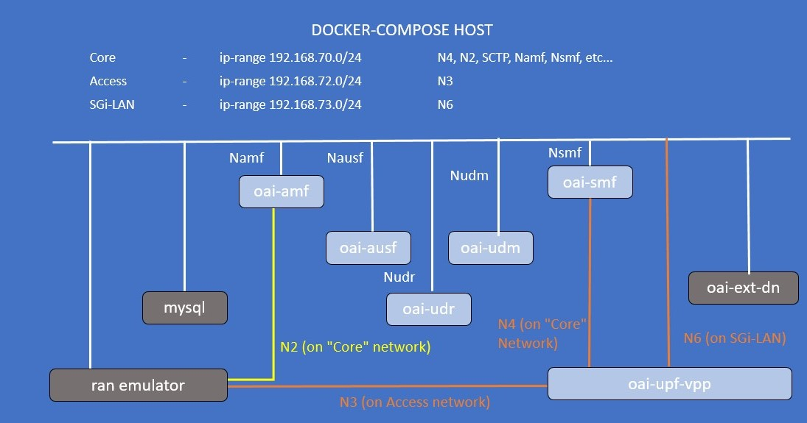

<table style="border-collapse: collapse; border: none;">
  <tr style="border-collapse: collapse; border: none;">
    <td style="border-collapse: collapse; border: none;">
      <a href="http://www.openairinterface.org/">
         
         </img>
      </a>
    </td>
    <td style="border-collapse: collapse; border: none; vertical-align: center;">
      <b><font size = "5">OpenAirInterface 5G Core Network Deployment with UPF-VPP using docker-compose</font></b>
    </td>
  </tr>
</table>



**Reading time: ~ 30mins**

**Tutorial replication time: ~ 1h30mins**

Note: In case readers are interested in deploying debuggers/developers core network environment with more logs, please follow [this tutorial](./DEBUG_5G_CORE.md)

**TABLE OF CONTENTS**

[[_TOC_]]

* In this demo the image tags and commits which were used are listed below, follow [Building images](./BUILD_IMAGES.md) to build images with the tags below.

You can also retrieve the images from `docker-hub`. See [Retrieving images](./RETRIEVE_OFFICIAL_IMAGES.md).

| CNF Name    | Branch Name    | Tag used at time of writing   | Ubuntu 18.04 | RHEL8          |
| ----------- |:-------------- | ----------------------------- | ------------ | ---------------|
| AMF         | `master`       | `v1.5.0`                      | X            | X              |
| AUSF        | `master`       | `v1.5.0`                      | X            | X              |
| NRF         | `master`       | `v1.5.0`                      | X            | X              |
| SMF         | `master`       | `v1.5.0`                      | X            | X              |
| UDR         | `master`       | `v1.5.0`                      | X            | X              |
| UDM         | `master`       | `v1.5.0`                      | X            | X              |
| UPF-VPP     | `master`       | `v1.5.0`                      | X            | X              |

<br/>

In previous tutorials, we were using the `oai-spgwu-tiny` implementation UPF. That implementation has limited throughput capacity and is a pure SW solution.

Moreover in this tutorial, we are going to integrate OAI 5G core with opensource `VPP-UPF` by [Travelping](https://www.travelping.com/). VPP-based UPF uses vector packet processing and it is has proven to have very good performance in the user plane. Motivation for this integration is to test and validate high performance VPP-UPF with OAI 5G core.

**About VPP-UPG**

UPG implements a GTP-U user plane based on `3GPP TS 23.214` and `3GPP TS 29.244` Release `15`. It is implemented as an
out-of-tree plugin for [Fdio VPP](https://github.com/FDio/vpp). The possible uses for UPG are:
* User Plane Function (UPF) in 5G networks
* Packet Data Network Gateway User plane (PGW-U)
* Traffic Detection Function User plane (TDF-U)

Project is available on github as VPP-UPG which follows release `16` of 3GPP specification TS `29.244`. More details about VPP-UPG can be found on [official page](https://github.com/travelping/upg-vpp). VPP-UPG currently doesn't support NRF feature hence and it also uses optional IE called network instance (nwi) to uniquely identify interfaces of UPF in the form of domain name.

Let's begin !!

* Steps 1 to 4 are similar to previous tutorials such as [minimalist](./DEPLOY_SA5G_MINI_WITH_GNBSIM.md) or [basic](./DEPLOY_SA5G_BASIC_DEPLOYMENT.md) deployments. Please follow these steps to deploy OAI 5G core network components.

## 1. Pre-requisites

Create a folder where you can store all the result files of the tutorial and later compare them with our provided result files, we recommend creating exactly the same folder to not break the flow of commands afterwards.

<!---
For CI purposes please ignore this line
``` shell
docker-compose-host $: rm -rf /tmp/oai/vpp-upf-gnbsim
```
-->

``` shell
docker-compose-host $: mkdir -p /tmp/oai/vpp-upf-gnbsim
docker-compose-host $: chmod 777 /tmp/oai/vpp-upf-gnbsim
```

## 5. Deploying OAI 5g Core Network

* We will use the same wrapper script for docker-compose that was used for previous tutorials to set up 5gcn with `UPF-VPP`. Use the --help option to check how to use this wrapper script.

**Note: - To use vpp-upf on bare metal, follow [these instructions.](https://gitlab.eurecom.fr/oai/cn5g/oai-cn5g-upf-vpp/-/blob/develop/docs/INSTALL_ON_HOST.md)**

All the following commands shall be executed from the `oai-cn5g-fed/docker-compose` folder.

``` console
oai-cn5g-fed/docker-compose$ $ python3 ./core-network.py --help
usage: core-network.py [-h] --type
                       {start-mini,start-basic,start-basic-vpp,stop-mini,stop-basic,stop-basic-vpp}
                      [--scenario {1,2}]

OAI 5G CORE NETWORK DEPLOY

optional arguments:
  -h, --help            show this help message and exit
  --type {start-mini,start-basic,start-basic-vpp,stop-mini,stop-basic,stop-basic-vpp}, -t {start-mini,start-basic,start-basic-vpp,stop-mini,stop-basic,stop-basic-vpp}
                        Functional type of 5g core network ("start-
                        mini"|"start-basic"|"start-basic-vpp"|"stop-
                        mini"|"stop-basic"|"stop-basic-vpp")
  --scenario {1,2}, -s {1,2}
                        Scenario with NRF ("1") and without NRF ("2")
  --capture CAPTURE, -c CAPTURE
                        Add an automatic PCAP capture on docker networks to CAPTURE file

example:
        python3 core-network.py --type start-basic
        python3 core-network.py --type start-basic-vpp
        python3 core-network.py --type start-mini --scenario 2
        python3 core-network.py --type stop-mini --scenario 2
        python3 core-network.py --type start-basic --scenario 1

```

Currently in this tutorial format, we support a `basic` deployment with the `UPF-VPP`: `basic-vpp`.

In that deployment configuration, you can deploy with and without `NRF` (ie scenarios `1` and `2`).

As a first-timer, we recommend that you first deploy without any PCAP capture. We also recommend no capture if you plan to run your CN5G deployment for a long time.

``` console
docker-compose-host $: python3 ./core-network.py --type start-basic-vpp --scenario 1
```

For CI purposes, we are deploying with an automated PCAP capture on the docker networks.

**REMEMBER: if you are planning to run your CN5G deployment for a long time, the PCAP file can become huge!**

``` shell
docker-compose-host $: python3 ./core-network.py --type start-basic-vpp  --scenario 1 --capture /tmp/oai/vpp-upf-gnbsim/vpp-upf-gnbsim.pcap
[2022-02-08 16:18:19,328] root:DEBUG:  Starting 5gcn components... Please wait....
[2022-02-08 16:18:19,328] root:DEBUG: docker-compose -f docker-compose-basic-vpp-nrf.yaml up -d mysql
Creating network "oai-public-cp" with the default driver
Creating network "oai-public-access" with the default driver
Creating network "oai-public-core" with the default driver
Creating mysql   ... done
[2022-02-08 16:18:32,203] root:DEBUG: nohup sudo tshark -i demo-oai -i cn5g-core -f "(not host 192.168.73.135 and not arp and not port 53 and not port 2152) or (host 192.168.73.135 and icmp)" -w /tmp/oai/vpp-upf-gnbsim/vpp-upf-gnbsim.pcap > /dev/null 2>&1 &
[2022-02-08 16:18:52,217] root:DEBUG: docker-compose -f docker-compose-basic-vpp-nrf.yaml up -d
mysql is up-to-date
Creating oai-nrf ... done
Creating vpp-upf ... done
Creating oai-udr ... done
Creating oai-udm    ... done
Creating oai-ext-dn ... done
Creating oai-ausf   ... done
Creating oai-amf    ... done
Creating oai-smf    ... done

[2022-02-08 16:19:47,977] root:DEBUG:  OAI 5G Core network started, checking the health status of the containers... takes few secs....
[2022-02-08 16:19:47,977] root:DEBUG: docker-compose -f docker-compose-basic-vpp-nrf.yaml ps -a
[2022-02-08 16:20:11,681] root:DEBUG:  All components are healthy, please see below for more details....
Name                 Command                  State                  Ports
-----------------------------------------------------------------------------------------
mysql        docker-entrypoint.sh mysqld      Up (healthy)   3306/tcp, 33060/tcp
oai-amf      /bin/bash /openair-amf/bin ...   Up (healthy)   38412/sctp, 80/tcp, 9090/tcp
oai-ausf     /bin/bash /openair-ausf/bi ...   Up (healthy)   80/tcp
oai-ext-dn   /bin/bash -c  apt update;  ...   Up
oai-nrf      /bin/bash /openair-nrf/bin ...   Up (healthy)   80/tcp, 9090/tcp
oai-smf      /bin/bash /openair-smf/bin ...   Up (healthy)   80/tcp, 8805/udp, 9090/tcp
oai-udm      /bin/bash /openair-udm/bin ...   Up (healthy)   80/tcp
oai-udr      /bin/bash /openair-udr/bin ...   Up (healthy)   80/tcp
vpp-upf      /openair-upf/bin/entrypoin ...   Up (healthy)   2152/udp, 8085/udp
[2022-02-08 16:20:11,681] root:DEBUG:  Checking if the containers are configured....
[2022-02-08 16:20:11,681] root:DEBUG:  Checking if AMF, SMF and UPF registered with nrf core network....
[2022-02-08 16:20:11,681] root:DEBUG: curl -s -X GET http://192.168.70.130/nnrf-nfm/v1/nf-instances?nf-type="AMF" | grep -o "192.168.70.132"
192.168.70.132
[2022-02-08 16:20:11,694] root:DEBUG: curl -s -X GET http://192.168.70.130/nnrf-nfm/v1/nf-instances?nf-type="SMF" | grep -o "192.168.70.133"
192.168.70.133
[2022-02-08 16:20:11,706] root:DEBUG: curl -s -X GET http://192.168.70.130/nnrf-nfm/v1/nf-instances?nf-type="UPF" | grep -o "192.168.70.202"
192.168.70.202
[2022-02-08 16:20:11,717] root:DEBUG:  Checking if AUSF, UDM and UDR registered with nrf core network....
[2022-02-08 16:20:11,717] root:DEBUG: curl -s -X GET http://192.168.70.130/nnrf-nfm/v1/nf-instances?nf-type="AUSF" | grep -o "192.168.70.138"
192.168.70.138
[2022-02-08 16:20:11,728] root:DEBUG: curl -s -X GET http://192.168.70.130/nnrf-nfm/v1/nf-instances?nf-type="UDM" | grep -o "192.168.70.137"
192.168.70.137
[2022-02-08 16:20:11,739] root:DEBUG: curl -s -X GET http://192.168.70.130/nnrf-nfm/v1/nf-instances?nf-type="UDR" | grep -o "192.168.70.136"
192.168.70.136
[2022-02-08 16:20:11,750] root:DEBUG:  AUSF, UDM, UDR, AMF, SMF and UPF are registered to NRF....
[2022-02-08 16:20:11,750] root:DEBUG:  Checking if SMF is able to connect with UPF....
[2022-02-08 16:20:11,868] root:DEBUG:  UPF did answer to N4 Association request from SMF....
[2022-02-08 16:20:11,927] root:DEBUG:  SMF receiving heathbeats from UPF....
[2022-02-08 16:20:11,928] root:DEBUG:  OAI 5G Core network is configured and healthy....
```

Here I have deployed with `NRF`:

* The script validates that `AMF`, `SMF`, `UPF-VPP`, `AUSF`, `UDM` and `UDR` did register to `NRF`
* The script also validates that SMF associates over `N4` with UPF.

You can also see this with the container logs:

1. UPF registration to NRF
``` console
$ docker logs oai-nrf
...
[2022-02-08T16:20:10.995675] [nrf] [sbi_srv] [info ] Got a request to register an NF instance/Update an NF instance, Instance ID: cdf2e275-ff1d-49e0-aa48-df2027af101f
[2022-02-08T16:20:10.995701] [nrf] [nrf_app] [info ] Handle Register NF Instance/Update NF Instance (HTTP version 2)
[2022-02-08T16:20:10.996429] [nrf] [nrf_app] [info ] Check if a profile with this ID cdf2e275-ff1d-49e0-aa48-df2027af101f exist
[2022-02-08T16:20:10.996442] [nrf] [nrf_app] [info ] NF profile (ID cdf2e275-ff1d-49e0-aa48-df2027af101f) not found
[2022-02-08T16:20:10.996446] [nrf] [nrf_app] [info ] Added/Updated NF Profile (ID cdf2e275-ff1d-49e0-aa48-df2027af101f) to the DB
[2022-02-08T16:20:10.996457] [nrf] [nrf_app] [info ] Handle NF status registered event, profile id cdf2e275-ff1d-49e0-aa48-df2027af101f
[2022-02-08T16:20:10.996460] [nrf] [nrf_app] [info ]    Find a NF profile with ID cdf2e275-ff1d-49e0-aa48-df2027af101f
[2022-02-08T16:20:10.996464] [nrf] [nrf_app] [info ]    Get the list of subscriptions related to this profile, profile id cdf2e275-ff1d-49e0-aa48-df2027af101f
[2022-02-08T16:20:10.996526] [nrf] [nrf_app] [info ] Added/Updated NF Instance, NF info: {"capacity":100,"fqdn":"gw1.vppupf.node.5gcn.mnc95.mcc208.3gppnetwork.org","heartBeatTimer":10,"ipv4Addresses":["192.168.70.202"],"json_data":null,"nfInstanceId":"cdf2e275-ff1d-49e0-aa48-df2027af101f","nfInstanceName":"OAI-UPF-VPP","nfServices":[],"nfStatus":"REGISTERED","nfType":"UPF","priority":1,"sNssais":[{"sd":"222","sst":123}],"upfInfo":{"interfaceUpfInfoList":[{"endpointFqdn":"access.oai.org","interfaceType":"N3","ipv4EndpointAddresses":["192.168.72.134"],"networkInstance":"access.oai.org"},{"endpointFqdn":"core.oai.org","interfaceType":"N6","ipv4EndpointAddresses":["192.168.70.134"],"networkInstance":"core.oai.org"}],"sNssaiUpfInfoList":[{"dnnUpfInfoList":[{"dnn":"default"}],"sNssai":{"sd":"222","sst":123}}]}}
[2022-02-08T16:20:16.002236] [nrf] [sbi_srv] [info ]
[2022-02-08T16:20:16.002261] [nrf] [sbi_srv] [info ] Got a request to update an NF instance, Instance ID: cdf2e275-ff1d-49e0-aa48-df2027af101f
[2022-02-08T16:20:16.002268] [nrf] [nrf_app] [info ] Handle Update NF Instance request (HTTP version 2)
[2022-02-08T16:20:16.002277] [nrf] [nrf_app] [info ] NF Heart-Beat procedure!
[2022-02-08T16:20:16.002282] [nrf] [nrf_app] [info ] Updated the NF profile (profile ID cdf2e275-ff1d-49e0-aa48-df2027af101f)
[2022-02-08T16:20:11.057964] [nrf] [sbi_srv] [info ]
[2022-02-08T16:20:11.057985] [nrf] [sbi_srv] [info ] Got a request to update an NF instance, Instance ID: cdf2e275-ff1d-49e0-aa48-df2027af101f
...
```
2. SMF PFCP association with UPF-VPP
``` console
$ docker logs oai-smf
...
[2022-02-08T16:20:17.497176] [smf] [smf_sbi] [debug] Send NFSubscribeNotify to NRF to be notified when a new UPF becomes available (HTTP version 1)
[2022-02-08T16:20:17.497202] [smf] [smf_sbi] [debug] Send NFStatusNotify to NRF, NRF URL 192.168.70.130:80/nnrf-nfm/v1/subscriptions
[2022-02-08T16:20:17.497423] [smf] [smf_sbi] [debug] Send NFStatusNotify to NRF, msg body: {"nfStatusNotificationUri":"192.168.70.133:80/nsmf-nfstatus-notify/v1/subscriptions","reqNotifEvents":["NF_REGISTERED","NF_DEREGISTERED"],"subscrCond":{"NfTypeCond":{"nfType":"UPF"}},"validityTime":"20390531T235959"}
[2022-02-08T16:20:17.497450] [smf] [smf_sbi] [debug] Promise ID generated 1
[2022-02-08T16:20:17.499881] [smf] [sbi_srv] [info ] NFStatusNotifyApiImpl, received a NF status notification...
[2022-02-08T16:20:17.499897] [smf] [smf_app] [debug] Convert NotificationData (OpenAPI) to Data Notification Msg
[2022-02-08T16:20:17.500400] [smf] [smf_app] [debug] NF instance info
[2022-02-08T16:20:17.500411] [smf] [smf_app] [debug]    Instance ID: cdf2e275-ff1d-49e0-aa48-df2027af101f
[2022-02-08T16:20:17.500415] [smf] [smf_app] [debug]    Instance name: OAI-UPF-VPP
[2022-02-08T16:20:17.500418] [smf] [smf_app] [debug]    Instance type: UPF
[2022-02-08T16:20:17.500422] [smf] [smf_app] [debug]    Status: REGISTERED
[2022-02-08T16:20:17.500425] [smf] [smf_app] [debug]    HeartBeat timer: 10
[2022-02-08T16:20:17.500429] [smf] [smf_app] [debug]    Priority: 1
[2022-02-08T16:20:17.500432] [smf] [smf_app] [debug]    Capacity: 100
[2022-02-08T16:20:17.500436] [smf] [smf_app] [debug]    SNSSAI:
[2022-02-08T16:20:17.500439] [smf] [smf_app] [debug]         SST 123, SD 222
[2022-02-08T16:20:17.500443] [smf] [smf_app] [debug]    FQDN: gw1.vppupf.node.5gcn.mnc95.mcc208.3gppnetwork.org
[2022-02-08T16:20:17.500446] [smf] [smf_app] [debug]    IPv4 Addr:
[2022-02-08T16:20:17.500451] [smf] [smf_app] [debug]         192.168.70.202
[2022-02-08T16:20:17.500454] [smf] [smf_app] [debug]    UPF Info:
[2022-02-08T16:20:17.500459] [smf] [smf_app] [debug]        Parameters supported by the UPF:
[2022-02-08T16:20:17.500463] [smf] [smf_app] [debug]            SNSSAI (SST 123, SD 222)
[2022-02-08T16:20:17.500468] [smf] [smf_app] [debug]            DNN default
[2022-02-08T16:20:17.500474] [smf] [smf_app] [debug]        INTERFACE UPF Info List, Interface Type : N3, Network Instance access.oai.org, EndpointFqdn: access.oai.org
[2022-02-08T16:20:17.500480] [smf] [smf_app] [debug]            INTERFACE UPF Info List, IPv4 Addr:
[2022-02-08T16:20:17.500484] [smf] [smf_app] [debug]                         192.168.72.134
[2022-02-08T16:20:17.500489] [smf] [smf_app] [debug]        INTERFACE UPF Info List, Interface Type : N6, Network Instance core.oai.org, EndpointFqdn: core.oai.org
[2022-02-08T16:20:17.500494] [smf] [smf_app] [debug]            INTERFACE UPF Info List, IPv4 Addr:
[2022-02-08T16:20:17.500498] [smf] [smf_app] [debug]                         192.168.70.134
[2022-02-08T16:20:17.500559] [smf] [smf_app] [info ] Handle a NF status notification from NRF (HTTP version 1)
[2022-02-08T16:20:17.500587] [smf] [smf_app] [debug] Add a new UPF node, Ipv4 Addr 192.168.70.202
[2022-02-08T16:20:17.501350] [smf] [smf_app] [debug] Got response with HTTP code  201!
...
[2022-02-08T16:20:17.510608] [smf] [smf_n4 ] [info ] Received N4 ASSOCIATION SETUP RESPONSE from an UPF
[2022-02-08T16:20:17.510634] [smf] [smf_n4 ] [info ] Received N4 ASSOCIATION SETUP RESPONSE
[2022-02-08T16:20:17.510649] [smf] [smf_app] [info ] Node ID Type FQDN: gw1.vppupf.node.5gcn.mnc95.mcc208.3gppnetwork.org
[2022-02-08T16:20:17.511111] [smf] [smf_app] [info ] Node ID Type FQDN: gw1.vppupf.node.5gcn.mnc95.mcc208.3gppnetwork.org, IPv4 Addr: 192.168.70.202
[2022-02-08T16:20:17.511213] [smf] [smf_app] [debug] NF instance info
[2022-02-08T16:20:17.511221] [smf] [smf_app] [debug]    Instance ID:
[2022-02-08T16:20:17.511225] [smf] [smf_app] [debug]    Instance name:
[2022-02-08T16:20:17.511228] [smf] [smf_app] [debug]    Instance type: UPF
[2022-02-08T16:20:17.511231] [smf] [smf_app] [debug]    Status:
[2022-02-08T16:20:17.511235] [smf] [smf_app] [debug]    HeartBeat timer: 0
[2022-02-08T16:20:17.511238] [smf] [smf_app] [debug]    Priority: 0
[2022-02-08T16:20:17.511241] [smf] [smf_app] [debug]    Capacity: 0
...
```

## 6. Simulate with a RAN emulator

### 6.1. Test with Gnbsim

In this Section we will use Gnbsim to test our deployemt. Make sure you already have built [Gnbsim docker image](./DEPLOY_SA5G_MINI_WITH_GNBSIM.md#6-getting-a-gnbsim-docker-image)<br/>
Launch gnbsim instance:

``` shell
docker-compose-host $: docker-compose -f docker-compose-gnbsim-vpp.yaml up -d gnbsim-vpp
Creating gnbsim-vpp ... done
```

<!---
For CI purposes please ignore this line
``` shell
docker-compose-host $: ../ci-scripts/checkContainerStatus.py --container_name gnbsim-vpp --timeout 30
```
-->

Make sure Gnbsim service is healthy:
``` shell
docker-compose-host $: docker-compose -f docker-compose-gnbsim-vpp.yaml ps -a
   Name                 Command                  State       Ports
------------------------------------------------------------------
gnbsim-vpp   /gnbsim/bin/entrypoint.sh  ...   Up (healthy)
```

After successful registration of UE, we can perform traffic test
``` console
docker-compose-host $: docker exec gnbsim-vpp ping -c 3 -I 12.1.1.2 google.com
PING google.com (172.217.18.238) from 12.1.1.2 : 56(84) bytes of data.
64 bytes from mrs08s02-in-f14.1e100.net (172.217.18.238): icmp_seq=1 ttl=114 time=9.89 ms
64 bytes from mrs08s02-in-f14.1e100.net (172.217.18.238): icmp_seq=2 ttl=114 time=7.10 ms
64 bytes from mrs08s02-in-f14.1e100.net (172.217.18.238): icmp_seq=3 ttl=114 time=6.72 ms

--- google.com ping statistics ---
3 packets transmitted, 3 received, 0% packet loss, time 5ms
rtt min/avg/max/mdev = 6.716/7.900/9.890/1.418 ms
```

``` shell
docker-compose-host $: docker exec oai-ext-dn ping 12.1.1.2 -c4
PING 12.1.1.2 (12.1.1.2) 56(84) bytes of data.
64 bytes from 12.1.1.2: icmp_seq=2 ttl=63 time=0.400 ms
64 bytes from 12.1.1.2: icmp_seq=3 ttl=63 time=0.352 ms
64 bytes from 12.1.1.2: icmp_seq=4 ttl=63 time=0.378 ms

--- 12.1.1.2 ping statistics ---
4 packets transmitted, 3 received, 25% packet loss, time 3055ms
rtt min/avg/max/mdev = 0.352/0.376/0.400/0.029 ms

docker-compose-host $: docker exec gnbsim-vpp ping -c4 -I 12.1.1.2 192.168.73.135
PING 192.168.73.135 (192.168.73.135) from 12.1.1.2 : 56(84) bytes of data.
64 bytes from 192.168.73.135: icmp_seq=1 ttl=63 time=0.289 ms
64 bytes from 192.168.73.135: icmp_seq=2 ttl=63 time=0.307 ms
64 bytes from 192.168.73.135: icmp_seq=3 ttl=63 time=0.183 ms
64 bytes from 192.168.73.135: icmp_seq=4 ttl=63 time=0.353 ms

--- 192.168.73.135 ping statistics ---
4 packets transmitted, 4 received, 0% packet loss, time 71ms
rtt min/avg/max/mdev = 0.183/0.283/0.353/0.062 ms
```

Let's analyze the N4 Traffic report from the UPF.

``` shell
docker-compose-host $: sleep 10
docker-compose-host $: docker logs oai-smf > /tmp/oai/vpp-upf-gnbsim/smf.log 2>&1
docker-compose-host $: python3 ../ci-scripts/validateN4UpfReportMessages.py --filename /tmp/oai/vpp-upf-gnbsim/smf.log
Received 7 N4 SESSION REPORT REQUESTS from an UPF
-  for a total duration of 70 seconds
-  Total Number of Packets : 16
-     DL Number of Packets : 8
-     UL Number of Packets : 8
-  Total Volume            : 1344 bytes
-     DL Volume            : 672 bytes
-     UL Volume            : 672 bytes
```

The SMF receives regularly N4 messages like this one:

``` console
[2022-04-08T11:27:46.540271] [smf] [smf_n4 ] [info ] Received N4 SESSION REPORT REQUEST from an UPF
[2022-04-08T11:27:46.540357] [smf] [smf_app] [info ]         SEID            -> 1
[2022-04-08T11:27:46.540378] [smf] [smf_app] [info ]         UR-SEQN         -> 4
[2022-04-08T11:27:46.540384] [smf] [smf_app] [info ]         Duration        -> 10
[2022-04-08T11:27:46.540389] [smf] [smf_app] [info ]         NoP    Total    -> 2
[2022-04-08T11:27:46.540394] [smf] [smf_app] [info ]                Uplink   -> 1
[2022-04-08T11:27:46.540399] [smf] [smf_app] [info ]                Downlink -> 1
[2022-04-08T11:27:46.540404] [smf] [smf_app] [info ]         Volume Total    -> 168
[2022-04-08T11:27:46.540409] [smf] [smf_app] [info ]                Uplink   -> 84
[2022-04-08T11:27:46.540423] [smf] [smf_app] [info ]                Downlink -> 84
```

Let's create bigger traffic:

``` shell
docker-compose-host $: docker exec oai-ext-dn ping 12.1.1.2 -c40 -i0.1 -s500
docker-compose-host $: sleep 10
docker-compose-host $: docker logs oai-smf > /tmp/oai/vpp-upf-gnbsim/smf.log 2>&1
docker-compose-host $: python3 ../ci-scripts/validateN4UpfReportMessages.py --filename /tmp/oai/vpp-upf-gnbsim/smf.log
Received 9 N4 SESSION REPORT REQUESTS from an UPF
-  for a total duration of 90 seconds
-  Total Number of Packets : 96
-     DL Number of Packets : 48
-     UL Number of Packets : 48
-  Total Volume            : 43584 bytes
-     DL Volume            : 21792 bytes
-     UL Volume            : 21792 bytes
```

Now create asymmetrical traffic with iperf3 in Downlink:

``` shell
docker-compose-host $: docker exec -d gnbsim-vpp /bin/bash -c "nohup iperf3 -B 12.1.1.2 -s -i 1 > /tmp/iperf-server-dl.log 2>&1"
docker-compose-host $: sleep 1
docker-compose-host $: docker exec oai-ext-dn iperf3 -c 12.1.1.2 -t 20 -i 1
docker-compose-host $: sleep 10
docker-compose-host $: docker logs oai-smf > /tmp/oai/vpp-upf-gnbsim/smf.log 2>&1
docker-compose-host $: python3 ../ci-scripts/validateN4UpfReportMessages.py --filename /tmp/oai/vpp-upf-gnbsim/smf.log
Received 13 N4 SESSION REPORT REQUESTS from an UPF
-  for a total duration of 130 seconds
-  Total Number of Packets : 20926
-     DL Number of Packets : 13306
-     UL Number of Packets : 7620
-  Total Volume            : 23912637 bytes
-     DL Volume            : 23436499 bytes
-     UL Volume            : 476138 bytes
```

**Don't forget to kill the iperf3 server process on `gnbsim-vpp` container.**

``` console
docker-compose-host $: docker exec gnbsim-vpp ps aux
USER       PID %CPU %MEM    VSZ   RSS TTY      STAT START   TIME COMMAND
root         1  1.0  0.0 927132  9952 ?        Ssl  11:51   0:01 /gnbsim/bin/example
root       126  0.0  0.0  18384  3064 ?        Ss   11:53   0:00 /bin/bash -c nohup iperf3 -B 12.1.1.2 -s -i 1 > /tmp/iperf-server-dl.log 2>&1
root       131  0.2  0.0  10412  2752 ?        S    11:53   0:00 iperf3 -B 12.1.1.2 -s -i 1
root       174  0.0  0.0  18516  3480 pts/0    Ss   11:54   0:00 /bin/bash
root       195  0.0  0.0  34412  2924 pts/0    R+   11:54   0:00 ps aux

# Here it is an example, kill the one corresponding to your run
docker-compose-host $: docker exec gnbsim-vpp kill -9 131

docker-compose-host $: docker exec gnbsim-vpp ps aux
USER       PID %CPU %MEM    VSZ   RSS TTY      STAT START   TIME COMMAND
root         1  1.0  0.0 927132  9952 ?        Ssl  11:51   0:01 /gnbsim/bin/example
root       174  0.0  0.0  18516  3480 pts/0    Ss   11:54   0:00 /bin/bash
root       208  0.0  0.0  34412  2900 pts/0    R+   11:54   0:00 ps aux
```

<!---
For CI purposes please ignore this line
In our network env, we cannot ping google.com
We replaced that with a wget (that we've installed in the gnbsim image)
``` shell
docker-compose-host $: docker exec gnbsim-vpp wget --tries=2 --timeout=30 --bind-address=12.1.1.2 https://openairinterface.org/wp-content/uploads/2015/06/cropped-oai_final_logo.png
```
-->

## 7. Recover the logs

<!---
For CI purposes please ignore these lines
``` shell
docker-compose-host $: docker-compose -f docker-compose-gnbsim-vpp.yaml stop -t 2
docker-compose-host $: docker-compose -f docker-compose-basic-vpp-nrf.yaml stop -t 2
```
-->

``` shell
docker-compose-host $: docker logs oai-amf > /tmp/oai/vpp-upf-gnbsim/amf.log 2>&1
docker-compose-host $: docker logs oai-smf > /tmp/oai/vpp-upf-gnbsim/smf.log 2>&1
docker-compose-host $: docker logs oai-nrf > /tmp/oai/vpp-upf-gnbsim/nrf.log 2>&1
docker-compose-host $: docker logs vpp-upf > /tmp/oai/vpp-upf-gnbsim/vpp-upf.log 2>&1
docker-compose-host $: docker logs oai-udr > /tmp/oai/vpp-upf-gnbsim/udr.log 2>&1
docker-compose-host $: docker logs oai-udm > /tmp/oai/vpp-upf-gnbsim/udm.log 2>&1
docker-compose-host $: docker logs oai-ausf > /tmp/oai/vpp-upf-gnbsim/ausf.log 2>&1
docker-compose-host $: docker logs gnbsim-vpp > /tmp/oai/vpp-upf-gnbsim/gnbsim-vpp.log 2>&1
```

## 8. Undeploy the Core Network

### 8.1. Undeploy the RAN emulator

``` shell
docker-compose-host $: docker-compose -f docker-compose-gnbsim-vpp.yaml down -t 0
Stopping gnbsim-vpp ... done
WARNING: Found orphan containers (vpp-upf, oai-nrf, oai-smf, oai-udm, oai-amf, mysql, oai-ext-dn, oai-udr, oai-ausf) for this project. If you removed or renamed this service in your compose file, you can run this command with the --remove-orphans flag to clean it up.
Removing gnbsim-vpp ... done
Network demo-oai-public-net is external, skipping
Network oai-public-access is external, skipping
```

### 8.2. Undeploy the Core Network

``` shell
docker-compose-host $: python3 ./core-network.py --type stop-basic-vpp --scenario 1
[2022-02-08 16:21:39,317] root:DEBUG:  UnDeploying OAI 5G core components....
[2022-02-08 16:21:39,317] root:DEBUG: docker-compose -f docker-compose-basic-vpp-nrf.yaml down
Stopping oai-smf    ... done
Stopping oai-amf    ... done
Stopping oai-ausf   ... done
Stopping oai-ext-dn ... done
Stopping oai-udm    ... done
Stopping oai-udr    ... done
Stopping vpp-upf    ... done
Stopping oai-nrf    ... done
Stopping mysql      ... done
Removing oai-smf    ... done
Removing oai-amf    ... done
Removing oai-ausf   ... done
Removing oai-ext-dn ... done
Removing oai-udm    ... done
Removing oai-udr    ... done
Removing vpp-upf    ... done
Removing oai-nrf    ... done
Removing mysql      ... done
Removing network oai-public-cp
Removing network oai-public-access
Removing network oai-public-core

[2022-02-08 16:22:59,980] root:DEBUG:  OAI 5G core components are UnDeployed....
```

If you replicate then your log files and pcap file will be present in `/tmp/oai/vpp-upf-gnbsim/`.

## 9. Notes

- Generally, in a COTS UE two PDN sessions are created by default so configure the IMS in SMF properly.
- In case you want to deploy debuggers/developers core network environment with more logs please follow [this tutorial](./DEBUG_5G_CORE.md)
- It is not necessary to use [core-network.py](../docker-compose/core-network.py) Python script, it is possible to directly deploy using `docker-compose` command
- In case you are interested in using HTTP V2 for SBI between the network functions instead of HTTP V1, then you have to use docker-compose [docker-compose-basic-vpp-nrf-http2.yaml](../docker-compose/docker-compose-basic-vpp-nrf-http2.yaml).
``` console
#To start the containers
docker-compose-host $: docker-compose -f <file-name> up -d
#To check their health status and wait till the time they are healthy, you ctrl + c to exit watch command
docker-compose-host $: watch docker-compose -f <file-name> ps -a
#To stop the containers with zero graceful period
docker-compose-host $: docker-compose -f <file-name> down -t 0
```
