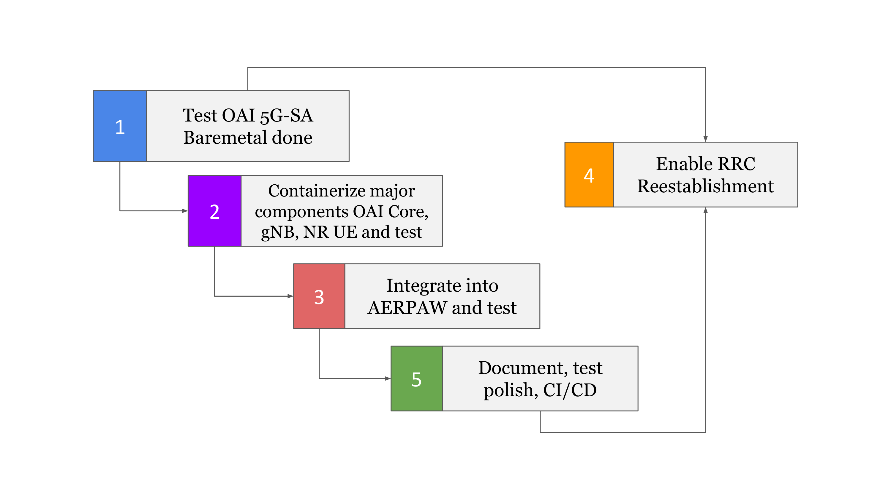

<h1 style="text-align: left;">Week of Dec 11 - 15</h1>

---

<figure class="image align-center"><figcaption>&nbsp; &nbsp; &nbsp; &nbsp; &nbsp; &nbsp; &nbsp; &nbsp; &nbsp; &nbsp; &nbsp; &nbsp; &nbsp; &nbsp; &nbsp; &nbsp; &nbsp; &nbsp; &nbsp; &nbsp; &nbsp; &nbsp; &nbsp; &nbsp; &nbsp; &nbsp; &nbsp; &nbsp; &nbsp;Fig: Development Roadmap</figcaption></figure>

&nbsp;

This week, we focused on laying out and planning the project structure for a smooth execution in the coming phases.  We explored the various offerings from both the srsRAN Project and OpenAirInterface (OAI). Although, we were already familiar with srsRAN Project, its limitation to 4G User Equipment (UE) led us to opt for OAI.  However, there were some issues working with OAI:

<ul><li style="text-align: left; font-family: tahoma, arial, helvetica, sans-serif;">The documentation was hard to comprehend.</li><li style="text-align: left; font-family: tahoma, arial, helvetica, sans-serif;">The 5G standalone (5G SA) had not been tested over-the-air previously.</li><li style="text-align: left; font-family: tahoma, arial, helvetica, sans-serif;">The core network (CN) contains too many containers, which could be a major issue in coming future.</li></ul>

&nbsp;

