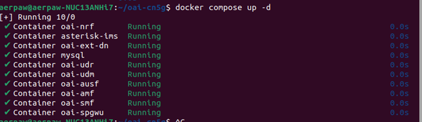
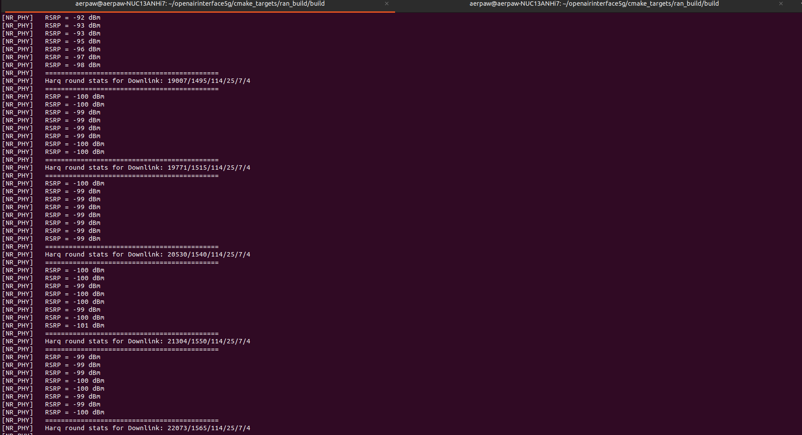

<h1 style="text-align: left;">Week of Dec 25 - 29</h1>

---

As per the documentation we created last week, we successfully tested OAI 5G SA with B210 UE.

<figure class="image align-center"><figcaption>&nbsp; &nbsp; &nbsp; &nbsp; &nbsp; &nbsp; &nbsp; &nbsp; &nbsp; &nbsp; &nbsp; &nbsp; &nbsp; &nbsp; &nbsp; &nbsp; &nbsp; &nbsp; &nbsp; &nbsp; Fig 1: Successfully running the containers</figcaption></figure>

‎&nbsp;

‎ ‎&nbsp;

<figure class="image"><figcaption>Fig 2: Connecting the UE and exchanging signal</figcaption></figure>

‎&nbsp;

