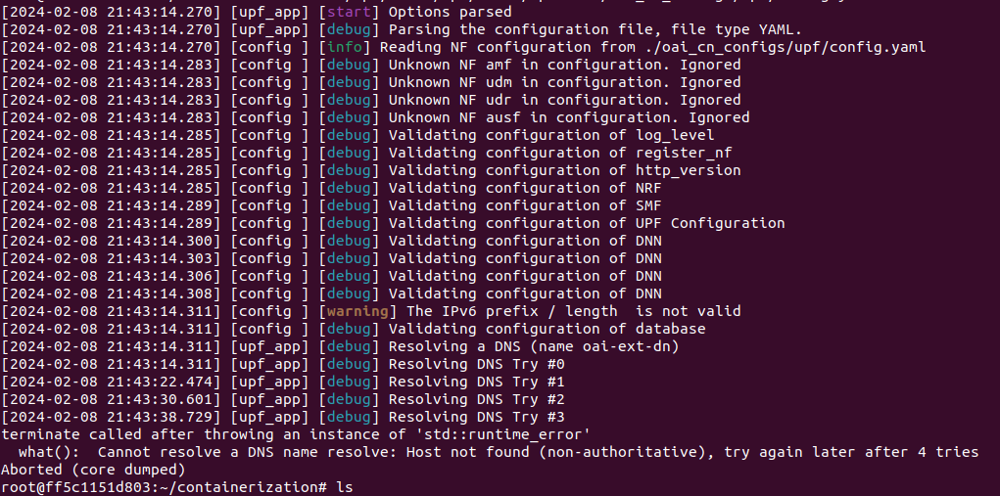
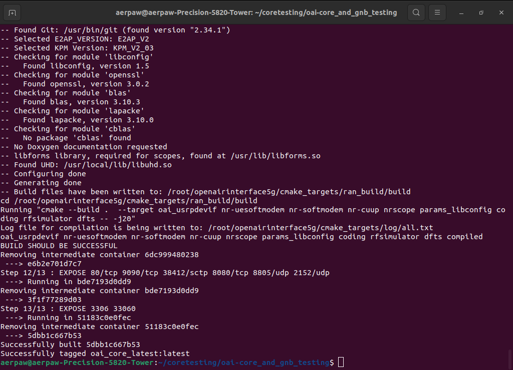

<h1 style="text-align: left;">Week of Feb 5 - 9</h1>

---

Tasks completed:

<ul style="text-align: left;"><li style="font-family: tahoma, arial, helvetica, sans-serif;">Successfully established seamless connection between the OAI Core Network services, except for UPF.</li></ul>

<figure class="image align-center"><figcaption>
Fig: DNS connection issue related to UPF
</figcaption></figure>

‎
‎&nbsp;

<ul><li style="font-family: tahoma, arial, helvetica, sans-serif;">Started working on configuration files required to connect Open5GS to OAI gNodeB.‎&nbsp;</li></ul>

<figure class="image align-center"><figcaption>&nbsp; &nbsp; &nbsp; &nbsp; &nbsp; &nbsp; &nbsp; &nbsp; &nbsp; &nbsp; &nbsp; &nbsp; &nbsp; &nbsp; &nbsp; &nbsp; &nbsp; &nbsp; &nbsp; &nbsp; &nbsp; &nbsp; &nbsp; &nbsp; &nbsp;Fig: Successful containerization of CN services</figcaption></figure>
