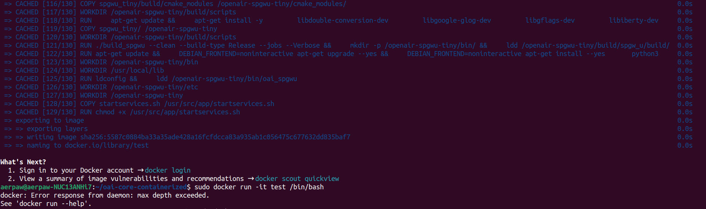
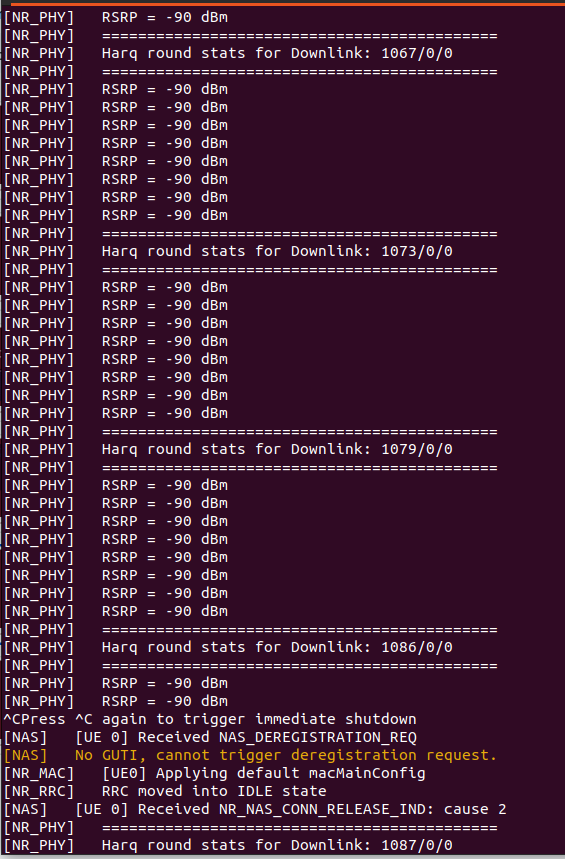

<h1 style="text-align: left;">Week of Jan 15 - 19</h1>

---

We continued our work on containerizing OAI Core Network into a single container. Meanwhile, we had some issue in containerizing the core network.

&nbsp;

<figure class="image"><figcaption>
Fig 1: 'max depth exceeded' error
</figcaption></figure>

‎

After containerizing the core network, we faced challenges with the Dockerfile's maximum layer limit. While we managed to build the file without issues, we encountered difficulties running the container.  <mark>Why does the issue occur: Docker has reached the number of layers that may be stacked in a container image, and it has hit that limit (127).</mark>  On the other side, we ran the containerized OAI on the testbed.

‎

<figure class="image align-center"><figcaption>&nbsp; &nbsp; &nbsp; &nbsp; &nbsp; &nbsp; &nbsp; Fig 2: Testbed for the containerized OAI</figcaption></figure>

‎

‎&nbsp;It appeared to have connected successfully; however, when attempting to fetch the IP address, it did not show up. The <code><mark><em>ifconfig</em></mark></code>&nbsp;command failed to display the required&nbsp;<code><em><mark>oaitun_ue1</mark></em></code>. However, when using the<code>&nbsp;<em><mark>ifconfig oaitun_ue1</mark></em></code> command, the TUN device showed up without an assigned IP address. This suggests that the TUN device may not have been activated properly.

‎

‎

‎
