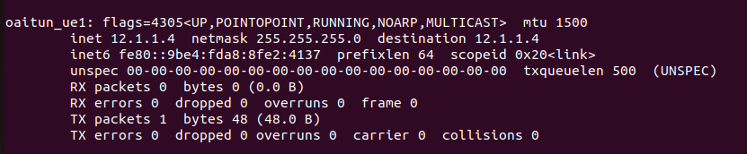

<h1 style="text-align: left;">Week of Jan 22 - 26</h1>

---

For the previous IP address issue, we solved pretty easily by simply restarting all the containers.

&nbsp;

<figure class="image align-center"><figcaption>&nbsp; &nbsp; &nbsp; &nbsp; &nbsp; &nbsp; &nbsp; &nbsp; &nbsp; &nbsp; &nbsp; &nbsp; &nbsp; &nbsp; &nbsp; &nbsp; &nbsp; &nbsp; &nbsp; &nbsp; &nbsp; &nbsp; &nbsp; &nbsp; &nbsp; &nbsp; &nbsp; &nbsp;Fig: IP address assigned to the UE</figcaption></figure>
