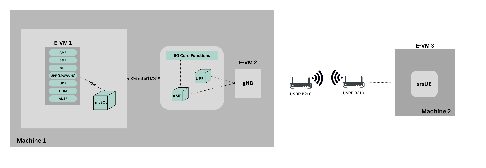

<h1 style="text-align: left;">Week of Jan 29 - Feb 2</h1>

---

By the end of January, we had a change of plan on how we were going to successfully containerize the core network. Since solving the previous issue of 'max depth exceeded' seemed a bit to difficult, we rather decided to implement the following architecture.

<figure class="image align-center"><figcaption>&nbsp; &nbsp; &nbsp; &nbsp; &nbsp; &nbsp; &nbsp; &nbsp; &nbsp; &nbsp; &nbsp; &nbsp; &nbsp; &nbsp; &nbsp; &nbsp; &nbsp; &nbsp; &nbsp; &nbsp; &nbsp; &nbsp; &nbsp; &nbsp; &nbsp; &nbsp; &nbsp; &nbsp; &nbsp; &nbsp; &nbsp; &nbsp; &nbsp; &nbsp; &nbsp; &nbsp; &nbsp; &nbsp; &nbsp; &nbsp; &nbsp; &nbsp; &nbsp; &nbsp; Fig: Proposed Setup Architecture</figcaption></figure>
