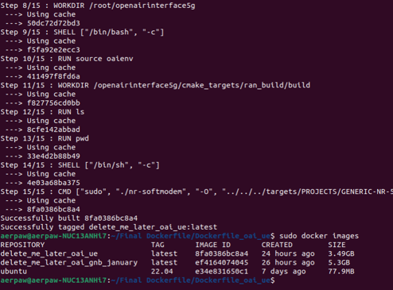

<h1 style="text-align: left;">Week of Jan 8 - 12</h1>

---

This week, we successfully containerized OAI gNodeB (gNB) and OAI UE. We continued our work on creating a single container for the entire OAI Core Network. As an alternative, we also started exploring Open5GS as the Core Network.

‎&nbsp;

<figure class="image align-center"><figcaption>&nbsp; &nbsp; &nbsp; &nbsp; &nbsp; &nbsp; &nbsp; &nbsp; &nbsp; &nbsp; &nbsp; &nbsp; &nbsp; &nbsp;Fig: Successful building of images</figcaption></figure>
