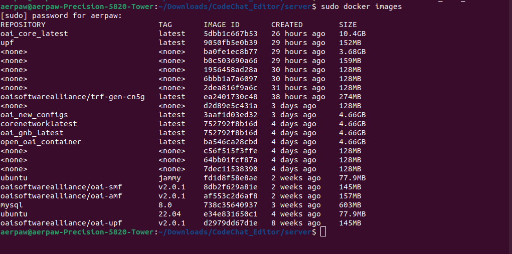

#### First clone down the AERPAW_DEV repo

```bash
git clone https://github.com/aayamrajshakya/AERPAW_DEV.git
```

#### run before starting:

`docker network create` \
`--driver=bridge`\
`--subnet=192.168.70.128/26`\
`-o "com.docker.network.bridge.name"="demo-oai"`\
`demo-oai-public-net`

#### Then simply cd into the cloned directory and build the image with docker tagging with an appropriate name

```bash
cd AERPAW_DEV
sudo docker build . -t oaicoreandgnb

```

Use docker images command to see the container id of this image

#### sudo docker images



#### Then run the image that was built:

```bash

sudo docker run -it --privileged --network <network-id> -v /dev/bus/usb:/dev/bus/usb --net none --cap-add=NET_ADMIN --cap-add=SYS_NICE <conatiner-id> /bin/bash

```
